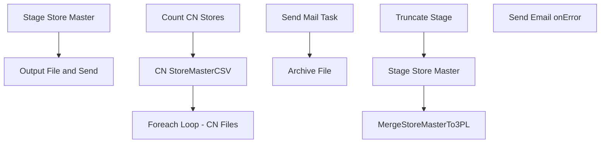

# SSIS Package: WMS_StoreMasterTo3PL

**Project:** WMS_StoreMasterTo3PL  
**Folder:** WMS  
**Server:** STL-SSIS-P-01  

## Connection Managers

| Name | Type | Server | Catalog | Connection (sanitized) |
|---|---|---|---|---|
| CNStoreMasterCSV | FLATFILE |  |  |  |
| IntegrationStaging | OLEDB | STL-SSIS-P-01 | IntegrationStaging | Data Source=STL-SSIS-P-01; Initial Catalog=IntegrationStaging; Provider=SQLNCLI11.1; Integrated Security=SSPI; Auto Translate=False |
| SMTP_EMAIL | SMTP |  |  |  |
| SQL_LOG | OLEDB | stl-ssis-p-01 | msdb | Data Source=stl-ssis-p-01; Initial Catalog=msdb; Provider=SQLNCLI11.1; Integrated Security=SSPI; Auto Translate=False |
| me_01 | OLEDB | bedrockdb02 | me_01 | Data Source=bedrockdb02; Initial Catalog=me_01; Provider=SQLNCLI11.1; Integrated Security=SSPI; Auto Translate=False |

## Control Flow Tasks

| Task | Type |
|---|---|
| WMS_StoreMasterTo3PL | Package |
| Output File and Send | SEQUENCE |
| CN StoreMasterCSV | Pipeline |
| Count CN Stores | ExecuteSQLTask |
| Foreach Loop - CN Files | FOREACHLOOP |
| Archive File | FileSystemTask |
| Send Mail Task | SendMailTask |
| Stage Store Master | SEQUENCE |
| MergeStoreMasterTo3PL | ExecuteSQLTask |
| Stage Store Master | Pipeline |
| Truncate Stage | ExecuteSQLTask |
| Send Email onError | SendMailTask |

## Control Flow Outline

```text
- Send Email onError [SendMailTask]
- Output File and Send [SEQUENCE]
  - CN StoreMasterCSV [Pipeline]
  - Count CN Stores [ExecuteSQLTask]
  - Foreach Loop - CN Files [FOREACHLOOP]
    - Archive File [FileSystemTask]
    - Send Mail Task [SendMailTask]
- Stage Store Master [SEQUENCE]
  - MergeStoreMasterTo3PL [ExecuteSQLTask]
  - Stage Store Master [Pipeline]
  - Truncate Stage [ExecuteSQLTask]
```

## Architecture Diagram



## Variables

| Namespace | Name | Expression-bound |
|---|---|---|
| System | Propagate | No |
| User | CNItemCount | No |
| User | CSV_StoreMasterCN | Yes |
| User | Entity | No |
| User | StoreMasterCNArchive | Yes |
| User | StoreMasterCNArchiveBonded | Yes |
| User | StoreMasterCNArchiveNonBonded | Yes |
| User | StoreMasterCNFileDrop | Yes |
| User | StoreMasterCNFileName | No |
| User | StoreMasterFileName | No |
| User | StoreMasterStageArchive | Yes |
| User | StoreMasterUKArchive | Yes |
| User | StoreMasterUKFileDrop | Yes |
| User | StoreMasterUKFilename | No |
| User | StoreMasterWCArchive | Yes |
| User | StoreMasterWCFileDrop | Yes |
| User | StoreMasterWCFileName | No |
| User | StoreMasterWMFileDrop | Yes |
| User | UKItemsCount | No |
| User | UpdatedCount | No |
| User | WCItemCount | No |

### Expression-bound variable values

#### User::CSV_StoreMasterCN

**Expression:**

```sql
"\\\\" + @[$Package::IntegrationStaging_ServerName] + "\\IntegrationStaging\\Dynamics\\WarehouseInterfaces\\StoreMaster\\CN\\StoreMaster.csv"
```

**Evaluated value:**

```sql
\\STL-SSIS-P-01\IntegrationStaging\Dynamics\WarehouseInterfaces\StoreMaster\CN\StoreMaster.csv
```

#### User::StoreMasterCNArchive

**Expression:**

```sql
"\\\\" +  @[$Package::IntegrationStaging_ServerName] + "\\IntegrationStaging\\Dynamics\\WarehouseInterfaces\\StoreMaster\\CN\\Archive\\StoreMaster.csv"
```

**Evaluated value:**

```sql
\\STL-SSIS-P-01\IntegrationStaging\Dynamics\WarehouseInterfaces\StoreMaster\CN\Archive\StoreMaster.csv
```

#### User::StoreMasterCNArchiveBonded

**Expression:**

```sql
"\\\\" +  @[$Package::IntegrationStaging_ServerName] + "\\IntegrationStaging\\Dynamics\\WarehouseInterfaces\\StoreMaster\\CN\\Archive\\StoreMasterBonded.csv"
```

**Evaluated value:**

```sql
\\STL-SSIS-P-01\IntegrationStaging\Dynamics\WarehouseInterfaces\StoreMaster\CN\Archive\StoreMasterBonded.csv
```

#### User::StoreMasterCNArchiveNonBonded

**Expression:**

```sql
"\\\\" +  @[$Package::IntegrationStaging_ServerName] + "\\IntegrationStaging\\Dynamics\\WarehouseInterfaces\\StoreMaster\\CN\\Archive\\StoreMasterNonBonded.csv"
```

**Evaluated value:**

```sql
\\STL-SSIS-P-01\IntegrationStaging\Dynamics\WarehouseInterfaces\StoreMaster\CN\Archive\StoreMasterNonBonded.csv
```

#### User::StoreMasterCNFileDrop

**Expression:**

```sql
"\\\\" + @[$Package::IntegrationStaging_ServerName] + "\\IntegrationStaging\\Dynamics\\WarehouseInterfaces\\StoreMaster\\CN\\"
```

**Evaluated value:**

```sql
\\STL-SSIS-P-01\IntegrationStaging\Dynamics\WarehouseInterfaces\StoreMaster\CN\
```

#### User::StoreMasterStageArchive

**Expression:**

```sql
@[User::StoreMasterWMFileDrop] + "Archive"
```

**Evaluated value:**

```sql
\\STL-SSIS-P-01\IntegrationStaging\Dynamics\WarehouseInterfaces\StoreMaster\WM\Archive
```

#### User::StoreMasterUKArchive

**Expression:**

```sql
@[User::StoreMasterUKFileDrop] + "Archive"
```

**Evaluated value:**

```sql
\\STL-SSIS-P-01\IntegrationStaging\Dynamics\WarehouseInterfaces\StoreMaster\UK\Archive
```

#### User::StoreMasterUKFileDrop

**Expression:**

```sql
"\\\\" + @[$Package::IntegrationStaging_ServerName] + "\\IntegrationStaging\\Dynamics\\WarehouseInterfaces\\StoreMaster\\UK\\"
```

**Evaluated value:**

```sql
\\STL-SSIS-P-01\IntegrationStaging\Dynamics\WarehouseInterfaces\StoreMaster\UK\
```

#### User::StoreMasterWCArchive

**Expression:**

```sql
"\\\\" +  @[$Package::IntegrationStaging_ServerName] + "\\IntegrationStaging\\Dynamics\\WarehouseInterfaces\\StoreMaster\\WC\\Archive"
```

**Evaluated value:**

```sql
\\STL-SSIS-P-01\IntegrationStaging\Dynamics\WarehouseInterfaces\StoreMaster\WC\Archive
```

#### User::StoreMasterWCFileDrop

**Expression:**

```sql
"\\\\" + @[$Package::IntegrationStaging_ServerName] + "\\IntegrationStaging\\Dynamics\\WarehouseInterfaces\\StoreMaster\\WC\\"
```

**Evaluated value:**

```sql
\\STL-SSIS-P-01\IntegrationStaging\Dynamics\WarehouseInterfaces\StoreMaster\WC\
```

#### User::StoreMasterWMFileDrop

**Expression:**

```sql
"\\\\" + @[$Package::IntegrationStaging_ServerName] + "\\IntegrationStaging\\Dynamics\\WarehouseInterfaces\\StoreMaster\\WM\\"
```

**Evaluated value:**

```sql
\\STL-SSIS-P-01\IntegrationStaging\Dynamics\WarehouseInterfaces\StoreMaster\WM\
```

## Execute SQL Tasks

### Count CN Stores

**Path:** `Package\Output File and Send\Count CN Stores`  
**Connection:** IntegrationStaging (STL-SSIS-P-01/IntegrationStaging)  

```sql
with Countz as
	(
		select count(*) Counts
		from WMS.StoreMasterTo3PL 
		where datediff(dd, isnull(UpdateDate, InsertDate), getdate())=0
		UNION
		select count(*) Counts
		from erp.DistributionAddressDim
		where ShipToCountry not in ('USA','US','CAN')
		and datediff(dd, isnull(UpdateDate, InsertDate), getdate())=0
	)
select sum(Counts) 
from Countz
```

### MergeStoreMasterTo3PL

**Path:** `Package\Stage Store Master\MergeStoreMasterTo3PL`  
**Connection:** IntegrationStaging (STL-SSIS-P-01/IntegrationStaging)  

```sql
exec WMS.spMergeStoreMasterTo3PL
```

### Truncate Stage

**Path:** `Package\Stage Store Master\Truncate Stage`  
**Connection:** IntegrationStaging (STL-SSIS-P-01/IntegrationStaging)  

```sql
TRUNCATE TABLE WMS.StoreMasterTo3PLStage
```

## Data Flow: Sources

| Component | Source Object | Type | Data Flow Task | Connection | SQL Kind |
|---|---|---|---|---|---|
| StoreMaster |  | OLEDBSource | CN StoreMasterCSV | IntegrationStaging | SqlCommand |
| VW_CNStoreMaster |  | OLEDBSource | Stage Store Master | me_01 |  |

#### StoreMaster — SqlCommand

```sql
select 
	store_nbr,	
	name,	
	addr_line_1,	
	addr_line_2,	
	city,	
	state,	
	zip,	
	cntry,	
	addr_line_1CH,	
	addr_line_2CH,	
	cityCH,	
	stateCH,	
	zipCH,	
	cntryCH
from WMS.StoreMasterTo3PL
where datediff(dd, isnull(UpdateDate, InsertDate), getdate())=0
UNION
select 
	a.AddressID as store_nbr,
	replace(a.ShipToName,',','') as name,
	replace(replace(replace(a.ShipToStreet,',',''),CHAR(10),''),CHAR(13),'') as addr_line_1,
	NULL as addr_line_2,
	replace(replace(replace(a.ShipToCity,',',''),CHAR(10),''),CHAR(13),'') as city,
	replace(replace(replace(a.ShipToState,',',''),CHAR(10),''),CHAR(13),'') as state,
	replace(replace(replace(a.ShipToZipCode,',',''),CHAR(10),''),CHAR(13),'') as zip,
	replace(replace(replace(cc.CountryCode2D,',',''),CHAR(10),''),CHAR(13),'') as cntry,
	NULL as addr_line_1CH,	
	NULL as addr_line_2CH,	
	NULL as cityCH,
	NULL as stateCH,	
	NULL as zipCH,	
	NULL as cntryCH
from erp.DistributionAddressDim a
left join wms.CountryCodes cc on a.ShipToCountry=cc.CountryCode3D
where a.ShipToCountry not in ('USA','US','CAN')
and datediff(dd, isnull(UpdateDate, InsertDate), getdate())=0
```

## Data Flow: Destinations

| Component | Target Table | Type | Data Flow Task | Connection | SQL Kind |
|---|---|---|---|---|---|
| CNStoreMasterCSV |  | FlatFileDestination | CN StoreMasterCSV | CNStoreMasterCSV |  |
| WMS_StoreMasterTo3PLStage |  | OLEDBDestination | Stage Store Master | IntegrationStaging |  |
