# SSIS Package: WMS_StoreReceiptsToMerch

**Project:** WMS_StoreReceiptsToMerch  
**Folder:** WMS  
**Server:** STL-SSIS-P-01  

## Connection Managers

| Name | Type | Server | Catalog | Connection (sanitized) |
|---|---|---|---|---|
| Dynamics AX Connection Manager | DynamicsAX |  |  |  |
| IntegrationStaging | OLEDB | stl-ssis-p-01 | IntegrationStaging | Data Source=stl-ssis-p-01; Initial Catalog=IntegrationStaging; Provider=SQLNCLI11.1; Integrated Security=SSPI; Auto Translate=False |
| PipelineGoFile | FLATFILE |  |  |  |
| SMTP | SMTP |  |  |  |
| me_01 | OLEDB | bedrockdb02 | me_01 | Data Source=bedrockdb02; Initial Catalog=me_01; Provider=SQLNCLI11.1; Integrated Security=SSPI; Auto Translate=False |

## Control Flow Tasks

| Task | Type |
|---|---|
| WMS_StoreReceiptsToMerch | Package |
| SeqCont - Ad Hoc Testing - BABW Container | SEQUENCE |
| Data Flow Task | Pipeline |
| Execute SQL Task | ExecuteSQLTask |
| SeqCont - Ad Hoc Testing - Packing StrucutreEntity | SEQUENCE |
| Data Flow Task | Pipeline |
| Execute SQL Task | ExecuteSQLTask |
| Sequence Container | SEQUENCE |
| Lookup Carton In Aptos and Generate Pipeline CBR File | SEQUENCE |
| Data Flow Task - Check if Any Eligible Records Found | Pipeline |
| Data Flow Task - Generate Pipeline File | Pipeline |
| SeqCont - Stage Store Receipts from Dynamics | SEQUENCE |
| Execute SQL Task - Truncate Stage | ExecuteSQLTask |
| SeqCont - Stage Receipt Data from Dynamics | SEQUENCE |
| Data Flow Task - Stage Receipts - Ohio to Canada Shipments | Pipeline |
| Data Flow Task - Stage TO Receipts - UK Shipments | Pipeline |
| Data Flow Task - Stage TO Receipts - US Shipments | Pipeline |
| spMergeStoreTransferOrderReceipt | ExecuteSQLTask |
| Sequence Container 1 | SEQUENCE |
| Data Flow Task | Pipeline |
| Execute SQL Task | ExecuteSQLTask |
| Send Mail Task | SendMailTask |

## Control Flow Outline

```text
- Send Mail Task [SendMailTask]
- SeqCont - Ad Hoc Testing - BABW Container [SEQUENCE]
  - Data Flow Task [Pipeline]
  - Execute SQL Task [ExecuteSQLTask]
- SeqCont - Ad Hoc Testing - Packing StrucutreEntity [SEQUENCE]
  - Data Flow Task [Pipeline]
  - Execute SQL Task [ExecuteSQLTask]
- Sequence Container [SEQUENCE]
- Sequence Container 1 [SEQUENCE]
  - Data Flow Task [Pipeline]
  - Execute SQL Task [ExecuteSQLTask]
  - Lookup Carton In Aptos and Generate Pipeline CBR File [SEQUENCE]
    - Data Flow Task - Check if Any Eligible Records Found [Pipeline]
    - Data Flow Task - Generate Pipeline File [Pipeline]
  - SeqCont - Stage Store Receipts from Dynamics [SEQUENCE]
    - Execute SQL Task - Truncate Stage [ExecuteSQLTask]
    - SeqCont - Stage Receipt Data from Dynamics [SEQUENCE]
      - Data Flow Task - Stage Receipts - Ohio to Canada Shipments [Pipeline]
      - Data Flow Task - Stage TO Receipts - UK Shipments [Pipeline]
      - Data Flow Task - Stage TO Receipts - US Shipments [Pipeline]
    - spMergeStoreTransferOrderReceipt [ExecuteSQLTask]
```

## Architecture Diagram

```mermaid
flowchart TD
    n_Package_SeqCont___Ad_Hoc_Testing___BABW_Container["SeqCont - Ad Hoc Testing - BABW Container"]
    n_Package_SeqCont___Ad_Hoc_Testing___BABW_Container_Data_Flow_Task["Data Flow Task"]
    n_Package_SeqCont___Ad_Hoc_Testing___BABW_Container_Execute_SQL_Task["Execute SQL Task"]
    n_Package_SeqCont___Ad_Hoc_Testing___Packing_StrucutreEntity["SeqCont - Ad Hoc Testing - Packing StrucutreEntity"]
    n_Package_SeqCont___Ad_Hoc_Testing___Packing_StrucutreEntity_Data_Flow_Task["Data Flow Task"]
    n_Package_SeqCont___Ad_Hoc_Testing___Packing_StrucutreEntity_Execute_SQL_Task["Execute SQL Task"]
    n_Package_Sequence_Container["Sequence Container"]
    n_Package_Sequence_Container_Lookup_Carton_In_Aptos_and_Generate_Pipeline_CBR_File["Lookup Carton In Aptos and Generate Pipeline CBR File"]
    n_Package_Sequence_Container_Lookup_Carton_In_Aptos_and_Generate_Pipeline_CBR_File_Data_Flow_Task___Check_if_Any_Eligible_Records_Found["Data Flow Task - Check if Any Eligible Records Found"]
    n_Package_Sequence_Container_Lookup_Carton_In_Aptos_and_Generate_Pipeline_CBR_File_Data_Flow_Task___Generate_Pipeline_File["Data Flow Task - Generate Pipeline File"]
    n_Package_Sequence_Container_SeqCont___Stage_Store_Receipts_from_Dynamics["SeqCont - Stage Store Receipts from Dynamics"]
    n_Package_Sequence_Container_SeqCont___Stage_Store_Receipts_from_Dynamics_Execute_SQL_Task___Truncate_Stage["Execute SQL Task - Truncate Stage"]
    n_Package_Sequence_Container_SeqCont___Stage_Store_Receipts_from_Dynamics_SeqCont___Stage_Receipt_Data_from_Dynamics["SeqCont - Stage Receipt Data from Dynamics"]
    n_Package_Sequence_Container_SeqCont___Stage_Store_Receipts_from_Dynamics_SeqCont___Stage_Receipt_Data_from_Dynamics_Data_Flow_Task___Stage_Receipts___Ohio_to_Canada_Shipments["Data Flow Task - Stage Receipts - Ohio to Canada Shipments"]
    n_Package_Sequence_Container_SeqCont___Stage_Store_Receipts_from_Dynamics_SeqCont___Stage_Receipt_Data_from_Dynamics_Data_Flow_Task___Stage_TO_Receipts___UK_Shipments["Data Flow Task - Stage TO Receipts - UK Shipments"]
    n_Package_Sequence_Container_SeqCont___Stage_Store_Receipts_from_Dynamics_SeqCont___Stage_Receipt_Data_from_Dynamics_Data_Flow_Task___Stage_TO_Receipts___US_Shipments["Data Flow Task - Stage TO Receipts - US Shipments"]
    n_Package_Sequence_Container_SeqCont___Stage_Store_Receipts_from_Dynamics_spMergeStoreTransferOrderReceipt["spMergeStoreTransferOrderReceipt"]
    n_Package_Sequence_Container_1["Sequence Container 1"]
    n_Package_Sequence_Container_1_Data_Flow_Task["Data Flow Task"]
    n_Package_Sequence_Container_1_Execute_SQL_Task["Execute SQL Task"]
    n_Package_EventHandlers_OnError__Send_Mail_Task["Send Mail Task"]
    n_Package_SeqCont___Ad_Hoc_Testing___BABW_Container_Execute_SQL_Task --> n_Package_SeqCont___Ad_Hoc_Testing___BABW_Container_Data_Flow_Task
    n_Package_SeqCont___Ad_Hoc_Testing___Packing_StrucutreEntity_Execute_SQL_Task --> n_Package_SeqCont___Ad_Hoc_Testing___Packing_StrucutreEntity_Data_Flow_Task
    n_Package_Sequence_Container_Lookup_Carton_In_Aptos_and_Generate_Pipeline_CBR_File_Data_Flow_Task___Check_if_Any_Eligible_Records_Found --> n_Package_Sequence_Container_Lookup_Carton_In_Aptos_and_Generate_Pipeline_CBR_File_Data_Flow_Task___Generate_Pipeline_File
    n_Package_Sequence_Container_SeqCont___Stage_Store_Receipts_from_Dynamics_Execute_SQL_Task___Truncate_Stage --> n_Package_Sequence_Container_SeqCont___Stage_Store_Receipts_from_Dynamics_SeqCont___Stage_Receipt_Data_from_Dynamics
    n_Package_Sequence_Container_SeqCont___Stage_Store_Receipts_from_Dynamics_SeqCont___Stage_Receipt_Data_from_Dynamics --> n_Package_Sequence_Container_SeqCont___Stage_Store_Receipts_from_Dynamics_spMergeStoreTransferOrderReceipt
    n_Package_Sequence_Container_SeqCont___Stage_Store_Receipts_from_Dynamics --> n_Package_Sequence_Container_Lookup_Carton_In_Aptos_and_Generate_Pipeline_CBR_File
    n_Package_Sequence_Container_1_Execute_SQL_Task --> n_Package_Sequence_Container_1_Data_Flow_Task
```



## Variables

| Namespace | Name | Expression-bound |
|---|---|---|
| System | Propagate | No |
| User | DateTimeStamp | Yes |
| User | EndDate | Yes |
| User | EndDateAsDATE | Yes |
| User | FoundCartonRowsForPipelineFile | No |
| User | GetDate | Yes |
| User | GetDateAsDATE | Yes |
| User | StartDate | Yes |
| User | StartDateAsDATE | Yes |
| User | StartDateAsDATEPlus30Days | Yes |
| User | StartDatePlus30Days | Yes |

### Expression-bound variable values

#### User::DateTimeStamp

**Expression:**

```sql
(DT_WSTR,4)DATEPART("yyyy",GetDate()) 
+ (DT_WSTR,4)DATEPART("mm",GetDate()) 
+ (DT_WSTR,4)DATEPART("dd",GetDate()) 
+ (DT_WSTR,4)DATEPART("hh",GetDate()) 
+ (DT_WSTR,4)DATEPART("mi",GetDate()) 
+ (DT_WSTR,4)DATEPART("ss",GetDate()) 
+ (DT_WSTR,4)DATEPART("ms",GetDate())
```

**Evaluated value:**

```sql
20231129121251227
```

#### User::EndDate

**Expression:**

```sql
dateadd("dd", @[$Package::DaysToInclude], @[User::StartDate])
```

**Evaluated value:**

```sql
11/16/2023
```

#### User::EndDateAsDATE

**Expression:**

```sql
(DT_WSTR, 4) datepart("year", @[User::EndDate])  + "-" +
right("0"+ (DT_WSTR, 2) datepart("mm", @[User::EndDate]),2)  + "-" +
right("0" +(DT_WSTR, 2) datepart("dd",  @[User::EndDate]),2)
```

**Evaluated value:**

```sql
2023-11-16
```

#### User::GetDate

**Expression:**

```sql
(DT_DATE)DATEDIFF("Day", (DT_DATE) 0, GETDATE())
```

**Evaluated value:**

```sql
11/29/2023
```

#### User::GetDateAsDATE

**Expression:**

```sql
(DT_WSTR, 4) datepart("year", @[User::GetDate])  + "-" +
right("0"+ (DT_WSTR, 2) datepart("mm", @[User::GetDate]),2)  + "-" +
right("0" +(DT_WSTR, 2) datepart("dd",  @[User::GetDate]),2)
```

**Evaluated value:**

```sql
2023-11-29
```

#### User::StartDate

**Expression:**

```sql
dateadd("dd", -@[$Package::DaysToGoBack] , @[User::GetDate] )
```

**Evaluated value:**

```sql
11/15/2023
```

#### User::StartDateAsDATE

**Expression:**

```sql
(DT_WSTR, 4) datepart("year", @[User::StartDate])  + "-" +
right("0"+ (DT_WSTR, 2) datepart("mm", @[User::StartDate]),2)  + "-" +
right("0" +(DT_WSTR, 2) datepart("dd",  @[User::StartDate]),2)
```

**Evaluated value:**

```sql
2023-11-15
```

#### User::StartDateAsDATEPlus30Days

**Expression:**

```sql
(DT_WSTR, 4) datepart("year", @[User::StartDatePlus30Days])  + "-" +
right("0"+ (DT_WSTR, 2) datepart("mm", @[User::StartDatePlus30Days]),2)  + "-" +
right("0" +(DT_WSTR, 2) datepart("dd",  @[User::StartDatePlus30Days]),2)
```

**Evaluated value:**

```sql
2023-10-16
```

#### User::StartDatePlus30Days

**Expression:**

```sql
dateadd("dd", -@[$Package::DaysToGoBack]-30 , @[User::GetDate] )
```

**Evaluated value:**

```sql
10/16/2023
```

## Execute SQL Tasks

### Execute SQL Task

**Path:** `Package\SeqCont - Ad Hoc Testing - BABW Container\Execute SQL Task`  
**Connection:** IntegrationStaging (stl-ssis-p-01/IntegrationStaging)  

```sql
truncate table WMS.[BABWContainerStage]
```

### Execute SQL Task

**Path:** `Package\SeqCont - Ad Hoc Testing - Packing StrucutreEntity\Execute SQL Task`  
**Connection:** IntegrationStaging (stl-ssis-p-01/IntegrationStaging)  

```sql
truncate table WMS.[BABWHSPackingStructureCaseStage]

```

### Execute SQL Task

**Path:** `Package\Sequence Container 1\Execute SQL Task`  
**Connection:** IntegrationStaging (stl-ssis-p-01/IntegrationStaging)  

```sql
truncate table wms.[StoreTransferOrderReceiptStage]
```

### Execute SQL Task - Truncate Stage

**Path:** `Package\Sequence Container\SeqCont - Stage Store Receipts from Dynamics\Execute SQL Task - Truncate Stage`  
**Connection:** IntegrationStaging (stl-ssis-p-01/IntegrationStaging)  

```sql
truncate table wms.[StoreTransferOrderReceiptStage]

```

### spMergeStoreTransferOrderReceipt

**Path:** `Package\Sequence Container\SeqCont - Stage Store Receipts from Dynamics\spMergeStoreTransferOrderReceipt`  
**Connection:** IntegrationStaging (stl-ssis-p-01/IntegrationStaging)  

```sql
exec  [WMS].[spMergeStoreTransferOrderReceipt] 

```

## Data Flow: Sources

| Component | Source Object | Type | Data Flow Task | Connection | SQL Kind |
|---|---|---|---|---|---|
| OLE DB Source - IntStaging |  | OLEDBSource | Data Flow Task - Check if Any Eligible Records Found | IntegrationStaging | SqlCommand |
| OLE DB Source |  | OLEDBSource | Data Flow Task - Generate Pipeline File | IntegrationStaging | SqlCommand |

#### OLE DB Source - IntStaging — SqlCommand

```sql
select distinct TargetLicensePlateNumber as ReceivedLicensePlate
from WMS.StoreTransferOrderReceipt (nolock) 
where ExportDate is null
and ISNUMERIC(TargetLicensePlateNumber) = 1
and len(TargetLicensePlateNumber) > 10 -- We do not send the LPN to Aptos 
and WarehouseId not in (1013,8175)
```

## Data Flow: Destinations

| Component | Target Table | Type | Data Flow Task | Connection | SQL Kind |
|---|---|---|---|---|---|
| OLE DB Destination |  | OLEDBDestination | Data Flow Task | IntegrationStaging |  |
| Flat File Destination - PipelineGoFile |  | FlatFileDestination | Data Flow Task - Generate Pipeline File | PipelineGoFile |  |
| OLE DB Destination |  | OLEDBDestination | Data Flow Task - Stage Receipts - Ohio to Canada Shipments | IntegrationStaging |  |
| OLE DB Destination - IntStaging -  StoreTransferOrderReceiptStage |  | OLEDBDestination | Data Flow Task - Stage TO Receipts - UK Shipments | IntegrationStaging |  |
| OLE DB Destination - IntStaging - StoreTransferOrderReceiptStage |  | OLEDBDestination | Data Flow Task - Stage TO Receipts - US Shipments | IntegrationStaging |  |
| OLE DB Destination |  | OLEDBDestination | Data Flow Task | IntegrationStaging |  |
