# SSIS Package: WMS_StoreReceiptsToMerch

**Project:** WMS_StoreReceiptsToMerch  
**Folder:** WMS  
**Server:** STL-SSIS-P-01  

## Architecture Diagram

```mermaid
flowchart TD
    subgraph Connections
        Dynamics_AX_Connection_Manager_conn(["Dynamics AX Connection Manager [DynamicsAX]"])
        IntegrationStaging_conn(["IntegrationStaging [OLEDB]"])
        me_01_conn(["me_01 [OLEDB]"])
        PipelineGoFile_conn(["PipelineGoFile [FLATFILE]"])
        SMTP_conn(["SMTP [SMTP]"])
    end
    subgraph ControlFlow
        WMS_StoreReceiptsToMerch_task["WMS_StoreReceiptsToMerch"]
        SeqCont___Ad_Hoc_Testing___BABW_Container_task["SeqCont - Ad Hoc Testing - BABW Container"]
        WMS_StoreReceiptsToMerch_task --> SeqCont___Ad_Hoc_Testing___BABW_Container_task
        Data_Flow_Task_task["Data Flow Task"]
        SeqCont___Ad_Hoc_Testing___BABW_Container_task --> Data_Flow_Task_task
        Execute_SQL_Task_task["Execute SQL Task"]
        Data_Flow_Task_task --> Execute_SQL_Task_task
        SeqCont___Ad_Hoc_Testing___Packing_StrucutreEntity_task["SeqCont - Ad Hoc Testing - Packing StrucutreEntity"]
        Execute_SQL_Task_task --> SeqCont___Ad_Hoc_Testing___Packing_StrucutreEntity_task
        Data_Flow_Task_task["Data Flow Task"]
        SeqCont___Ad_Hoc_Testing___Packing_StrucutreEntity_task --> Data_Flow_Task_task
        Execute_SQL_Task_task["Execute SQL Task"]
        Data_Flow_Task_task --> Execute_SQL_Task_task
        Sequence_Container_task["Sequence Container"]
        Execute_SQL_Task_task --> Sequence_Container_task
        Lookup_Carton_In_Aptos_and_Generate_Pipeline_CBR_File_task["Lookup Carton In Aptos and Generate Pipeline CBR File"]
        Sequence_Container_task --> Lookup_Carton_In_Aptos_and_Generate_Pipeline_CBR_File_task
        Data_Flow_Task___Check_if_Any_Eligible_Records_Found_task["Data Flow Task - Check if Any Eligible Records Found"]
        Lookup_Carton_In_Aptos_and_Generate_Pipeline_CBR_File_task --> Data_Flow_Task___Check_if_Any_Eligible_Records_Found_task
        Data_Flow_Task___Generate_Pipeline_File_task["Data Flow Task - Generate Pipeline File"]
        Data_Flow_Task___Check_if_Any_Eligible_Records_Found_task --> Data_Flow_Task___Generate_Pipeline_File_task
        SeqCont___Stage_Store_Receipts_from_Dynamics_task["SeqCont - Stage Store Receipts from Dynamics"]
        Data_Flow_Task___Generate_Pipeline_File_task --> SeqCont___Stage_Store_Receipts_from_Dynamics_task
        Execute_SQL_Task___Truncate_Stage_task["Execute SQL Task - Truncate Stage"]
        SeqCont___Stage_Store_Receipts_from_Dynamics_task --> Execute_SQL_Task___Truncate_Stage_task
        SeqCont___Stage_Receipt_Data_from_Dynamics_task["SeqCont - Stage Receipt Data from Dynamics"]
        Execute_SQL_Task___Truncate_Stage_task --> SeqCont___Stage_Receipt_Data_from_Dynamics_task
        Data_Flow_Task___Stage_Receipts___Ohio_to_Canada_Shipments_task["Data Flow Task - Stage Receipts - Ohio to Canada Shipments"]
        SeqCont___Stage_Receipt_Data_from_Dynamics_task --> Data_Flow_Task___Stage_Receipts___Ohio_to_Canada_Shipments_task
        Data_Flow_Task___Stage_TO_Receipts___UK_Shipments_task["Data Flow Task - Stage TO Receipts - UK Shipments"]
        Data_Flow_Task___Stage_Receipts___Ohio_to_Canada_Shipments_task --> Data_Flow_Task___Stage_TO_Receipts___UK_Shipments_task
        Data_Flow_Task___Stage_TO_Receipts___US_Shipments_task["Data Flow Task - Stage TO Receipts - US Shipments"]
        Data_Flow_Task___Stage_TO_Receipts___UK_Shipments_task --> Data_Flow_Task___Stage_TO_Receipts___US_Shipments_task
        spMergeStoreTransferOrderReceipt_task["spMergeStoreTransferOrderReceipt"]
        Data_Flow_Task___Stage_TO_Receipts___US_Shipments_task --> spMergeStoreTransferOrderReceipt_task
        Sequence_Container_1_task["Sequence Container 1"]
        spMergeStoreTransferOrderReceipt_task --> Sequence_Container_1_task
        Data_Flow_Task_task["Data Flow Task"]
        Sequence_Container_1_task --> Data_Flow_Task_task
        Execute_SQL_Task_task["Execute SQL Task"]
        Data_Flow_Task_task --> Execute_SQL_Task_task
        Send_Mail_Task_task["Send Mail Task"]
        Execute_SQL_Task_task --> Send_Mail_Task_task
    end
```

## Connection Managers

| Name | Type |
|---|---|
| Dynamics AX Connection Manager | DynamicsAX |
| IntegrationStaging | OLEDB |
| me_01 | OLEDB |
| PipelineGoFile | FLATFILE |
| SMTP | SMTP |

## Control Flow Tasks

| Task | Type |
|---|---|
| WMS_StoreReceiptsToMerch | Microsoft.Package |
| SeqCont - Ad Hoc Testing - BABW Container | STOCK:SEQUENCE |
| Data Flow Task | Microsoft.Pipeline |
| Execute SQL Task | Microsoft.ExecuteSQLTask |
| SeqCont - Ad Hoc Testing - Packing StrucutreEntity | STOCK:SEQUENCE |
| Data Flow Task | Microsoft.Pipeline |
| Execute SQL Task | Microsoft.ExecuteSQLTask |
| Sequence Container | STOCK:SEQUENCE |
| Lookup Carton In Aptos and Generate Pipeline CBR File | STOCK:SEQUENCE |
| Data Flow Task - Check if Any Eligible Records Found | Microsoft.Pipeline |
| Data Flow Task - Generate Pipeline File | Microsoft.Pipeline |
| SeqCont - Stage Store Receipts from Dynamics | STOCK:SEQUENCE |
| Execute SQL Task - Truncate Stage | Microsoft.ExecuteSQLTask |
| SeqCont - Stage Receipt Data from Dynamics | STOCK:SEQUENCE |
| Data Flow Task - Stage Receipts - Ohio to Canada Shipments | Microsoft.Pipeline |
| Data Flow Task - Stage TO Receipts - UK Shipments | Microsoft.Pipeline |
| Data Flow Task - Stage TO Receipts - US Shipments | Microsoft.Pipeline |
| spMergeStoreTransferOrderReceipt | Microsoft.ExecuteSQLTask |
| Sequence Container 1 | STOCK:SEQUENCE |
| Data Flow Task | Microsoft.Pipeline |
| Execute SQL Task | Microsoft.ExecuteSQLTask |
| Send Mail Task | Microsoft.SendMailTask |

## Data Flow: Sources

| Component | SQL Preview |
|---|---|
|  | select ssd.carton_no as AptosCartonNumber, l.location_code as ToLocationCode  from store_shipment_detail ssd (nolock)  join store_shipment ss (nolock) on ssd.store_shipment_id=ss.store_shipment_id join location l (nolock) on l.location_id=ss.location_id where datediff(dd,ss.create_date,GETDATE()) <= 30 -- Just to reduce size, cant remember how long merch keeps shipment data.  group by ssd.carton_n |
|  | select distinct TargetLicensePlateNumber as ReceivedLicensePlate from WMS.StoreTransferOrderReceipt (nolock)  where ExportDate is null and ISNUMERIC(TargetLicensePlateNumber) = 1 and len(TargetLicensePlateNumber) > 10 -- We do not send the LPN to Aptos  and WarehouseId not in (1013,8175) |
|  | select ssd.carton_no as AptosCartonNumber, l.location_code as ToLocationCode  from store_shipment_detail ssd (nolock)  join store_shipment ss (nolock) on ssd.store_shipment_id=ss.store_shipment_id join location l (nolock) on l.location_id=ss.location_id where datediff(dd,ss.create_date,GETDATE()) <= 60 -- Just to reduce size, cant remember how long merch keeps shipment data.  group by ssd.carton_n |
|  | update WMS.StoreTransferOrderReceipt set  ExportDate = getdate() where TargetLicensePlateNumber = ? |
|  | select distinct TargetLicensePlateNumber as ReceivedLicensePlate from WMS.StoreTransferOrderReceipt (nolock)  where ExportDate is null and ISNUMERIC(TargetLicensePlateNumber) = 1 and len(TargetLicensePlateNumber) > 10 -- We do not send the LPN to Aptos  and WarehouseId not in (1013,8175) |

## Data Flow: Destinations

| Component | Destination |
|---|---|
|  | [WMS].[BABWContainerStage] |
|  | [WMS].[StoreTransferOrderReceiptStage] |
|  | [WMS].[StoreTransferOrderReceiptStage] |
|  | [WMS].[StoreTransferOrderReceiptStage] |
|  | [WMS].[StoreTransferOrderReceiptStage] |

