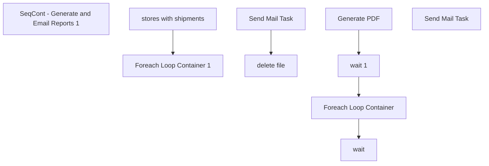

# SSIS Package: WMS_StoreShipmentReportEmail

**Project:** WMS_StoreShipmentReportEmail  
**Folder:** WMS  
**Server:** STL-SSIS-P-01  

## Connection Managers

| Name | Type | Server | Catalog | Connection (sanitized) |
|---|---|---|---|---|
| IntegrationStaging | OLEDB | stl-ssis-p-01 | IntegrationStaging | Data Source=stl-ssis-p-01; Initial Catalog=IntegrationStaging; Provider=SQLNCLI11.1; Integrated Security=SSPI; Auto Translate=False |
| SMTP | SMTP |  |  |  |
| SMTP Connection Manager | SMTP (KingswaySoft) |  |  |  |

## Control Flow Tasks

| Task | Type |
|---|---|
| WMS_StoreShipmentReportEmail | Package |
| SeqCont - Generate and Email Reports 1 | SEQUENCE |
| Foreach Loop Container 1 | FOREACHLOOP |
| Foreach Loop Container | FOREACHLOOP |
| delete file | FileSystemTask |
| Send Mail Task | SendMailTask |
| Generate PDF | ScriptTask |
| wait | ExecuteSQLTask |
| wait 1 | ExecuteSQLTask |
| stores with shipments | ExecuteSQLTask |
| Send Mail Task | SendMailTask |

## Control Flow Outline

```text
- Send Mail Task [SendMailTask]
- SeqCont - Generate and Email Reports 1 [SEQUENCE]
  - Foreach Loop Container 1 [FOREACHLOOP]
    - Foreach Loop Container [FOREACHLOOP]
      - Send Mail Task [SendMailTask]
      - delete file [FileSystemTask]
    - Generate PDF [ScriptTask]
    - wait [ExecuteSQLTask]
    - wait 1 [ExecuteSQLTask]
  - stores with shipments [ExecuteSQLTask]
```

## Architecture Diagram



## Variables

| Namespace | Name | Expression-bound |
|---|---|---|
| System | Propagate | No |
| User | DateTimeStamp | Yes |
| User | DateTimeStamp2 | Yes |
| User | EmailSubjectLine | Yes |
| User | EndDate | Yes |
| User | EndDateAsDATE | Yes |
| User | EntitiesForReportingLoop | No |
| User | FEL_Attachment | No |
| User | FEL_EmailAddress | No |
| User | FEL_EmailBody | No |
| User | FEL_FileAttachment | Yes |
| User | FEL_FileAttachment2 | No |
| User | GetDate | Yes |
| User | GetDateAsDATE | Yes |
| User | SsrsReportFolderDestination | Yes |
| User | SsrsReportParameterEntity | No |
| User | SsrsReportParameterTransferOrderNumber | No |
| User | SsrsReportUrl | Yes |
| User | StartDate | Yes |
| User | StartDateAsDATE | Yes |
| User | storesForReportingLoop | No |
| User | varDateDiff | No |
| User | varEmailAddress | No |
| User | varFileName | No |

### Expression-bound variable values

#### User::DateTimeStamp

**Expression:**

```sql
(DT_WSTR,4)DATEPART("yyyy",GetDate()) 
+ (DT_WSTR,4)DATEPART("mm",GetDate()) 
+ (DT_WSTR,4)DATEPART("dd",GetDate()) 
+ (DT_WSTR,4)DATEPART("hh",GetDate()) 
+ (DT_WSTR,4)DATEPART("mi",GetDate()) 
+ (DT_WSTR,4)DATEPART("ss",GetDate()) 
+ (DT_WSTR,4)DATEPART("ms",GetDate())
```

**Evaluated value:**

```sql
20235914433397
```

#### User::DateTimeStamp2

**Expression:**

```sql
(DT_WSTR, 4) datepart("year", @[User::GetDate])  + right("0"+ (DT_WSTR, 2) datepart("mm", @[User::GetDate]),2)  +
right("0" +(DT_WSTR, 2) datepart("dd",  @[User::GetDate]),2)
```

**Evaluated value:**

```sql
20230509
```

#### User::EmailSubjectLine

**Expression:**

```sql
"Store Shipment Report - " + @[$Package::EmailTestOrProd]
```

**Evaluated value:**

```sql
Store Shipment Report - PROD
```

#### User::EndDate

**Expression:**

```sql
dateadd("dd", @[$Package::DaysToInclude], @[User::StartDate])
```

**Evaluated value:**

```sql
5/9/2023
```

#### User::EndDateAsDATE

**Expression:**

```sql
(DT_WSTR, 4) datepart("year", @[User::EndDate])  + "-" +
right("0"+ (DT_WSTR, 2) datepart("mm", @[User::EndDate]),2)  + "-" +
right("0" +(DT_WSTR, 2) datepart("dd",  @[User::EndDate]),2)
```

**Evaluated value:**

```sql
2023-05-09
```

#### User::FEL_FileAttachment

**Expression:**

```sql
@[User::SsrsReportFolderDestination] + "Report_" +  @[User::SsrsReportParameterEntity] + "_" + @[User::DateTimeStamp2] + ".pdf"
```

**Evaluated value:**

```sql
\\stl-ssis-p-01\IntegrationStaging\Stores\StoreShipmentReport\Report_2051_20230509.pdf
```

#### User::GetDate

**Expression:**

```sql
(DT_DATE)DATEDIFF("Day", (DT_DATE) 0, GETDATE())
```

**Evaluated value:**

```sql
5/9/2023
```

#### User::GetDateAsDATE

**Expression:**

```sql
(DT_WSTR, 4) datepart("year", @[User::GetDate])  + "-" +
right("0"+ (DT_WSTR, 2) datepart("mm", @[User::GetDate]),2)  + "-" +
right("0" +(DT_WSTR, 2) datepart("dd",  @[User::GetDate]),2)
```

**Evaluated value:**

```sql
2023-05-09
```

#### User::SsrsReportFolderDestination

**Expression:**

```sql
"\\\\"+ @[$Package::IntegrationStaging_ServerName]+"\\IntegrationStaging\\Stores\\StoreShipmentReport\\"
```

**Evaluated value:**

```sql
\\stl-ssis-p-01\IntegrationStaging\Stores\StoreShipmentReport\
```

#### User::SsrsReportUrl

**Expression:**

```sql
@[$Package::SsrsReportUrl]
```

**Evaluated value:**

```sql
http://clb-ssrs-p-01/ReportServer/Pages/ReportViewer.aspx?%2fSTORES%2fStore+shipment+report+(prod)&rs:Command=Render&storeNumber=
```

#### User::StartDate

**Expression:**

```sql
dateadd("dd", -@[$Package::DaysToGoBack] , @[User::GetDate] )
```

**Evaluated value:**

```sql
5/8/2023
```

#### User::StartDateAsDATE

**Expression:**

```sql
(DT_WSTR, 4) datepart("year", @[User::StartDate])  + "-" +
right("0"+ (DT_WSTR, 2) datepart("mm", @[User::StartDate]),2)  + "-" +
right("0" +(DT_WSTR, 2) datepart("dd",  @[User::StartDate]),2)
```

**Evaluated value:**

```sql
2023-05-08
```

## Execute SQL Tasks

### wait

**Path:** `Package\SeqCont - Generate and Email Reports 1\Foreach Loop Container 1\wait`  
**Connection:** IntegrationStaging (stl-ssis-p-01/IntegrationStaging)  

```sql
WAITFOR DELAY '00:00:05'
```

### wait 1

**Path:** `Package\SeqCont - Generate and Email Reports 1\Foreach Loop Container 1\wait 1`  
**Connection:** IntegrationStaging (stl-ssis-p-01/IntegrationStaging)  

```sql
WAITFOR DELAY '00:00:05'
```

### stores with shipments

**Path:** `Package\SeqCont - Generate and Email Reports 1\stores with shipments`  
**Connection:** IntegrationStaging (stl-ssis-p-01/IntegrationStaging)  

```sql

SELECT distinct([Receiving Location]), --'store' + right([Receiving Location],3) + '@buildabear.com'
case when left([Receiving Location], 1) = 2 then  'store' + right([Receiving Location],4) + '@buildabear.com'
else  'store' + right([Receiving Location],3) + '@buildabear.com' end
FROM [WMS].[vwStoreShipmentReport]
  where  1=1
 -- and [Receiving Location] = '1335'
  and datediff(dd, [Ship Date], getdate()) <= 1
 and [Receiving Location] not in ('9991','1013','2013')
  and [Receiving Location] in (select WarehouseID from [ERP].[vwWarehouseIDToLocationCodeRetailInventory])

```

## Data Flow: Sources

_None detected._

## Data Flow: Destinations

_None detected._
