# SSIS Package: WMS_StoreToStoreTransferExtract

**Project:** WMS_StoreToStoreTransferExtract  
**Folder:** WMS  
**Server:** STL-SSIS-P-01  

## Connection Managers

| Name | Type | Server | Catalog | Connection (sanitized) |
|---|---|---|---|---|
| Azure Service Bus | Azure Service Bus (KingswaySoft) |  |  |  |
| Dynamics AX Connection Manager | DynamicsAX |  |  |  |
| IntegrationStaging | OLEDB | stl-ssis-p-01 | IntegrationStaging | Data Source=stl-ssis-p-01; Initial Catalog=IntegrationStaging; Provider=SQLNCLI11.1; Integrated Security=SSPI; Auto Translate=False |
| SMTP | SMTP |  |  |  |

## Control Flow Tasks

| Task | Type |
|---|---|
| WMS_StoreToStoreTransferExtract | Package |
| SeqCont - Discovery and Testing | SEQUENCE |
| Data Flow Task | Pipeline |
| Data Flow Task 1 | Pipeline |
| Data Flow Task 2 | Pipeline |
| Data Flow Task 3 | Pipeline |
| DFT - WORK LINE | Pipeline |
| SeqCont - Generate and Email Reports | SEQUENCE |
| Execute SQL Task - Target Companies | ExecuteSQLTask |
| Foreach Loop Container | FOREACHLOOP |
| Execute SQL Task - Target Transfer Order Numbers | ExecuteSQLTask |
| Foreach Loop Container | FOREACHLOOP |
| Execute SQL Task - Get Email Address | ExecuteSQLTask |
| Execute SQL Task - Update As Emailed | ExecuteSQLTask |
| FEL -  Email and Delete File | FOREACHLOOP |
| File System Task | FileSystemTask |
| Send Mail Task | SendMailTask |
| Script Task - Generate PDF File - 1100 | ScriptTask |
| SeqCont - Message Substring Extract Approach | SEQUENCE |
| SeqCont - Msg Download and Parse | SEQUENCE |
| DFT - Extract from Raw Message | Pipeline |
| DFT - Raw Message Download | Pipeline |
| Execute SQL Task - Truncate Stage | ExecuteSQLTask |
| spMergeStoreToStoreTransferMessage | ExecuteSQLTask |
| Sequence Container | SEQUENCE |
| Execute SQL Task - Truncate Stage | ExecuteSQLTask |
| Sequence Container | SEQUENCE |
| SeqCont - 1100 | SEQUENCE |
| FEL - 1100 | FOREACHLOOP |
| Data Flow Task | Pipeline |
| Update Records as WorkLookupComplete | ExecuteSQLTask |
| Stage Transfer Order Numbers for Loop | ExecuteSQLTask |
| SeqCont - 1700 | SEQUENCE |
| FEL - 1700 | FOREACHLOOP |
| Data Flow Task | Pipeline |
| Update Records as WorkLookupComplete | ExecuteSQLTask |
| Stage Transfer Order Numbers for Loop 1700 | ExecuteSQLTask |
| SeqCont - 2110 | SEQUENCE |
| FEL - 2110 | FOREACHLOOP |
| Data Flow Task | Pipeline |
| Update Records as WorkLookupComplete | ExecuteSQLTask |
| Stage Transfer Order Numbers for Loop 2110 | ExecuteSQLTask |
| spMergeStoreToStoreTransferLicensePlate | ExecuteSQLTask |
| Send Mail Task | SendMailTask |

## Control Flow Outline

```text
- Send Mail Task [SendMailTask]
- SeqCont - Discovery and Testing [SEQUENCE]
  - DFT - WORK LINE [Pipeline]
  - Data Flow Task [Pipeline]
  - Data Flow Task 1 [Pipeline]
  - Data Flow Task 2 [Pipeline]
  - Data Flow Task 3 [Pipeline]
- SeqCont - Generate and Email Reports [SEQUENCE]
  - Execute SQL Task - Target Companies [ExecuteSQLTask]
  - Foreach Loop Container [FOREACHLOOP]
    - Execute SQL Task - Target Transfer Order Numbers [ExecuteSQLTask]
    - Foreach Loop Container [FOREACHLOOP]
      - Execute SQL Task - Get Email Address [ExecuteSQLTask]
      - Execute SQL Task - Update As Emailed [ExecuteSQLTask]
      - FEL -  Email and Delete File [FOREACHLOOP]
        - File System Task [FileSystemTask]
        - Send Mail Task [SendMailTask]
      - Script Task - Generate PDF File - 1100 [ScriptTask]
- SeqCont - Message Substring Extract Approach [SEQUENCE]
  - SeqCont - Msg Download and Parse [SEQUENCE]
    - DFT - Extract from Raw Message [Pipeline]
    - DFT - Raw Message Download [Pipeline]
    - Execute SQL Task - Truncate Stage [ExecuteSQLTask]
  - spMergeStoreToStoreTransferMessage [ExecuteSQLTask]
- Sequence Container [SEQUENCE]
  - Execute SQL Task - Truncate Stage [ExecuteSQLTask]
  - Sequence Container [SEQUENCE]
    - SeqCont - 1100 [SEQUENCE]
      - FEL - 1100 [FOREACHLOOP]
        - Data Flow Task [Pipeline]
        - Update Records as WorkLookupComplete [ExecuteSQLTask]
      - Stage Transfer Order Numbers for Loop [ExecuteSQLTask]
    - SeqCont - 1700 [SEQUENCE]
      - FEL - 1700 [FOREACHLOOP]
        - Data Flow Task [Pipeline]
        - Update Records as WorkLookupComplete [ExecuteSQLTask]
      - Stage Transfer Order Numbers for Loop 1700 [ExecuteSQLTask]
    - SeqCont - 2110 [SEQUENCE]
      - FEL - 2110 [FOREACHLOOP]
        - Data Flow Task [Pipeline]
        - Update Records as WorkLookupComplete [ExecuteSQLTask]
      - Stage Transfer Order Numbers for Loop 2110 [ExecuteSQLTask]
  - spMergeStoreToStoreTransferLicensePlate [ExecuteSQLTask]
```

## Architecture Diagram

```mermaid
flowchart TD
    n_Package_SeqCont___Discovery_and_Testing["SeqCont - Discovery and Testing"]
    n_Package_SeqCont___Discovery_and_Testing_Data_Flow_Task["Data Flow Task"]
    n_Package_SeqCont___Discovery_and_Testing_Data_Flow_Task_1["Data Flow Task 1"]
    n_Package_SeqCont___Discovery_and_Testing_Data_Flow_Task_2["Data Flow Task 2"]
    n_Package_SeqCont___Discovery_and_Testing_Data_Flow_Task_3["Data Flow Task 3"]
    n_Package_SeqCont___Discovery_and_Testing_DFT___WORK_LINE["DFT - WORK LINE"]
    n_Package_SeqCont___Generate_and_Email_Reports["SeqCont - Generate and Email Reports"]
    n_Package_SeqCont___Generate_and_Email_Reports_Execute_SQL_Task___Target_Companies["Execute SQL Task - Target Companies"]
    n_Package_SeqCont___Generate_and_Email_Reports_Foreach_Loop_Container["Foreach Loop Container"]
    n_Package_SeqCont___Generate_and_Email_Reports_Foreach_Loop_Container_Execute_SQL_Task___Target_Transfer_Order_Numbers["Execute SQL Task - Target Transfer Order Numbers"]
    n_Package_SeqCont___Generate_and_Email_Reports_Foreach_Loop_Container_Foreach_Loop_Container["Foreach Loop Container"]
    n_Package_SeqCont___Generate_and_Email_Reports_Foreach_Loop_Container_Foreach_Loop_Container_Execute_SQL_Task___Get_Email_Address["Execute SQL Task - Get Email Address"]
    n_Package_SeqCont___Generate_and_Email_Reports_Foreach_Loop_Container_Foreach_Loop_Container_Execute_SQL_Task___Update_As_Emailed["Execute SQL Task - Update As Emailed"]
    n_Package_SeqCont___Generate_and_Email_Reports_Foreach_Loop_Container_Foreach_Loop_Container_FEL____Email_and_Delete_File["FEL -  Email and Delete File"]
    n_Package_SeqCont___Generate_and_Email_Reports_Foreach_Loop_Container_Foreach_Loop_Container_FEL____Email_and_Delete_File_File_System_Task["File System Task"]
    n_Package_SeqCont___Generate_and_Email_Reports_Foreach_Loop_Container_Foreach_Loop_Container_FEL____Email_and_Delete_File_Send_Mail_Task["Send Mail Task"]
    n_Package_SeqCont___Generate_and_Email_Reports_Foreach_Loop_Container_Foreach_Loop_Container_Script_Task___Generate_PDF_File___1100["Script Task - Generate PDF File - 1100"]
    n_Package_SeqCont___Message_Substring_Extract_Approach["SeqCont - Message Substring Extract Approach"]
    n_Package_SeqCont___Message_Substring_Extract_Approach_SeqCont___Msg_Download_and_Parse["SeqCont - Msg Download and Parse"]
    n_Package_SeqCont___Message_Substring_Extract_Approach_SeqCont___Msg_Download_and_Parse_DFT___Extract_from_Raw_Message["DFT - Extract from Raw Message"]
    n_Package_SeqCont___Message_Substring_Extract_Approach_SeqCont___Msg_Download_and_Parse_DFT___Raw_Message_Download["DFT - Raw Message Download"]
    n_Package_SeqCont___Message_Substring_Extract_Approach_SeqCont___Msg_Download_and_Parse_Execute_SQL_Task___Truncate_Stage["Execute SQL Task - Truncate Stage"]
    n_Package_SeqCont___Message_Substring_Extract_Approach_spMergeStoreToStoreTransferMessage["spMergeStoreToStoreTransferMessage"]
    n_Package_Sequence_Container["Sequence Container"]
    n_Package_Sequence_Container_Execute_SQL_Task___Truncate_Stage["Execute SQL Task - Truncate Stage"]
    n_Package_Sequence_Container_Sequence_Container["Sequence Container"]
    n_Package_Sequence_Container_Sequence_Container_SeqCont___1100["SeqCont - 1100"]
    n_Package_Sequence_Container_Sequence_Container_SeqCont___1100_FEL___1100["FEL - 1100"]
    n_Package_Sequence_Container_Sequence_Container_SeqCont___1100_FEL___1100_Data_Flow_Task["Data Flow Task"]
    n_Package_Sequence_Container_Sequence_Container_SeqCont___1100_FEL___1100_Update_Records_as_WorkLookupComplete["Update Records as WorkLookupComplete"]
    n_Package_Sequence_Container_Sequence_Container_SeqCont___1100_Stage_Transfer_Order_Numbers_for_Loop["Stage Transfer Order Numbers for Loop"]
    n_Package_Sequence_Container_Sequence_Container_SeqCont___1700["SeqCont - 1700"]
    n_Package_Sequence_Container_Sequence_Container_SeqCont___1700_FEL___1700["FEL - 1700"]
    n_Package_Sequence_Container_Sequence_Container_SeqCont___1700_FEL___1700_Data_Flow_Task["Data Flow Task"]
    n_Package_Sequence_Container_Sequence_Container_SeqCont___1700_FEL___1700_Update_Records_as_WorkLookupComplete["Update Records as WorkLookupComplete"]
    n_Package_Sequence_Container_Sequence_Container_SeqCont___1700_Stage_Transfer_Order_Numbers_for_Loop_1700["Stage Transfer Order Numbers for Loop 1700"]
    n_Package_Sequence_Container_Sequence_Container_SeqCont___2110["SeqCont - 2110"]
    n_Package_Sequence_Container_Sequence_Container_SeqCont___2110_FEL___2110["FEL - 2110"]
    n_Package_Sequence_Container_Sequence_Container_SeqCont___2110_FEL___2110_Data_Flow_Task["Data Flow Task"]
    n_Package_Sequence_Container_Sequence_Container_SeqCont___2110_FEL___2110_Update_Records_as_WorkLookupComplete["Update Records as WorkLookupComplete"]
    n_Package_Sequence_Container_Sequence_Container_SeqCont___2110_Stage_Transfer_Order_Numbers_for_Loop_2110["Stage Transfer Order Numbers for Loop 2110"]
    n_Package_Sequence_Container_spMergeStoreToStoreTransferLicensePlate["spMergeStoreToStoreTransferLicensePlate"]
    n_Package_EventHandlers_OnError__Send_Mail_Task["Send Mail Task"]
    n_Package_SeqCont___Generate_and_Email_Reports_Foreach_Loop_Container_Foreach_Loop_Container_FEL____Email_and_Delete_File_Send_Mail_Task --> n_Package_SeqCont___Generate_and_Email_Reports_Foreach_Loop_Container_Foreach_Loop_Container_FEL____Email_and_Delete_File_File_System_Task
    n_Package_SeqCont___Generate_and_Email_Reports_Foreach_Loop_Container_Foreach_Loop_Container_Execute_SQL_Task___Get_Email_Address --> n_Package_SeqCont___Generate_and_Email_Reports_Foreach_Loop_Container_Foreach_Loop_Container_FEL____Email_and_Delete_File
    n_Package_SeqCont___Generate_and_Email_Reports_Foreach_Loop_Container_Foreach_Loop_Container_Script_Task___Generate_PDF_File___1100 --> n_Package_SeqCont___Generate_and_Email_Reports_Foreach_Loop_Container_Foreach_Loop_Container_Execute_SQL_Task___Get_Email_Address
    n_Package_SeqCont___Generate_and_Email_Reports_Foreach_Loop_Container_Foreach_Loop_Container_FEL____Email_and_Delete_File --> n_Package_SeqCont___Generate_and_Email_Reports_Foreach_Loop_Container_Foreach_Loop_Container_Execute_SQL_Task___Update_As_Emailed
    n_Package_SeqCont___Generate_and_Email_Reports_Foreach_Loop_Container_Execute_SQL_Task___Target_Transfer_Order_Numbers --> n_Package_SeqCont___Generate_and_Email_Reports_Foreach_Loop_Container_Foreach_Loop_Container
    n_Package_SeqCont___Generate_and_Email_Reports_Execute_SQL_Task___Target_Companies --> n_Package_SeqCont___Generate_and_Email_Reports_Foreach_Loop_Container
    n_Package_SeqCont___Message_Substring_Extract_Approach_SeqCont___Msg_Download_and_Parse_Execute_SQL_Task___Truncate_Stage --> n_Package_SeqCont___Message_Substring_Extract_Approach_SeqCont___Msg_Download_and_Parse_DFT___Raw_Message_Download
    n_Package_SeqCont___Message_Substring_Extract_Approach_SeqCont___Msg_Download_and_Parse_DFT___Raw_Message_Download --> n_Package_SeqCont___Message_Substring_Extract_Approach_SeqCont___Msg_Download_and_Parse_DFT___Extract_from_Raw_Message
    n_Package_SeqCont___Message_Substring_Extract_Approach_SeqCont___Msg_Download_and_Parse --> n_Package_SeqCont___Message_Substring_Extract_Approach_spMergeStoreToStoreTransferMessage
    n_Package_Sequence_Container_Sequence_Container_SeqCont___1100_FEL___1100_Data_Flow_Task --> n_Package_Sequence_Container_Sequence_Container_SeqCont___1100_FEL___1100_Update_Records_as_WorkLookupComplete
    n_Package_Sequence_Container_Sequence_Container_SeqCont___1100_Stage_Transfer_Order_Numbers_for_Loop --> n_Package_Sequence_Container_Sequence_Container_SeqCont___1100_FEL___1100
    n_Package_Sequence_Container_Sequence_Container_SeqCont___1700_FEL___1700_Data_Flow_Task --> n_Package_Sequence_Container_Sequence_Container_SeqCont___1700_FEL___1700_Update_Records_as_WorkLookupComplete
    n_Package_Sequence_Container_Sequence_Container_SeqCont___1700_Stage_Transfer_Order_Numbers_for_Loop_1700 --> n_Package_Sequence_Container_Sequence_Container_SeqCont___1700_FEL___1700
    n_Package_Sequence_Container_Sequence_Container_SeqCont___2110_FEL___2110_Data_Flow_Task --> n_Package_Sequence_Container_Sequence_Container_SeqCont___2110_FEL___2110_Update_Records_as_WorkLookupComplete
    n_Package_Sequence_Container_Sequence_Container_SeqCont___2110_Stage_Transfer_Order_Numbers_for_Loop_2110 --> n_Package_Sequence_Container_Sequence_Container_SeqCont___2110_FEL___2110
    n_Package_Sequence_Container_Sequence_Container --> n_Package_Sequence_Container_spMergeStoreToStoreTransferLicensePlate
    n_Package_Sequence_Container_Execute_SQL_Task___Truncate_Stage --> n_Package_Sequence_Container_Sequence_Container
    n_Package_SeqCont___Message_Substring_Extract_Approach --> n_Package_Sequence_Container
    n_Package_Sequence_Container --> n_Package_SeqCont___Generate_and_Email_Reports
```



## Variables

| Namespace | Name | Expression-bound |
|---|---|---|
| System | Propagate | No |
| User | DateTimeStamp | Yes |
| User | EmailSubjectLine | Yes |
| User | EndDate | Yes |
| User | EndDateAsDATE | Yes |
| User | EntitiesForReportingLoop | No |
| User | FEL_EmailAddress | No |
| User | FEL_FileAttachment | No |
| User | FEL_TransferOrderNumber | No |
| User | FEL_TransferOrderNumber1700 | No |
| User | FEL_TransferOrderNumber2110 | No |
| User | GetDate | Yes |
| User | GetDateAsDATE | Yes |
| User | SsrsReportFolderDestination | Yes |
| User | SsrsReportParameterEntity | No |
| User | SsrsReportParameterTransferOrderNumber | No |
| User | SsrsReportUrl | Yes |
| User | StartDate | Yes |
| User | StartDateAsDATE | Yes |
| User | TransferOrderNumbers | No |
| User | TransferOrderNumbers1700 | No |
| User | TransferOrderNumbers2110 | No |
| User | TransferOrderNumbersEmailSequence | No |

### Expression-bound variable values

#### User::DateTimeStamp

**Expression:**

```sql
(DT_WSTR,4)DATEPART("yyyy",GetDate()) 
+ (DT_WSTR,4)DATEPART("mm",GetDate()) 
+ (DT_WSTR,4)DATEPART("dd",GetDate()) 
+ (DT_WSTR,4)DATEPART("hh",GetDate()) 
+ (DT_WSTR,4)DATEPART("mi",GetDate()) 
+ (DT_WSTR,4)DATEPART("ss",GetDate()) 
+ (DT_WSTR,4)DATEPART("ms",GetDate())
```

**Evaluated value:**

```sql
202342516323760
```

#### User::EmailSubjectLine

**Expression:**

```sql
"Store To Store Transfer Barcode Report - " + @[$Package::EmailTestOrProd]
```

**Evaluated value:**

```sql
Store To Store Transfer Barcode Report - TEST
```

#### User::EndDate

**Expression:**

```sql
dateadd("dd", @[$Package::DaysToInclude], @[User::StartDate])
```

**Evaluated value:**

```sql
4/25/2023
```

#### User::EndDateAsDATE

**Expression:**

```sql
(DT_WSTR, 4) datepart("year", @[User::EndDate])  + "-" +
right("0"+ (DT_WSTR, 2) datepart("mm", @[User::EndDate]),2)  + "-" +
right("0" +(DT_WSTR, 2) datepart("dd",  @[User::EndDate]),2)
```

**Evaluated value:**

```sql
2023-04-25
```

#### User::GetDate

**Expression:**

```sql
(DT_DATE)DATEDIFF("Day", (DT_DATE) 0, GETDATE())
```

**Evaluated value:**

```sql
4/25/2023
```

#### User::GetDateAsDATE

**Expression:**

```sql
(DT_WSTR, 4) datepart("year", @[User::GetDate])  + "-" +
right("0"+ (DT_WSTR, 2) datepart("mm", @[User::GetDate]),2)  + "-" +
right("0" +(DT_WSTR, 2) datepart("dd",  @[User::GetDate]),2)
```

**Evaluated value:**

```sql
2023-04-25
```

#### User::SsrsReportFolderDestination

**Expression:**

```sql
"\\\\"+ @[$Package::IntegrationStaging_ServerName]+"\\IntegrationStaging\\Stores\\StoreToStoreTransferBarcode\\"
```

**Evaluated value:**

```sql
\\stl-ssis-p-01\IntegrationStaging\Stores\StoreToStoreTransferBarcode\
```

#### User::SsrsReportUrl

**Expression:**

```sql
@[$Package::SsrsReportUrl]
```

**Evaluated value:**

```sql
http://clb-ssrs-p-01/ReportServer/Pages/ReportViewer.aspx?%2fSTORES%2fStoreToStoreTransferLabel&rs:Command=Render&TransferOrderNumber=
```

#### User::StartDate

**Expression:**

```sql
dateadd("dd", -@[$Package::DaysToGoBack] , @[User::GetDate] )
```

**Evaluated value:**

```sql
4/24/2023
```

#### User::StartDateAsDATE

**Expression:**

```sql
(DT_WSTR, 4) datepart("year", @[User::StartDate])  + "-" +
right("0"+ (DT_WSTR, 2) datepart("mm", @[User::StartDate]),2)  + "-" +
right("0" +(DT_WSTR, 2) datepart("dd",  @[User::StartDate]),2)
```

**Evaluated value:**

```sql
2023-04-24
```

## Execute SQL Tasks

### Execute SQL Task - Target Companies

**Path:** `Package\SeqCont - Generate and Email Reports\Execute SQL Task - Target Companies`  
**Connection:** IntegrationStaging (stl-ssis-p-01/IntegrationStaging)  

```sql
select distinct Entity 
from wms.StoreToStoreTransferLicensePlate
where EmailedDate is null 
```

### Execute SQL Task - Target Transfer Order Numbers

**Path:** `Package\SeqCont - Generate and Email Reports\Foreach Loop Container\Execute SQL Task - Target Transfer Order Numbers`  
**Connection:** IntegrationStaging (stl-ssis-p-01/IntegrationStaging)  

```sql
select distinct TransferOrderNumber
from wms.StoreToStoreTransferLicensePlate (nolock) 
where Entity = ?
and EmailedDate is null 

```

### Execute SQL Task - Get Email Address

**Path:** `Package\SeqCont - Generate and Email Reports\Foreach Loop Container\Foreach Loop Container\Execute SQL Task - Get Email Address`  
**Connection:** IntegrationStaging (stl-ssis-p-01/IntegrationStaging)  

```sql

select distinct EmailAddress 
from wms.StoreToStoreTransferLicensePlate (nolock) 
where Entity = ?
and TransferOrderNumber = ?

```

### Execute SQL Task - Update As Emailed

**Path:** `Package\SeqCont - Generate and Email Reports\Foreach Loop Container\Foreach Loop Container\Execute SQL Task - Update As Emailed`  
**Connection:** IntegrationStaging (stl-ssis-p-01/IntegrationStaging)  

```sql
update wms.StoreToStoreTransferLicensePlate
set EmailedDate = getdate()
where Entity = ?
and TransferOrderNumber = ?

```

### Execute SQL Task - Truncate Stage

**Path:** `Package\SeqCont - Message Substring Extract Approach\SeqCont - Msg Download and Parse\Execute SQL Task - Truncate Stage`  
**Connection:** IntegrationStaging (stl-ssis-p-01/IntegrationStaging)  

```sql
truncate table WMS.StoreToStoreTransferRawMessage

truncate table WMS.StoreToStoreTransferMessageStage
```

### spMergeStoreToStoreTransferMessage

**Path:** `Package\SeqCont - Message Substring Extract Approach\spMergeStoreToStoreTransferMessage`  
**Connection:** IntegrationStaging (stl-ssis-p-01/IntegrationStaging)  

```sql
exec [WMS].[spMergeStoreToStoreTransferMessage] 
```

### Execute SQL Task - Truncate Stage

**Path:** `Package\Sequence Container\Execute SQL Task - Truncate Stage`  
**Connection:** IntegrationStaging (stl-ssis-p-01/IntegrationStaging)  

```sql
truncate table [WMS].[StoreToStoreTransferLicensePlateStage]
```

### Update Records as WorkLookupComplete

**Path:** `Package\Sequence Container\Sequence Container\SeqCont - 1100\FEL - 1100\Update Records as WorkLookupComplete`  
**Connection:** IntegrationStaging (stl-ssis-p-01/IntegrationStaging)  

```sql
declare @TransferOrderNumber varchar (20)
	
set @TransferOrderNumber = ?

--

update [WMS].[StoreToStoreTransferMessage]
set WorkLookupComplete = 1
where Entity = '1100'
and TransferOrderNumber = @TransferOrderNumber

```

### Stage Transfer Order Numbers for Loop

**Path:** `Package\Sequence Container\Sequence Container\SeqCont - 1100\Stage Transfer Order Numbers for Loop`  
**Connection:** IntegrationStaging (stl-ssis-p-01/IntegrationStaging)  

```sql
select distinct TransferOrderNumber

from [WMS].[StoreToStoreTransferMessage]

where entity = 1100

and WorkLookupComplete is null 

order by 1


```

### Update Records as WorkLookupComplete

**Path:** `Package\Sequence Container\Sequence Container\SeqCont - 1700\FEL - 1700\Update Records as WorkLookupComplete`  
**Connection:** IntegrationStaging (stl-ssis-p-01/IntegrationStaging)  

```sql
declare @TransferOrderNumber varchar (20)
	
set @TransferOrderNumber = ?

--

update [WMS].[StoreToStoreTransferMessage]
set WorkLookupComplete = 1
where Entity = '1700'
and TransferOrderNumber = @TransferOrderNumber

```

### Stage Transfer Order Numbers for Loop 1700

**Path:** `Package\Sequence Container\Sequence Container\SeqCont - 1700\Stage Transfer Order Numbers for Loop 1700`  
**Connection:** IntegrationStaging (stl-ssis-p-01/IntegrationStaging)  

```sql
select distinct TransferOrderNumber

from [WMS].[StoreToStoreTransferMessage]

where entity = 1700

and WorkLookupComplete is null 

order by 1


```

### Update Records as WorkLookupComplete

**Path:** `Package\Sequence Container\Sequence Container\SeqCont - 2110\FEL - 2110\Update Records as WorkLookupComplete`  
**Connection:** IntegrationStaging (stl-ssis-p-01/IntegrationStaging)  

```sql
declare @TransferOrderNumber varchar (20)
	
set @TransferOrderNumber = ?

--

update [WMS].[StoreToStoreTransferMessage]
set WorkLookupComplete = 1
where Entity = '2110'
and TransferOrderNumber = @TransferOrderNumber

```

### Stage Transfer Order Numbers for Loop 2110

**Path:** `Package\Sequence Container\Sequence Container\SeqCont - 2110\Stage Transfer Order Numbers for Loop 2110`  
**Connection:** IntegrationStaging (stl-ssis-p-01/IntegrationStaging)  

```sql
select distinct TransferOrderNumber

from [WMS].[StoreToStoreTransferMessage]

where entity = 2110

and WorkLookupComplete is null 

order by 1


```

### spMergeStoreToStoreTransferLicensePlate

**Path:** `Package\Sequence Container\spMergeStoreToStoreTransferLicensePlate`  
**Connection:** IntegrationStaging (stl-ssis-p-01/IntegrationStaging)  

```sql
EXEC [WMS].[spMergeStoreToStoreTransferLicensePlate]
```

## Data Flow: Sources

| Component | Source Object | Type | Data Flow Task | Connection | SQL Kind |
|---|---|---|---|---|---|
| OLE DB Source - IntStaging - CTE of StoreToStoreTransferRawMessage |  | OLEDBSource | DFT - Extract from Raw Message | IntegrationStaging | SqlCommand |

#### OLE DB Source - IntStaging - CTE of StoreToStoreTransferRawMessage — SqlCommand

```sql
with MessageExtract as (
select 
cast (
SUBSTRING(message,
CHARINDEX('mserp_transferordernumber', Message)+36, 
12) as varchar (20)) as TransferOrderNumber, 

cast (
SUBSTRING(message, 
CHARINDEX('mserp_dataareaid', Message)+27, 
4 )  as varchar (10)) as Entity, 
cast (
SUBSTRING(message, 
CHARINDEX('mserp_shippingwarehouseid',Message)+36,
4) as varchar(5)) as  FromWarehouse, 
cast (
SUBSTRING(message, 
CHARINDEX('mserp_receivingwarehouseid',Message)+37,
4) as varchar(5)) as  ToWarehouse, 

SUBSTRING(message, 
charindex('mserp_transferorderstatus',Message)+123,
9) as Status 
from WMS.StoreToStoreTransferRawMessage


) 

select TransferOrderNumber, 
Entity, 
FromWarehouse, 
ToWarehouse
from MessageExtract
where ISNUMERIC(entity) = 1
and Status = '200000001' -- Per Cameron Toben this is Shipped Status 
and FromWarehouse not in ('1013','9980','8175','9960','9970')  -- Excluding Primary Warehouses 
group by 
TransferOrderNumber, 
Entity, 
FromWarehouse, 
ToWarehouse
order by 2, 1
```

## Data Flow: Destinations

| Component | Target Table | Type | Data Flow Task | Connection | SQL Kind |
|---|---|---|---|---|---|
| OLE DB Destination - IntStaging -  WMS StoreToStoreTransferLabelRawMessage |  | OLEDBDestination | Data Flow Task | IntegrationStaging |  |
| OLE DB Destination |  | OLEDBDestination | Data Flow Task 2 | IntegrationStaging |  |
| OLE DB Destination |  | OLEDBDestination | DFT - WORK LINE | IntegrationStaging |  |
| OLE DB Destination - IntStaging  - StoreToStoreTransferMessageStage |  | OLEDBDestination | DFT - Extract from Raw Message | IntegrationStaging |  |
| OLE DB Destination - IntStaging -  WMS StoreToStoreTransferLabelRawMessage |  | OLEDBDestination | DFT - Raw Message Download | IntegrationStaging |  |
| OLE DB Destination - IntStaging - StoreToStoreTransferLicensePlateStage |  | OLEDBDestination | Data Flow Task | IntegrationStaging |  |
| OLE DB Destination - IntStaging - StoreToStoreTransferLicensePlateStage |  | OLEDBDestination | Data Flow Task | IntegrationStaging |  |
| OLE DB Destination - IntStaging - StoreToStoreTransferLicensePlateStage |  | OLEDBDestination | Data Flow Task | IntegrationStaging |  |
