# SSIS Package: WMS_TransferOrderCreateFromGS

**Project:** WMS_TransferOrderCreateFromGS  
**Folder:** WMS  
**Server:** STL-SSIS-P-01  

## Connection Managers

| Name | Type | Server | Catalog | Connection (sanitized) |
|---|---|---|---|---|
| CouponXML | FLATFILE |  |  |  |
| DWStaging | OLEDB | papamart | DWStaging | Data Source=papamart; Initial Catalog=DWStaging; Provider=SQLNCLI11.1; Integrated Security=SSPI; Auto Translate=False |
| IntegrationStaging | OLEDB | STL-SSIS-P-01 | IntegrationStaging | Data Source=STL-SSIS-P-01; Initial Catalog=IntegrationStaging; Provider=SQLNCLI11.1; Integrated Security=SSPI; Auto Translate=False |
| SMTP | SMTP |  |  |  |
| XML_Error | FLATFILE |  |  |  |
| XML_InProgress | FLATFILE |  |  |  |
| XML_Processed | FLATFILE |  |  |  |
| XML_Source | FLATFILE |  |  |  |
| XML_Source 1 | FLATFILE |  |  |  |
| bedrockdb02.me_01 | OLEDB | bedrockdb02 | me_01 | Data Source=bedrockdb02; Initial Catalog=me_01; Provider=SQLNCLI11.1; Integrated Security=SSPI; Auto Translate=False |
| bedrocktestdb02.me_01 | OLEDB | bedrocktestdb02 | me_01 | Data Source=bedrocktestdb02; Initial Catalog=me_01; Provider=SQLNCLI11.1; Integrated Security=SSPI; Auto Translate=False |
| papamart.dw | OLEDB | papamart | dw | Data Source=papamart; Initial Catalog=dw; Provider=SQLNCLI11.1; Integrated Security=SSPI; Auto Translate=False |
| papamarttest.dw | OLEDB | papamarttest | dw | Data Source=papamarttest; Initial Catalog=dw; Provider=SQLNCLI11.1; Integrated Security=SSPI; Auto Translate=False |

## Control Flow Tasks

| Task | Type |
|---|---|
| WMS_TransferOrderCreateFromGS | Package |
| Pick a Path | ExecuteSQLTask |
| SEQ - D365 Post Processing | SEQUENCE |
| API Response | ExecuteSQLTask |
| XML File Move | FOREACHLOOP |
| API Success Check | ExecuteSQLTask |
| Move to Error | FileSystemTask |
| Move to Processed | FileSystemTask |
| SEQ - Import Party XML and Prep for D365 | SEQUENCE |
| Add Line Numbers | ExecuteSQLTask |
| Assign Line Numbers | ExecuteSQLTask |
| Merge Header | ExecuteSQLTask |
| Merge Lines | ExecuteSQLTask |
| Truncate Staging | ExecuteSQLTask |
| XML Data | FOREACHLOOP |
| Move to InProgress | FileSystemTask |
| XML Load | Pipeline |
| SEQ Stage for Dynamics | SEQUENCE |
| Merge to StoreShipmentExport | ExecuteSQLTask |
| Stage for TO Create | ExecuteSQLTask |
| Send Mail Task | SendMailTask |

## Control Flow Outline

```text
- Send Mail Task [SendMailTask]
- Pick a Path [ExecuteSQLTask]
- SEQ - D365 Post Processing [SEQUENCE]
  - API Response [ExecuteSQLTask]
  - XML File Move [FOREACHLOOP]
    - API Success Check [ExecuteSQLTask]
    - Move to Error [FileSystemTask]
    - Move to Processed [FileSystemTask]
- SEQ - Import Party XML and Prep for D365 [SEQUENCE]
  - Add Line Numbers [ExecuteSQLTask]
  - Assign Line Numbers [ExecuteSQLTask]
  - Merge Header [ExecuteSQLTask]
  - Merge Lines [ExecuteSQLTask]
  - Truncate Staging [ExecuteSQLTask]
  - XML Data [FOREACHLOOP]
    - Move to InProgress [FileSystemTask]
    - XML Load [Pipeline]
- SEQ Stage for Dynamics [SEQUENCE]
  - Merge to StoreShipmentExport [ExecuteSQLTask]
  - Stage for TO Create [ExecuteSQLTask]
```

## Architecture Diagram

```mermaid
flowchart TD
    n_Package_Pick_a_Path["Pick a Path"]
    n_Package_SEQ___D365_Post_Processing["SEQ - D365 Post Processing"]
    n_Package_SEQ___D365_Post_Processing_API_Response["API Response"]
    n_Package_SEQ___D365_Post_Processing_XML_File_Move["XML File Move"]
    n_Package_SEQ___D365_Post_Processing_XML_File_Move_API_Success_Check["API Success Check"]
    n_Package_SEQ___D365_Post_Processing_XML_File_Move_Move_to_Error["Move to Error"]
    n_Package_SEQ___D365_Post_Processing_XML_File_Move_Move_to_Processed["Move to Processed"]
    n_Package_SEQ___Import_Party_XML_and_Prep_for_D365["SEQ - Import Party XML and Prep for D365"]
    n_Package_SEQ___Import_Party_XML_and_Prep_for_D365_Add_Line_Numbers["Add Line Numbers"]
    n_Package_SEQ___Import_Party_XML_and_Prep_for_D365_Assign_Line_Numbers["Assign Line Numbers"]
    n_Package_SEQ___Import_Party_XML_and_Prep_for_D365_Merge_Header["Merge Header"]
    n_Package_SEQ___Import_Party_XML_and_Prep_for_D365_Merge_Lines["Merge Lines"]
    n_Package_SEQ___Import_Party_XML_and_Prep_for_D365_Truncate_Staging["Truncate Staging"]
    n_Package_SEQ___Import_Party_XML_and_Prep_for_D365_XML_Data["XML Data"]
    n_Package_SEQ___Import_Party_XML_and_Prep_for_D365_XML_Data_Move_to_InProgress["Move to InProgress"]
    n_Package_SEQ___Import_Party_XML_and_Prep_for_D365_XML_Data_XML_Load["XML Load"]
    n_Package_SEQ_Stage_for_Dynamics["SEQ Stage for Dynamics"]
    n_Package_SEQ_Stage_for_Dynamics_Merge_to_StoreShipmentExport["Merge to StoreShipmentExport"]
    n_Package_SEQ_Stage_for_Dynamics_Stage_for_TO_Create["Stage for TO Create"]
    n_Package_EventHandlers_OnError__Send_Mail_Task["Send Mail Task"]
    n_Package_SEQ___D365_Post_Processing_XML_File_Move_API_Success_Check --> n_Package_SEQ___D365_Post_Processing_XML_File_Move_Move_to_Error
    n_Package_SEQ___D365_Post_Processing_XML_File_Move_API_Success_Check --> n_Package_SEQ___D365_Post_Processing_XML_File_Move_Move_to_Processed
    n_Package_SEQ___D365_Post_Processing_API_Response --> n_Package_SEQ___D365_Post_Processing_XML_File_Move
    n_Package_SEQ___Import_Party_XML_and_Prep_for_D365_XML_Data_XML_Load --> n_Package_SEQ___Import_Party_XML_and_Prep_for_D365_XML_Data_Move_to_InProgress
    n_Package_SEQ___Import_Party_XML_and_Prep_for_D365_Truncate_Staging --> n_Package_SEQ___Import_Party_XML_and_Prep_for_D365_XML_Data
    n_Package_SEQ___Import_Party_XML_and_Prep_for_D365_XML_Data --> n_Package_SEQ___Import_Party_XML_and_Prep_for_D365_Assign_Line_Numbers
    n_Package_SEQ___Import_Party_XML_and_Prep_for_D365_Assign_Line_Numbers --> n_Package_SEQ___Import_Party_XML_and_Prep_for_D365_Merge_Header
    n_Package_SEQ___Import_Party_XML_and_Prep_for_D365_Merge_Header --> n_Package_SEQ___Import_Party_XML_and_Prep_for_D365_Merge_Lines
    n_Package_SEQ_Stage_for_Dynamics_Stage_for_TO_Create --> n_Package_SEQ_Stage_for_Dynamics_Merge_to_StoreShipmentExport
    n_Package_Pick_a_Path --> n_Package_SEQ___Import_Party_XML_and_Prep_for_D365
    n_Package_Pick_a_Path --> n_Package_SEQ___D365_Post_Processing
    n_Package_SEQ___Import_Party_XML_and_Prep_for_D365 --> n_Package_SEQ_Stage_for_Dynamics
```



## Variables

| Namespace | Name | Expression-bound |
|---|---|---|
| System | Propagate | No |
| User | CustomerNote | No |
| User | CustomerNoteFileName | No |
| User | CustomerNoteProcessGroup | No |
| User | CustomerNumber | No |
| User | DateTimeStamp | Yes |
| User | EndDate | Yes |
| User | EndDateAsDATE | Yes |
| User | GetDate | Yes |
| User | GetDateAsDATE | Yes |
| User | ProcessedOrError | No |
| User | StartDate | Yes |
| User | StartDateAsDATE | Yes |
| User | StoreInventoryZipForLoop | No |
| User | Variable | Yes |
| User | XMLDestinationFullPath | Yes |
| User | XMLErrorFullPath | Yes |
| User | XMLFileName | No |
| User | XMLFileNameMove | Yes |
| User | XMLInProgressFullPath | Yes |
| User | XMLPartyID | Yes |
| User | XMLPartyIdMove | Yes |
| User | XMLSourceFullPath | Yes |
| User | ZipExecutionPath | No |
| User | ZipPath | No |
| User | ZipUnzipPath | No |

### Expression-bound variable values

#### User::DateTimeStamp

**Expression:**

```sql
(DT_WSTR,4)DATEPART("yyyy",GetDate()) 
+ (DT_WSTR,4)DATEPART("mm",GetDate()) 
+ (DT_WSTR,4)DATEPART("dd",GetDate()) 
+ (DT_WSTR,4)DATEPART("hh",GetDate()) 
+ (DT_WSTR,4)DATEPART("mi",GetDate()) 
+ (DT_WSTR,4)DATEPART("ss",GetDate()) 
+ (DT_WSTR,4)DATEPART("ms",GetDate())
```

**Evaluated value:**

```sql
202461193322157
```

#### User::EndDate

**Expression:**

```sql
dateadd("dd", @[$Package::DaysToInclude], @[User::StartDate])
```

**Evaluated value:**

```sql
4/17/2024
```

#### User::EndDateAsDATE

**Expression:**

```sql
(DT_WSTR, 4) datepart("year", @[User::EndDate])  + "-" +
right("0"+ (DT_WSTR, 2) datepart("mm", @[User::EndDate]),2)  + "-" +
right("0" +(DT_WSTR, 2) datepart("dd",  @[User::EndDate]),2)
```

**Evaluated value:**

```sql
2024-04-17
```

#### User::GetDate

**Expression:**

```sql
(DT_DATE)DATEDIFF("Day", (DT_DATE) 0, GETDATE())
```

**Evaluated value:**

```sql
6/11/2024
```

#### User::GetDateAsDATE

**Expression:**

```sql
(DT_WSTR, 4) datepart("year", @[User::GetDate])  + "-" +
right("0"+ (DT_WSTR, 2) datepart("mm", @[User::GetDate]),2)  + "-" +
right("0" +(DT_WSTR, 2) datepart("dd",  @[User::GetDate]),2)
```

**Evaluated value:**

```sql
2024-06-11
```

#### User::StartDate

**Expression:**

```sql
dateadd("dd", -@[$Package::DaysToGoBack] , @[User::GetDate] )
```

**Evaluated value:**

```sql
4/16/2024
```

#### User::StartDateAsDATE

**Expression:**

```sql
(DT_WSTR, 4) datepart("year", @[User::StartDate])  + "-" +
right("0"+ (DT_WSTR, 2) datepart("mm", @[User::StartDate]),2)  + "-" +
right("0" +(DT_WSTR, 2) datepart("dd",  @[User::StartDate]),2)
```

**Evaluated value:**

```sql
2024-04-16
```

#### User::Variable

**Expression:**

```sql
LEFT(RTRIM(@[User::XMLFileName]),50)
```

#### User::XMLDestinationFullPath

**Expression:**

```sql
@[$Package::XMLDestinationFilePath] + @[User::XMLFileName]
```

**Evaluated value:**

```sql
\\kermode\FileRepository\PartyRequestWebShip\Processed\
```

#### User::XMLErrorFullPath

**Expression:**

```sql
@[$Package::XMLErrorFilePath]  +   @[User::XMLFileNameMove]
```

**Evaluated value:**

```sql
\\kermode\FileRepository\PartyRequestWebShip\Error\\\kermode\FileRepository\PartyRequestWebShip\InProgress\
```

#### User::XMLFileNameMove

**Expression:**

```sql
@[$Package::XMLInProgressFilePath] +  @[User::XMLFileName]
```

**Evaluated value:**

```sql
\\kermode\FileRepository\PartyRequestWebShip\InProgress\
```

#### User::XMLInProgressFullPath

**Expression:**

```sql
@[$Package::XMLInProgressFilePath] +  @[User::XMLFileName]
```

**Evaluated value:**

```sql
\\kermode\FileRepository\PartyRequestWebShip\InProgress\
```

#### User::XMLPartyID

**Expression:**

```sql
LEFT(@[User::XMLFileName],7)
```

#### User::XMLPartyIdMove

**Expression:**

```sql
LEFT(@[User::XMLFileNameMove],7)
```

**Evaluated value:**

```sql
\\kermo
```

#### User::XMLSourceFullPath

**Expression:**

```sql
@[$Package::XMLSourceLocation] +  @[User::XMLFileName]
```

**Evaluated value:**

```sql
\\kermode\FileRepository\PartyRequestWebShip\
```

## Execute SQL Tasks

### Pick a Path

**Path:** `Package\Pick a Path`  
**Connection:** IntegrationStaging (STL-SSIS-P-01/IntegrationStaging)  

```sql
--
```

### API Response

**Path:** `Package\SEQ - D365 Post Processing\API Response`  
**Connection:** IntegrationStaging (STL-SSIS-P-01/IntegrationStaging)  

```sql
EXEC WMS.spMergePartyHeaderAPI
```

### API Success Check

**Path:** `Package\SEQ - D365 Post Processing\XML File Move\API Success Check`  
**Connection:** IntegrationStaging (STL-SSIS-P-01/IntegrationStaging)  

```sql
SELECT 
	case when APISuccess = 1 then 'Success' else 'Failure' end  as ProcessStatus 
FROM WMS.PartyHeader 
WHERE 1=1 
AND SourceFile = ?
```

### Add Line Numbers

**Path:** `Package\SEQ - Import Party XML and Prep for D365\Add Line Numbers`  
**Connection:** IntegrationStaging (STL-SSIS-P-01/IntegrationStaging)  

```sql
WITH Lines AS (
	SELECT PartyID, ItemNumber, ROW_NUMBER() OVER (PARTITION BY PartyID ORDER BY (SELECT NULL)) AS LineNumber, Quantity
	FROM WMS.PartyLinesStage
)
UPDATE t SET LineNumber = n.LineNumber
FROM WMS.PartyLinesStage t
	INNER JOIN Lines n ON t.PartyId = n.PartyId AND t.ItemNumber = n.ItemNumber AND t.Quantity = n.Quantity
```

### Assign Line Numbers

**Path:** `Package\SEQ - Import Party XML and Prep for D365\Assign Line Numbers`  
**Connection:** IntegrationStaging (STL-SSIS-P-01/IntegrationStaging)  

```sql
WITH NumberedRows AS (
    SELECT *,
           ROW_NUMBER() OVER (PARTITION BY PartyID ORDER BY ItemNumber) AS Line
    FROM WMS.PartyLinesStage
)
UPDATE NumberedRows
SET LineNumber = Line;
```

### Merge Header

**Path:** `Package\SEQ - Import Party XML and Prep for D365\Merge Header`  
**Connection:** IntegrationStaging (STL-SSIS-P-01/IntegrationStaging)  

```sql
EXEC WMS.spMergePartyHeader
```

### Merge Lines

**Path:** `Package\SEQ - Import Party XML and Prep for D365\Merge Lines`  
**Connection:** IntegrationStaging (STL-SSIS-P-01/IntegrationStaging)  

```sql
EXEC WMS.spMergePartyLines
```

### Truncate Staging

**Path:** `Package\SEQ - Import Party XML and Prep for D365\Truncate Staging`  
**Connection:** IntegrationStaging (STL-SSIS-P-01/IntegrationStaging)  

```sql
TRUNCATE TABLE WMS.PartyHeaderStage
TRUNCATE TABLE WMS.PartyLinesStage
TRUNCATE TABLE WMS.PartyToDynamics
```

### Merge to StoreShipmentExport

**Path:** `Package\SEQ Stage for Dynamics\Merge to StoreShipmentExport`  
**Connection:** IntegrationStaging (STL-SSIS-P-01/IntegrationStaging)  

```sql
EXEC WMS.spMergeStoreShipmentExportParty
```

### Stage for TO Create

**Path:** `Package\SEQ Stage for Dynamics\Stage for TO Create`  
**Connection:** IntegrationStaging (STL-SSIS-P-01/IntegrationStaging)  

```sql
EXEC WMS.spPartyStageForDynamics
```

## Data Flow: Sources

_None detected._

## Data Flow: Destinations

| Component | Target Table | Type | Data Flow Task | Connection | SQL Kind |
|---|---|---|---|---|---|
| PartyHeaderLines |  | OLEDBDestination | XML Load | IntegrationStaging |  |
| PartyHeaderStage |  | OLEDBDestination | XML Load | IntegrationStaging |  |
