# SSIS Package: WMS_TransferOrderCreateFromGS

**Project:** WMS_TransferOrderCreateFromGS  
**Folder:** WMS  
**Server:** STL-SSIS-P-01  

## Architecture Diagram

```mermaid
flowchart TD
    subgraph Connections
        bedrockdb02_me_01_conn(["bedrockdb02.me_01 [OLEDB]"])
        bedrocktestdb02_me_01_conn(["bedrocktestdb02.me_01 [OLEDB]"])
        CouponXML_conn(["CouponXML [FLATFILE]"])
        DWStaging_conn(["DWStaging [OLEDB]"])
        IntegrationStaging_conn(["IntegrationStaging [OLEDB]"])
        papamart_dw_conn(["papamart.dw [OLEDB]"])
        papamarttest_dw_conn(["papamarttest.dw [OLEDB]"])
        SMTP_conn(["SMTP [SMTP]"])
        XML_Error_conn(["XML_Error [FLATFILE]"])
        XML_InProgress_conn(["XML_InProgress [FLATFILE]"])
        XML_Processed_conn(["XML_Processed [FLATFILE]"])
        XML_Source_conn(["XML_Source [FLATFILE]"])
        XML_Source_1_conn(["XML_Source 1 [FLATFILE]"])
    end
    subgraph ControlFlow
        WMS_TransferOrderCreateFromGS_task["WMS_TransferOrderCreateFromGS"]
        Pick_a_Path_task["Pick a Path"]
        WMS_TransferOrderCreateFromGS_task --> Pick_a_Path_task
        SEQ___D365_Post_Processing_task["SEQ - D365 Post Processing"]
        Pick_a_Path_task --> SEQ___D365_Post_Processing_task
        API_Response_task["API Response"]
        SEQ___D365_Post_Processing_task --> API_Response_task
        XML_File_Move_task["XML File Move"]
        API_Response_task --> XML_File_Move_task
        API_Success_Check_task["API Success Check"]
        XML_File_Move_task --> API_Success_Check_task
        Move_to_Error_task["Move to Error"]
        API_Success_Check_task --> Move_to_Error_task
        Move_to_Processed_task["Move to Processed"]
        Move_to_Error_task --> Move_to_Processed_task
        SEQ___Import_Party_XML_and_Prep_for_D365_task["SEQ - Import Party XML and Prep for D365"]
        Move_to_Processed_task --> SEQ___Import_Party_XML_and_Prep_for_D365_task
        Add_Line_Numbers_task["Add Line Numbers"]
        SEQ___Import_Party_XML_and_Prep_for_D365_task --> Add_Line_Numbers_task
        Assign_Line_Numbers_task["Assign Line Numbers"]
        Add_Line_Numbers_task --> Assign_Line_Numbers_task
        Merge_Header_task["Merge Header"]
        Assign_Line_Numbers_task --> Merge_Header_task
        Merge_Lines_task["Merge Lines"]
        Merge_Header_task --> Merge_Lines_task
        Truncate_Staging_task["Truncate Staging"]
        Merge_Lines_task --> Truncate_Staging_task
        XML_Data_task["XML Data"]
        Truncate_Staging_task --> XML_Data_task
        Move_to_InProgress_task["Move to InProgress"]
        XML_Data_task --> Move_to_InProgress_task
        XML_Load_task["XML Load"]
        Move_to_InProgress_task --> XML_Load_task
        SEQ_Stage_for_Dynamics_task["SEQ Stage for Dynamics"]
        XML_Load_task --> SEQ_Stage_for_Dynamics_task
        Merge_to_StoreShipmentExport_task["Merge to StoreShipmentExport"]
        SEQ_Stage_for_Dynamics_task --> Merge_to_StoreShipmentExport_task
        Stage_for_TO_Create_task["Stage for TO Create"]
        Merge_to_StoreShipmentExport_task --> Stage_for_TO_Create_task
        Send_Mail_Task_task["Send Mail Task"]
        Stage_for_TO_Create_task --> Send_Mail_Task_task
    end
```

## Connection Managers

| Name | Type |
|---|---|
| bedrockdb02.me_01 | OLEDB |
| bedrocktestdb02.me_01 | OLEDB |
| CouponXML | FLATFILE |
| DWStaging | OLEDB |
| IntegrationStaging | OLEDB |
| papamart.dw | OLEDB |
| papamarttest.dw | OLEDB |
| SMTP | SMTP |
| XML_Error | FLATFILE |
| XML_InProgress | FLATFILE |
| XML_Processed | FLATFILE |
| XML_Source | FLATFILE |
| XML_Source 1 | FLATFILE |

## Control Flow Tasks

| Task | Type |
|---|---|
| WMS_TransferOrderCreateFromGS | Microsoft.Package |
| Pick a Path | Microsoft.ExecuteSQLTask |
| SEQ - D365 Post Processing | STOCK:SEQUENCE |
| API Response | Microsoft.ExecuteSQLTask |
| XML File Move | STOCK:FOREACHLOOP |
| API Success Check | Microsoft.ExecuteSQLTask |
| Move to Error | Microsoft.FileSystemTask |
| Move to Processed | Microsoft.FileSystemTask |
| SEQ - Import Party XML and Prep for D365 | STOCK:SEQUENCE |
| Add Line Numbers | Microsoft.ExecuteSQLTask |
| Assign Line Numbers | Microsoft.ExecuteSQLTask |
| Merge Header | Microsoft.ExecuteSQLTask |
| Merge Lines | Microsoft.ExecuteSQLTask |
| Truncate Staging | Microsoft.ExecuteSQLTask |
| XML Data | STOCK:FOREACHLOOP |
| Move to InProgress | Microsoft.FileSystemTask |
| XML Load | Microsoft.Pipeline |
| SEQ Stage for Dynamics | STOCK:SEQUENCE |
| Merge to StoreShipmentExport | Microsoft.ExecuteSQLTask |
| Stage for TO Create | Microsoft.ExecuteSQLTask |
| Send Mail Task | Microsoft.SendMailTask |

## Data Flow: Sources

_None detected._

## Data Flow: Destinations

| Component | Destination |
|---|---|
|  | [WMS].[PartyLinesStage] |
|  | [WMS].[PartyHeaderStage] |

