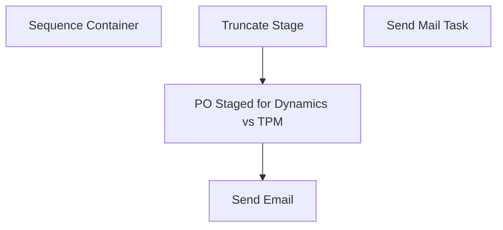

# SSIS Package: WMS_Validation_AptosPOvsTPM

**Project:** WMS_Validation_AptosPOvsTPM  
**Folder:** WMS  
**Server:** STL-SSIS-P-01  

## Connection Managers

| Name | Type | Server | Catalog | Connection (sanitized) |
|---|---|---|---|---|
| IntegrationStaging | OLEDB | STL-SSIS-P-01 | IntegrationStaging | Data Source=STL-SSIS-P-01; Initial Catalog=IntegrationStaging; Provider=SQLNCLI11.1; Integrated Security=SSPI; Auto Translate=False |
| SMTP | SMTP |  |  |  |
| TPM | OLEDB | wmtpmdb | TPM2006 | Data Source=wmtpmdb; Initial Catalog=TPM2006; Provider=SQLNCLI10.1; Application Name=SSIS-WMS_Validation_AptosPOvsTPM-{5ED076DE-41C9-4D30-8261-950E91D3AB70}wmtpmdbtest.TPM2006.tpmuser; Auto Translate=False |

## Control Flow Tasks

| Task | Type |
|---|---|
| WMS_Validation_AptosPOvsTPM | Package |
| Sequence Container | SEQUENCE |
| PO Staged for Dynamics vs TPM | Pipeline |
| Send Email | ExecuteSQLTask |
| Truncate Stage | ExecuteSQLTask |
| Send Mail Task | SendMailTask |

## Control Flow Outline

```text
- Send Mail Task [SendMailTask]
- Sequence Container [SEQUENCE]
  - PO Staged for Dynamics vs TPM [Pipeline]
  - Send Email [ExecuteSQLTask]
  - Truncate Stage [ExecuteSQLTask]
```

## Architecture Diagram



## Variables

| Namespace | Name | Expression-bound |
|---|---|---|
| System | Propagate | No |
| User | DateTimeStamp | Yes |
| User | EndDate | Yes |
| User | EndDateAsDATE | Yes |
| User | GetDate | Yes |
| User | GetDateAsDATE | Yes |
| User | StartDate | Yes |
| User | StartDateAsDATE | Yes |

### Expression-bound variable values

#### User::DateTimeStamp

**Expression:**

```sql
(DT_WSTR,4)DATEPART("yyyy",GetDate()) 
+ (DT_WSTR,4)DATEPART("mm",GetDate()) 
+ (DT_WSTR,4)DATEPART("dd",GetDate()) 
+ (DT_WSTR,4)DATEPART("hh",GetDate()) 
+ (DT_WSTR,4)DATEPART("mi",GetDate()) 
+ (DT_WSTR,4)DATEPART("ss",GetDate()) 
+ (DT_WSTR,4)DATEPART("ms",GetDate())
```

**Evaluated value:**

```sql
2020210134452103
```

#### User::EndDate

**Expression:**

```sql
dateadd("dd", @[$Package::DaysToInclude], @[User::StartDate])
```

**Evaluated value:**

```sql
2/10/2020
```

#### User::EndDateAsDATE

**Expression:**

```sql
(DT_WSTR, 4) datepart("year", @[User::EndDate])  + "-" + 
(DT_WSTR, 2) datepart("mm", @[User::EndDate])  + "-" + 
(DT_WSTR, 2) datepart("dd",  @[User::EndDate])
```

**Evaluated value:**

```sql
2020-2-10
```

#### User::GetDate

**Expression:**

```sql
(DT_DATE)DATEDIFF("Day", (DT_DATE) 0, GETDATE())
```

**Evaluated value:**

```sql
2/10/2020
```

#### User::GetDateAsDATE

**Expression:**

```sql
(DT_WSTR, 4) datepart("year", @[User::GetDate])  + "-" + 
(DT_WSTR, 2) datepart("mm", @[User::GetDate])  + "-" + 
(DT_WSTR, 2) datepart("dd",  @[User::GetDate])
```

**Evaluated value:**

```sql
2020-2-10
```

#### User::StartDate

**Expression:**

```sql
dateadd("dd", -@[$Package::DaysToGoBack] , @[User::GetDate] )
```

**Evaluated value:**

```sql
2/9/2020
```

#### User::StartDateAsDATE

**Expression:**

```sql
(DT_WSTR, 4) datepart("year", @[User::StartDate])  + "-" + 
(DT_WSTR, 2) datepart("mm", @[User::StartDate])  + "-" + 
(DT_WSTR, 2) datepart("dd",  @[User::StartDate])
```

**Evaluated value:**

```sql
2020-2-9
```

## Execute SQL Tasks

### Send Email

**Path:** `Package\Sequence Container\Send Email`  
**Connection:** IntegrationStaging (STL-SSIS-P-01/IntegrationStaging)  

```sql
exec WMS.spEmailAptosPONotInTPM
```

### Truncate Stage

**Path:** `Package\Sequence Container\Truncate Stage`  
**Connection:** IntegrationStaging (STL-SSIS-P-01/IntegrationStaging)  

```sql
truncate table WMS.ValidationStage_AptosPONotInTPM
```

## Data Flow: Sources

| Component | Source Object | Type | Data Flow Task | Connection | SQL Kind |
|---|---|---|---|---|---|
| PurchaseOrderMerchToDynamics |  | OLEDBSource | PO Staged for Dynamics vs TPM | IntegrationStaging | SqlCommand |

#### PurchaseOrderMerchToDynamics — SqlCommand

```sql
with 
PO as
	(
		select 
			cast(e.PONumber as varchar(20)) as AptosPONumber, 
			case 
					when substring(api.ResponseBody, charindex('Purchase order PO1200', api.ResponseBody, 1)+15, 11) like 'PO1200%' 
						then substring(api.ResponseBody, charindex('Purchase order PO1200', api.ResponseBody, 1)+15, 11) 
					else NULL
			end as Dynamics1200PO,
			case 
				when substring(api.ResponseBody, charindex('Purchase order PO1100', api.ResponseBody, 1)+15, 11) like 'PO1100%'
					then substring(api.ResponseBody, charindex('Purchase order PO1100', api.ResponseBody, 1)+15, 11)
				else NULL
			end as Dynamics1100PO,
			convert(varchar, isnull(e.UpdateDate, e.InsertDate), 120) as StageDate
		from WMS.PurchaseOrderMerchToDynamics e with (nolock)
		join WMS.DynamicsAPILog api with (nolock)
			on api.IntegrationName='WMS_PurchaseOrderToDynamics'
			and e.BatchID=api.BatchID
			and e.PONumber=api.AptosDocumentNumber
	)
select 
	AptosPONumber,
	cast(max(StageDate) as datetime) as StageDate
from PO
group by 
	AptosPONumber
```

## Data Flow: Destinations

| Component | Target Table | Type | Data Flow Task | Connection | SQL Kind |
|---|---|---|---|---|---|
| AptosPONotInTPM |  | OLEDBDestination | PO Staged for Dynamics vs TPM | IntegrationStaging |  |
