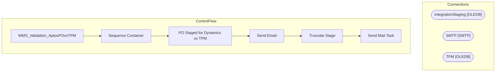

# SSIS Package: WMS_Validation_AptosPOvsTPM

**Project:** WMS_Validation_AptosPOvsTPM  
**Folder:** WMS  
**Server:** STL-SSIS-P-01  

## Architecture Diagram

## Connection Managers

| Name | Type |
|---|---|
| IntegrationStaging | OLEDB |
| SMTP | SMTP |
| TPM | OLEDB |

## Control Flow Tasks

| Task | Type |
|---|---|
| WMS_Validation_AptosPOvsTPM | Microsoft.Package |
| Sequence Container | STOCK:SEQUENCE |
| PO Staged for Dynamics vs TPM | Microsoft.Pipeline |
| Send Email | Microsoft.ExecuteSQLTask |
| Truncate Stage | Microsoft.ExecuteSQLTask |
| Send Mail Task | Microsoft.SendMailTask |

## Data Flow: Sources

| Component | SQL Preview |
|---|---|
|  | select cast( [order] as varchar) as PO from orderheader with (nolock) |
|  | with  PO as 	( 		select  			cast(e.PONumber as varchar(20)) as AptosPONumber,  			case  					when substring(api.ResponseBody, charindex('Purchase order PO1200', api.ResponseBody, 1)+15, 11) like 'PO1200%'  						then substring(api.ResponseBody, charindex('Purchase order PO1200', api.ResponseBody, 1)+15, 11)  					else NULL 			end as Dynamics1200PO, 			case  				when substring(api.ResponseBody, cha |

## Data Flow: Destinations

| Component | Destination |
|---|---|
|  | [WMS].[ValidationStage_AptosPONotInTPM] |

