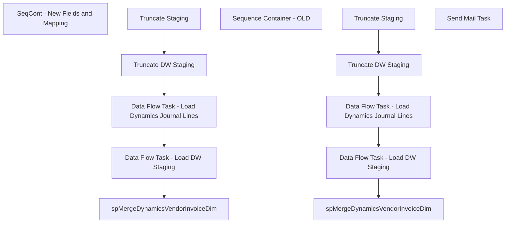

# SSIS Package: WMS_VendorDataExtract

**Project:** WMS_VendorDataExtract  
**Folder:** WMS  
**Server:** STL-SSIS-P-01  

## Connection Managers

| Name | Type | Server | Catalog | Connection (sanitized) |
|---|---|---|---|---|
| DW | OLEDB | papamart | dw | Data Source=papamart; Initial Catalog=dw; Provider=SQLNCLI11.1; Integrated Security=SSPI; Auto Translate=False |
| DWStaging | OLEDB | papamart | DWStaging | Data Source=papamart; Initial Catalog=DWStaging; Provider=SQLNCLI11.1; Integrated Security=SSPI; Auto Translate=False |
| Dynamics AX Connection Manager | DynamicsAX |  |  |  |
| IntegrationStaging | OLEDB | stl-ssis-p-01 | IntegrationStaging | Data Source=stl-ssis-p-01; Initial Catalog=IntegrationStaging; Provider=SQLNCLI11.1; Integrated Security=SSPI; Auto Translate=False |
| SMTP | SMTP |  |  |  |

## Control Flow Tasks

| Task | Type |
|---|---|
| WMS_VendorDataExtract | Package |
| SeqCont - New Fields and Mapping | SEQUENCE |
| Data Flow Task - Load DW Staging | Pipeline |
| Data Flow Task - Load Dynamics Journal Lines | Pipeline |
| spMergeDynamicsVendorInvoiceDim | ExecuteSQLTask |
| Truncate DW Staging | ExecuteSQLTask |
| Truncate Staging | ExecuteSQLTask |
| Sequence Container - OLD | SEQUENCE |
| Data Flow Task - Load DW Staging | Pipeline |
| Data Flow Task - Load Dynamics Journal Lines | Pipeline |
| spMergeDynamicsVendorInvoiceDim | ExecuteSQLTask |
| Truncate DW Staging | ExecuteSQLTask |
| Truncate Staging | ExecuteSQLTask |
| Send Mail Task | SendMailTask |

## Control Flow Outline

```text
- Send Mail Task [SendMailTask]
- SeqCont - New Fields and Mapping [SEQUENCE]
  - Data Flow Task - Load DW Staging [Pipeline]
  - Data Flow Task - Load Dynamics Journal Lines [Pipeline]
  - Truncate DW Staging [ExecuteSQLTask]
  - Truncate Staging [ExecuteSQLTask]
  - spMergeDynamicsVendorInvoiceDim [ExecuteSQLTask]
- Sequence Container - OLD [SEQUENCE]
  - Data Flow Task - Load DW Staging [Pipeline]
  - Data Flow Task - Load Dynamics Journal Lines [Pipeline]
  - Truncate DW Staging [ExecuteSQLTask]
  - Truncate Staging [ExecuteSQLTask]
  - spMergeDynamicsVendorInvoiceDim [ExecuteSQLTask]
```

## Architecture Diagram



## Variables

| Namespace | Name | Expression-bound |
|---|---|---|
| System | Propagate | No |
| User | DateTimeStamp | Yes |
| User | EndDate | Yes |
| User | EndDateAsDATE | Yes |
| User | GetDate | Yes |
| User | GetDateAsDATE | Yes |
| User | StartDate | Yes |
| User | StartDateAsDATE | Yes |

### Expression-bound variable values

#### User::DateTimeStamp

**Expression:**

```sql
(DT_WSTR,4)DATEPART("yyyy",GetDate()) 
+ (DT_WSTR,4)DATEPART("mm",GetDate()) 
+ (DT_WSTR,4)DATEPART("dd",GetDate()) 
+ (DT_WSTR,4)DATEPART("hh",GetDate()) 
+ (DT_WSTR,4)DATEPART("mi",GetDate()) 
+ (DT_WSTR,4)DATEPART("ss",GetDate()) 
+ (DT_WSTR,4)DATEPART("ms",GetDate())
```

**Evaluated value:**

```sql
2022102416275213
```

#### User::EndDate

**Expression:**

```sql
dateadd("dd", @[$Package::DaysToInclude], @[User::StartDate])
```

**Evaluated value:**

```sql
10/24/2022
```

#### User::EndDateAsDATE

**Expression:**

```sql
(DT_WSTR, 4) datepart("year", @[User::EndDate])  + "-" +
right("0"+ (DT_WSTR, 2) datepart("mm", @[User::EndDate]),2)  + "-" +
right("0" +(DT_WSTR, 2) datepart("dd",  @[User::EndDate]),2)
```

**Evaluated value:**

```sql
2022-10-24
```

#### User::GetDate

**Expression:**

```sql
(DT_DATE)DATEDIFF("Day", (DT_DATE) 0, GETDATE())
```

**Evaluated value:**

```sql
10/24/2022
```

#### User::GetDateAsDATE

**Expression:**

```sql
(DT_WSTR, 4) datepart("year", @[User::GetDate])  + "-" +
right("0"+ (DT_WSTR, 2) datepart("mm", @[User::GetDate]),2)  + "-" +
right("0" +(DT_WSTR, 2) datepart("dd",  @[User::GetDate]),2)
```

**Evaluated value:**

```sql
2022-10-24
```

#### User::StartDate

**Expression:**

```sql
dateadd("dd", -@[$Package::DaysToGoBack] , @[User::GetDate] )
```

**Evaluated value:**

```sql
10/17/2022
```

#### User::StartDateAsDATE

**Expression:**

```sql
(DT_WSTR, 4) datepart("year", @[User::StartDate])  + "-" +
right("0"+ (DT_WSTR, 2) datepart("mm", @[User::StartDate]),2)  + "-" +
right("0" +(DT_WSTR, 2) datepart("dd",  @[User::StartDate]),2)
```

**Evaluated value:**

```sql
2022-10-17
```

## Execute SQL Tasks

### Truncate DW Staging

**Path:** `Package\SeqCont - New Fields and Mapping\Truncate DW Staging`  
**Connection:** DWStaging (papamart/DWStaging)  

```sql
truncate table VendorInvoiceDimStage
```

### Truncate Staging

**Path:** `Package\SeqCont - New Fields and Mapping\Truncate Staging`  
**Connection:** IntegrationStaging (stl-ssis-p-01/IntegrationStaging)  

```sql
truncate table [WMS].[DynamicsVendorInvoiceJournalLineStage]

```

### spMergeDynamicsVendorInvoiceDim

**Path:** `Package\SeqCont - New Fields and Mapping\spMergeDynamicsVendorInvoiceDim`  
**Connection:** DW (papamart/dw)  

```sql
exec [spMergeDynamicsVendorInvoiceDim]
```

### Truncate DW Staging

**Path:** `Package\Sequence Container - OLD\Truncate DW Staging`  
**Connection:** DWStaging (papamart/DWStaging)  

```sql
truncate table VendorInvoiceDimStage
```

### Truncate Staging

**Path:** `Package\Sequence Container - OLD\Truncate Staging`  
**Connection:** IntegrationStaging (stl-ssis-p-01/IntegrationStaging)  

```sql
truncate table [WMS].[DynamicsVendorInvoiceJournalLineStage]

```

### spMergeDynamicsVendorInvoiceDim

**Path:** `Package\Sequence Container - OLD\spMergeDynamicsVendorInvoiceDim`  
**Connection:** DW (papamart/dw)  

```sql
exec [spMergeDynamicsVendorInvoiceDim]
```

## Data Flow: Sources

| Component | Source Object | Type | Data Flow Task | Connection | SQL Kind |
|---|---|---|---|---|---|
| OLE DB Source - WMS -vwDynamicsVendorInvoiceDim |  | OLEDBSource | Data Flow Task - Load DW Staging | IntegrationStaging | SqlCommand |
| OLE DB Source - WMS -vwDynamicsVendorInvoiceDim |  | OLEDBSource | Data Flow Task - Load DW Staging | IntegrationStaging | SqlCommand |

#### OLE DB Source - WMS -vwDynamicsVendorInvoiceDim — SqlCommand

```sql
select *
from WMS.vwDynamicsVendorInvoiceDimv2
where VendorAccount is not null
and (RemittanceLocation <> '' or RemittanceAddress <> '') 
order by Company, StoreNumber, VendorName
```

#### OLE DB Source - WMS -vwDynamicsVendorInvoiceDim — SqlCommand

```sql
select *
from WMS.vwDynamicsVendorInvoiceDim 
where VendorAccount is not null
and (RemittanceLocation <> '' or RemittanceAddress <> '') 
order by Company, StoreNumber, VendorName
```

## Data Flow: Destinations

| Component | Target Table | Type | Data Flow Task | Connection | SQL Kind |
|---|---|---|---|---|---|
| OLE DB Destination -DWStaging -  VendorInvoiceDimStage |  | OLEDBDestination | Data Flow Task - Load DW Staging | DWStaging |  |
| WMS -DynamicsVendorInvoiceJournalLineStage |  | OLEDBDestination | Data Flow Task - Load Dynamics Journal Lines | IntegrationStaging |  |
| OLE DB Destination - VendorInvoiceDimStage |  | OLEDBDestination | Data Flow Task - Load DW Staging | DWStaging |  |
| WMS -DynamicsVendorInvoiceJournalLineStage |  | OLEDBDestination | Data Flow Task - Load Dynamics Journal Lines | IntegrationStaging |  |
