# SSIS Package: WMS_VendorDataExtract

**Project:** WMS_VendorDataExtract  
**Folder:** WMS  
**Server:** STL-SSIS-P-01  

## Architecture Diagram

```mermaid
flowchart TD
    subgraph Connections
        DW_conn(["DW [OLEDB]"])
        DWStaging_conn(["DWStaging [OLEDB]"])
        Dynamics_AX_Connection_Manager_conn(["Dynamics AX Connection Manager [DynamicsAX]"])
        IntegrationStaging_conn(["IntegrationStaging [OLEDB]"])
        SMTP_conn(["SMTP [SMTP]"])
    end
    subgraph ControlFlow
        WMS_VendorDataExtract_task["WMS_VendorDataExtract"]
        SeqCont___New_Fields_and_Mapping_task["SeqCont - New Fields and Mapping"]
        WMS_VendorDataExtract_task --> SeqCont___New_Fields_and_Mapping_task
        Data_Flow_Task___Load_DW_Staging_task["Data Flow Task - Load DW Staging"]
        SeqCont___New_Fields_and_Mapping_task --> Data_Flow_Task___Load_DW_Staging_task
        Data_Flow_Task___Load_Dynamics_Journal_Lines_task["Data Flow Task - Load Dynamics Journal Lines"]
        Data_Flow_Task___Load_DW_Staging_task --> Data_Flow_Task___Load_Dynamics_Journal_Lines_task
        spMergeDynamicsVendorInvoiceDim_task["spMergeDynamicsVendorInvoiceDim"]
        Data_Flow_Task___Load_Dynamics_Journal_Lines_task --> spMergeDynamicsVendorInvoiceDim_task
        Truncate_DW_Staging_task["Truncate DW Staging"]
        spMergeDynamicsVendorInvoiceDim_task --> Truncate_DW_Staging_task
        Truncate_Staging_task["Truncate Staging"]
        Truncate_DW_Staging_task --> Truncate_Staging_task
        Sequence_Container___OLD_task["Sequence Container - OLD"]
        Truncate_Staging_task --> Sequence_Container___OLD_task
        Data_Flow_Task___Load_DW_Staging_task["Data Flow Task - Load DW Staging"]
        Sequence_Container___OLD_task --> Data_Flow_Task___Load_DW_Staging_task
        Data_Flow_Task___Load_Dynamics_Journal_Lines_task["Data Flow Task - Load Dynamics Journal Lines"]
        Data_Flow_Task___Load_DW_Staging_task --> Data_Flow_Task___Load_Dynamics_Journal_Lines_task
        spMergeDynamicsVendorInvoiceDim_task["spMergeDynamicsVendorInvoiceDim"]
        Data_Flow_Task___Load_Dynamics_Journal_Lines_task --> spMergeDynamicsVendorInvoiceDim_task
        Truncate_DW_Staging_task["Truncate DW Staging"]
        spMergeDynamicsVendorInvoiceDim_task --> Truncate_DW_Staging_task
        Truncate_Staging_task["Truncate Staging"]
        Truncate_DW_Staging_task --> Truncate_Staging_task
        Send_Mail_Task_task["Send Mail Task"]
        Truncate_Staging_task --> Send_Mail_Task_task
    end
```

## Connection Managers

| Name | Type |
|---|---|
| DW | OLEDB |
| DWStaging | OLEDB |
| Dynamics AX Connection Manager | DynamicsAX |
| IntegrationStaging | OLEDB |
| SMTP | SMTP |

## Control Flow Tasks

| Task | Type |
|---|---|
| WMS_VendorDataExtract | Microsoft.Package |
| SeqCont - New Fields and Mapping | STOCK:SEQUENCE |
| Data Flow Task - Load DW Staging | Microsoft.Pipeline |
| Data Flow Task - Load Dynamics Journal Lines | Microsoft.Pipeline |
| spMergeDynamicsVendorInvoiceDim | Microsoft.ExecuteSQLTask |
| Truncate DW Staging | Microsoft.ExecuteSQLTask |
| Truncate Staging | Microsoft.ExecuteSQLTask |
| Sequence Container - OLD | STOCK:SEQUENCE |
| Data Flow Task - Load DW Staging | Microsoft.Pipeline |
| Data Flow Task - Load Dynamics Journal Lines | Microsoft.Pipeline |
| spMergeDynamicsVendorInvoiceDim | Microsoft.ExecuteSQLTask |
| Truncate DW Staging | Microsoft.ExecuteSQLTask |
| Truncate Staging | Microsoft.ExecuteSQLTask |
| Send Mail Task | Microsoft.SendMailTask |

## Data Flow: Sources

| Component | SQL Preview |
|---|---|
|  | select * from WMS.vwDynamicsVendorInvoiceDimv2 where VendorAccount is not null and (RemittanceLocation <> '' or RemittanceAddress <> '')  order by Company, StoreNumber, VendorName |
|  | select * from WMS.vwDynamicsVendorInvoiceDim  where VendorAccount is not null and (RemittanceLocation <> '' or RemittanceAddress <> '')  order by Company, StoreNumber, VendorName |

## Data Flow: Destinations

| Component | Destination |
|---|---|
|  | [dbo].[VendorInvoiceDimStage] |
|  | [WMS].[DynamicsVendorInvoiceJournalLineStage] |
|  | [dbo].[VendorInvoiceDimStage] |
|  | [WMS].[DynamicsVendorInvoiceJournalLineStage] |

