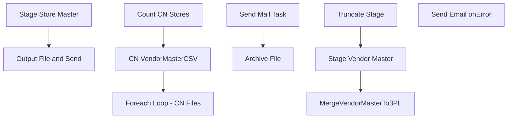

# SSIS Package: WMS_VendorMasterTo3PL

**Project:** WMS_VendorMasterTo3PL  
**Folder:** WMS  
**Server:** STL-SSIS-P-01  

## Connection Managers

| Name | Type | Server | Catalog | Connection (sanitized) |
|---|---|---|---|---|
| CNVendorMasterCSV | FLATFILE |  |  |  |
| IntegrationStaging | OLEDB | STL-SSIS-P-01 | IntegrationStaging | Data Source=STL-SSIS-P-01; Initial Catalog=IntegrationStaging; Provider=SQLNCLI11.1; Integrated Security=SSPI; Auto Translate=False |
| SMTP_EMAIL | SMTP |  |  |  |
| SQL_LOG | OLEDB | stl-ssis-p-01 | msdb | Data Source=stl-ssis-p-01; Initial Catalog=msdb; Provider=SQLNCLI11.1; Integrated Security=SSPI; Auto Translate=False |
| me_01 | OLEDB | bedrockdb02 | me_01 | Data Source=bedrockdb02; Initial Catalog=me_01; Provider=SQLNCLI11.1; Integrated Security=SSPI; Auto Translate=False |

## Control Flow Tasks

| Task | Type |
|---|---|
| WMS_VendorMasterTo3PL | Package |
| Output File and Send | SEQUENCE |
| CN VendorMasterCSV | Pipeline |
| Count CN Stores | ExecuteSQLTask |
| Foreach Loop - CN Files | FOREACHLOOP |
| Archive File | FileSystemTask |
| Send Mail Task | SendMailTask |
| Stage Store Master | SEQUENCE |
| MergeVendorMasterTo3PL | ExecuteSQLTask |
| Stage Vendor Master | Pipeline |
| Truncate Stage | ExecuteSQLTask |
| Send Email onError | SendMailTask |

## Control Flow Outline

```text
- Send Email onError [SendMailTask]
- Output File and Send [SEQUENCE]
  - CN VendorMasterCSV [Pipeline]
  - Count CN Stores [ExecuteSQLTask]
  - Foreach Loop - CN Files [FOREACHLOOP]
    - Archive File [FileSystemTask]
    - Send Mail Task [SendMailTask]
- Stage Store Master [SEQUENCE]
  - MergeVendorMasterTo3PL [ExecuteSQLTask]
  - Stage Vendor Master [Pipeline]
  - Truncate Stage [ExecuteSQLTask]
```

## Architecture Diagram



## Variables

| Namespace | Name | Expression-bound |
|---|---|---|
| System | Propagate | No |
| User | CNItemCount | No |
| User | CSV_VendorMasterCN | Yes |
| User | Entity | No |
| User | UKItemsCount | No |
| User | UpdatedCount | No |
| User | VendorMasterCNArchive | Yes |
| User | VendorMasterCNArchiveBonded | Yes |
| User | VendorMasterCNArchiveNonBonded | Yes |
| User | VendorMasterCNFileDrop | Yes |
| User | VendorMasterCNFileName | No |
| User | VendorMasterFileName | No |
| User | VendorMasterStageArchive | Yes |
| User | VendorMasterUKArchive | Yes |
| User | VendorMasterUKFileDrop | Yes |
| User | VendorMasterUKFilename | No |
| User | VendorMasterWCArchive | Yes |
| User | VendorMasterWCFileDrop | Yes |
| User | VendorMasterWCFileName | No |
| User | VendorMasterWMFileDrop | Yes |
| User | WCItemCount | No |

### Expression-bound variable values

#### User::CSV_VendorMasterCN

**Expression:**

```sql
"\\\\" + @[$Package::IntegrationStaging_ServerName] + "\\IntegrationStaging\\Dynamics\\WarehouseInterfaces\\VendorMaster\\CN\\VendorMaster.csv"
```

**Evaluated value:**

```sql
\\STL-SSIS-P-01\IntegrationStaging\Dynamics\WarehouseInterfaces\VendorMaster\CN\VendorMaster.csv
```

#### User::VendorMasterCNArchive

**Expression:**

```sql
"\\\\" +  @[$Package::IntegrationStaging_ServerName] + "\\IntegrationStaging\\Dynamics\\WarehouseInterfaces\\VendorMaster\\CN\\Archive\\VendorMaster.csv"
```

**Evaluated value:**

```sql
\\STL-SSIS-P-01\IntegrationStaging\Dynamics\WarehouseInterfaces\VendorMaster\CN\Archive\VendorMaster.csv
```

#### User::VendorMasterCNArchiveBonded

**Expression:**

```sql
"\\\\" +  @[$Package::IntegrationStaging_ServerName] + "\\IntegrationStaging\\Dynamics\\WarehouseInterfaces\\VendorMaster\\CN\\Archive\\VendorMasterBonded.csv"
```

**Evaluated value:**

```sql
\\STL-SSIS-P-01\IntegrationStaging\Dynamics\WarehouseInterfaces\VendorMaster\CN\Archive\VendorMasterBonded.csv
```

#### User::VendorMasterCNArchiveNonBonded

**Expression:**

```sql
"\\\\" +  @[$Package::IntegrationStaging_ServerName] + "\\IntegrationStaging\\Dynamics\\WarehouseInterfaces\\VendorMaster\\CN\\Archive\\VendorMasterNonBonded.csv"
```

**Evaluated value:**

```sql
\\STL-SSIS-P-01\IntegrationStaging\Dynamics\WarehouseInterfaces\VendorMaster\CN\Archive\VendorMasterNonBonded.csv
```

#### User::VendorMasterCNFileDrop

**Expression:**

```sql
"\\\\" + @[$Package::IntegrationStaging_ServerName] + "\\IntegrationStaging\\Dynamics\\WarehouseInterfaces\\VendorMaster\\CN\\"
```

**Evaluated value:**

```sql
\\STL-SSIS-P-01\IntegrationStaging\Dynamics\WarehouseInterfaces\VendorMaster\CN\
```

#### User::VendorMasterStageArchive

**Expression:**

```sql
@[User::VendorMasterWMFileDrop] + "Archive"
```

**Evaluated value:**

```sql
\\STL-SSIS-P-01\IntegrationStaging\Dynamics\WarehouseInterfaces\VendorMaster\WM\Archive
```

#### User::VendorMasterUKArchive

**Expression:**

```sql
@[User::VendorMasterUKFileDrop] + "Archive"
```

**Evaluated value:**

```sql
\\STL-SSIS-P-01\IntegrationStaging\Dynamics\WarehouseInterfaces\VendorMaster\UK\Archive
```

#### User::VendorMasterUKFileDrop

**Expression:**

```sql
"\\\\" + @[$Package::IntegrationStaging_ServerName] + "\\IntegrationStaging\\Dynamics\\WarehouseInterfaces\\VendorMaster\\UK\\"
```

**Evaluated value:**

```sql
\\STL-SSIS-P-01\IntegrationStaging\Dynamics\WarehouseInterfaces\VendorMaster\UK\
```

#### User::VendorMasterWCArchive

**Expression:**

```sql
"\\\\" +  @[$Package::IntegrationStaging_ServerName] + "\\IntegrationStaging\\Dynamics\\WarehouseInterfaces\\VendorMaster\\WC\\Archive"
```

**Evaluated value:**

```sql
\\STL-SSIS-P-01\IntegrationStaging\Dynamics\WarehouseInterfaces\VendorMaster\WC\Archive
```

#### User::VendorMasterWCFileDrop

**Expression:**

```sql
"\\\\" + @[$Package::IntegrationStaging_ServerName] + "\\IntegrationStaging\\Dynamics\\WarehouseInterfaces\\VendorMaster\\WC\\"
```

**Evaluated value:**

```sql
\\STL-SSIS-P-01\IntegrationStaging\Dynamics\WarehouseInterfaces\VendorMaster\WC\
```

#### User::VendorMasterWMFileDrop

**Expression:**

```sql
"\\\\" + @[$Package::IntegrationStaging_ServerName] + "\\IntegrationStaging\\Dynamics\\WarehouseInterfaces\\VendorMaster\\WM\\"
```

**Evaluated value:**

```sql
\\STL-SSIS-P-01\IntegrationStaging\Dynamics\WarehouseInterfaces\VendorMaster\WM\
```

## Execute SQL Tasks

### Count CN Stores

**Path:** `Package\Output File and Send\Count CN Stores`  
**Connection:** IntegrationStaging (STL-SSIS-P-01/IntegrationStaging)  

```sql
select count(*) from WMS.VendorMasterTo3PL 
where datediff(dd, isnull(UpdateDate, InsertDate), getdate())=0
```

### MergeVendorMasterTo3PL

**Path:** `Package\Stage Store Master\MergeVendorMasterTo3PL`  
**Connection:** IntegrationStaging (STL-SSIS-P-01/IntegrationStaging)  

```sql
exec WMS.spMergeVendorMasterTo3PL
```

### Truncate Stage

**Path:** `Package\Stage Store Master\Truncate Stage`  
**Connection:** IntegrationStaging (STL-SSIS-P-01/IntegrationStaging)  

```sql
TRUNCATE TABLE WMS.VendorMasterTo3PLStage
```

## Data Flow: Sources

| Component | Source Object | Type | Data Flow Task | Connection | SQL Kind |
|---|---|---|---|---|---|
| VW_CNVendorMaster |  | OLEDBSource | CN VendorMasterCSV | IntegrationStaging | SqlCommand |
| VW_CNVendorMaster |  | OLEDBSource | Stage Vendor Master | me_01 |  |

#### VW_CNVendorMaster — SqlCommand

```sql
select 
	city,	
	vendor_name,	
	address_name,	
	port,	
	address,
	province,	
	country,	
	phone_number	
from WMS.VendorMasterTo3PL
where datediff(dd, isnull(UpdateDate, InsertDate), getdate())=0
```

## Data Flow: Destinations

| Component | Target Table | Type | Data Flow Task | Connection | SQL Kind |
|---|---|---|---|---|---|
| CNVendorMasterCSV |  | FlatFileDestination | CN VendorMasterCSV | CNVendorMasterCSV |  |
| WMS_VendorMasterTo3PLStage |  | OLEDBDestination | Stage Vendor Master | IntegrationStaging |  |
