# SSIS Package: WMS_VendorMasterTo3PL

**Project:** WMS_VendorMasterTo3PL  
**Folder:** WMS  
**Server:** STL-SSIS-P-01  

## Architecture Diagram

```mermaid
flowchart TD
    subgraph Connections
        CNVendorMasterCSV_conn(["CNVendorMasterCSV [FLATFILE]"])
        IntegrationStaging_conn(["IntegrationStaging [OLEDB]"])
        me_01_conn(["me_01 [OLEDB]"])
        SMTP_EMAIL_conn(["SMTP_EMAIL [SMTP]"])
        SQL_LOG_conn(["SQL_LOG [OLEDB]"])
    end
    subgraph ControlFlow
        WMS_VendorMasterTo3PL_task["WMS_VendorMasterTo3PL"]
        Output_File_and_Send_task["Output File and Send"]
        WMS_VendorMasterTo3PL_task --> Output_File_and_Send_task
        CN_VendorMasterCSV_task["CN VendorMasterCSV"]
        Output_File_and_Send_task --> CN_VendorMasterCSV_task
        Count_CN_Stores_task["Count CN Stores"]
        CN_VendorMasterCSV_task --> Count_CN_Stores_task
        Foreach_Loop___CN_Files_task["Foreach Loop - CN Files"]
        Count_CN_Stores_task --> Foreach_Loop___CN_Files_task
        Archive_File_task["Archive File"]
        Foreach_Loop___CN_Files_task --> Archive_File_task
        Send_Mail_Task_task["Send Mail Task"]
        Archive_File_task --> Send_Mail_Task_task
        Stage_Store_Master_task["Stage Store Master"]
        Send_Mail_Task_task --> Stage_Store_Master_task
        MergeVendorMasterTo3PL_task["MergeVendorMasterTo3PL"]
        Stage_Store_Master_task --> MergeVendorMasterTo3PL_task
        Stage_Vendor_Master_task["Stage Vendor Master"]
        MergeVendorMasterTo3PL_task --> Stage_Vendor_Master_task
        Truncate_Stage_task["Truncate Stage"]
        Stage_Vendor_Master_task --> Truncate_Stage_task
        Send_Email_onError_task["Send Email onError"]
        Truncate_Stage_task --> Send_Email_onError_task
    end
```

## Connection Managers

| Name | Type |
|---|---|
| CNVendorMasterCSV | FLATFILE |
| IntegrationStaging | OLEDB |
| me_01 | OLEDB |
| SMTP_EMAIL | SMTP |
| SQL_LOG | OLEDB |

## Control Flow Tasks

| Task | Type |
|---|---|
| WMS_VendorMasterTo3PL | Microsoft.Package |
| Output File and Send | STOCK:SEQUENCE |
| CN VendorMasterCSV | Microsoft.Pipeline |
| Count CN Stores | Microsoft.ExecuteSQLTask |
| Foreach Loop - CN Files | STOCK:FOREACHLOOP |
| Archive File | Microsoft.FileSystemTask |
| Send Mail Task | Microsoft.SendMailTask |
| Stage Store Master | STOCK:SEQUENCE |
| MergeVendorMasterTo3PL | Microsoft.ExecuteSQLTask |
| Stage Vendor Master | Microsoft.Pipeline |
| Truncate Stage | Microsoft.ExecuteSQLTask |
| Send Email onError | Microsoft.SendMailTask |

## Data Flow: Sources

| Component | SQL Preview |
|---|---|
|  | select  	city,	 	vendor_name,	 	address_name,	 	port,	 	address, 	province,	 	country,	 	phone_number	 from WMS.VendorMasterTo3PL where datediff(dd, isnull(UpdateDate, InsertDate), getdate())=0 |

## Data Flow: Destinations

| Component | Destination |
|---|---|
|  | [ERP].[vwVendorMasterCNNonBonded] |
|  | [dbo].[VW_CNVendorMaster] |
|  | [WMS].[VendorMasterTo3PLStage] |

