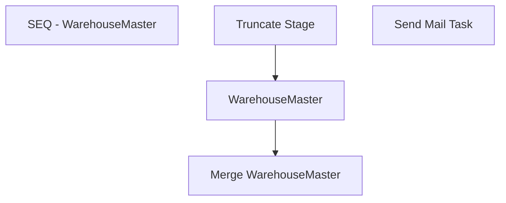

# SSIS Package: WMS_WarehouseMaster

**Project:** WMS_WarehouseMaster  
**Folder:** WMS  
**Server:** STL-SSIS-P-01  

## Connection Managers

| Name | Type | Server | Catalog | Connection (sanitized) |
|---|---|---|---|---|
| Dynamics AX Connection Manager | DynamicsAX |  |  |  |
| IntegrationStaging | OLEDB | stl-ssis-p-01 | IntegrationStaging | Data Source=stl-ssis-p-01; Initial Catalog=IntegrationStaging; Provider=SQLNCLI11.1; Integrated Security=SSPI; Auto Translate=False |
| SMTP | SMTP |  |  |  |

## Control Flow Tasks

| Task | Type |
|---|---|
| WMS_WarehouseMaster | Package |
| SEQ - WarehouseMaster | SEQUENCE |
| Merge WarehouseMaster | ExecuteSQLTask |
| Truncate Stage | ExecuteSQLTask |
| WarehouseMaster | Pipeline |
| Send Mail Task | SendMailTask |

## Control Flow Outline

```text
- Send Mail Task [SendMailTask]
- SEQ - WarehouseMaster [SEQUENCE]
  - Merge WarehouseMaster [ExecuteSQLTask]
  - Truncate Stage [ExecuteSQLTask]
  - WarehouseMaster [Pipeline]
```

## Architecture Diagram



## Variables

| Namespace | Name | Expression-bound |
|---|---|---|
| System | Propagate | No |

## Execute SQL Tasks

### Merge WarehouseMaster

**Path:** `Package\SEQ - WarehouseMaster\Merge WarehouseMaster`  
**Connection:** IntegrationStaging (stl-ssis-p-01/IntegrationStaging)  

```sql
exec ERP.spMergeWarehouseMaster
```

### Truncate Stage

**Path:** `Package\SEQ - WarehouseMaster\Truncate Stage`  
**Connection:** IntegrationStaging (stl-ssis-p-01/IntegrationStaging)  

```sql
TRUNCATE TABLE ERP.WarehouseMasterStage
TRUNCATE TABLE wms.WarehouseMasterFail
```

## Data Flow: Sources

_None detected._

## Data Flow: Destinations

| Component | Target Table | Type | Data Flow Task | Connection | SQL Kind |
|---|---|---|---|---|---|
| WarehouseMaster |  | OLEDBDestination | WarehouseMaster | IntegrationStaging |  |
| WarehouseMasterFail |  | OLEDBDestination | WarehouseMaster | IntegrationStaging |  |
