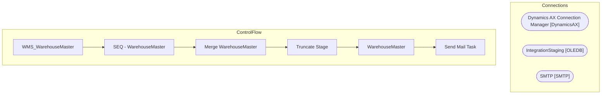

# SSIS Package: WMS_WarehouseMaster

**Project:** WMS_WarehouseMaster  
**Folder:** WMS  
**Server:** STL-SSIS-P-01  

## Architecture Diagram

## Connection Managers

| Name | Type |
|---|---|
| Dynamics AX Connection Manager | DynamicsAX |
| IntegrationStaging | OLEDB |
| SMTP | SMTP |

## Control Flow Tasks

| Task | Type |
|---|---|
| WMS_WarehouseMaster | Microsoft.Package |
| SEQ - WarehouseMaster | STOCK:SEQUENCE |
| Merge WarehouseMaster | Microsoft.ExecuteSQLTask |
| Truncate Stage | Microsoft.ExecuteSQLTask |
| WarehouseMaster | Microsoft.Pipeline |
| Send Mail Task | Microsoft.SendMailTask |

## Data Flow: Sources

_None detected._

## Data Flow: Destinations

| Component | Destination |
|---|---|
|  | [ERP].[WarehouseMasterStage] |
|  | [WMS].[WarehouseMasterFail] |

