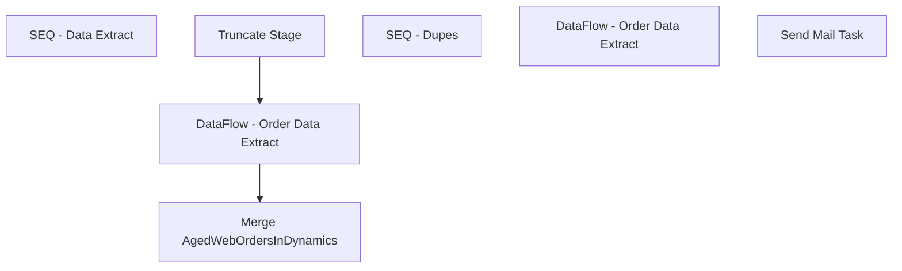

# SSIS Package: WMS_WebSalesOrderDownloadFromDynamics

**Project:** WMS_WebSalesOrderDownloadFromDynamics  
**Folder:** WMS  
**Server:** STL-SSIS-P-01  

## Connection Managers

| Name | Type | Server | Catalog | Connection (sanitized) |
|---|---|---|---|---|
| BEARCLUSTER01.SQL.BUILDABEAR.COM.WebOrderProcessing | OLEDB | BEARCLUSTER01.SQL.BUILDABEAR.COM | WebOrderProcessing | Data Source=BEARCLUSTER01.SQL.BUILDABEAR.COM; Initial Catalog=WebOrderProcessing; Provider=SQLNCLI11.1; Integrated Security=SSPI; Auto Translate=False |
| Cache OrderLine | CACHE |  |  |  |
| Dynamics AX Connection Manager | DynamicsAX |  |  |  |
| IntegrationStaging | OLEDB | STL-SSIS-P-01 | IntegrationStaging | Data Source=STL-SSIS-P-01; Initial Catalog=IntegrationStaging; Provider=SQLNCLI11.1; Integrated Security=SSPI; Auto Translate=False |
| SMTP | SMTP |  |  |  |

## Control Flow Tasks

| Task | Type |
|---|---|
| WMS_WebSalesOrderDownloadFromDynamics | Package |
| SEQ - Data Extract | SEQUENCE |
| DataFlow - Order Data Extract | Pipeline |
| Merge AgedWebOrdersInDynamics | ExecuteSQLTask |
| Truncate Stage | ExecuteSQLTask |
| SEQ - Dupes | SEQUENCE |
| DataFlow - Order Data Extract | Pipeline |
| Send Mail Task | SendMailTask |

## Control Flow Outline

```text
- Send Mail Task [SendMailTask]
- SEQ - Data Extract [SEQUENCE]
  - DataFlow - Order Data Extract [Pipeline]
  - Merge AgedWebOrdersInDynamics [ExecuteSQLTask]
  - Truncate Stage [ExecuteSQLTask]
- SEQ - Dupes [SEQUENCE]
  - DataFlow - Order Data Extract [Pipeline]
```

## Architecture Diagram



## Variables

| Namespace | Name | Expression-bound |
|---|---|---|
| System | Propagate | No |
| User | DateTimeStamp | Yes |
| User | EndDate | Yes |
| User | EndDateAsDATE | Yes |
| User | GetDate | Yes |
| User | GetDateAsDATE | Yes |
| User | StartDate | Yes |
| User | StartDateAsDATE | Yes |

### Expression-bound variable values

#### User::DateTimeStamp

**Expression:**

```sql
(DT_WSTR,4)DATEPART("yyyy",GetDate()) 
+ (DT_WSTR,4)DATEPART("mm",GetDate()) 
+ (DT_WSTR,4)DATEPART("dd",GetDate()) 
+ (DT_WSTR,4)DATEPART("hh",GetDate()) 
+ (DT_WSTR,4)DATEPART("mi",GetDate()) 
+ (DT_WSTR,4)DATEPART("ss",GetDate()) 
+ (DT_WSTR,4)DATEPART("ms",GetDate())
```

**Evaluated value:**

```sql
202134115815437
```

#### User::EndDate

**Expression:**

```sql
dateadd("dd", @[$Package::DaysToInclude], @[User::StartDate])
```

**Evaluated value:**

```sql
3/4/2021
```

#### User::EndDateAsDATE

**Expression:**

```sql
(DT_WSTR, 4) datepart("year", @[User::EndDate])  + "-" + 
(DT_WSTR, 2) datepart("mm", @[User::EndDate])  + "-" + 
(DT_WSTR, 2) datepart("dd",  @[User::EndDate])
```

**Evaluated value:**

```sql
2021-3-4
```

#### User::GetDate

**Expression:**

```sql
(DT_DATE)DATEDIFF("Day", (DT_DATE) 0, GETDATE())
```

**Evaluated value:**

```sql
3/4/2021
```

#### User::GetDateAsDATE

**Expression:**

```sql
(DT_WSTR, 4) datepart("year", @[User::GetDate])  + "-" + 
(DT_WSTR, 2) datepart("mm", @[User::GetDate])  + "-" + 
(DT_WSTR, 2) datepart("dd",  @[User::GetDate])
```

**Evaluated value:**

```sql
2021-3-4
```

#### User::StartDate

**Expression:**

```sql
dateadd("dd", -@[$Package::DaysToGoBack] , @[User::GetDate] )
```

**Evaluated value:**

```sql
3/3/2021
```

#### User::StartDateAsDATE

**Expression:**

```sql
(DT_WSTR, 4) datepart("year", @[User::StartDate])  + "-" + 
(DT_WSTR, 2) datepart("mm", @[User::StartDate])  + "-" + 
(DT_WSTR, 2) datepart("dd",  @[User::StartDate])
```

**Evaluated value:**

```sql
2021-3-3
```

## Execute SQL Tasks

### Merge AgedWebOrdersInDynamics

**Path:** `Package\SEQ - Data Extract\Merge AgedWebOrdersInDynamics`  
**Connection:** IntegrationStaging (STL-SSIS-P-01/IntegrationStaging)  

```sql
exec WMS.spMergeAgedWebOrdersInDynamics
```

### Truncate Stage

**Path:** `Package\SEQ - Data Extract\Truncate Stage`  
**Connection:** IntegrationStaging (STL-SSIS-P-01/IntegrationStaging)  

```sql
TRUNCATE TABLE wms.AgedWebOrdersInDynamicsStage
```

## Data Flow: Sources

| Component | Source Object | Type | Data Flow Task | Connection | SQL Kind |
|---|---|---|---|---|---|
| Wave Data |  | OLEDBSource | DataFlow - Order Data Extract | IntegrationStaging | SqlCommand |

#### Wave Data — SqlCommand

```sql
with
MaxWave as
	(
		select
			OrderNum, max(WaveID) as WaveID
		from WMS.SalesOrderStatusUpdateWaved with (nolock)
		group by OrderNum
	)
select 
	wa.WaveID,
	wa.ReleasedDateAndTime,
	wa.ContainerID,
	wa.WorkID,
	cast(wa.OrderNum as nvarchar) as OrderNum,
	wa.ItemID
from WMS.SalesOrderStatusUpdateWaved wa with (nolock)
--join MaxWave mw on wa.WaveID=mw.WaveID
where exists (select mw.WaveID from MaxWave mw where mw.WaveID=wa.WaveID and wa.OrderNum=mw.OrderNum)
group by 
	wa.WaveID,
	wa.ReleasedDateAndTime,
	wa.ContainerID,
	wa.WorkID,
	cast(wa.OrderNum as nvarchar),
	wa.ItemID
```

## Data Flow: Destinations

| Component | Target Table | Type | Data Flow Task | Connection | SQL Kind |
|---|---|---|---|---|---|
| AgedWebOrdersInDynamicsStage |  | OLEDBDestination | DataFlow - Order Data Extract | IntegrationStaging |  |
