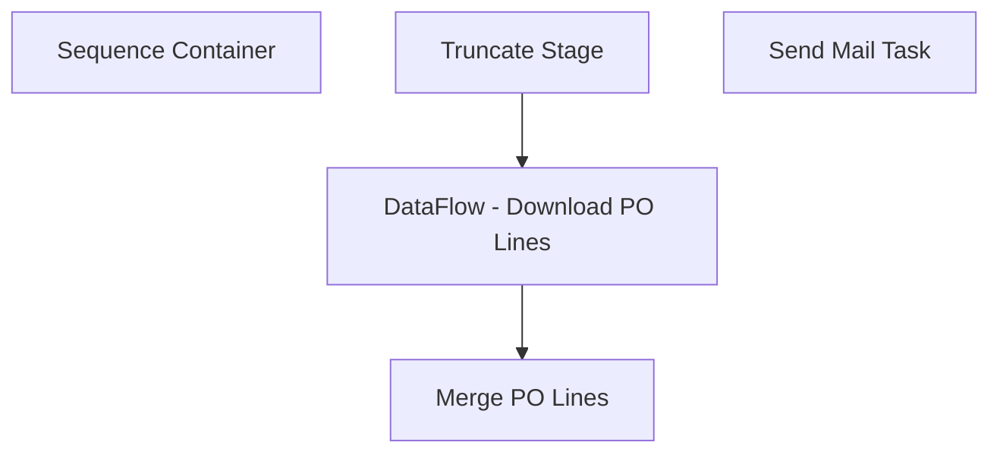

# SSIS Package: WMS_WholesalePurchaseOrderOnOrderData

**Project:** WMS_WholesalePurchaseOrderOnOrderData  
**Folder:** WMS  
**Server:** STL-SSIS-P-01  

## Connection Managers

| Name | Type | Server | Catalog | Connection (sanitized) |
|---|---|---|---|---|
| Dynamics AX Connection Manager | DynamicsAX |  |  |  |
| IntegrationStaging | OLEDB | stl-ssis-P-01 | IntegrationStaging | Data Source=stl-ssis-P-01; Initial Catalog=IntegrationStaging; Provider=SQLNCLI11.1; Integrated Security=SSPI; Auto Translate=False |
| SMTP | SMTP |  |  |  |

## Control Flow Tasks

| Task | Type |
|---|---|
| WMS_WholesalePurchaseOrderOnOrderData | Package |
| Sequence Container | SEQUENCE |
| DataFlow - Download PO Lines | Pipeline |
| Merge PO Lines | ExecuteSQLTask |
| Truncate Stage | ExecuteSQLTask |
| Send Mail Task | SendMailTask |

## Control Flow Outline

```text
- Send Mail Task [SendMailTask]
- Sequence Container [SEQUENCE]
  - DataFlow - Download PO Lines [Pipeline]
  - Merge PO Lines [ExecuteSQLTask]
  - Truncate Stage [ExecuteSQLTask]
```

## Architecture Diagram



## Variables

| Namespace | Name | Expression-bound |
|---|---|---|
| System | Propagate | No |

## Execute SQL Tasks

### Merge PO Lines

**Path:** `Package\Sequence Container\Merge PO Lines`  
**Connection:** IntegrationStaging (stl-ssis-P-01/IntegrationStaging)  

```sql
exec WMS.spMergeWholesaleOnOrder 
```

### Truncate Stage

**Path:** `Package\Sequence Container\Truncate Stage`  
**Connection:** IntegrationStaging (stl-ssis-P-01/IntegrationStaging)  

```sql
TRUNCATE TABLE WMS.WholesaleOnOrderStage
```

## Data Flow: Sources

_None detected._

## Data Flow: Destinations

| Component | Target Table | Type | Data Flow Task | Connection | SQL Kind |
|---|---|---|---|---|---|
| WholesaleOnOrderStage |  | OLEDBDestination | DataFlow - Download PO Lines | IntegrationStaging |  |
