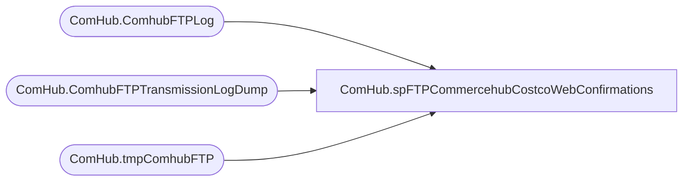

# ComHub.spFTPCommercehubCostcoWebConfirmations

**Database:** IntegrationStaging  
**Server:** STL-SSIS-P-01  

## Architecture Diagram



## Table Dependencies

| Referenced Table |
|---|
| ComHub.ComhubFTPLog |
| ComHub.ComhubFTPTransmissionLogDump |
| ComHub.tmpComhubFTP |

## Stored Procedure Code

```sql
CREATE proc [ComHub].[spFTPCommercehubCostcoWebConfirmations]

as

-- =====================================================================================================
-- Name: spFTPCommercehubCostcoWebConfirmations
--
-- Description:	Uploads web orders to UK 
--
-- Revision History
--		Name:			Date:			Comments:
--		Ben Barud		2020-10-15		Initial Creation
-- =====================================================================================================
	
set nocount on

--DELETE PREVIOUS LOG FILES
IF (Object_ID('tempdb..#DEL') IS NOT NULL) DROP TABLE #DEL
create table #DEL(output varchar(1000))
insert #DEL exec master..xp_cmdshell 'dir \\kermode\Filerepository\CommerceHubCostcoConfirmation\log\Upload.log /B'
insert #DEL exec master..xp_cmdshell 'dir \\kermode\Filerepository\CommerceHubCostcoConfirmation\log\FTPLog_CommercehubCostcoFA.txt /B'

delete from #DEL where output is null or output = 'File Not Found'

IF (select count(*) from #DEL where output = 'Upload.log') > 0
	begin
		exec master..xp_cmdshell 'del \\kermode\Filerepository\CommerceHubCostcoConfirmation\log\Upload.log'
	end
IF (select count(*) from #DEL where output = 'FTPLog_CommercehubCostcoFA.txt') > 0
	begin
		exec master..xp_cmdshell 'del \\kermode\Filerepository\CommerceHubCostcoConfirmation\log\FTPLog_CommercehubCostcoFA.txt'
	end

--CHECK FOR FILES TO UPLOAD
-------------do a DIR command and store the results in a temp table
IF (Object_ID('tempdb..#DIR') IS NOT NULL) DROP TABLE #DIR
create table #DIR (output varchar(1000))
insert #DIR exec master..xp_cmdshell 'dir \\kermode\Filerepository\CommerceHubCostcoConfirmation\*.xml /B'
delete from #DIR where output is null or output = 'File Not Found'

--===========================================================================================================================
--===========================================================================================================================


------------query temp table to see if there are CSV files
if (select count(*) from #DIR) > 0

--create table CommHub.CommhubFTPLog 
--(CommhubFileName varchar(1000), UploadDateTime datetime, Success int)


BEGIN
insert ComHub.ComhubFTPLog 
select output as ComhubFileName, getdate(), NULL, 1 
from #DIR

			-----ftp upload
					declare 
							@winSCP varchar(1000),
							@ini varchar(1000),
							@script varchar(1000),
							@log varchar(1000),
							@FTP varchar(4000),
							@Log_query varchar(1000),
							@Log_filename varchar(100),
							@Log_file_location varchar(100),
							@Log_bcp varchar(1000),
							@body varchar(4000)

					select 
							@winSCP = '"\\stl-ssis-p-01\C$\Program Files (x86)\WinSCP\winscp.com"',
							@ini = ' /ini=\\stl-ssis-p-01\Integrationstaging\Commercehub\Prod\WinSCP.ini',
							@script = ' /script=\\stl-ssis-p-01\Integrationstaging\Commercehub\Prod\winscpConfirmation.txt',
							@log = ' /log=\\kermode\Filerepository\CommerceHubCostcoConfirmation\log\Upload.log',
							@FTP = concat(@winSCP, @ini, @script, @log)

					--create temp tables for ftp logs
					IF (Object_ID('IntegrationStaging.ComHub.tmpComhubFTP') IS NOT NULL) DROP TABLE ComHub.tmpComhubFTP
					create table ComHub.tmpComhubFTP
					(ftpLog varchar(4000))

					--execute sql/ftp
					----connect to ftp server, if connection unsuccessful, send email
							insert ComHub.tmpComhubFTP exec master..xp_cmdshell @FTP --create table  (ftpLog varchar(4000), LogDateTime datetime)
							insert ComHub.ComhubFTPTransmissionLogDump 
							select ftpLog, getdate() from ComHub.tmpComhubFTP

							if (select count(*) from ComHub.tmpComhubFTP where ftplog like '%.xml%100[%]') < 1
								begin
									set @Log_query = 'select * from IntegrationStaging.ComHub.tmpComhubFTP'
									set @Log_filename = 'FTPLog_CommercehubCostcoConfirmation.txt'
									set @Log_file_location = '\\kermode\Filerepository\CommerceHubCostcoConfirmation\log\'
									set @Log_bcp = 'bcp "' + @Log_query + '" queryout "' + @Log_file_location + @Log_filename + '" -t, -T -c -S stl-ssis-p-01'

									exec master..xp_cmdshell @Log_bcp
									
									-----commented out becuase we have validations and processes to check the Failed folder and restage and upload again and notify if not sent					
									--set @body =	'An attempt to FTP a UK Web Order failed.' 
									--			+ char(10) + char(13) + 
									--			'See the attached logs for details.'
									--			+ char(10) + char(13) + 
									--			+ char(10) + char(13) + 
									--			'This process is managed by stl-ssip-p-01.IntegrationStaging.WEB.spFTPukORDERS'
							
									--EXEC msdb.dbo.sp_send_dbmail
									--@profile_name = 'BIAdmin',
									--@recipients = 'WebAlerts@buildabear.com',
									--@subject = 'FTP Failure: UK Web Order Upload',
									--@body = @body,
									--@file_attachments = '\\kermode\Filerepository\CommerceHubTestCostcoPOs\log\FTPLog_UKWeb.txt;\\kermode\Filerepository\CommerceHubTestCostcoPOs\log\Upload.log',
									--@importance = 'HIGH'
									------------------------------------------------------------------------------------------------------------------------
									EXEC master..xp_cmdshell 'move \\kermode\Filerepository\CommerceHubCostcoConfirmation\*.xml \\kermode\Filerepository\CommerceHubCostcoConfirmation\FAILED\'
									update ComHub.ComhubFTPLog   set Success = 0 where Success is NULL
								end
							else
								begin
									--EXEC master..xp_cmdshell 'move \\kermode\Filerepository\CommerceHubTestCostcoPOs\Temp\* \\kermode\Filerepository\CommerceHubTestCostcoPOs\Success\'
									EXEC master..xp_cmdshell 'move \\kermode\Filerepository\CommerceHubCostcoConfirmation\*.xml \\kermode\Filerepository\CommerceHubCostcoConfirmation\Archive\'
									update ComHub.ComhubFTPLog   set Success = 1 where Success is NULL

									--INSERT INTO [WebOrderProcessing].[ComHub].[POWebOrderStatus] ([POWebOrderId]
									--	,[StatusId]
									--	,[CreatedBy]
									--	,[CreatedOn])
									--SELECT POWebOrderId
									--	,@poPlaceStatusId
									--	,SYSTEM_USER
									--	,GETDATE()
									--FROM [ComHub].[vwPOWebOrderCurrentStatus]
									--WHERE StatusId = @poReceivedSatusId
								end

END
```

