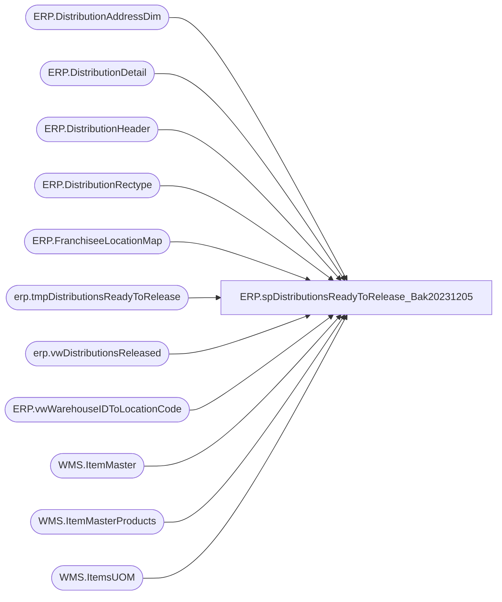

# ERP.spDistributionsReadyToRelease_Bak20231205

**Database:** IntegrationStaging  
**Server:** STL-SSIS-P-01  

## Architecture Diagram



## Table Dependencies

| Referenced Table |
|---|
| ERP.DistributionAddressDim |
| ERP.DistributionDetail |
| ERP.DistributionHeader |
| ERP.DistributionRectype |
| ERP.FranchiseeLocationMap |
| erp.tmpDistributionsReadyToRelease |
| erp.vwDistributionsReleased |
| ERP.vwWarehouseIDToLocationCode |
| WMS.ItemMaster |
| WMS.ItemMasterProducts |
| WMS.ItemsUOM |

## Stored Procedure Code

```sql
CREATE  proc [ERP].[spDistributionsReadyToRelease_Bak20231205]
as

-- =====================================================================================================
-- Name: DistributionsReadyToRelease
--
-- Description:	Selects summary of Canadian shipments to export to DB Schenker system. 
--
-- Input: NA
--
-- Output: na
--
-- Dependencies: na
--
-- Revision History
--		Name:			Date:			Comments:
--		TimCallahan		08/08/2022		Created proc to replace view [ERP].[vwDistributionsReadyToRelease] due to performance issues 
--		Tim Callahan	08/11/2022		Added ##MaxPicklist Lookup to account for when multiple picklists are generated 
--		Tim Callahan	08/15/2022		Added Entity to MaxPicklist Lookup and join to DistroData when TO numbers overlap entities 

-- =====================================================================================================
set nocount on


truncate table erp.tmpDistributionsReadyToRelease
IF (Object_ID('tempdb..##DistroData') IS NOT NULL) DROP TABLE ##DistroData
IF (Object_ID('tempdb..##MaxSequence') IS NOT NULL) DROP TABLE ##MaxSequence
IF (Object_ID('tempdb..##MaxPickList') IS NOT NULL) DROP TABLE ##MaxPickList
;


	select DISTINCT 
		h.Entity,
		h.PICKLISTID,
		h.CUSTOMERREQUISITIONID,
		h.DELIVERYTERM,
		cast(lc1.OperationalSiteCode as varchar(10)) as FROMWAREHOUSE,
		case when isnumeric(isnull(h.ModeOfDelivery,1)) = 0 then 1 else isnull(h.ModeOfDelivery,1) end as MODEOFDELIVERY,
		CAST(h.ORDERID as varchar(12)) AS ORDERID,
		h.ORDERTYPE,
		h.SHIPTONAME,
		
		CASE 
			WHEN h.ORDERTYPE = 'Sales' and f.LocationCode is not null  ---SALES ORDER FOR FRANCHISEE LOCATION THAT IS MAPPED IN ERP.FranchiseeLocationMap, CAME FROM RON TO TELL US LOCATION CODES FOR FRANCHISEES AS THEY ARE NOT IN DYNAMICS AS WAREHOUSE/SITE
				THEN f.LocationCode
			else 
					----ORIGNAL CASE STATEMENT
					cast(
							case when lc4.OperationalSiteCode is not null
								then cast(lc4.OperationalSiteCode as varchar)
								else
									case 
										when lc2.OperationalSiteCode is not null 
											then cast(lc2.OperationalSiteCode as varchar)
											else isnull(cast(a.location_code as varchar), cast(a.AddressID as varchar) )
									end
							 end 
						 as varchar(10))
		END as TOWAREHOUSE,
		h.TRANSACTIONDATETIME,
		d.ITEMDESCRIPTION,
		--case when left(d.ITEMNUMBER,1) = 'S' then 'Supply' else 'Merch' end as MerchOrSupply,
		case when im.NecessaryProductionWorkingTimeSchedulingPropertyId  = 'Supplies' then 'Supply'else 'Merch' end as MerchOrSupply,
		cast(right(d.ITEMNUMBER,6) as varchar(20)) as ITEMNUMBER,
		D.QUANTITY,
		cast( isnull(uom.Factor,1) * d.Quantity as int) as ConvertedQuantity,
		d.QUANTITYUNITOFMEASURE,
		d.SALESPRICE,
		isnull(rt.RecType,1) as RecType,
		rt.ReasonCode,
		rt.Priority,
		upper(datename(dw,getdate())) as current_day,
		a.AddressID OrderAddressID,
		a.location_code OrderLocationCode,
		case when lc4.WarehouseID is null 
			then 0
			else 1
		end as SaleToStore,
		---next 4 fields are for use in the 3pl files
		cast(right(d.ITEMNUMBER,6) as varchar(6)) as VendorStyle,
		'00' as ColorCode,
		cast(p.PRODUCTDESCRIPTION as varchar(52)) as ShortDesription,
		case 
			--when left(im.ProductNumber,1) = 'M'
			--when it.ItemType = 'Merch' -- Remarked out on 2/5/2020
			when im.NecessaryProductionWorkingTimeSchedulingPropertyId  = 'Merch'
			then 1
			else cast(uom.Factor as int)
		end as DistributionMultiple,
		h.OrderCreateSource,
		rt.message as RecTypeMessage
	into ##DistroData
	from 
		ERP.DistributionHeader h with (nolock)
	join ERP.DistributionDetail d with (nolock) on h.OrderID = d.OrderID and h.PickListID = d.PickListID and h.entity = d.entity 
	left join ERP.DistributionRectype rt with (nolock) on rt.RecType = case when isnumeric(isnull(h.ModeOfDelivery,1)) = 0 then 1 else isnull(h.ModeOfDelivery,1) end
	join WMS.ItemMaster im with (nolock) on d.ItemNumber = im.ProductNumber and d.Entity = im.Entity  
		and im.NecessaryProductionWorkingTimeSchedulingPropertyId in ('Merch','Supplies') -- Added 02/05/2020
	join WMS.ItemMasterProducts p with (nolock) on d.ItemNumber = p.ProductNumber
	left join WMS.ItemsUOM uom with (nolock) 
		on d.ItemNumber = uom.ProductNumber
		and d.UOM = uom.FromUnitSymbol
		and d.Entity = uom.Entity
		and uom.ToUnitSymbol = 'wmea'
	left join ERP.vwWarehouseIDToLocationCode lc1 with (nolock) on 
				case when left(h.OrderType,8) = 'Transfer'
					then h.FROMWAREHOUSE
					else d.Warehouse 
				 end = lc1.WarehouseID
				 and h.Entity = lc1.Entity 
	left join ERP.vwWarehouseIDToLocationCode lc2 with (nolock) on 
				case when left(h.OrderType,8) = 'Transfer'
					then cast(h.ToWAREHOUSE as varchar(5))
					else cast(d.Location as varchar(5))
				 end = cast(lc2.WarehouseID as varchar(5))
				 and h.Entity = lc2.Entity 
	left join ERP.DistributionAddressDim a with (nolock) on h.SHIPTONAME = a.SHIPTONAME
	left join ERP.vwWarehouseIDToLocationCode lc3 with (nolock) on lc2.LocationCode = replace(lc3.WarehouseID, '-','') and h.Entity = lc3.Entity 
	left join ERP.vwWarehouseIDToLocationCode lc4 with (nolock) on h.ShipToName = lc4.PrimaryAddressDescription and left(h.OrderType,5) = 'Sales' and h.Entity = lc4.Entity -- SALES ORDERS TO CANADA STORES..
	left join ERP.FranchiseeLocationMap f with (nolock) on h.SHIPTONAME = f.FranchiseeName and h.entity = f.entity 
	where 1=1
	and d.QUANTITY > 0
	and h.ReleaseDate is NULL
	--and left(im.ItemNumber, 1) in ('M', 'S')
	--and it.ItemType in ('Merch', 'Supplies') -- Remarked out on 02/05/2020
	and 
		(
			(left(h.OrderType,8) = 'Transfer' and h.TOWAREHOUSE is not null)
			OR
			(left(h.OrderType,4) = 'Sale' and h.TOWAREHOUSE is null)
		)
	and left(isnull(h.FromWarehouse,666),2) not in ('92','93','94') --excludes various hubs, pool points, etc 
	and isnull(h.FromWarehouse,666) <> '8010' --Keenpac - uk 
	--and h.OrderID = 'TO0000013765' 
	and h.TRANSACTIONDATETIME > '06-27-2022'


select 
	OrderID,
	max(SequenceNumber) MaxSequence 
	into ##MaxSequence
from erp.vwDistributionsReleased 
where OrderID in (select OrderID from ##DistroData)
group by OrderID 

select OrderID, 
Entity, 
max(pickListID) as PickListID
into ##MaxPickList
from erp.DistributionHeader with (nolock)
where OrderID in (select OrderID from ##DistroData)
group by OrderID, Entity 


insert Into  erp.tmpDistributionsReadyToRelease
select  
	dd.Entity,
	dd.PICKLISTID,
	dd.CUSTOMERREQUISITIONID,
	dd.DELIVERYTERM,
	dd.FROMWAREHOUSE,
	dd.MODEOFDELIVERY,
	dd.ORDERID,
	dd.ORDERTYPE,
	dd.SHIPTONAME,
	dd.TOWAREHOUSE,
	dd.TRANSACTIONDATETIME,
	dd.ITEMDESCRIPTION,
	dd.MerchOrSupply,
	dd.ITEMNUMBER,
	dd.QUANTITY,
	dd.ConvertedQuantity,
	dd.QUANTITYUNITOFMEASURE,
	dd.SALESPRICE,
	dd.RecType as RecType,
	dd.ReasonCode,
	dd.Priority,
	case 
		when ms.MaxSequence is NULL 
			then row_number() over(partition by dd.Entity, dd.OrderID order by dd.OrderID, dd.PicklistID, dd.ToWarehouse, dd.ItemNumber, dd.ModeOfDelivery)
			else row_number() over(partition by dd.Entity, dd.OrderID order by dd.OrderID, dd.PicklistID, dd.ToWarehouse, dd.ItemNumber, dd.ModeOfDelivery) + isnull(ms.MaxSequence,0) +100 
	end as SequenceNumber,
	row_number() over(partition by dd.Entity, dd.OrderID order by dd.OrderID, dd.PicklistID, dd.ItemNumber, dd.CustomerRequisitionID) as ref_field_1,
	dd.current_day,
	dd.OrderAddressID,
	dd.OrderLocationCode,
	dd.SaleToStore,
	dd.VendorStyle,
	dd.ColorCode,
	dd.ShortDesription,
	dd.DistributionMultiple,
	dd.OrderCreateSource,
	dd.RecTypeMessage

from ##DistroData dd
left join ##MaxSequence ms on dd.OrderID = ms.OrderID
join ##MaxPickList mp on mp.ORDERID=dd.ORDERID and mp.PickListID=dd.PICKLISTID and mp.Entity=dd.Entity
where dd.TOWAREHOUSE is NOT NULL
AND (
		(
			isnull(dd.TOWAREHOUSE,'x') <> isnull(dd.FROMWAREHOUSE,'x')
			AND
							(
								((isnull(dd.RecType,1) >= 50 and dd.FROMWAREHOUSE not in ('9960','0960')) or (left(dd.OrderType,4) = 'Sale' AND dd.SaleToStore = 0)) --EITHER RECTYPE >= 50 OR IS A SALE THAT IS NOT TO CANADIAN STORE, also DDC add ons needs to export\group after 12:30
								or 
								((isnull(dd.RecType,1) >= 50 and dd.FROMWAREHOUSE in ('9960','0960') and convert(varchar, getdate(), 108) >= '12:30:00') or (left(dd.OrderType,4) = 'Sale' AND dd.SaleToStore = 0)) --EITHER RECTYPE >= 50 OR IS A SALE THAT IS NOT TO CANADIAN STORE  also DDC add ons needs to export\group after 12:30
								or		
								(
									isnull(dd.RecType,1) < 50 
									--datepart(hh,getdate()) >= case when dd.FROMWAREHOUSE = '3970' then 15 else 18 end
									--and convert(varchar, getdate(), 108) >= case when dd.FROMWAREHOUSE in ('3970','3980','8505','8502') then '15:00:00' else '16:30:00' end									

									and convert(varchar, getdate(), 108) >= case when dd.FROMWAREHOUSE in ('2970','9970') then '18:00:00' 
																				 when dd.FROMWAREHOUSE in ('0960','9960') then '17:15:00' 
																														  else '16:30:00' 
																			end
								)
				
							)
			and isnull(dd.FROMWAREHOUSE,'x') not in ('9980', '1013','0980','0013') --- need to add this code for WMS
		)

	--OR dd.OrderID in ('TO0000025705','TO0000025707','TO0000025709','TO0000025713','TO0000025717','TO0000025721','TO0000025725','TO0000025729','TO0000025733') -- Ad Hoc Let Order Export 
)


--GO


ERP,spEmailDistroExportErrorFileCheck,CREATE proc [ERP].[spEmailDistroExportErrorFileCheck] 

as


--====================================================================================================
--	Dan Tweedie	2019-08-20	Created proc 
--====================================================================================================

set nocount on

IF (Object_ID('tempdb..#data') IS NOT null) DROP TABLE #data

select 
	Processname,
	ProcessDateTime,
	ErrorFileName
into #data
from erp.IntegrationLog
where ProcessName = 'ERP_TransfersAndSalesOrderDistros'
and errorfilename is not null
and datediff(dd, ProcessDateTime, getdate()) = 0
order by ProcessDateTime 


if (select count(*) from #data) > 0

begin

delete from erp.IntegrationLog --ensures we don't get emailed all day
where ErrorFileName in (select ErrorFileName from #data)

declare 
	@text nvarchar(max)

	set @text = 
		'<font face =arial size = 2><B>Dynamics to WM / 3PL File Error</B><br>There was an error during processing of the files. This needs to be investigated, and if neccessary, the files should be restaged<br></font>' +
			'<table border="1">' +
				'<tr><th><font face =arial size = 2>Processname</font></th>' +
					'<th><font face =arial size = 2>ProcessDateTime</font></th>' +
					'<th><font face =arial size = 2>ErrorFileName</font></th></tr>' +
		'<font face =arial size = 2>' +
			CAST ( ( SELECT td = Processname,'',
							td = ProcessDateTime, '',
							td = ErrorFileName, ''
					  from #data
					  order by ProcessDateTime, ErrorFileName
					  FOR XML PATH('tr'), TYPE 
					) AS NVARCHAR(MAX) ) +
			'</font></table></font></p></p>
			<br>
			<font face =arial size = 1><B>This report was run from stl-ssis-t-01.IntegrationStaging.ERP.spEmailDistroExportErrorFileCheck vis SSIS ERP_TransfersAndSalesOrderDistros.</B></font>
			<br>
			<br>
		<font face =arial size = 1><i>The information in this message may be privileged, “confidential” and protected from disclosure and/or intended only for the addressee(s) named above.  If the reader of this message is not the intended recipient, or an employee or agent responsible for delivering this message to the intended recipient, you are hereby notified that any dissemination, distribution or copying of the communication is strictly prohibited.  If you have received this communication in error, please notify us immediately by replying to the message and deleting it from your computer.  Thank you beary much.</i></font>'

		exec msdb.dbo.sp_send_dbmail
		@profile_name = 'biadmin',
		@recipients = 'merchadmin@buildabear.com;biadmin@buildabear.com',
		@body = @text,
		@subject = 'Dynamics to WM / 3PL File Error',
		@body_format = 'HTML'


end
```

