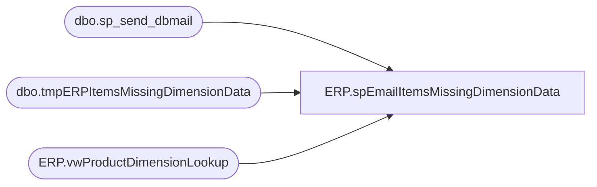

# ERP.spEmailItemsMissingDimensionData

**Database:** IntegrationStaging  
**Server:** STL-SSIS-P-01  

## Architecture Diagram



## Table Dependencies

| Referenced Table |
|---|
| dbo.sp_send_dbmail |
| dbo.tmpERPItemsMissingDimensionData |
| ERP.vwProductDimensionLookup |

## Stored Procedure Code

```sql
CREATE proc [ERP].[spEmailItemsMissingDimensionData] 
--@entity varchar(4)

as 

------------------------------------------------------------------------------------------------------------------------------------------------------------
-- Dan Tweedie	2018-10-10	Created Proc to notify when Items from Dynamics are missing data that is needed for interfacting PO's, Transfers, Sales Orders
------------------------------------------------------------------------------------------------------------------------------------------------------------


set nocount on


IF (Object_ID('IntegrationStaging..tmpERPItemsMissingDimensionData') IS NOT NULL) DROP TABLE tmpERPItemsMissingDimensionData;


with 
MissingDimensions as 
	(
		select 
			Entity,
			ProductNumber,
			VendorAccountNumber,
			VendorSearchName,
			OrganizationPhoneticName,
			VendorCode, 
			FactoryCode,
			FactoryName,
			Country, 
			HarmonizedSystemCode,
			FromUnitSymbol,
			ToUnitSymbol,
			Factor 
		from ERP.vwProductDimensionLookup 
		where 
			
				(
					OrganizationPhoneticName is NULL
					or VendorCode is NULL
					--or Country is NULL
					or Factor is NULL
					or HarmonizedSystemCode is NULL 
				)
	),
MissingStage as 
	(
		select DISTINCT 
			Entity,
			ProductNumber,
			VendorAccountNumber,
			VendorSearchName,
			sum(case when OrganizationPhoneticName is NULL then 0 else 1 end) as HasOrganizationPhoneticName,
			sum(case when VendorCode is NULL then 0 else 1 end) as HasVendorCode,
			sum(case when Country is NULL then 0 else 1 end) as HasCountry,
			sum(case when Factor is NULL then 0 else 1 end) as HasUOM,
			sum(case when HarmonizedSystemCode is NULL then 0 else 1 end) as HasHTS
		from  MissingDimensions
		group by 
			Entity,
			ProductNumber,
			VendorAccountNumber,
			VendorSearchName
	)
select 
	Entity,
	ProductNumber,
	VendorAccountNumber,
	VendorSearchName,
	case when HasOrganizationPhoneticName = 0 then 'NO' else 'YES' end as HasOrganizationPhoneticName,
	case when HasVendorCode = 0 then 'NO' else 'YES' end as HasVendorCode,
	--case when HasCountry = 0 then 'NO' else 'YES' end as HasCountry,
	case when HasUOM = 0 then 'NO' else 'YES' end as HasUOM,
	case when HasHTS = 0 then 'NO' else 'YES' end as HasHTS
into tmpERPItemsMissingDimensionData
from MissingStage


if (select count(*) from tmpERPItemsMissingDimensionData) > 0
begin

declare @subj varchar(52),
		@text nvarchar(max),
		@recip varchar(1000),
		@cc varchar(100)


set @subj = 'Dynamics Items Missing Data'
set @recip = 'dant@buildabear.com;santiagob@buildabear.com'
set @text = 
'<font face =arial size = 2><B>Items missing Vendor, HTS, or UOM Data</B><br>' +
'The items below from Dynamics are missing either Organization Phonetic Name, Vendor Code, UOM or HTS.<br>' +
'If you find fault with this report, please contact DanT@buildabear.com to review.<br><br>'	+
'</font>' +
	'<table border="1">' +
		'<tr><th><font face =arial size = 2>Entity</font></th>' +
			'<th><font face =arial size = 2>ProductNumber</font></th>' +
			'<th><font face =arial size = 2>HasOrganizationPhoneticName</font></th>' +
			'<th><font face =arial size = 2>HasVendorCode</font></th>' +
			--'<th><font face =arial size = 2>HasCountry</font></th>' +
			'<th><font face =arial size = 2>HasUOM</font></th>' +
			'<th><font face =arial size = 2>HasHTS</font></th></tr>' +
'<font face =arial size = 2>' +
    CAST ( ( SELECT td = Entity,'',
                    td = ProductNumber, '',
                    td = HasOrganizationPhoneticName, '',
                    td = HasVendorCode, '',
                    --td = HasCountry, '',
                    td = HasUOM, '',
					td = HasHTS, ''
              from tmpERPItemsMissingDimensionData
			order by Entity, ProductNumber 
              FOR XML PATH('tr'), TYPE 
    ) AS NVARCHAR(MAX) ) +
    '</font></table></font></p></p>
    <br><br>' +
    '<br>
    <font face =arial size = 1><B>This report was run from stl-ssis-p-01.IntegrationStaging.ERP.spEmailItemsMissingDimensionData.</B></font>
    <br>
    <br>
<font face =arial size = 1><i>The information in this message may be privileged, “confidential” and protected from disclosure and/or intended only for the addressee(s) named above.  If the reader of this message is not the intended recipient, or an employee or agent responsible for delivering this message to the intended recipient, you are hereby notified that any dissemination, distribution or copying of the communication is strictly prohibited.  If you have received this communication in error, please notify us immediately by replying to the message and deleting it from your computer.  Thank you beary much.</i></font>'


		exec msdb.dbo.sp_send_dbmail
			@profile_name = 'BIAdmin',
			@recipients = @recip,
			@body = @text,
			@subject = @subj,
			@body_format = 'HTML'

end
```

