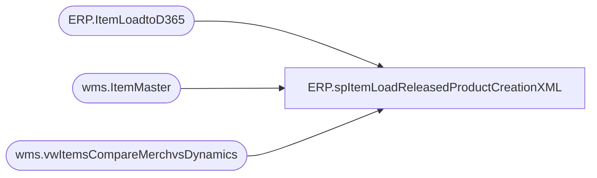

# ERP.spItemLoadReleasedProductCreationXML

**Database:** IntegrationStaging  
**Server:** STL-SSIS-P-01  

## Architecture Diagram



## Table Dependencies

| Referenced Table |
|---|
| ERP.ItemLoadtoD365 |
| wms.ItemMaster |
| wms.vwItemsCompareMerchvsDynamics |

## Stored Procedure Code

```sql
CREATE proc [ERP].[spItemLoadReleasedProductCreationXML]
@Entity nvarchar(10)

as

-------------------------------------------------------------------------------
--2017-08-16	-	Dan Tweedie	- Created view to output ItemLoad XML for D365
-------------------------------------------------------------------------------
WITH
XMLStage (XMLData) as 
	(
		select (
					select 
						e.InventoryUnitSymbol,
						e.IsCatchWeightProduct,
						e.IsProductKit,
						e.ItemModelGroupId,
						e.ItemNumber,
						e.ProductDescription,
						e.ProductGroupId,
						e.ProductName,
						e.ProductNumber,
						e.ProductDescription as ProductSearchName, 
						e.ProductSubType,
						e.ProductType as PrductType,
						e.PurchaseUnitSymbol,
						e.SalesUnitSymbol,
						e.ProductDescription as SearchName,
						e.PurchasePrice,
						e.SalesPrice,
						e.UnitCostQuantity,
						e.UnitCost,
						e.StorageDimensionGroupName,
						e.TrackingDimensionGroupName,
						e.HarmonizedSystemCode,
						e.NMFCCode,
						e.ReservationHierarchyName,
						case 
							when e.Entity=3001 then NULL
							else e.OriginCountryRegionId
						end as OriginCountryRegionId,
						e.AreTransportationManagementProcessesEnabled,
						e.WarehouseMobileDeviceDescriptionLine2,
						e.PropertyId,
						e.UnitConversionSequenceGroupId
					FROM ERP.ItemLoadtoD365 e
					where e.Entity = @Entity
					and (
							e.SendData = 1
							or not exists (select distinct im.ProductNumber from wms.ItemMaster im where im.ItemNumber = e.ProductNumber and im.Entity = @Entity) 
							or exists (select mvd.StagedItem from wms.vwItemsCompareMerchvsDynamics mvd where (mvd.StagedEntity=@Entity and mvd.StagedItem=e.ProductNumber) AND (mvd.StagedHTS<>mvd.DynamicsHTS or mvd.StagedCOO<>mvd.DynamicsCOO))
						)
					--and e.ItemNumber='128270'
					for xml path('EcoResReleasedProductCreationEntity'), Type
			)
		 for xml path('Document')
	)
select cast(XMLData as xml) as XMLData
from XMLStage
```

