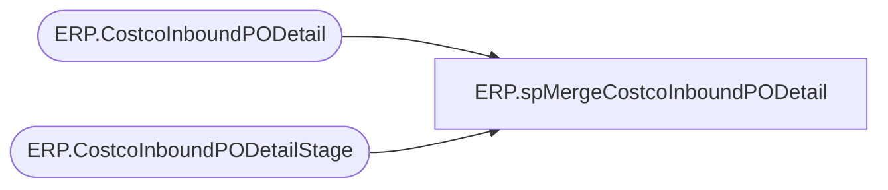

# ERP.spMergeCostcoInboundPODetail

**Database:** IntegrationStaging  
**Server:** STL-SSIS-P-01  

## Architecture Diagram



## Table Dependencies

| Referenced Table |
|---|
| ERP.CostcoInboundPODetail |
| ERP.CostcoInboundPODetailStage |

## Stored Procedure Code

```sql
CREATE proc [ERP].[spMergeCostcoInboundPODetail]

as 

set nocount on

merge into ERP.CostcoInboundPODetail as target  
USING 
	(
		select 
			c.PurchaseOrderID,
			c.CustomerRequisitionNumber,
			c.CustomersLineNumber,
			--p.ProductNumber as ItemNumber,
			c.ItemNumber,
			c.OrderedSalesQuantity,
			c.SalesPrice,
			c.SalesUnitSymbol
		from ERP.CostcoInboundPODetailStage c
		--join ERP.ItemMasterProducts p on p.entity = 1100 and c.ItemNumber = p.ProductNumber
   ) as source 
on 
	(
		target.PurchaseOrderID=source.PurchaseOrderID
		and
		target.CustomerRequisitionNumber=source.CustomerRequisitionNumber
		and
		target.CustomersLineNumber=source.CustomersLineNumber
	)
when NOT MATCHED by target
then INSERT
	(
		PurchaseOrderID,
		CUSTOMERREQUISITIONNUMBER,
		CUSTOMERSLINENUMBER,
		ITEMNUMBER,
		ORDEREDSALESQUANTITY,
		SALESPRICE,
		SALESUNITSYMBOL,
		InsertDate
	)
VALUES
	(
		source.PurchaseOrderID,
		source.CUSTOMERREQUISITIONNUMBER,
		source.CUSTOMERSLINENUMBER,
		source.ITEMNUMBER,
		source.ORDEREDSALESQUANTITY,
		source.SALESPRICE,
		source.SALESUNITSYMBOL,
		getdate()
	)
;
```

