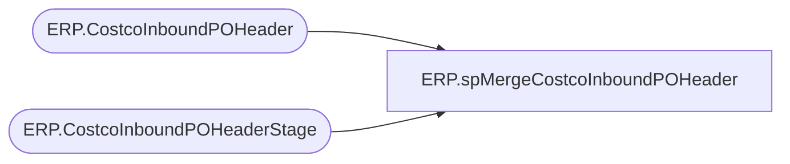

# ERP.spMergeCostcoInboundPOHeader

**Database:** IntegrationStaging  
**Server:** STL-SSIS-P-01  

## Architecture Diagram



## Table Dependencies

| Referenced Table |
|---|
| ERP.CostcoInboundPOHeader |
| ERP.CostcoInboundPOHeaderStage |

## Stored Procedure Code

```sql
CREATE proc [ERP].[spMergeCostcoInboundPOHeader] 

as 

set nocount on

merge into ERP.CostcoInboundPOHeader as target  
USING ERP.CostcoInboundPOHeaderStage as source 
on 
	(
		target.PurchaseOrderID=source.PurchaseOrderID
		and
		target.CustomerRequisitionNumber=source.CustomerRequisitionNumber
	)
when NOT MATCHED by target
then INSERT
	(
		PurchaseOrderID,
		CUSTOMERREQUISITIONNUMBER,
		CUSTOMERSORDERREFERENCE,
		INVOICECUSTOMERACCOUNTNUMBER,
		ORDERINGCUSTOMERACCOUNTNUMBER,
		REQUESTEDSHIPPINGDATE,
		DELIVERYADDRESSDESCRIPTION,
		DELIVERYADDRESSNAME,
		DELIVERYADDRESSSTREET,
		DELIVERYADDRESSCITY,
		DELIVERYADDRESSSTATEID,
		DELIVERYADDRESSZIPCODE,
		DELIVERYADDRESSCOUNTRYREGIONID,
		InsertDate,
		Transmitted
	)
VALUES
	(
		source.PurchaseOrderID,
		source.CUSTOMERREQUISITIONNUMBER,
		source.CUSTOMERSORDERREFERENCE,
		source.INVOICECUSTOMERACCOUNTNUMBER,
		source.ORDERINGCUSTOMERACCOUNTNUMBER,
		source.REQUESTEDSHIPPINGDATE,
		source.DELIVERYADDRESSDESCRIPTION,
		source.DELIVERYADDRESSNAME,
		source.DELIVERYADDRESSSTREET,
		source.DELIVERYADDRESSCITY,
		source.DELIVERYADDRESSSTATEID,
		source.DELIVERYADDRESSZIPCODE,
		source.DELIVERYADDRESSCOUNTRYREGIONID,
		getdate(),
		0
	)
;
```

