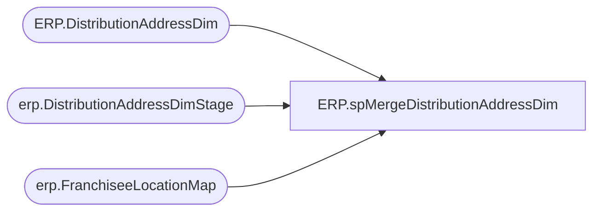

# ERP.spMergeDistributionAddressDim

**Database:** IntegrationStaging  
**Server:** STL-SSIS-P-01  

## Architecture Diagram



## Table Dependencies

| Referenced Table |
|---|
| ERP.DistributionAddressDim |
| erp.DistributionAddressDimStage |
| erp.FranchiseeLocationMap |

## Stored Procedure Code

```sql
CREATE proc [ERP].[spMergeDistributionAddressDim]

as

-------------------------------------------------------------------------
-- spMergeDistributionAddressDim - Merges from ERP.DistributionAddressDimStage to ERP.DistributionAddressDim
--						
-- 2017-08-21 - Dan Tweedie - Created Proc
-- 2021-04-28 - Tim Callahan - Updated proc to exlcuded locations that already exist in Erp.FranchiseeLocationMap table 
-------------------------------------------------------------------------

set nocount on


Merge into ERP.DistributionAddressDim as target
--Using ERP.DistributionAddressDimStage as source -- Changed source on 3/25/2021 
Using (
	select location_code,
	ShipToName,
	ShipToStreet,
	ShipToCity,
	ShipToState,
	ShipToZipCode,
	ShipToCountry,
	ShipToPhone
	from erp.DistributionAddressDimStage e
	where e.ShipToName not in (select distinct FranchiseeName from erp.FranchiseeLocationMap) -- Added 4/28/2021
	group by 
	location_code,
	ShipToName,
	ShipToStreet,
	ShipToCity,
	ShipToState,
	ShipToZipCode,
	ShipToCountry,
	ShipToPhone
) as source 
On (
		target.ShipToName = source.ShipToName
	)
when matched 
	and (
			ISNULL(target.ShipToStreet, 'XXX') <> ISNULL(source.ShipToStreet, 'XXX')
			OR
			ISNULL(target.ShipToCity, 'XXX') <> ISNULL(source.ShipToCity, 'XXX')
			OR
			ISNULL(target.ShipToState, 'XXX') <> ISNULL(source.ShipToState, 'XXX')
			OR
			ISNULL(target.ShipToZipCode, 'XXX') <> ISNULL(source.ShipToZipCode, 'XXX')
			OR
			ISNULL(target.ShipToCountry, 'XXX') <> ISNULL(source.ShipToCountry, 'XXX')
			OR
			ISNULL(target.ShipToPhone, 'XXX') <> ISNULL(source.ShipToPhone, 'XXX')
			--OR
			--ISNULL(target.location_code, 0) <> ISNULL(source.location_code, 0)
		)
	then 
		UPDATE
			SET
				target.ShipToStreet = source.ShipToStreet,
				target.ShipToCity = source.ShipToCity,
				target.ShipToState = source.ShipToState,
				target.ShipToZipCode = source.ShipToZipCode,
				target.ShipToCountry = source.ShipToCountry,
				target.ShipToPhone = source.ShipToPhone,
				--target.location_code = source.location_code,
				target.UpdateDate = getdate()
When Not Matched By Target 
	Then 
		Insert (
					ShipToName,
					ShipToStreet,
					ShipToCity,
					ShipToState,
					ShipToZipCode,
					ShipToCountry,
					ShipToPhone,
					location_code,
					InsertDate
				)
		Values (	
					source.ShipToName,
					source.ShipToStreet,
					source.ShipToCity,
					source.ShipToState,
					source.ShipToZipCode,
					source.ShipToCountry,
					source.ShipToPhone,
					source.location_code,
					getdate()
				)
;
```

