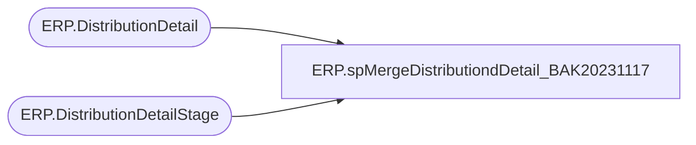

# ERP.spMergeDistributiondDetail_BAK20231117

**Database:** IntegrationStaging  
**Server:** STL-SSIS-P-01  

## Architecture Diagram



## Table Dependencies

| Referenced Table |
|---|
| ERP.DistributionDetail |
| ERP.DistributionDetailStage |

## Stored Procedure Code

```sql
CREATE proc [ERP].[spMergeDistributiondDetail_BAK20231117]

as

-------------------------------------------------------------------------
-- spMergeDistributionDetail- Merges from ERP.DistributionHeaderStage to ERP.DistributionHeader
--						
-- 2017-08-22 - Dan Tweedie - Created Proc
-- 2021-01-19 - Tim Callahan - Added logic for handling of null warehouse and locations as it was creating a non match when a match existed 
-- 2021-01-20 - Tim Callahan - Updated source logic to exclude Aptos Distributions that are now Dynamics TOs or SOs
-- 2021-01-21 - Tim Callahan - Updated proc for handling of OrderLineNumber which was added to JSON message on 1/21/2021
-- 2022-06-28 - Tim Callahan - Remarked out source logic that was added on 2021-01-20 as part of Dynamics 3PL Integration Project
-- 2022-08-11 - Tim Callahan - Remarked out Quantity Comparison from update segment
-------------------------------------------------------------------------

set nocount on


Merge into ERP.DistributionDetail as target
--Using ERP.DistributionDetailStage as source
using (
		SELECT 
			PickListID,
			ItemDescription,
			ItemNumber,
			ModeOfDelivery, 
			OrderID,
			Sum(Quantity) as Quantity,
			QUANTITYUNITOFMEASURE,
			SALESPRICE,
			TransactionDateTime, 
			Warehouse,
			Location, 
			Entity,
			UOM, 
			OrderLineNumber
		from ERP.DistributionDetailStage d
		--where not exists (select v.DynamicsOrder from [ERP].[vwAptosDistributionDynamicsOrderLookup] v where d.ORDERID=v.DynamicsOrder and D.Entity=v.Entity) -- We want to exclude Aptos Distributions that are now Dynamics TOs or SOs
		group by 
			PickListID,
			ItemDescription,
			ItemNumber,
			ModeOfDelivery, 
			OrderID,
			QUANTITYUNITOFMEASURE,
			SALESPRICE,
			TransactionDateTime, 
			Warehouse,
			Location, 
			Entity,
			UOM, 
			OrderLineNumber
	 )
as source

On (
		target.OrderID = source.OrderID
		AND
		target.PickListID = source.PickListID	
		AND
		target.ItemNumber = source.ItemNumber
		AND
		isnull(target.Warehouse,'x')=isnull(source.Warehouse,'x') -- Added 01/19/2021
		AND 
		isnull(target.Location,'x')=isnull(source.Location,'x') -- Added 01/19/2021
		AND 
		target.Entity = source.entity
		AND
		isnull(target.OrderLineNumber,1) = isnull(source.OrderLineNumber,1) -- Added 01/21/2021
	)
when matched 
	and 
		target.ReleaseDate is NULL --UPDATES ARE ONLY ALLOWED IF THE ORDER HAS NOT BEEN EXPORTED TO THE WAREHOUSE YET, AS INDICATED BY THE ReleaseDate COLUMN
		AND
		(	
			isnull(target.ItemDescription, 'xxx') <> isnull(source.ItemDescription,'xxx')
			OR
			isnull(target.ModeOfDelivery, 'xxx') <> isnull(source.ModeOfDelivery,'xxx')
			OR
			--isnull(target.OrderID, 'xxx') <> isnull(source.OrderID,'xxx')
			--OR
			--isnull(target.Quantity, 0.00) <> isnull(source.Quantity, 0.00)
			--OR
			isnull(target.QuantityUnitOfMeasure, 'xxx') <> isnull(source.QuantityUnitOfMeasure,'xxx')
			OR
			isnull(target.SalesPrice, 0.00) <> isnull(source.SalesPrice, 0.00)
			OR
			isnull(target.TransactionDateTime, '1999-12-31') <> isnull(source.TransactionDateTime,'1999-12-31')		
			OR
			isnull(target.UOM, 'xxx') <> isnull(source.UOM, 'xxx')
		)
	then 
		UPDATE
			SET
				target.ItemDescription = source.ItemDescription,
				target.ModeOfDelivery = source.ModeOfDelivery,
				--target.OrderID = source.OrderID,
				target.Quantity = source.Quantity,
				target.QuantityUnitOfMeasure = source.QuantityUnitOfMeasure,
				target.SalesPrice = source.SalesPrice,
				target.TransactionDateTime = source.TransactionDateTime,
				target.UOM = source.UOM,
				target.UpdateDate = getdate()
When Not Matched By Target 
	Then 
		Insert (
					PickListID,
					ItemDescription,
					ItemNumber,
					ModeOfDelivery,
					OrderID,
					Quantity,
					QuantityUnitOfMeasure,
					SalesPrice,
					TransactionDateTime,
					Warehouse,
					Location,
					UOM,
					Entity,
					OrderLineNumber,
					InsertDate
				)
		Values (	
					source.PickListID,
					source.ItemDescription,
					source.ItemNumber,
					source.ModeOfDelivery,
					source.OrderID,
					source.Quantity,
					source.QuantityUnitOfMeasure,
					source.SalesPrice,
					source.TransactionDateTime,
					source.Warehouse,
					source.Location,
					source.UOM,
					source.Entity,
					source.OrderLineNumber,
					getdate()
				)
;


ERP,spMergeDistributionHeader,CREATE proc [ERP].[spMergeDistributionHeader]

as

-------------------------------------------------------------------------
-- spMergeDistributionHeader - Merges from ERP.DistributionHeaderStage to ERP.DistributionHeader
--						
-- 2017-08-22 - Dan Tweedie - Created Proc
-- 2021-01-20 - Tim Callahan - Updated source logic to exclude Aptos Distributions that are now Dynamics TOs or SOs
-- 2021-01-21 - Tim Callahan - Added handling of CustAccount field to Header table 
-- 2021-04-19 - Tim Callahan - Added handling of AptosShipmentNumber field
-- 2022-06-28 - Tim Callahan - Remarked out source logic that was added on 2021-01-20 as part of Dynamics 3PL Integration Project
-------------------------------------------------------------------------

set nocount on


Merge into ERP.DistributionHeader as target
Using ERP.DistributionHeaderStage as source
--Using (
--		select h.* 
--		from erp.DistributionHeaderStage h 
--		where not exists (select v.DynamicsOrder from [ERP].[vwAptosDistributionDynamicsOrderLookup] v where h.ORDERID=v.DynamicsOrder and h.Entity=v.Entity) -- We want to exclude Aptos Distributions that are now Dynamics TOs or SOs
		

--	  ) as source
On (
		target.OrderID = source.OrderID
		AND
		target.PickListID = source.PickListID
		AND
		target.Entity = source.Entity
		AND		
		isnull(target.CustAccount,'x')=isnull(source.CustAccount,'x') -- Added 01/19/2021
	)
when matched 
	and 
		target.ReleaseDate is NULL --UPDATES ARE ONLY ALLOWED IF THE ORDER HAS NOT BEEN EXPORTED TO THE WAREHOUSE YET, AS INDICATED BY THE ReleaseDate COLUMN
		AND
		(	
			
			isnull(target.CUSTOMERREQUISITIONID,'xxx') <> isnull(source.CUSTOMERREQUISITIONID,'xxx')
			OR
			isnull(target.DELIVERYTERM,'xxx') <> isnull(source.DELIVERYTERM,'xxx')
			OR
			isnull(target.FROMWAREHOUSE,'xxx') <> isnull(source.FROMWAREHOUSE,'xxx')
			OR
			isnull(target.MODEOFDELIVERY,'xxx') <> isnull(source.MODEOFDELIVERY,'xxx')			
			OR
			--isnull(target.ORDERID,'xxx') <> isnull(source.ORDERID,'xxx')			
			--OR
			isnull(target.ORDERTYPE,'xxx') <> isnull(source.ORDERTYPE,'xxx')
			OR
			isnull(target.SHIPTONAME,'xxx') <> isnull(source.SHIPTONAME,'xxx')
			OR
			isnull(target.TOWAREHOUSE,'xxx') <> isnull(source.TOWAREHOUSE,'xxx')
			OR
			isnull(target.TRANSACTIONDATETIME,'1999-12-31') <> isnull(source.TRANSACTIONDATETIME,'1999-12-31')
			or
			isnull(target.OrderCreateSource,'x')<>isnull(source.OrderCreateSource,'x')
			or
			isnull(target.AptosShipmentNumber,'x')<>isnull(source.AptosShipmentNumber,'x')
		)
	then 
		UPDATE
			SET
				target.CUSTOMERREQUISITIONID = source.CUSTOMERREQUISITIONID,
				target.DELIVERYTERM = source.DELIVERYTERM,
				target.FROMWAREHOUSE = source.FROMWAREHOUSE,
				target.MODEOFDELIVERY = source.MODEOFDELIVERY,
				--target.ORDERID = source.ORDERID,
				target.ORDERTYPE = source.ORDERTYPE,
				target.SHIPTONAME = source.SHIPTONAME,
				target.TOWAREHOUSE = source.TOWAREHOUSE,
				target.TRANSACTIONDATETIME = source.TRANSACTIONDATETIME,
				target.OrderCreateSource=source.OrderCreateSource,
				target.AptosShipmentNumber=source.AptosShipmentNumber,
				target.UpdateDate = getdate()
When Not Matched By Target 
	Then 
		Insert (
					PICKLISTID,
					CUSTOMERREQUISITIONID,
					DELIVERYTERM,
					FROMWAREHOUSE,
					MODEOFDELIVERY,
					ORDERID,
					ORDERTYPE,
					SHIPTONAME,
					TOWAREHOUSE,
					TRANSACTIONDATETIME,
					Entity,
					OrderCreateSource,
					CustAccount,
					AptosShipmentNumber,
					InsertDate
				)
		Values (	
					source.PICKLISTID,
					source.CUSTOMERREQUISITIONID,
					source.DELIVERYTERM,
					source.FROMWAREHOUSE,
					source.MODEOFDELIVERY,
					source.ORDERID,
					source.ORDERTYPE,
					source.SHIPTONAME,
					source.TOWAREHOUSE,
					source.TRANSACTIONDATETIME,
					source.Entity,
					source.OrderCreateSource,
					source.CustAccount,
					source.AptosShipmentNumber,
					getdate()
				)
;


ERP,spMergeDynamicsValidationPOReceipts,create proc ERP.spMergeDynamicsValidationPOReceipts 
as

------------------------------------------
--	Dan Tweedie	2018-11-02	Created proc
------------------------------------------
set nocount on


merge into ERP.DynamicsValidationPOReceipt as target
using ERP.DynamicsValidationPOReceiptStage as source
on 
	(
		target.Entity=source.Entity
		and
		target.PurchID=source.PurchID
		and
		target.ReceiptID=source.ReceiptID
		and
		target.InventLocationID=source.InventLocationID
		and 
		target.ReceiptDate=source.ReceiptDate
		and
		target.LineNum=source.LineNum
		and
		target.ItemID=source.ItemID
		and
		target.UNITOFMEASURE=source.UNITOFMEASURE
	)
when matched 
	and
		target.IMPORTSTATUS<>source.IMPORTSTATUS
		OR
		target.QTY<>source.QTY
		or
		target.CLOSEFORRECEIPT<>source.CLOSEFORRECEIPT
then update
	set 
		target.IMPORTSTATUS=source.IMPORTSTATUS,
		target.QTY=source.QTY,
		target.CLOSEFORRECEIPT=source.CLOSEFORRECEIPT,
		target.UpdateDate=getdate()
when not matched by target
then insert
	(
		Entity,
		CLOSEFORRECEIPT,
		IMPORTSTATUS,
		INVENTLOCATIONID,
		ITEMID,
		LINENUM,
		ORIGRECEIPTID,
		PURCHID,
		QTY,
		RECEIPTDATE,
		RECEIPTID,
		UNITOFMEASURE,
		InsertDate
	)
	values
	(
		source.Entity,
		source.CLOSEFORRECEIPT,
		source.IMPORTSTATUS,
		source.INVENTLOCATIONID,
		source.ITEMID,
		source.LINENUM,
		source.ORIGRECEIPTID,
		source.PURCHID,
		source.QTY,
		source.RECEIPTDATE,
		source.RECEIPTID,
		source.UNITOFMEASURE,
		getdate()
	)
;
```

