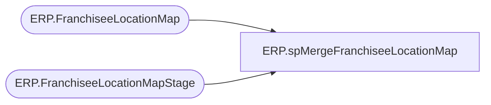

# ERP.spMergeFranchiseeLocationMap

**Database:** IntegrationStaging  
**Server:** STL-SSIS-P-01  

## Architecture Diagram



## Table Dependencies

| Referenced Table |
|---|
| ERP.FranchiseeLocationMap |
| ERP.FranchiseeLocationMapStage |

## Stored Procedure Code

```sql
CREATE proc [ERP].[spMergeFranchiseeLocationMap] -- Update to Proper Name 

as 

-------------------------------------------------------------------------------------------------------
--	Tim Callahan	-	2023-02-02	-	Created proc - Merges Franchisee Location Data from ERP.FranchiseeLocationMapStage to ERP.FranchiseeLocationMap
-------------------------------------------------------------------------------------------------------

set nocount on

merge into ERP.FranchiseeLocationMap as target
using ERP.FranchiseeLocationMapStage as source -- Use Entire Table as Source 

on 
	(

		target.Entity = source.Entity
			and 
		target.FranchiseeName = source.FranchiseeName
			and 
		target.LocationCode = source.LocationCode
	)
 
When Not Matched by target
Then Insert
	(
		-- Fields to be inserted 
		   [Entity],
		   [FranchiseeName],
		   [LocationCode]
         
	)
Values
	(
           source.Entity,
		   source.FranchiseeName,
           source.LocationCode

	)
;
```

