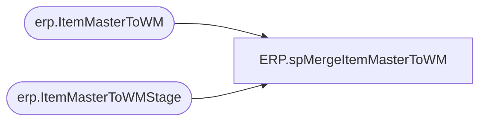

# ERP.spMergeItemMasterToWM

**Database:** IntegrationStaging  
**Server:** STL-SSIS-P-01  

## Architecture Diagram



## Table Dependencies

| Referenced Table |
|---|
| erp.ItemMasterToWM |
| erp.ItemMasterToWMStage |

## Stored Procedure Code

```sql
CREATE proc [ERP].[spMergeItemMasterToWM]

as 


set nocount on


merge into erp.ItemMasterToWM as target
using erp.ItemMasterToWMStage as source
on (
		target.entity = source.entity
		and
		target.Style = source.Style
	)
when matched 
	and (
			ISNULL(target.SKU_DESC, 'XXX') <> ISNULL(source.SKU_DESC, 'XXX')
			OR
			ISNULL(target.UNIT_PRICE, 0.0) <> ISNULL(source.UNIT_PRICE, 0.0)
			OR
			ISNULL(target.RETAIL_PRICE, 0.0) <> ISNULL(source.RETAIL_PRICE, 0.0)
			OR
			ISNULL(target.STD_PACK_QTY, 'XXX') <> ISNULL(source.STD_PACK_QTY, 'XXX')
			OR
			ISNULL(target.InWM, 0) <> ISNULL(source.InWM, 0)
			OR
			ISNULL(target.HTS,'x')<>isnull(source.HTS,'x')
		)
then update
	set 
		target.sku_desc=source.sku_desc,
		target.unit_price=source.unit_price,
		target.retail_price=source.retail_price,
		target.std_pack_qty=source.std_pack_qty,
		target.InWM=source.InWM,
		target.HTS=source.HTS,
		target.UpdateDate=getdate()
when not matched by target
then insert (
				CO, 
				DIV, 
				STYLE, 
				SKU_DESC,
				CARTON_TYPE,
				UNIT_PRICE, 
				RETAIL_PRICE,
				STD_PACK_QTY, 
				STD_CASE_QTY, 
				MAX_CASE_QTY, 
				STD_CASE_LEN, 
				STD_CASE_WIDTH, 
				STD_CASE_HT, 
				UNIT_WT, 
				UNIT_VOL, 
				STD_PACK_WT, 
				STD_PACK_VOL, 
				STD_CASE_WT, 
				STD_CASE_VOL, 
				CRITCL_DIM_1,
				CRITCL_DIM_2, 
				CRITCL_DIM_3,
				STAT_CODE, 
				SKU_BRCD, 
				STD_PACK_WIDTH, 
				STD_PACK_LEN, 
				STD_PACK_HT, 
				UNIT_WIDTH, 
				UNIT_LEN, 
				UNIT_HT, 
				SKU_PROFILE_ID,
				ECCN_NBR,
				EXP_LICN_NBR, 
				COMMODITY_CODE,
				nmfc_code, 
				frt_class, 
				COMMODITY_LEVEL_DESC,
				WHSE, 
				STORE_DEPT,
				ORGN_CERT_CODE,
				HTS,
				Entity,
				InsertDate,
				InWM
			)
		values
			(
				source.CO, 
				source.DIV, 
				source.STYLE, 
				source.SKU_DESC,
				source.CARTON_TYPE,
				source.UNIT_PRICE, 
				source.RETAIL_PRICE,
				source.STD_PACK_QTY, 
				source.STD_CASE_QTY, 
				source.MAX_CASE_QTY, 
				source.STD_CASE_LEN, 
				source.STD_CASE_WIDTH, 
				source.STD_CASE_HT, 
				source.UNIT_WT, 
				source.UNIT_VOL, 
				source.STD_PACK_WT, 
				source.STD_PACK_VOL, 
				source.STD_CASE_WT, 
				source.STD_CASE_VOL, 
				source.CRITCL_DIM_1,
				source.CRITCL_DIM_2, 
				source.CRITCL_DIM_3,
				source.STAT_CODE, 
				source.SKU_BRCD, 
				source.STD_PACK_WIDTH, 
				source.STD_PACK_LEN, 
				source.STD_PACK_HT, 
				source.UNIT_WIDTH, 
				source.UNIT_LEN, 
				source.UNIT_HT, 
				source.SKU_PROFILE_ID,
				source.ECCN_NBR,
				source.EXP_LICN_NBR, 
				source.COMMODITY_CODE,
				source.nmfc_code, 
				source.frt_class, 
				source.COMMODITY_LEVEL_DESC,
				source.WHSE, 
				source.STORE_DEPT,
				source.ORGN_CERT_CODE,
				source.HTS,
				source.Entity,
				getdate(),
				source.InWM
			)
when not matched by source
then delete

;
ERP,spMergeItemsUOM,CREATE proc [ERP].[spMergeItemsUOM]
as
----------------------------------------------------------------------------------------------------------------------------
--	Dan Tweedie	-	2017-11-06	-	Created proc - Merges Dynamics 365 Item UOM data from ERP.ItemsUOMStage to ERP.ItemsUOM
----------------------------------------------------------------------------------------------------------------------------

set nocount on
merge into ERP.ItemsUOM as target
Using ERP.ItemsUOMStage as source
on 
	(
		target.PRODUCTNUMBER=source.PRODUCTNUMBER
		and
		target.FROMUNITSYMBOL=source.FROMUNITSYMBOL
		and
		target.TOUNITSYMBOL=source.TOUNITSYMBOL
		and 
		target.Entity = source.Entity
	)
when matched 
	and
		(
			isnull(target.DENOMINATOR,0)<>isnull(source.DENOMINATOR,0) OR
			isnull(target.FACTOR,0.00)<>isnull(source.FACTOR,0.00) OR
			isnull(target.INNEROFFSET,0.00)<>isnull(source.INNEROFFSET,0.00) OR
			isnull(target.NUMERATOR,0)<>isnull(source.NUMERATOR,0) OR
			isnull(target.OUTEROFFSET,0.00)<>isnull(source.OUTEROFFSET,0.00) OR
			isnull(target.ROUNDING,'xxx')<>isnull(source.ROUNDING,'xxx') 
		)
	then 
		UPDATE
			SET
				target.DENOMINATOR=source.DENOMINATOR,
				target.FACTOR=source.FACTOR,
				target.INNEROFFSET=source.INNEROFFSET,
				target.NUMERATOR=source.NUMERATOR,
				target.OUTEROFFSET=source.OUTEROFFSET,
				target.ROUNDING=source.ROUNDING,
				target.UpdateDate=getdate()
when NOT MATCHED by Target
	then
		Insert
			(
				DENOMINATOR,
				FACTOR,
				FROMUNITSYMBOL,
				INNEROFFSET,
				NUMERATOR,
				OUTEROFFSET,
				PRODUCTNUMBER,
				ROUNDING,
				TOUNITSYMBOL,
				Entity,
				InsertDate
			)
		values
			(
				source.DENOMINATOR,
				source.FACTOR,
				source.FROMUNITSYMBOL,
				source.INNEROFFSET,
				source.NUMERATOR,
				source.OUTEROFFSET,
				source.PRODUCTNUMBER,
				source.ROUNDING,
				source.TOUNITSYMBOL,
				source.Entity,
				getdate()
			)

;
```

