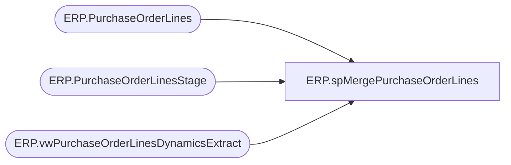

# ERP.spMergePurchaseOrderLines

**Database:** IntegrationStaging  
**Server:** STL-SSIS-P-01  

## Architecture Diagram



## Table Dependencies

| Referenced Table |
|---|
| ERP.PurchaseOrderLines |
| ERP.PurchaseOrderLinesStage |
| ERP.vwPurchaseOrderLinesDynamicsExtract |

## Stored Procedure Code

```sql
CREATE proc [ERP].[spMergePurchaseOrderLines]

as

----------------------------------------------------------------------------------------------------------------------------
--ERP.spMergePurchaseOrderLines
--Dan Tweedie 2017-10-31 - Created proc - Merges D365 PO data from ERP.PurchaseOrderLinesStage to ERP.PurchaseOrderLines
--Tim Callahan 2021-01-25 - Modified Proc to a new source due to changes in PurchaseOrder source, now Dynamics AX Connector
----------------------------------------------------------------------------------------------------------------------------

set nocount on

Update ERP.PurchaseOrderLines
set SendData = 0 


;

Merge into ERP.PurchaseOrderLines as target
Using (
		select *
		from [ERP].[vwPurchaseOrderLinesDynamicsExtract]
		--where isCurrent = 1
	  ) as source
		On (
					target.PurchaseOrderNumber = source.PurchaseOrderNumber
					AND
					target.Entity = source.Entity
					AND
					target.LineNumber = source.LineNumber
			)
When Not Matched By Target 
	Then 
		Insert (
					PurchaseOrderNumber,
					ConfirmationNumber,
					--Lines_ID,
					LineNumber,
					DestinationWarehouse,
					ItemID,
					CurrQty,
					UnitCost,
					StartShipDate,
					EndDeliverDateTime,
					CancelDate,
					VendExtItemID,
					VendExtItemDescription,
					FactoryCode,
					FactoryName,
					FactoryPort,
					FactoryAddress,
					FactoryCity,
					FactoryProvince,
					COOCode,
					Entity,
					UOM,
					MergeAction,
					IsCurrent,
					InsertDate,
					UpdateDate,
					SendData
				)
		Values (	
					source.PurchaseOrderNumber,
					source.ConfirmationNumber,
					--source.Lines_ID,
					source.LineNumber,
					source.DestinationWarehouse,
					source.ItemID,
					source.CurrQty,
					source.UnitCost,
					source.StartShipDate,
					source.EndDeliverDateTime,
					source.CancelDate,
					source.VendExtItemID,
					source.VendExtItemDescription,
					source.FactoryCode,
					source.FactoryName,
					source.FactoryPort,
					source.FactoryAddress,
					source.FactoryCity,
					source.FactoryProvince,
					source.COOCode,
					source.Entity,
					source.UOM,
					'NEW',
					source.IsCurrent,
					getdate(),
					NULL,
					--case 
					--	when source.IsCurrent = 1
					--		then 1
					--	else 0
					--end
					1
				)
When Matched
	and
		(
			isnull(target.ConfirmationNumber,'xxx')<>isnull(source.ConfirmationNumber,'xxx') OR
			--isnull(target.Lines_ID,0)<>isnull(source.Lines_ID,0) OR
			--isnull(target.LineNumber,0)<>isnull(source.LineNumber,0) OR
			isnull(target.DestinationWarehouse,0)<>isnull(source.DestinationWarehouse,0) OR
			isnull(target.ItemID,'xxx')<>isnull(source.ItemID,'xxx') OR
			isnull(target.CurrQty,0)<>isnull(source.CurrQty,0) OR
			isnull(target.UnitCost,'xxx')<>isnull(source.UnitCost,'xxx') OR
			isnull(target.StartShipDate,'xxx')<>isnull(source.StartShipDate,'xxx') OR
			isnull(target.EndDeliverDateTime,'xxx')<>isnull(source.EndDeliverDateTime,'xxx') OR
			isnull(target.CancelDate,'xxx')<>isnull(source.CancelDate,'xxx') OR
			isnull(target.VendExtItemID,'xxx')<>isnull(source.VendExtItemID,'xxx') OR
			isnull(target.VendExtItemDescription,'xxx')<>isnull(source.VendExtItemDescription,'xxx') OR
			isnull(target.FactoryCode,'xxx')<>isnull(source.FactoryCode,'xxx') OR
			isnull(target.FactoryName,'xxx')<>isnull(source.FactoryName,'xxx') OR
			isnull(target.FactoryPort,'xxx')<>isnull(source.FactoryPort,'xxx') OR
			isnull(target.FactoryAddress,'xxx')<>isnull(source.FactoryAddress,'xxx') OR
			isnull(target.FactoryCity,'xxx')<>isnull(source.FactoryCity,'xxx') OR
			isnull(target.FactoryProvince,'xxx')<>isnull(source.FactoryProvince,'xxx') OR
			isnull(target.COOCode,'xxx')<>isnull(source.COOCode,'xxx') OR
			isnull(target.IsCurrent,'xxx')<>isnull(source.IsCurrent,'xxx') OR
			isnull(target.UOM, 'xxx') <> isnull(source.UOM, 'xxx')
		)
	then
		Update
			set 
			target.ConfirmationNumber=source.ConfirmationNumber,
			--target.Lines_ID=source.Lines_ID,
			--target.LineNumber=source.LineNumber,
			target.DestinationWarehouse=source.DestinationWarehouse,
			target.ItemID=source.ItemID,
			target.CurrQty=source.CurrQty,
			target.UnitCost=source.UnitCost,
			target.StartShipDate=source.StartShipDate,
			target.EndDeliverDateTime=source.EndDeliverDateTime,
			target.CancelDate=source.CancelDate,
			target.VendExtItemID=source.VendExtItemID,
			target.VendExtItemDescription=source.VendExtItemDescription,
			target.FactoryCode=source.FactoryCode,
			target.FactoryName=source.FactoryName,
			target.FactoryPort=source.FactoryPort,
			target.FactoryAddress=source.FactoryAddress,
			target.FactoryCity=source.FactoryCity,
			target.FactoryProvince=source.FactoryProvince,
			target.COOCode=source.COOCode,
			target.MergeAction = case when source.CurrQty > 0 then 'UPDATE' else 'CANCEL' END,
			target.IsCurrent=source.IsCurrent,
			target.UOM=source.UOM,
			target.UpdateDate = getdate(),
			target.SendData = case 
						when source.IsCurrent = 1
							then 1
						else 0
					end
--when not matched by source
--	then
--		Update
--			set	
--				target.MergeAction='CANCEL',
--				target.CurrQty=0,
--				target.IsCurrent=1,
--				target.UpdateDate = getdate(),
--				target.SendData = 1
;

--for lines on the po/entity that are not in stage, send cancel
with StagePO 
as
(
	select PurchaseOrderNumber, Entity, LineNumber
	from ERP.PurchaseOrderLinesStage
)
update pol 
set 
	pol.MergeAction='CANCEL',
	pol.CurrQty=0,
	pol.IsCurrent=1,
	pol.UpdateDate = getdate(),
	pol.SendData = 1
from ERP.PurchaseOrderLines pol
join StagePO sp on sp.PurchaseOrderNumber = pol.PurchaseOrderNumber and sp.Entity = pol.Entity 
where not exists (select s.LineNumber from StagePO s where s.PurchaseOrderNumber = pol.PurchaseOrderNumber and s.Entity = pol.Entity and pol.LineNumber = s.LineNumber)
```

