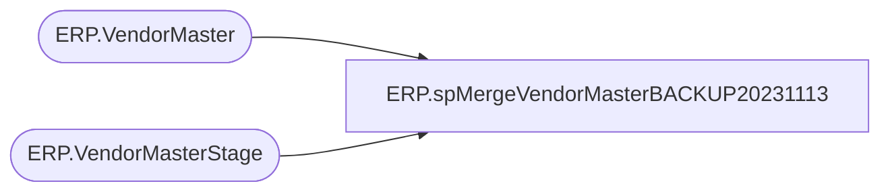

# ERP.spMergeVendorMasterBACKUP20231113

**Database:** IntegrationStaging  
**Server:** STL-SSIS-P-01  

## Architecture Diagram



## Table Dependencies

| Referenced Table |
|---|
| ERP.VendorMaster |
| ERP.VendorMasterStage |

## Stored Procedure Code

```sql
create proc [ERP].[spMergeVendorMasterBACKUP20231113] 

as

---------------------------------------------------------------------------------------------------------------------------------
--	Dan Tweedie	-	2017-11-06	-	Created proc - Merges Dynamics 365 vendor data from ERP.VendorMasterStage to ERP.VendorMaster
---------------------------------------------------------------------------------------------------------------------------------


set nocount on


merge into ERP.VendorMaster as target 
using 
	(
		select *
		from ERP.VendorMasterStage 
		where isnumeric(entity) = 1
	) as source 
on (
		target.VendorAccountNumber = source.VendorAccountNumber
		AND
		target.Entity = source.Entity
	)
when matched and 
	(
		isnull(target.ADDRESSBOOKS  ,'xxx')<>isnull(source.ADDRESSBOOKS,'xxx')  OR 
		isnull(target.ADDRESSCITY  ,'xxx')<>isnull(source.ADDRESSCITY,'xxx')  OR 
		isnull(target.ADDRESSCOUNTRYREGIONID  ,'xxx')<>isnull(source.ADDRESSCOUNTRYREGIONID,'xxx')  OR 
		isnull(target.ADDRESSCOUNTRYREGIONISOCODE  ,'xxx')<>isnull(source.ADDRESSCOUNTRYREGIONISOCODE,'xxx')  OR 
		isnull(target.ADDRESSCOUNTYID  ,'xxx')<>isnull(source.ADDRESSCOUNTYID,'xxx')  OR 
		isnull(target.ADDRESSDESCRIPTION  ,'xxx')<>isnull(source.ADDRESSDESCRIPTION,'xxx')  OR 
		isnull(target.ADDRESSDISTRICTNAME  ,'xxx')<>isnull(source.ADDRESSDISTRICTNAME,'xxx')  OR 
		isnull(target.ADDRESSLATITUDE  ,0.00)<>isnull(source.ADDRESSLATITUDE,0.00)  OR 
		isnull(target.ADDRESSLOCATIONID  ,'xxx')<>isnull(source.ADDRESSLOCATIONID,'xxx')  OR 
		isnull(target.ADDRESSLOCATIONROLES  ,'xxx')<>isnull(source.ADDRESSLOCATIONROLES,'xxx')  OR 
		isnull(target.ADDRESSLONGITUDE  ,0.00)<>isnull(source.ADDRESSLONGITUDE,0.00)  OR 
		isnull(target.ADDRESSSTATEID  ,'xxx')<>isnull(source.ADDRESSSTATEID,'xxx')  OR 
		isnull(target.ADDRESSSTREET  ,'xxx')<>isnull(source.ADDRESSSTREET,'xxx')  OR 
		isnull(target.ADDRESSTIMEZONE  ,'xxx')<>isnull(source.ADDRESSTIMEZONE,'xxx')  OR 
		isnull(target.ADDRESSVALIDFROM  ,'xxx')<>isnull(source.ADDRESSVALIDFROM,'xxx')  OR 
		isnull(target.ADDRESSVALIDTO  ,'xxx')<>isnull(source.ADDRESSVALIDTO,'xxx')  OR 
		isnull(target.ADDRESSZIPCODE  ,'xxx')<>isnull(source.ADDRESSZIPCODE,'xxx')  OR 
		isnull(target.AREPRICESINCLUDINGSALESTAX  ,'xxx')<>isnull(source.AREPRICESINCLUDINGSALESTAX,'xxx')  OR 
		isnull(target.BANKACCOUNTID  ,'xxx')<>isnull(source.BANKACCOUNTID,'xxx')  OR 
		isnull(target.BUSINESSSEGMENTCODE  ,'xxx')<>isnull(source.BUSINESSSEGMENTCODE,'xxx')  OR 
		isnull(target.BUSINESSSUBSEGMENTCODE  ,'xxx')<>isnull(source.BUSINESSSUBSEGMENTCODE,'xxx')  OR 
		isnull(target.BUYERGROUPID  ,'xxx')<>isnull(source.BUYERGROUPID,'xxx')  OR 
		isnull(target.CASHDISCOUNTCODE  ,'xxx')<>isnull(source.CASHDISCOUNTCODE,'xxx')  OR 
		isnull(target.CENTRALBANKPURPOSECODE  ,'xxx')<>isnull(source.CENTRALBANKPURPOSECODE,'xxx')  OR 
		isnull(target.CENTRALBANKPURPOSETEXT  ,'xxx')<>isnull(source.CENTRALBANKPURPOSETEXT,'xxx')  OR 
		isnull(target.CHARGEVENDORGROUPID  ,'xxx')<>isnull(source.CHARGEVENDORGROUPID,'xxx')  OR 
		isnull(target.CLEARINGPERIODPAYMENTTERMSID  ,'xxx')<>isnull(source.CLEARINGPERIODPAYMENTTERMSID,'xxx')  OR 
		isnull(target.COMPANYCHAINNAME  ,'xxx')<>isnull(source.COMPANYCHAINNAME,'xxx')  OR 
		isnull(target.CREDITLIMIT  ,0.00)<>isnull(source.CREDITLIMIT,0.00)  OR 
		isnull(target.CREDITRATING  ,'xxx')<>isnull(source.CREDITRATING,'xxx')  OR 
		isnull(target.CURRENCYCODE  ,'xxx')<>isnull(source.CURRENCYCODE,'xxx')  OR 
		isnull(target.CUSIPDETAILS  ,'xxx')<>isnull(source.CUSIPDETAILS,'xxx')  OR 
		isnull(target.CUSIPIDENTIFICATIONNUMBER  ,'xxx')<>isnull(source.CUSIPIDENTIFICATIONNUMBER,'xxx')  OR 
		isnull(target.DEFAULTCASHDISCOUNTUSAGE  ,'xxx')<>isnull(source.DEFAULTCASHDISCOUNTUSAGE,'xxx')  OR 
		isnull(target.DEFAULTDELIVERYMODEID  ,'xxx')<>isnull(source.DEFAULTDELIVERYMODEID,'xxx')  OR 
		isnull(target.DEFAULTDELIVERYTERMSCODE  ,'xxx')<>isnull(source.DEFAULTDELIVERYTERMSCODE,'xxx')  OR 
		isnull(target.DEFAULTINVENTORYSTATUSID  ,'xxx')<>isnull(source.DEFAULTINVENTORYSTATUSID,'xxx')  OR 
		isnull(target.DEFAULTLEDGERDIMENSIONDISPLAYVALUE  ,'xxx')<>isnull(source.DEFAULTLEDGERDIMENSIONDISPLAYVALUE,'xxx')  OR 
		isnull(target.DEFAULTOFFSETACCOUNTTYPE  ,'xxx')<>isnull(source.DEFAULTOFFSETACCOUNTTYPE,'xxx')  OR 
		isnull(target.DEFAULTOFFSETLEDGERACCOUNTDISPLAYVALUE  ,'xxx')<>isnull(source.DEFAULTOFFSETLEDGERACCOUNTDISPLAYVALUE,'xxx')  OR 
		isnull(target.DEFAULTPAYMENTDAYNAME  ,'xxx')<>isnull(source.DEFAULTPAYMENTDAYNAME,'xxx')  OR 
		isnull(target.DEFAULTPAYMENTSCHEDULENAME  ,'xxx')<>isnull(source.DEFAULTPAYMENTSCHEDULENAME,'xxx')  OR 
		isnull(target.DEFAULTPAYMENTTERMSNAME  ,'xxx')<>isnull(source.DEFAULTPAYMENTTERMSNAME,'xxx')  OR 
		isnull(target.DEFAULTPROCUMENTWAREHOUSEID  ,'xxx')<>isnull(source.DEFAULTPROCUMENTWAREHOUSEID,'xxx')  OR 
		isnull(target.DEFAULTPURCHASEORDERPOOLID  ,'xxx')<>isnull(source.DEFAULTPURCHASEORDERPOOLID,'xxx')  OR 
		isnull(target.DEFAULTPURCHASESITEID  ,'xxx')<>isnull(source.DEFAULTPURCHASESITEID,'xxx')  OR 
		isnull(target.DEFAULTSUPPLEMENTARYPRODUCTVENDORGROUPID  ,'xxx')<>isnull(source.DEFAULTSUPPLEMENTARYPRODUCTVENDORGROUPID,'xxx')  OR 
		isnull(target.DEFAULTTOTALDISCOUNTVENDORGROUPCODE  ,'xxx')<>isnull(source.DEFAULTTOTALDISCOUNTVENDORGROUPCODE,'xxx')  OR 
		isnull(target.DEFAULTVENDORPAYMENTMETHODNAME  ,'xxx')<>isnull(source.DEFAULTVENDORPAYMENTMETHODNAME,'xxx')  OR 
		isnull(target.DESTINATIONCODE  ,'xxx')<>isnull(source.DESTINATIONCODE,'xxx')  OR 
		isnull(target.DUNSNUMBER  ,'xxx')<>isnull(source.DUNSNUMBER,'xxx')  OR 
		isnull(target.ELECTRONICLOCATIONID  ,'xxx')<>isnull(source.ELECTRONICLOCATIONID,'xxx')  OR 
		isnull(target.ETHNICORIGINID  ,'xxx')<>isnull(source.ETHNICORIGINID,'xxx')  OR 
		isnull(target.FORMATTEDPRIMARYADDRESS  ,'xxx')<>isnull(source.FORMATTEDPRIMARYADDRESS,'xxx')  OR 
		isnull(target.HASONLYTAKENBIDS  ,'xxx')<>isnull(source.HASONLYTAKENBIDS,'xxx')  OR 
		isnull(target.INVOICEVENDORACCOUNTNUMBER  ,'xxx')<>isnull(source.INVOICEVENDORACCOUNTNUMBER,'xxx')  OR 
		isnull(target.ISCHANGEMANAGEMENTACTIVATED  ,'xxx')<>isnull(source.ISCHANGEMANAGEMENTACTIVATED,'xxx')  OR 
		isnull(target.ISCHANGEMANGEMENTOVERRIDEBYVENDORALLOWED  ,'xxx')<>isnull(source.ISCHANGEMANGEMENTOVERRIDEBYVENDORALLOWED,'xxx')  OR 
		isnull(target.ISCUSIPIDENTIFICATIONNUMBERAPPLICABLE  ,'xxx')<>isnull(source.ISCUSIPIDENTIFICATIONNUMBERAPPLICABLE,'xxx')  OR 
		isnull(target.ISFLAGGEDWITHSECONDTIN  ,'xxx')<>isnull(source.ISFLAGGEDWITHSECONDTIN,'xxx')  OR 
		isnull(target.ISFOREIGNENTITY  ,'xxx')<>isnull(source.ISFOREIGNENTITY,'xxx')  OR 
		isnull(target.ISMINORITYOWNED  ,'xxx')<>isnull(source.ISMINORITYOWNED,'xxx')  OR 
		isnull(target.ISONETIMEVENDOR  ,'xxx')<>isnull(source.ISONETIMEVENDOR,'xxx')  OR 
		isnull(target.ISOWNERDISABLED  ,'xxx')<>isnull(source.ISOWNERDISABLED,'xxx')  OR 
		isnull(target.ISPRIMARYEMAILADDRESSIMENABLED  ,'xxx')<>isnull(source.ISPRIMARYEMAILADDRESSIMENABLED,'xxx')  OR 
		isnull(target.ISPRIMARYPHONENUMBERMOBILE  ,'xxx')<>isnull(source.ISPRIMARYPHONENUMBERMOBILE,'xxx')  OR 
		isnull(target.ISPURCHASEORDERCHANGEREQUESTOVERRIDEALLOWED  ,'xxx')<>isnull(source.ISPURCHASEORDERCHANGEREQUESTOVERRIDEALLOWED,'xxx')  OR 
		isnull(target.ISREPORTINGTAX1099  ,'xxx')<>isnull(source.ISREPORTINGTAX1099,'xxx')  OR 
		isnull(target.ISSERVICEVETERANOWNED  ,'xxx')<>isnull(source.ISSERVICEVETERANOWNED,'xxx')  OR 
		isnull(target.ISSMALLBUSINESS  ,'xxx')<>isnull(source.ISSMALLBUSINESS,'xxx')  OR 
		isnull(target.ISSUBCONTRACTOR  ,'xxx')<>isnull(source.ISSUBCONTRACTOR,'xxx')  OR 
		isnull(target.ISVENDORLOCALLYOWNED  ,'xxx')<>isnull(source.ISVENDORLOCALLYOWNED,'xxx')  OR 
		isnull(target.ISVENDORLOCATEDINHUBZONE  ,'xxx')<>isnull(source.ISVENDORLOCATEDINHUBZONE,'xxx')  OR 
		isnull(target.ISW9CHECKINGENABLED  ,'xxx')<>isnull(source.ISW9CHECKINGENABLED,'xxx')  OR 
		isnull(target.ISW9RECEIVED  ,'xxx')<>isnull(source.ISW9RECEIVED,'xxx')  OR 
		isnull(target.ISWITHHOLDINGTAXCALCULATED  ,'xxx')<>isnull(source.ISWITHHOLDINGTAXCALCULATED,'xxx')  OR 
		isnull(target.ISWOMANOWNER  ,'xxx')<>isnull(source.ISWOMANOWNER,'xxx')  OR 
		isnull(target.LANGUAGEID  ,'xxx')<>isnull(source.LANGUAGEID,'xxx')  OR 
		isnull(target.LINEDISCOUNTVENDORGROUPCODE  ,'xxx')<>isnull(source.LINEDISCOUNTVENDORGROUPCODE,'xxx')  OR 
		isnull(target.LINEOFBUSINESSID  ,'xxx')<>isnull(source.LINEOFBUSINESSID,'xxx')  OR 
		isnull(target.MAINCONTACTPERSONNELNUMBER  ,'xxx')<>isnull(source.MAINCONTACTPERSONNELNUMBER,'xxx')  OR 
		isnull(target.MULTILINEDISCOUNTVENDORGROUPCODE  ,'xxx')<>isnull(source.MULTILINEDISCOUNTVENDORGROUPCODE,'xxx')  OR 
		isnull(target.NAMECONTROL  ,'xxx')<>isnull(source.NAMECONTROL,'xxx')  OR 
		isnull(target.NOTES  ,'xxx')<>isnull(source.NOTES,'xxx')  OR 
		isnull(target.NUMBERSEQUENCEGROUPID  ,'xxx')<>isnull(source.NUMBERSEQUENCEGROUPID,'xxx')  OR 
		isnull(target.OIDINVESTORTYPE  ,'xxx')<>isnull(source.OIDINVESTORTYPE,'xxx')  OR 
		isnull(target.OIDNOMINEEDETAILS  ,'xxx')<>isnull(source.OIDNOMINEEDETAILS,'xxx')  OR 
		isnull(target.ONHOLDSTATUS  ,'xxx')<>isnull(source.ONHOLDSTATUS,'xxx')  OR 
		isnull(target.ORGANIZATIONABCCODE  ,'xxx')<>isnull(source.ORGANIZATIONABCCODE,'xxx')  OR 
		isnull(target.ORGANIZATIONEMPLOYEEAMOUNT ,0)<>isnull(source.ORGANIZATIONEMPLOYEEAMOUNT,0) OR 
		isnull(target.ORGANIZATIONNUMBER  ,'xxx')<>isnull(source.ORGANIZATIONNUMBER,'xxx')  OR 
		isnull(target.ORGANIZATIONPHONETICNAME  ,'xxx')<>isnull(source.ORGANIZATIONPHONETICNAME,'xxx')  OR 
		isnull(target.OURACCOUNTNUMBER  ,'xxx')<>isnull(source.OURACCOUNTNUMBER,'xxx')  OR 
		isnull(target.PAYMENTID  ,'xxx')<>isnull(source.PAYMENTID,'xxx')  OR 
		isnull(target.PAYMENTSPECIFICATIONID  ,'xxx')<>isnull(source.PAYMENTSPECIFICATIONID,'xxx')  OR 
		isnull(target.PERSONANNIVERSARYDAY  ,'xxx')<>isnull(source.PERSONANNIVERSARYDAY,'xxx')  OR 
		isnull(target.PERSONANNIVERSARYMONTH  ,'xxx')<>isnull(source.PERSONANNIVERSARYMONTH,'xxx')  OR 
		isnull(target.PERSONANNIVERSARYYEAR  ,'xxx')<>isnull(source.PERSONANNIVERSARYYEAR,'xxx')  OR 
		isnull(target.PERSONBIRTHDAY  ,'xxx')<>isnull(source.PERSONBIRTHDAY,'xxx')  OR 
		isnull(target.PERSONBIRTHMONTH  ,'xxx')<>isnull(source.PERSONBIRTHMONTH,'xxx')  OR 
		isnull(target.PERSONBIRTHYEAR  ,'xxx')<>isnull(source.PERSONBIRTHYEAR,'xxx')  OR 
		isnull(target.PERSONCHILDRENNAMES  ,'xxx')<>isnull(source.PERSONCHILDRENNAMES,'xxx')  OR 
		isnull(target.PERSONFIRSTNAME  ,'xxx')<>isnull(source.PERSONFIRSTNAME,'xxx')  OR 
		isnull(target.PERSONGENDER  ,'xxx')<>isnull(source.PERSONGENDER,'xxx')  OR 
		isnull(target.PERSONHOBBIES  ,'xxx')<>isnull(source.PERSONHOBBIES,'xxx')  OR 
		isnull(target.PERSONINITIALS  ,'xxx')<>isnull(source.PERSONINITIALS,'xxx')  OR 
		isnull(target.PERSONLASTNAME  ,'xxx')<>isnull(source.PERSONLASTNAME,'xxx')  OR 
		isnull(target.PERSONLASTNAMEPREFIX  ,'xxx')<>isnull(source.PERSONLASTNAMEPREFIX,'xxx')  OR 
		isnull(target.PERSONMARITALSTATUS  ,'xxx')<>isnull(source.PERSONMARITALSTATUS,'xxx')  OR 
		isnull(target.PERSONMIDDLENAME  ,'xxx')<>isnull(source.PERSONMIDDLENAME,'xxx')  OR 
		isnull(target.PERSONPERSONALSUFFIX  ,'xxx')<>isnull(source.PERSONPERSONALSUFFIX,'xxx')  OR 
		isnull(target.PERSONPERSONALTITLE  ,'xxx')<>isnull(source.PERSONPERSONALTITLE,'xxx')  OR 
		isnull(target.PERSONPHONETICFIRSTNAME  ,'xxx')<>isnull(source.PERSONPHONETICFIRSTNAME,'xxx')  OR 
		isnull(target.PERSONPHONETICLASTNAME  ,'xxx')<>isnull(source.PERSONPHONETICLASTNAME,'xxx')  OR 
		isnull(target.PERSONPHONETICMIDDLENAME  ,'xxx')<>isnull(source.PERSONPHONETICMIDDLENAME,'xxx')  OR 
		isnull(target.PERSONPROFESSIONALSUFFIX  ,'xxx')<>isnull(source.PERSONPROFESSIONALSUFFIX,'xxx')  OR 
		isnull(target.PERSONPROFESSIONALTITLE  ,'xxx')<>isnull(source.PERSONPROFESSIONALTITLE,'xxx')  OR 
		isnull(target.PRICEVENDORGROUPID  ,'xxx')<>isnull(source.PRICEVENDORGROUPID,'xxx')  OR 
		isnull(target.PRIMARYCONTACTPERSONID  ,'xxx')<>isnull(source.PRIMARYCONTACTPERSONID,'xxx')  OR 
		isnull(target.PRIMARYEMAILADDRESS  ,'xxx')<>isnull(source.PRIMARYEMAILADDRESS,'xxx')  OR 
		isnull(target.PRIMARYEMAILADDRESSDESCRIPTION  ,'xxx')<>isnull(source.PRIMARYEMAILADDRESSDESCRIPTION,'xxx')  OR 
		isnull(target.PRIMARYEMAILADDRESSPURPOSE  ,'xxx')<>isnull(source.PRIMARYEMAILADDRESSPURPOSE,'xxx')  OR 
		isnull(target.PRIMARYFACEBOOK  ,'xxx')<>isnull(source.PRIMARYFACEBOOK,'xxx')  OR 
		isnull(target.PRIMARYFACEBOOKDESCRIPTION  ,'xxx')<>isnull(source.PRIMARYFACEBOOKDESCRIPTION,'xxx')  OR 
		isnull(target.PRIMARYFACEBOOKPURPOSE  ,'xxx')<>isnull(source.PRIMARYFACEBOOKPURPOSE,'xxx')  OR 
		isnull(target.PRIMARYFAXNUMBER  ,'xxx')<>isnull(source.PRIMARYFAXNUMBER,'xxx')  OR 
		isnull(target.PRIMARYFAXNUMBERDESCRIPTION  ,'xxx')<>isnull(source.PRIMARYFAXNUMBERDESCRIPTION,'xxx')  OR 
		isnull(target.PRIMARYFAXNUMBEREXTENSION  ,'xxx')<>isnull(source.PRIMARYFAXNUMBEREXTENSION,'xxx')  OR 
		isnull(target.PRIMARYFAXNUMBERPURPOSE  ,'xxx')<>isnull(source.PRIMARYFAXNUMBERPURPOSE,'xxx')  OR 
		isnull(target.PRIMARYLINKEDIN  ,'xxx')<>isnull(source.PRIMARYLINKEDIN,'xxx')  OR 
		isnull(target.PRIMARYLINKEDINDESCRIPTION  ,'xxx')<>isnull(source.PRIMARYLINKEDINDESCRIPTION,'xxx')  OR 
		isnull(target.PRIMARYLINKEDINPURPOSE  ,'xxx')<>isnull(source.PRIMARYLINKEDINPURPOSE,'xxx')  OR 
		isnull(target.PRIMARYPHONENUMBER  ,'xxx')<>isnull(source.PRIMARYPHONENUMBER,'xxx')  OR 
		isnull(target.PRIMARYPHONENUMBERDESCRIPTION  ,'xxx')<>isnull(source.PRIMARYPHONENUMBERDESCRIPTION,'xxx')  OR 
		isnull(target.PRIMARYPHONENUMBEREXTENSION  ,'xxx')<>isnull(source.PRIMARYPHONENUMBEREXTENSION,'xxx')  OR 
		isnull(target.PRIMARYPHONENUMBERPURPOSE  ,'xxx')<>isnull(source.PRIMARYPHONENUMBERPURPOSE,'xxx')  OR 
		isnull(target.PRIMARYTELEX  ,'xxx')<>isnull(source.PRIMARYTELEX,'xxx')  OR 
		isnull(target.PRIMARYTELEXDESCRIPTION  ,'xxx')<>isnull(source.PRIMARYTELEXDESCRIPTION,'xxx')  OR 
		isnull(target.PRIMARYTELEXPURPOSE  ,'xxx')<>isnull(source.PRIMARYTELEXPURPOSE,'xxx')  OR 
		isnull(target.PRIMARYTWITTER  ,'xxx')<>isnull(source.PRIMARYTWITTER,'xxx')  OR 
		isnull(target.PRIMARYTWITTERDESCRIPTION  ,'xxx')<>isnull(source.PRIMARYTWITTERDESCRIPTION,'xxx')  OR 
		isnull(target.PRIMARYTWITTERPURPOSE  ,'xxx')<>isnull(source.PRIMARYTWITTERPURPOSE,'xxx')  OR 
		isnull(target.PRIMARYURL  ,'xxx')<>isnull(source.PRIMARYURL,'xxx')  OR 
		isnull(target.PRIMARYURLDESCRIPTION  ,'xxx')<>isnull(source.PRIMARYURLDESCRIPTION,'xxx')  OR 
		isnull(target.PRIMARYURLPURPOSE  ,'xxx')<>isnull(source.PRIMARYURLPURPOSE,'xxx')  OR 
		isnull(target.PRODUCTDESCRIPTIONVENDORGROUPID  ,'xxx')<>isnull(source.PRODUCTDESCRIPTIONVENDORGROUPID,'xxx')  OR 
		isnull(target.PURCHASEREBATEVENDORGROUPID  ,'xxx')<>isnull(source.PURCHASEREBATEVENDORGROUPID,'xxx')  OR 
		isnull(target.PURCHASEWORKCALENDARID  ,'xxx')<>isnull(source.PURCHASEWORKCALENDARID,'xxx')  OR 
		isnull(target.SALESTAXGROUPCODE  ,'xxx')<>isnull(source.SALESTAXGROUPCODE,'xxx')  OR 
		isnull(target.TAX1099BOXID  ,'xxx')<>isnull(source.TAX1099BOXID,'xxx')  OR 
		isnull(target.TAX1099DOINGBUSINESSASNAME  ,'xxx')<>isnull(source.TAX1099DOINGBUSINESSASNAME,'xxx')  OR 
		isnull(target.TAX1099FEDERALTAXID  ,'xxx')<>isnull(source.TAX1099FEDERALTAXID,'xxx')  OR 
		isnull(target.TAX1099IDTYPE  ,'xxx')<>isnull(source.TAX1099IDTYPE,'xxx')  OR 
		isnull(target.TAX1099NAMETOUSE  ,'xxx')<>isnull(source.TAX1099NAMETOUSE,'xxx')  OR 
		isnull(target.TAX1099TYPE  ,'xxx')<>isnull(source.TAX1099TYPE,'xxx')  OR 
		isnull(target.TAXEXEMPTNUMBER  ,'xxx')<>isnull(source.TAXEXEMPTNUMBER,'xxx')  OR 
		isnull(target.UPSFREIGHTZONE  ,'xxx')<>isnull(source.UPSFREIGHTZONE,'xxx')  OR 
		--isnull(target.VENDORACCOUNTNUMBER  ,'xxx')<>isnull(source.VENDORACCOUNTNUMBER,'xxx')  OR 
		isnull(target.VENDOREXCEPTIONGROUPID  ,'xxx')<>isnull(source.VENDOREXCEPTIONGROUPID,'xxx')  OR 
		isnull(target.VENDORGROUPID ,'xx')<>isnull(source.VENDORGROUPID,'xx') OR 
		isnull(target.VENDORHOLDRELEASEDATE  ,'xxx')<>isnull(source.VENDORHOLDRELEASEDATE,'xxx')  OR 
		isnull(target.VENDORINVOICELINEMATCHINGPOLICY  ,'xxx')<>isnull(source.VENDORINVOICELINEMATCHINGPOLICY,'xxx')  OR 
		isnull(target.VENDORKNOWNASNAME  ,'xxx')<>isnull(source.VENDORKNOWNASNAME,'xxx')  OR 
		isnull(target.VENDORORGANIZATIONNAME  ,'xxx')<>isnull(source.VENDORORGANIZATIONNAME,'xxx')  OR 
		isnull(target.VENDORPARTYNUMBER  ,'xxx')<>isnull(source.VENDORPARTYNUMBER,'xxx')  OR 
		isnull(target.VENDORPARTYTYPE  ,'xxx')<>isnull(source.VENDORPARTYTYPE,'xxx')  OR 
		isnull(target.VENDORPORTALCOLLABORATIONMETHOD  ,'xxx')<>isnull(source.VENDORPORTALCOLLABORATIONMETHOD,'xxx')  OR 
		isnull(target.VENDORPRICETOLERANCEGROUPID  ,'xxx')<>isnull(source.VENDORPRICETOLERANCEGROUPID,'xxx')  OR 
		isnull(target.VENDORSEARCHNAME  ,'xxx')<>isnull(source.VENDORSEARCHNAME,'xxx')  OR 
		isnull(target.WILLINVOICEPROCESSINGSUMMARYUPDATEPURCHASEORDER  ,'xxx')<>isnull(source.WILLINVOICEPROCESSINGSUMMARYUPDATEPURCHASEORDER,'xxx')  OR 
		isnull(target.WILLPRODUCTRECEIPTPROCESSINGSUMMARYUPDATEPURCHASEORDER  ,'xxx')<>isnull(source.WILLPRODUCTRECEIPTPROCESSINGSUMMARYUPDATEPURCHASEORDER,'xxx')  OR 
		isnull(target.WILLPURCHASEORDERINCLUDEPRICESANDAMOUNTS  ,'xxx')<>isnull(source.WILLPURCHASEORDERINCLUDEPRICESANDAMOUNTS,'xxx')  OR 
		isnull(target.WILLPURCHASEORDERPROCESSINGSUMMARYUPDATEPURCHASEORDER  ,'xxx')<>isnull(source.WILLPURCHASEORDERPROCESSINGSUMMARYUPDATEPURCHASEORDER,'xxx')  OR 
		isnull(target.WILLRECEIPTSLISTPROCESSINGSUMMARYUPDATEPURCHASEORDER  ,'xxx')<>isnull(source.WILLRECEIPTSLISTPROCESSINGSUMMARYUPDATEPURCHASEORDER,'xxx')  OR 
		isnull(target.WITHHOLDINGTAXGROUPCODE  ,'xxx')<>isnull(source.WITHHOLDINGTAXGROUPCODE,'xxx')  OR 
		isnull(target.ZAKATREGISTRATIONNUMBER  ,'xxx')<>isnull(source.ZAKATREGISTRATIONNUMBER,'xxx')  
	)
then update 
	set 
		target.ADDRESSBOOKS  = source.ADDRESSBOOKS, 
		target.ADDRESSCITY  = source.ADDRESSCITY, 
		target.ADDRESSCOUNTRYREGIONID  = source.ADDRESSCOUNTRYREGIONID, 
		target.ADDRESSCOUNTRYREGIONISOCODE  = source.ADDRESSCOUNTRYREGIONISOCODE, 
		target.ADDRESSCOUNTYID  = source.ADDRESSCOUNTYID, 
		target.ADDRESSDESCRIPTION  = source.ADDRESSDESCRIPTION, 
		target.ADDRESSDISTRICTNAME  = source.ADDRESSDISTRICTNAME, 
		target.ADDRESSLATITUDE  = source.ADDRESSLATITUDE, 
		target.ADDRESSLOCATIONID  = source.ADDRESSLOCATIONID, 
		target.ADDRESSLOCATIONROLES  = source.ADDRESSLOCATIONROLES, 
		target.ADDRESSLONGITUDE  = source.ADDRESSLONGITUDE, 
		target.ADDRESSSTATEID  = source.ADDRESSSTATEID, 
		target.ADDRESSSTREET  = source.ADDRESSSTREET, 
		target.ADDRESSTIMEZONE  = source.ADDRESSTIMEZONE, 
		target.ADDRESSVALIDFROM  = source.ADDRESSVALIDFROM, 
		target.ADDRESSVALIDTO  = source.ADDRESSVALIDTO, 
		target.ADDRESSZIPCODE  = source.ADDRESSZIPCODE, 
		target.AREPRICESINCLUDINGSALESTAX  = source.AREPRICESINCLUDINGSALESTAX, 
		target.BANKACCOUNTID  = source.BANKACCOUNTID, 
		target.BUSINESSSEGMENTCODE  = source.BUSINESSSEGMENTCODE, 
		target.BUSINESSSUBSEGMENTCODE  = source.BUSINESSSUBSEGMENTCODE, 
		target.BUYERGROUPID  = source.BUYERGROUPID, 
		target.CASHDISCOUNTCODE  = source.CASHDISCOUNTCODE, 
		target.CENTRALBANKPURPOSECODE  = source.CENTRALBANKPURPOSECODE, 
		target.CENTRALBANKPURPOSETEXT  = source.CENTRALBANKPURPOSETEXT, 
		target.CHARGEVENDORGROUPID  = source.CHARGEVENDORGROUPID, 
		target.CLEARINGPERIODPAYMENTTERMSID  = source.CLEARINGPERIODPAYMENTTERMSID, 
		target.COMPANYCHAINNAME  = source.COMPANYCHAINNAME, 
		target.CREDITLIMIT  = source.CREDITLIMIT, 
		target.CREDITRATING  = source.CREDITRATING, 
		target.CURRENCYCODE  = source.CURRENCYCODE, 
		target.CUSIPDETAILS  = source.CUSIPDETAILS, 
		target.CUSIPIDENTIFICATIONNUMBER  = source.CUSIPIDENTIFICATIONNUMBER, 
		target.DEFAULTCASHDISCOUNTUSAGE  = source.DEFAULTCASHDISCOUNTUSAGE, 
		target.DEFAULTDELIVERYMODEID  = source.DEFAULTDELIVERYMODEID, 
		target.DEFAULTDELIVERYTERMSCODE  = source.DEFAULTDELIVERYTERMSCODE, 
		target.DEFAULTINVENTORYSTATUSID  = source.DEFAULTINVENTORYSTATUSID, 
		target.DEFAULTLEDGERDIMENSIONDISPLAYVALUE  = source.DEFAULTLEDGERDIMENSIONDISPLAYVALUE, 
		target.DEFAULTOFFSETACCOUNTTYPE  = source.DEFAULTOFFSETACCOUNTTYPE, 
		target.DEFAULTOFFSETLEDGERACCOUNTDISPLAYVALUE  = source.DEFAULTOFFSETLEDGERACCOUNTDISPLAYVALUE, 
		target.DEFAULTPAYMENTDAYNAME  = source.DEFAULTPAYMENTDAYNAME, 
		target.DEFAULTPAYMENTSCHEDULENAME  = source.DEFAULTPAYMENTSCHEDULENAME, 
		target.DEFAULTPAYMENTTERMSNAME  = source.DEFAULTPAYMENTTERMSNAME, 
		target.DEFAULTPROCUMENTWAREHOUSEID  = source.DEFAULTPROCUMENTWAREHOUSEID, 
		target.DEFAULTPURCHASEORDERPOOLID  = source.DEFAULTPURCHASEORDERPOOLID, 
		target.DEFAULTPURCHASESITEID  = source.DEFAULTPURCHASESITEID, 
		target.DEFAULTSUPPLEMENTARYPRODUCTVENDORGROUPID  = source.DEFAULTSUPPLEMENTARYPRODUCTVENDORGROUPID, 
		target.DEFAULTTOTALDISCOUNTVENDORGROUPCODE  = source.DEFAULTTOTALDISCOUNTVENDORGROUPCODE, 
		target.DEFAULTVENDORPAYMENTMETHODNAME  = source.DEFAULTVENDORPAYMENTMETHODNAME, 
		target.DESTINATIONCODE  = source.DESTINATIONCODE, 
		target.DUNSNUMBER  = source.DUNSNUMBER, 
		target.ELECTRONICLOCATIONID  = source.ELECTRONICLOCATIONID, 
		target.ETHNICORIGINID  = source.ETHNICORIGINID, 
		target.FORMATTEDPRIMARYADDRESS  = source.FORMATTEDPRIMARYADDRESS, 
		target.HASONLYTAKENBIDS  = source.HASONLYTAKENBIDS, 
		target.INVOICEVENDORACCOUNTNUMBER  = source.INVOICEVENDORACCOUNTNUMBER, 
		target.ISCHANGEMANAGEMENTACTIVATED  = source.ISCHANGEMANAGEMENTACTIVATED, 
		target.ISCHANGEMANGEMENTOVERRIDEBYVENDORALLOWED  = source.ISCHANGEMANGEMENTOVERRIDEBYVENDORALLOWED, 
		target.ISCUSIPIDENTIFICATIONNUMBERAPPLICABLE  = source.ISCUSIPIDENTIFICATIONNUMBERAPPLICABLE, 
		target.ISFLAGGEDWITHSECONDTIN  = source.ISFLAGGEDWITHSECONDTIN, 
		target.ISFOREIGNENTITY  = source.ISFOREIGNENTITY, 
		target.ISMINORITYOWNED  = source.ISMINORITYOWNED, 
		target.ISONETIMEVENDOR  = source.ISONETIMEVENDOR, 
		target.ISOWNERDISABLED  = source.ISOWNERDISABLED, 
		target.ISPRIMARYEMAILADDRESSIMENABLED  = source.ISPRIMARYEMAILADDRESSIMENABLED, 
		target.ISPRIMARYPHONENUMBERMOBILE  = source.ISPRIMARYPHONENUMBERMOBILE, 
		target.ISPURCHASEORDERCHANGEREQUESTOVERRIDEALLOWED  = source.ISPURCHASEORDERCHANGEREQUESTOVERRIDEALLOWED, 
		target.ISREPORTINGTAX1099  = source.ISREPORTINGTAX1099, 
		target.ISSERVICEVETERANOWNED  = source.ISSERVICEVETERANOWNED, 
		target.ISSMALLBUSINESS  = source.ISSMALLBUSINESS, 
		target.ISSUBCONTRACTOR  = source.ISSUBCONTRACTOR, 
		target.ISVENDORLOCALLYOWNED  = source.ISVENDORLOCALLYOWNED, 
		target.ISVENDORLOCATEDINHUBZONE  = source.ISVENDORLOCATEDINHUBZONE, 
		target.ISW9CHECKINGENABLED  = source.ISW9CHECKINGENABLED, 
		target.ISW9RECEIVED  = source.ISW9RECEIVED, 
		target.ISWITHHOLDINGTAXCALCULATED  = source.ISWITHHOLDINGTAXCALCULATED, 
		target.ISWOMANOWNER  = source.ISWOMANOWNER, 
		target.LANGUAGEID  = source.LANGUAGEID, 
		target.LINEDISCOUNTVENDORGROUPCODE  = source.LINEDISCOUNTVENDORGROUPCODE, 
		target.LINEOFBUSINESSID  = source.LINEOFBUSINESSID, 
		target.MAINCONTACTPERSONNELNUMBER  = source.MAINCONTACTPERSONNELNUMBER, 
		target.MULTILINEDISCOUNTVENDORGROUPCODE  = source.MULTILINEDISCOUNTVENDORGROUPCODE, 
		target.NAMECONTROL  = source.NAMECONTROL, 
		target.NOTES  = source.NOTES, 
		target.NUMBERSEQUENCEGROUPID  = source.NUMBERSEQUENCEGROUPID, 
		target.OIDINVESTORTYPE  = source.OIDINVESTORTYPE, 
		target.OIDNOMINEEDETAILS  = source.OIDNOMINEEDETAILS, 
		target.ONHOLDSTATUS  = source.ONHOLDSTATUS, 
		target.ORGANIZATIONABCCODE  = source.ORGANIZATIONABCCODE, 
		target.ORGANIZATIONEMPLOYEEAMOUNT = source.ORGANIZATIONEMPLOYEEAMOUNT,
		target.ORGANIZATIONNUMBER  = source.ORGANIZATIONNUMBER, 
		target.ORGANIZATIONPHONETICNAME  = source.ORGANIZATIONPHONETICNAME, 
		target.OURACCOUNTNUMBER  = source.OURACCOUNTNUMBER, 
		target.PAYMENTID  = source.PAYMENTID, 
		target.PAYMENTSPECIFICATIONID  = source.PAYMENTSPECIFICATIONID, 
		target.PERSONANNIVERSARYDAY  = source.PERSONANNIVERSARYDAY, 
		target.PERSONANNIVERSARYMONTH  = source.PERSONANNIVERSARYMONTH, 
		target.PERSONANNIVERSARYYEAR  = source.PERSONANNIVERSARYYEAR, 
		target.PERSONBIRTHDAY  = source.PERSONBIRTHDAY, 
		target.PERSONBIRTHMONTH  = source.PERSONBIRTHMONTH, 
		target.PERSONBIRTHYEAR  = source.PERSONBIRTHYEAR, 
		target.PERSONCHILDRENNAMES  = source.PERSONCHILDRENNAMES, 
		target.PERSONFIRSTNAME  = source.PERSONFIRSTNAME, 
		target.PERSONGENDER  = source.PERSONGENDER, 
		target.PERSONHOBBIES  = source.PERSONHOBBIES, 
		target.PERSONINITIALS  = source.PERSONINITIALS, 
		target.PERSONLASTNAME  = source.PERSONLASTNAME, 
		target.PERSONLASTNAMEPREFIX  = source.PERSONLASTNAMEPREFIX, 
		target.PERSONMARITALSTATUS  = source.PERSONMARITALSTATUS, 
		target.PERSONMIDDLENAME  = source.PERSONMIDDLENAME, 
		target.PERSONPERSONALSUFFIX  = source.PERSONPERSONALSUFFIX, 
		target.PERSONPERSONALTITLE  = source.PERSONPERSONALTITLE, 
		target.PERSONPHONETICFIRSTNAME  = source.PERSONPHONETICFIRSTNAME, 
		target.PERSONPHONETICLASTNAME  = source.PERSONPHONETICLASTNAME, 
		target.PERSONPHONETICMIDDLENAME  = source.PERSONPHONETICMIDDLENAME, 
		target.PERSONPROFESSIONALSUFFIX  = source.PERSONPROFESSIONALSUFFIX, 
		target.PERSONPROFESSIONALTITLE  = source.PERSONPROFESSIONALTITLE, 
		target.PRICEVENDORGROUPID  = source.PRICEVENDORGROUPID, 
		target.PRIMARYCONTACTPERSONID  = source.PRIMARYCONTACTPERSONID, 
		target.PRIMARYEMAILADDRESS  = source.PRIMARYEMAILADDRESS, 
		target.PRIMARYEMAILADDRESSDESCRIPTION  = source.PRIMARYEMAILADDRESSDESCRIPTION, 
		target.PRIMARYEMAILADDRESSPURPOSE  = source.PRIMARYEMAILADDRESSPURPOSE, 
		target.PRIMARYFACEBOOK  = source.PRIMARYFACEBOOK, 
		target.PRIMARYFACEBOOKDESCRIPTION  = source.PRIMARYFACEBOOKDESCRIPTION, 
		target.PRIMARYFACEBOOKPURPOSE  = source.PRIMARYFACEBOOKPURPOSE, 
		target.PRIMARYFAXNUMBER  = source.PRIMARYFAXNUMBER, 
		target.PRIMARYFAXNUMBERDESCRIPTION  = source.PRIMARYFAXNUMBERDESCRIPTION, 
		target.PRIMARYFAXNUMBEREXTENSION  = source.PRIMARYFAXNUMBEREXTENSION, 
		target.PRIMARYFAXNUMBERPURPOSE  = source.PRIMARYFAXNUMBERPURPOSE, 
		target.PRIMARYLINKEDIN  = source.PRIMARYLINKEDIN, 
		target.PRIMARYLINKEDINDESCRIPTION  = source.PRIMARYLINKEDINDESCRIPTION, 
		target.PRIMARYLINKEDINPURPOSE  = source.PRIMARYLINKEDINPURPOSE, 
		target.PRIMARYPHONENUMBER  = source.PRIMARYPHONENUMBER, 
		target.PRIMARYPHONENUMBERDESCRIPTION  = source.PRIMARYPHONENUMBERDESCRIPTION, 
		target.PRIMARYPHONENUMBEREXTENSION  = source.PRIMARYPHONENUMBEREXTENSION, 
		target.PRIMARYPHONENUMBERPURPOSE  = source.PRIMARYPHONENUMBERPURPOSE, 
		target.PRIMARYTELEX  = source.PRIMARYTELEX, 
		target.PRIMARYTELEXDESCRIPTION  = source.PRIMARYTELEXDESCRIPTION, 
		target.PRIMARYTELEXPURPOSE  = source.PRIMARYTELEXPURPOSE, 
		target.PRIMARYTWITTER  = source.PRIMARYTWITTER, 
		target.PRIMARYTWITTERDESCRIPTION  = source.PRIMARYTWITTERDESCRIPTION, 
		target.PRIMARYTWITTERPURPOSE  = source.PRIMARYTWITTERPURPOSE, 
		target.PRIMARYURL  = source.PRIMARYURL, 
		target.PRIMARYURLDESCRIPTION  = source.PRIMARYURLDESCRIPTION, 
		target.PRIMARYURLPURPOSE  = source.PRIMARYURLPURPOSE, 
		target.PRODUCTDESCRIPTIONVENDORGROUPID  = source.PRODUCTDESCRIPTIONVENDORGROUPID, 
		target.PURCHASEREBATEVENDORGROUPID  = source.PURCHASEREBATEVENDORGROUPID, 
		target.PURCHASEWORKCALENDARID  = source.PURCHASEWORKCALENDARID, 
		target.SALESTAXGROUPCODE  = source.SALESTAXGROUPCODE, 
		target.TAX1099BOXID  = source.TAX1099BOXID, 
		target.TAX1099DOINGBUSINESSASNAME  = source.TAX1099DOINGBUSINESSASNAME, 
		target.TAX1099FEDERALTAXID  = source.TAX1099FEDERALTAXID, 
		target.TAX1099IDTYPE  = source.TAX1099IDTYPE, 
		target.TAX1099NAMETOUSE  = source.TAX1099NAMETOUSE, 
		target.TAX1099TYPE  = source.TAX1099TYPE, 
		target.TAXEXEMPTNUMBER  = source.TAXEXEMPTNUMBER, 
		target.UPSFREIGHTZONE  = source.UPSFREIGHTZONE, 
		--target.VENDORACCOUNTNUMBER  = source.VENDORACCOUNTNUMBER, 
		target.VENDOREXCEPTIONGROUPID  = source.VENDOREXCEPTIONGROUPID, 
		target.VENDORGROUPID = source.VENDORGROUPID,
		target.VENDORHOLDRELEASEDATE  = source.VENDORHOLDRELEASEDATE, 
		target.VENDORINVOICELINEMATCHINGPOLICY  = source.VENDORINVOICELINEMATCHINGPOLICY, 
		target.VENDORKNOWNASNAME  = source.VENDORKNOWNASNAME, 
		target.VENDORORGANIZATIONNAME  = source.VENDORORGANIZATIONNAME, 
		target.VENDORPARTYNUMBER  = source.VENDORPARTYNUMBER, 
		target.VENDORPARTYTYPE  = source.VENDORPARTYTYPE, 
		target.VENDORPORTALCOLLABORATIONMETHOD  = source.VENDORPORTALCOLLABORATIONMETHOD, 
		target.VENDORPRICETOLERANCEGROUPID  = source.VENDORPRICETOLERANCEGROUPID, 
		target.VENDORSEARCHNAME  = source.VENDORSEARCHNAME, 
		target.WILLINVOICEPROCESSINGSUMMARYUPDATEPURCHASEORDER  = source.WILLINVOICEPROCESSINGSUMMARYUPDATEPURCHASEORDER, 
		target.WILLPRODUCTRECEIPTPROCESSINGSUMMARYUPDATEPURCHASEORDER  = source.WILLPRODUCTRECEIPTPROCESSINGSUMMARYUPDATEPURCHASEORDER, 
		target.WILLPURCHASEORDERINCLUDEPRICESANDAMOUNTS  = source.WILLPURCHASEORDERINCLUDEPRICESANDAMOUNTS, 
		target.WILLPURCHASEORDERPROCESSINGSUMMARYUPDATEPURCHASEORDER  = source.WILLPURCHASEORDERPROCESSINGSUMMARYUPDATEPURCHASEORDER, 
		target.WILLRECEIPTSLISTPROCESSINGSUMMARYUPDATEPURCHASEORDER  = source.WILLRECEIPTSLISTPROCESSINGSUMMARYUPDATEPURCHASEORDER, 
		target.WITHHOLDINGTAXGROUPCODE  = source.WITHHOLDINGTAXGROUPCODE, 
		target.ZAKATREGISTRATIONNUMBER  = source.ZAKATREGISTRATIONNUMBER, 
		target.UpdateDate = getdate()

when not matched by target
	then insert
			(
				ADDRESSBOOKS,
				ADDRESSCITY,
				ADDRESSCOUNTRYREGIONID,
				ADDRESSCOUNTRYREGIONISOCODE,
				ADDRESSCOUNTYID,
				ADDRESSDESCRIPTION,
				ADDRESSDISTRICTNAME,
				ADDRESSLATITUDE,
				ADDRESSLOCATIONID,
				ADDRESSLOCATIONROLES,
				ADDRESSLONGITUDE,
				ADDRESSSTATEID,
				ADDRESSSTREET,
				ADDRESSTIMEZONE,
				ADDRESSVALIDFROM,
				ADDRESSVALIDTO,
				ADDRESSZIPCODE,
				AREPRICESINCLUDINGSALESTAX,
				BANKACCOUNTID,
				BUSINESSSEGMENTCODE,
				BUSINESSSUBSEGMENTCODE,
				BUYERGROUPID,
				CASHDISCOUNTCODE,
				CENTRALBANKPURPOSECODE,
				CENTRALBANKPURPOSETEXT,
				CHARGEVENDORGROUPID,
				CLEARINGPERIODPAYMENTTERMSID,
				COMPANYCHAINNAME,
				CREDITLIMIT,
				CREDITRATING,
				CURRENCYCODE,
				CUSIPDETAILS,
				CUSIPIDENTIFICATIONNUMBER,
				DEFAULTCASHDISCOUNTUSAGE,
				DEFAULTDELIVERYMODEID,
				DEFAULTDELIVERYTERMSCODE,
				DEFAULTINVENTORYSTATUSID,
				DEFAULTLEDGERDIMENSIONDISPLAYVALUE,
				DEFAULTOFFSETACCOUNTTYPE,
				DEFAULTOFFSETLEDGERACCOUNTDISPLAYVALUE,
				DEFAULTPAYMENTDAYNAME,
				DEFAULTPAYMENTSCHEDULENAME,
				DEFAULTPAYMENTTERMSNAME,
				DEFAULTPROCUMENTWAREHOUSEID,
				DEFAULTPURCHASEORDERPOOLID,
				DEFAULTPURCHASESITEID,
				DEFAULTSUPPLEMENTARYPRODUCTVENDORGROUPID,
				DEFAULTTOTALDISCOUNTVENDORGROUPCODE,
				DEFAULTVENDORPAYMENTMETHODNAME,
				DESTINATIONCODE,
				DUNSNUMBER,
				ELECTRONICLOCATIONID,
				ETHNICORIGINID,
				FORMATTEDPRIMARYADDRESS,
				HASONLYTAKENBIDS,
				INVOICEVENDORACCOUNTNUMBER,
				ISCHANGEMANAGEMENTACTIVATED,
				ISCHANGEMANGEMENTOVERRIDEBYVENDORALLOWED,
				ISCUSIPIDENTIFICATIONNUMBERAPPLICABLE,
				ISFLAGGEDWITHSECONDTIN,
				ISFOREIGNENTITY,
				ISMINORITYOWNED,
				ISONETIMEVENDOR,
				ISOWNERDISABLED,
				ISPRIMARYEMAILADDRESSIMENABLED,
				ISPRIMARYPHONENUMBERMOBILE,
				ISPURCHASEORDERCHANGEREQUESTOVERRIDEALLOWED,
				ISREPORTINGTAX1099,
				ISSERVICEVETERANOWNED,
				ISSMALLBUSINESS,
				ISSUBCONTRACTOR,
				ISVENDORLOCALLYOWNED,
				ISVENDORLOCATEDINHUBZONE,
				ISW9CHECKINGENABLED,
				ISW9RECEIVED,
				ISWITHHOLDINGTAXCALCULATED,
				ISWOMANOWNER,
				LANGUAGEID,
				LINEDISCOUNTVENDORGROUPCODE,
				LINEOFBUSINESSID,
				MAINCONTACTPERSONNELNUMBER,
				MULTILINEDISCOUNTVENDORGROUPCODE,
				NAMECONTROL,
				NOTES,
				NUMBERSEQUENCEGROUPID,
				OIDINVESTORTYPE,
				OIDNOMINEEDETAILS,
				ONHOLDSTATUS,
				ORGANIZATIONABCCODE,
				ORGANIZATIONEMPLOYEEAMOUNT,
				ORGANIZATIONNUMBER,
				ORGANIZATIONPHONETICNAME,
				OURACCOUNTNUMBER,
				PAYMENTID,
				PAYMENTSPECIFICATIONID,
				PERSONANNIVERSARYDAY,
				PERSONANNIVERSARYMONTH,
				PERSONANNIVERSARYYEAR,
				PERSONBIRTHDAY,
				PERSONBIRTHMONTH,
				PERSONBIRTHYEAR,
				PERSONCHILDRENNAMES,
				PERSONFIRSTNAME,
				PERSONGENDER,
				PERSONHOBBIES,
				PERSONINITIALS,
				PERSONLASTNAME,
				PERSONLASTNAMEPREFIX,
				PERSONMARITALSTATUS,
				PERSONMIDDLENAME,
				PERSONPERSONALSUFFIX,
				PERSONPERSONALTITLE,
				PERSONPHONETICFIRSTNAME,
				PERSONPHONETICLASTNAME,
				PERSONPHONETICMIDDLENAME,
				PERSONPROFESSIONALSUFFIX,
				PERSONPROFESSIONALTITLE,
				PRICEVENDORGROUPID,
				PRIMARYCONTACTPERSONID,
				PRIMARYEMAILADDRESS,
				PRIMARYEMAILADDRESSDESCRIPTION,
				PRIMARYEMAILADDRESSPURPOSE,
				PRIMARYFACEBOOK,
				PRIMARYFACEBOOKDESCRIPTION,
				PRIMARYFACEBOOKPURPOSE,
				PRIMARYFAXNUMBER,
				PRIMARYFAXNUMBERDESCRIPTION,
				PRIMARYFAXNUMBEREXTENSION,
				PRIMARYFAXNUMBERPURPOSE,
				PRIMARYLINKEDIN,
				PRIMARYLINKEDINDESCRIPTION,
				PRIMARYLINKEDINPURPOSE,
				PRIMARYPHONENUMBER,
				PRIMARYPHONENUMBERDESCRIPTION,
				PRIMARYPHONENUMBEREXTENSION,
				PRIMARYPHONENUMBERPURPOSE,
				PRIMARYTELEX,
				PRIMARYTELEXDESCRIPTION,
				PRIMARYTELEXPURPOSE,
				PRIMARYTWITTER,
				PRIMARYTWITTERDESCRIPTION,
				PRIMARYTWITTERPURPOSE,
				PRIMARYURL,
				PRIMARYURLDESCRIPTION,
				PRIMARYURLPURPOSE,
				PRODUCTDESCRIPTIONVENDORGROUPID,
				PURCHASEREBATEVENDORGROUPID,
				PURCHASEWORKCALENDARID,
				SALESTAXGROUPCODE,
				TAX1099BOXID,
				TAX1099DOINGBUSINESSASNAME,
				TAX1099FEDERALTAXID,
				TAX1099IDTYPE,
				TAX1099NAMETOUSE,
				TAX1099TYPE,
				TAXEXEMPTNUMBER,
				UPSFREIGHTZONE,
				VENDORACCOUNTNUMBER,
				VENDOREXCEPTIONGROUPID,
				VENDORGROUPID,
				VENDORHOLDRELEASEDATE,
				VENDORINVOICELINEMATCHINGPOLICY,
				VENDORKNOWNASNAME,
				VENDORORGANIZATIONNAME,
				VENDORPARTYNUMBER,
				VENDORPARTYTYPE,
				VENDORPORTALCOLLABORATIONMETHOD,
				VENDORPRICETOLERANCEGROUPID,
				VENDORSEARCHNAME,
				WILLINVOICEPROCESSINGSUMMARYUPDATEPURCHASEORDER,
				WILLPRODUCTRECEIPTPROCESSINGSUMMARYUPDATEPURCHASEORDER,
				WILLPURCHASEORDERINCLUDEPRICESANDAMOUNTS,
				WILLPURCHASEORDERPROCESSINGSUMMARYUPDATEPURCHASEORDER,
				WILLRECEIPTSLISTPROCESSINGSUMMARYUPDATEPURCHASEORDER,
				WITHHOLDINGTAXGROUPCODE,
				ZAKATREGISTRATIONNUMBER,
				Entity,
				InsertDate,
				UpdateDate 
			)
		values
			(
				source.ADDRESSBOOKS,
				source.ADDRESSCITY,
				source.ADDRESSCOUNTRYREGIONID,
				source.ADDRESSCOUNTRYREGIONISOCODE,
				source.ADDRESSCOUNTYID,
				source.ADDRESSDESCRIPTION,
				source.ADDRESSDISTRICTNAME,
				source.ADDRESSLATITUDE,
				source.ADDRESSLOCATIONID,
				source.ADDRESSLOCATIONROLES,
				source.ADDRESSLONGITUDE,
				source.ADDRESSSTATEID,
				source.ADDRESSSTREET,
				source.ADDRESSTIMEZONE,
				source.ADDRESSVALIDFROM,
				source.ADDRESSVALIDTO,
				source.ADDRESSZIPCODE,
				source.AREPRICESINCLUDINGSALESTAX,
				source.BANKACCOUNTID,
				source.BUSINESSSEGMENTCODE,
				source.BUSINESSSUBSEGMENTCODE,
				source.BUYERGROUPID,
				source.CASHDISCOUNTCODE,
				source.CENTRALBANKPURPOSECODE,
				source.CENTRALBANKPURPOSETEXT,
				source.CHARGEVENDORGROUPID,
				source.CLEARINGPERIODPAYMENTTERMSID,
				source.COMPANYCHAINNAME,
				source.CREDITLIMIT,
				source.CREDITRATING,
				source.CURRENCYCODE,
				source.CUSIPDETAILS,
				source.CUSIPIDENTIFICATIONNUMBER,
				source.DEFAULTCASHDISCOUNTUSAGE,
				source.DEFAULTDELIVERYMODEID,
				source.DEFAULTDELIVERYTERMSCODE,
				source.DEFAULTINVENTORYSTATUSID,
				source.DEFAULTLEDGERDIMENSIONDISPLAYVALUE,
				source.DEFAULTOFFSETACCOUNTTYPE,
				source.DEFAULTOFFSETLEDGERACCOUNTDISPLAYVALUE,
				source.DEFAULTPAYMENTDAYNAME,
				source.DEFAULTPAYMENTSCHEDULENAME,
				source.DEFAULTPAYMENTTERMSNAME,
				source.DEFAULTPROCUMENTWAREHOUSEID,
				source.DEFAULTPURCHASEORDERPOOLID,
				source.DEFAULTPURCHASESITEID,
				source.DEFAULTSUPPLEMENTARYPRODUCTVENDORGROUPID,
				source.DEFAULTTOTALDISCOUNTVENDORGROUPCODE,
				source.DEFAULTVENDORPAYMENTMETHODNAME,
				source.DESTINATIONCODE,
				source.DUNSNUMBER,
				source.ELECTRONICLOCATIONID,
				source.ETHNICORIGINID,
				source.FORMATTEDPRIMARYADDRESS,
				source.HASONLYTAKENBIDS,
				source.INVOICEVENDORACCOUNTNUMBER,
				source.ISCHANGEMANAGEMENTACTIVATED,
				source.ISCHANGEMANGEMENTOVERRIDEBYVENDORALLOWED,
				source.ISCUSIPIDENTIFICATIONNUMBERAPPLICABLE,
				source.ISFLAGGEDWITHSECONDTIN,
				source.ISFOREIGNENTITY,
				source.ISMINORITYOWNED,
				source.ISONETIMEVENDOR,
				source.ISOWNERDISABLED,
				source.ISPRIMARYEMAILADDRESSIMENABLED,
				source.ISPRIMARYPHONENUMBERMOBILE,
				source.ISPURCHASEORDERCHANGEREQUESTOVERRIDEALLOWED,
				source.ISREPORTINGTAX1099,
				source.ISSERVICEVETERANOWNED,
				source.ISSMALLBUSINESS,
				source.ISSUBCONTRACTOR,
				source.ISVENDORLOCALLYOWNED,
				source.ISVENDORLOCATEDINHUBZONE,
				source.ISW9CHECKINGENABLED,
				source.ISW9RECEIVED,
				source.ISWITHHOLDINGTAXCALCULATED,
				source.ISWOMANOWNER,
				source.LANGUAGEID,
				source.LINEDISCOUNTVENDORGROUPCODE,
				source.LINEOFBUSINESSID,
				source.MAINCONTACTPERSONNELNUMBER,
				source.MULTILINEDISCOUNTVENDORGROUPCODE,
				source.NAMECONTROL,
				source.NOTES,
				source.NUMBERSEQUENCEGROUPID,
				source.OIDINVESTORTYPE,
				source.OIDNOMINEEDETAILS,
				source.ONHOLDSTATUS,
				source.ORGANIZATIONABCCODE,
				source.ORGANIZATIONEMPLOYEEAMOUNT,
				source.ORGANIZATIONNUMBER,
				source.ORGANIZATIONPHONETICNAME,
				source.OURACCOUNTNUMBER,
				source.PAYMENTID,
				source.PAYMENTSPECIFICATIONID,
				source.PERSONANNIVERSARYDAY,
				source.PERSONANNIVERSARYMONTH,
				source.PERSONANNIVERSARYYEAR,
				source.PERSONBIRTHDAY,
				source.PERSONBIRTHMONTH,
				source.PERSONBIRTHYEAR,
				source.PERSONCHILDRENNAMES,
				source.PERSONFIRSTNAME,
				source.PERSONGENDER,
				source.PERSONHOBBIES,
				source.PERSONINITIALS,
				source.PERSONLASTNAME,
				source.PERSONLASTNAMEPREFIX,
				source.PERSONMARITALSTATUS,
				source.PERSONMIDDLENAME,
				source.PERSONPERSONALSUFFIX,
				source.PERSONPERSONALTITLE,
				source.PERSONPHONETICFIRSTNAME,
				source.PERSONPHONETICLASTNAME,
				source.PERSONPHONETICMIDDLENAME,
				source.PERSONPROFESSIONALSUFFIX,
				source.PERSONPROFESSIONALTITLE,
				source.PRICEVENDORGROUPID,
				source.PRIMARYCONTACTPERSONID,
				source.PRIMARYEMAILADDRESS,
				source.PRIMARYEMAILADDRESSDESCRIPTION,
				source.PRIMARYEMAILADDRESSPURPOSE,
				source.PRIMARYFACEBOOK,
				source.PRIMARYFACEBOOKDESCRIPTION,
				source.PRIMARYFACEBOOKPURPOSE,
				source.PRIMARYFAXNUMBER,
				source.PRIMARYFAXNUMBERDESCRIPTION,
				source.PRIMARYFAXNUMBEREXTENSION,
				source.PRIMARYFAXNUMBERPURPOSE,
				source.PRIMARYLINKEDIN,
				source.PRIMARYLINKEDINDESCRIPTION,
				source.PRIMARYLINKEDINPURPOSE,
				source.PRIMARYPHONENUMBER,
				source.PRIMARYPHONENUMBERDESCRIPTION,
				source.PRIMARYPHONENUMBEREXTENSION,
				source.PRIMARYPHONENUMBERPURPOSE,
				source.PRIMARYTELEX,
				source.PRIMARYTELEXDESCRIPTION,
				source.PRIMARYTELEXPURPOSE,
				source.PRIMARYTWITTER,
				source.PRIMARYTWITTERDESCRIPTION,
				source.PRIMARYTWITTERPURPOSE,
				source.PRIMARYURL,
				source.PRIMARYURLDESCRIPTION,
				source.PRIMARYURLPURPOSE,
				source.PRODUCTDESCRIPTIONVENDORGROUPID,
				source.PURCHASEREBATEVENDORGROUPID,
				source.PURCHASEWORKCALENDARID,
				source.SALESTAXGROUPCODE,
				source.TAX1099BOXID,
				source.TAX1099DOINGBUSINESSASNAME,
				source.TAX1099FEDERALTAXID,
				source.TAX1099IDTYPE,
				source.TAX1099NAMETOUSE,
				source.TAX1099TYPE,
				source.TAXEXEMPTNUMBER,
				source.UPSFREIGHTZONE,
				source.VENDORACCOUNTNUMBER,
				source.VENDOREXCEPTIONGROUPID,
				source.VENDORGROUPID,
				source.VENDORHOLDRELEASEDATE,
				source.VENDORINVOICELINEMATCHINGPOLICY,
				source.VENDORKNOWNASNAME,
				source.VENDORORGANIZATIONNAME,
				source.VENDORPARTYNUMBER,
				source.VENDORPARTYTYPE,
				source.VENDORPORTALCOLLABORATIONMETHOD,
				source.VENDORPRICETOLERANCEGROUPID,
				source.VENDORSEARCHNAME,
				source.WILLINVOICEPROCESSINGSUMMARYUPDATEPURCHASEORDER,
				source.WILLPRODUCTRECEIPTPROCESSINGSUMMARYUPDATEPURCHASEORDER,
				source.WILLPURCHASEORDERINCLUDEPRICESANDAMOUNTS,
				source.WILLPURCHASEORDERPROCESSINGSUMMARYUPDATEPURCHASEORDER,
				source.WILLRECEIPTSLISTPROCESSINGSUMMARYUPDATEPURCHASEORDER,
				source.WITHHOLDINGTAXGROUPCODE,
				source.ZAKATREGISTRATIONNUMBER,
				source.Entity,
				getdate(),
				NULL
			)
when not matched by source 
--and target.Entity in (select distinct entity from ERP.VendorMasterStage)
then delete
;


ERP,spMergeWarehouseInventoryAdjustment,CREATE proc [ERP].[spMergeWarehouseInventoryAdjustment]

as 

set nocount on

--Added 2023-09-11 by Tim C
--Added Step to Temporarily Exclude Nightly Sync Adjustments during PI

--select *
delete
from ERP.WarehouseInventoryAdjustmentStage
where 1=1
and 
(
	--LocationCode in  ('2970','9960') -- Warehouse(s) to Exclude
	LocationCode in  ('2970','0960') -- Warehouse(s) to Exclude -- Replaced Above on 11/28/2023
		and 
	[Description] in ('nightly sync inv-adj') -- Nightly Sync Adjustmen Type -  There are other types
)


-- Begin Merge 


merge into ERP.WarehouseInventoryAdjustment as target
--Using ERP.WarehouseInventoryAdjustmentStage as source -- Changed Source on 11/16/2023
Using 
(
select
LocationCode, 
WarehouseID, 
Style, 
ItemID, 
Qty, 
isnull(Description,'UNDEFINED IN FILE') as Description, 
AdjustmentDate, 
Entity

from ERP.WarehouseInventoryAdjustmentStage 
) as source -- 

on 
	(
		target.Entity = source.Entity
		and
		target.LocationCode = Source.LocationCode
		and
		target.Style = source.Style
		and 
		target.AdjustmentDate = source.AdjustmentDate
		and
		target.Description = source.Description
	)
--when matched 
--	and
--		(
--			isnull(target.Qty,0)<>isnull(source.Qty,0)
--		)
--	then 
--		UPDATE
--			SET
--				target.Qty=source.Qty,
--				target.UpdateDate=getdate()
when NOT MATCHED by Target
	then
		Insert
			(
				LocationCode, 
				WarehouseID,
				Style, 
				ItemID,
				Qty, 
				Description,
				AdjustmentDate,
				Entity,
				InsertDate,
				Exported,
				ExportDate
			)
		values
			(
				source.LocationCode, 
				source.WarehouseID,
				source.Style, 
				source.ItemID,
				source.Qty, 
				source.Description,
				source.AdjustmentDate,
				source.Entity,
				getdate(),
				0,
				NULL
			)

;
```

