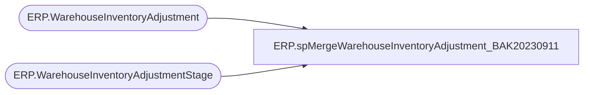

# ERP.spMergeWarehouseInventoryAdjustment_BAK20230911

**Database:** IntegrationStaging  
**Server:** STL-SSIS-P-01  

## Architecture Diagram



## Table Dependencies

| Referenced Table |
|---|
| ERP.WarehouseInventoryAdjustment |
| ERP.WarehouseInventoryAdjustmentStage |

## Stored Procedure Code

```sql
CREATE proc [ERP].[spMergeWarehouseInventoryAdjustment_BAK20230911]

as 

set nocount on


merge into ERP.WarehouseInventoryAdjustment as target
Using ERP.WarehouseInventoryAdjustmentStage as source
on 
	(
		target.Entity = source.Entity
		and
		target.LocationCode = Source.LocationCode
		and
		target.Style = source.Style
		and 
		target.AdjustmentDate = source.AdjustmentDate
		and
		target.Description = source.Description
	)
--when matched 
--	and
--		(
--			isnull(target.Qty,0)<>isnull(source.Qty,0)
--		)
--	then 
--		UPDATE
--			SET
--				target.Qty=source.Qty,
--				target.UpdateDate=getdate()
when NOT MATCHED by Target
	then
		Insert
			(
				LocationCode, 
				WarehouseID,
				Style, 
				ItemID,
				Qty, 
				Description,
				AdjustmentDate,
				Entity,
				InsertDate,
				Exported,
				ExportDate
			)
		values
			(
				source.LocationCode, 
				source.WarehouseID,
				source.Style, 
				source.ItemID,
				source.Qty, 
				source.Description,
				source.AdjustmentDate,
				source.Entity,
				getdate(),
				0,
				NULL
			)

;

ERP,spMergeWarehouseMaster,CREATE proc [ERP].[spMergeWarehouseMaster] 

as 

----------------------------------------------------------------------------------------------------------------------------------------------------
--	Dan Tweedie	-	2017-11-06	-	Created proc - Merges Dynamics 365 Warehouse from ERP.spMergeWarehouseMasterStage to ERP.spMergeWarehouseMaster 
-----------------------------------------------------------------------------------------------------------------------------------------------------


set nocount on


merge into ERP.WarehouseMaster as target 
using ERP.WarehouseMasterStage as source
on (
		target.WarehouseID = source.WarehouseID
		and 
		target.Entity = source.Entity
	)
when matched and 
	(
		isnull(target.AreAdvancedWarehouseManagementProcessesEnabled,'xxx')<>isnull(source.AreAdvancedWarehouseManagementProcessesEnabled,'xxx') OR
		isnull(target.AreItemsCoveragePlannedManually,'xxx')<>isnull(source.AreItemsCoveragePlannedManually,'xxx') OR
		isnull(target.AreLaborStandardsAllowed,'xxx')<>isnull(source.AreLaborStandardsAllowed,'xxx') OR
		isnull(target.ArePickingListsDeliveryModeSpecific,'xxx')<>isnull(source.ArePickingListsDeliveryModeSpecific,'xxx') OR
		isnull(target.ArePickingListsShipmentSpecificOnly,'xxx')<>isnull(source.ArePickingListsShipmentSpecificOnly,'xxx') OR
		isnull(target.AreWarehouseLocationCheckDigitsUnique,'xxx')<>isnull(source.AreWarehouseLocationCheckDigitsUnique,'xxx') OR
		isnull(target.DefaultContainerTypeId,'xxx')<>isnull(source.DefaultContainerTypeId,'xxx') OR
		isnull(target.ExternallyLocatedWarehouseVendorAccountNumber,'xxx')<>isnull(source.ExternallyLocatedWarehouseVendorAccountNumber,'xxx') OR
		isnull(target.FormattedPrimaryAddress,'xxx')<>isnull(source.FormattedPrimaryAddress,'xxx') OR
		isnull(target.InventoryStatusChangeReservationRemovalLevel,'xxx')<>isnull(source.InventoryStatusChangeReservationRemovalLevel,'xxx') OR
		isnull(target.IsBillOfLadingPrintingBeforeShipmentConfirmationEnabled,'xxx')<>isnull(source.IsBillOfLadingPrintingBeforeShipmentConfirmationEnabled,'xxx') OR
		isnull(target.IsFallbackWarehouse,'xxx')<>isnull(source.IsFallbackWarehouse,'xxx') OR
		isnull(target.IsFinancialNegativeRetailStoreInventoryAllowed,'xxx')<>isnull(source.IsFinancialNegativeRetailStoreInventoryAllowed,'xxx') OR
		isnull(target.IsPalletMovementDuringCycleCountingAllowed,'xxx')<>isnull(source.IsPalletMovementDuringCycleCountingAllowed,'xxx') OR
		isnull(target.IsPhysicalNegativeRetailStoreInventoryAllowed,'xxx')<>isnull(source.IsPhysicalNegativeRetailStoreInventoryAllowed,'xxx') OR
		isnull(target.IsPrimaryAddressAssigned,'xxx')<>isnull(source.IsPrimaryAddressAssigned,'xxx') OR
		isnull(target.IsRefilledFromMainWarehouse,'xxx')<>isnull(source.IsRefilledFromMainWarehouse,'xxx') OR
		isnull(target.IsRetailStoreWarehouse,'xxx')<>isnull(source.IsRetailStoreWarehouse,'xxx') OR
		isnull(target.MainRefillingWarehouseId,'xxx')<>isnull(source.MainRefillingWarehouseId,'xxx') OR
		isnull(target.MasterPlanningWorkCalendardId,'xxx')<>isnull(source.MasterPlanningWorkCalendardId,'xxx') OR
		isnull(target.MaximumBatchPickingListQuantity,'xxx')<>isnull(source.MaximumBatchPickingListQuantity,'xxx') OR
		isnull(target.MaximumPickingListLineQuantity,'xxx')<>isnull(source.MaximumPickingListLineQuantity,'xxx') OR
		isnull(target.OperationalSiteId,'xxx')<>isnull(source.OperationalSiteId,'xxx') OR
		isnull(target.PrimaryAddressCity,'xxx')<>isnull(source.PrimaryAddressCity,'xxx') OR
		isnull(target.PrimaryAddressCountryRegionId,'xxx')<>isnull(source.PrimaryAddressCountryRegionId,'xxx') OR
		isnull(target.PrimaryAddressCountyId,'xxx')<>isnull(source.PrimaryAddressCountyId,'xxx') OR
		isnull(target.PrimaryAddressDescription,'xxx')<>isnull(source.PrimaryAddressDescription,'xxx') OR
		isnull(target.PrimaryAddressDistrictName,'xxx')<>isnull(source.PrimaryAddressDistrictName,'xxx') OR
		isnull(target.PrimaryAddressLatitude,'xxx')<>isnull(source.PrimaryAddressLatitude,'xxx') OR
		isnull(target.PrimaryAddressLocationRoles,'xxx')<>isnull(source.PrimaryAddressLocationRoles,'xxx') OR
		isnull(target.PrimaryAddressLocationSalesTaxGroupCode,'xxx')<>isnull(source.PrimaryAddressLocationSalesTaxGroupCode,'xxx') OR
		isnull(target.PrimaryAddressLongitude,'xxx')<>isnull(source.PrimaryAddressLongitude,'xxx') OR
		isnull(target.PrimaryAddressStateId,'xxx')<>isnull(source.PrimaryAddressStateId,'xxx') OR
		isnull(target.PrimaryAddressStreet,'xxx')<>isnull(source.PrimaryAddressStreet,'xxx') OR
		isnull(target.PrimaryAddressTimeZone,'xxx')<>isnull(source.PrimaryAddressTimeZone,'xxx') OR
		isnull(target.PrimaryAddressZipCode,'xxx')<>isnull(source.PrimaryAddressZipCode,'xxx') OR
		isnull(target.QuarantineWarehouseId,'xxx')<>isnull(source.QuarantineWarehouseId,'xxx') OR
		isnull(target.RawMaterialPickingInventoryIssueStatus,'xxx')<>isnull(source.RawMaterialPickingInventoryIssueStatus,'xxx') OR
		isnull(target.RetailStoreQuantityAllocationReplenismentRuleWeight,'xxx')<>isnull(source.RetailStoreQuantityAllocationReplenismentRuleWeight,'xxx') OR
		isnull(target.ShouldWarehouseLocationIdIncludeAisleId,'xxx')<>isnull(source.ShouldWarehouseLocationIdIncludeAisleId,'xxx') OR
		isnull(target.TransitWarehouseId,'xxx')<>isnull(source.TransitWarehouseId,'xxx') OR
		isnull(target.WarehouseLocationIdBinIdFormat,'xxx')<>isnull(source.WarehouseLocationIdBinIdFormat,'xxx') OR
		isnull(target.WarehouseLocationIdRackIdFormat,'xxx')<>isnull(source.WarehouseLocationIdRackIdFormat,'xxx') OR
		isnull(target.WarehouseLocationIdShelfIdFormat,'xxx')<>isnull(source.WarehouseLocationIdShelfIdFormat,'xxx') OR
		isnull(target.WarehouseName,'xxx')<>isnull(source.WarehouseName,'xxx') OR
		isnull(target.WarehouseSpecificDefaultInventoryStatusId,'xxx')<>isnull(source.WarehouseSpecificDefaultInventoryStatusId,'xxx') OR
		isnull(target.WarehouseType,'xxx')<>isnull(source.WarehouseType,'xxx') OR
		isnull(target.WillAutomaticLoadReleaseReserveInventory,'xxx')<>isnull(source.WillAutomaticLoadReleaseReserveInventory,'xxx') OR
		isnull(target.WillInventoryStatusChangeRemoveBlocking,'xxx')<>isnull(source.WillInventoryStatusChangeRemoveBlocking,'xxx') OR
		isnull(target.WillManualLoadReleaseReserveInventory,'xxx')<>isnull(source.WillManualLoadReleaseReserveInventory,'xxx') OR
		isnull(target.WillOrderReleasingConsolidateShipments,'xxx')<>isnull(source.WillOrderReleasingConsolidateShipments,'xxx') OR
		isnull(target.WillProductionBOMsReserveWarehouseLevelOnly,'xxx')<>isnull(source.WillProductionBOMsReserveWarehouseLevelOnly,'xxx') OR
		isnull(target.WillShippingCancellationDecrementLoadQuanity,'xxx')<>isnull(source.WillShippingCancellationDecrementLoadQuanity,'xxx') OR
		isnull(target.WillWarehouseLocationIdIncludeBinIdByDefault,'xxx')<>isnull(source.WillWarehouseLocationIdIncludeBinIdByDefault,'xxx') OR
		isnull(target.WillWarehouseLocationIdIncludeRackIdByDefault,'xxx')<>isnull(source.WillWarehouseLocationIdIncludeRackIdByDefault,'xxx') OR
		isnull(target.WillWarehouseLocationIdIncludeShelfIdByDefault,'xxx')<>isnull(source.WillWarehouseLocationIdIncludeShelfIdByDefault,'xxx') 
	)
then UPDATE 
	set 
		target.AreAdvancedWarehouseManagementProcessesEnabled=source.AreAdvancedWarehouseManagementProcessesEnabled,
		target.AreItemsCoveragePlannedManually=source.AreItemsCoveragePlannedManually,
		target.AreLaborStandardsAllowed=source.AreLaborStandardsAllowed,
		target.ArePickingListsDeliveryModeSpecific=source.ArePickingListsDeliveryModeSpecific,
		target.ArePickingListsShipmentSpecificOnly=source.ArePickingListsShipmentSpecificOnly,
		target.AreWarehouseLocationCheckDigitsUnique=source.AreWarehouseLocationCheckDigitsUnique,
		target.DefaultContainerTypeId=source.DefaultContainerTypeId,
		target.ExternallyLocatedWarehouseVendorAccountNumber=source.ExternallyLocatedWarehouseVendorAccountNumber,
		target.FormattedPrimaryAddress=source.FormattedPrimaryAddress,
		target.InventoryStatusChangeReservationRemovalLevel=source.InventoryStatusChangeReservationRemovalLevel,
		target.IsBillOfLadingPrintingBeforeShipmentConfirmationEnabled=source.IsBillOfLadingPrintingBeforeShipmentConfirmationEnabled,
		target.IsFallbackWarehouse=source.IsFallbackWarehouse,
		target.IsFinancialNegativeRetailStoreInventoryAllowed=source.IsFinancialNegativeRetailStoreInventoryAllowed,
		target.IsPalletMovementDuringCycleCountingAllowed=source.IsPalletMovementDuringCycleCountingAllowed,
		target.IsPhysicalNegativeRetailStoreInventoryAllowed=source.IsPhysicalNegativeRetailStoreInventoryAllowed,
		target.IsPrimaryAddressAssigned=source.IsPrimaryAddressAssigned,
		target.IsRefilledFromMainWarehouse=source.IsRefilledFromMainWarehouse,
		target.IsRetailStoreWarehouse=source.IsRetailStoreWarehouse,
		target.MainRefillingWarehouseId=source.MainRefillingWarehouseId,
		target.MasterPlanningWorkCalendardId=source.MasterPlanningWorkCalendardId,
		target.MaximumBatchPickingListQuantity=source.MaximumBatchPickingListQuantity,
		target.MaximumPickingListLineQuantity=source.MaximumPickingListLineQuantity,
		target.OperationalSiteId=source.OperationalSiteId,
		target.PrimaryAddressCity=source.PrimaryAddressCity,
		target.PrimaryAddressCountryRegionId=source.PrimaryAddressCountryRegionId,
		target.PrimaryAddressCountyId=source.PrimaryAddressCountyId,
		target.PrimaryAddressDescription=source.PrimaryAddressDescription,
		target.PrimaryAddressDistrictName=source.PrimaryAddressDistrictName,
		target.PrimaryAddressLatitude=source.PrimaryAddressLatitude,
		target.PrimaryAddressLocationRoles=source.PrimaryAddressLocationRoles,
		target.PrimaryAddressLocationSalesTaxGroupCode=source.PrimaryAddressLocationSalesTaxGroupCode,
		target.PrimaryAddressLongitude=source.PrimaryAddressLongitude,
		target.PrimaryAddressStateId=source.PrimaryAddressStateId,
		target.PrimaryAddressStreet=source.PrimaryAddressStreet,
		target.PrimaryAddressTimeZone=source.PrimaryAddressTimeZone,
		target.PrimaryAddressZipCode=source.PrimaryAddressZipCode,
		target.QuarantineWarehouseId=source.QuarantineWarehouseId,
		target.RawMaterialPickingInventoryIssueStatus=source.RawMaterialPickingInventoryIssueStatus,
		target.RetailStoreQuantityAllocationReplenismentRuleWeight=source.RetailStoreQuantityAllocationReplenismentRuleWeight,
		target.ShouldWarehouseLocationIdIncludeAisleId=source.ShouldWarehouseLocationIdIncludeAisleId,
		target.TransitWarehouseId=source.TransitWarehouseId,
		target.WarehouseLocationIdBinIdFormat=source.WarehouseLocationIdBinIdFormat,
		target.WarehouseLocationIdRackIdFormat=source.WarehouseLocationIdRackIdFormat,
		target.WarehouseLocationIdShelfIdFormat=source.WarehouseLocationIdShelfIdFormat,
		target.WarehouseName=source.WarehouseName,
		target.WarehouseSpecificDefaultInventoryStatusId=source.WarehouseSpecificDefaultInventoryStatusId,
		target.WarehouseType=source.WarehouseType,
		target.WillAutomaticLoadReleaseReserveInventory=source.WillAutomaticLoadReleaseReserveInventory,
		target.WillInventoryStatusChangeRemoveBlocking=source.WillInventoryStatusChangeRemoveBlocking,
		target.WillManualLoadReleaseReserveInventory=source.WillManualLoadReleaseReserveInventory,
		target.WillOrderReleasingConsolidateShipments=source.WillOrderReleasingConsolidateShipments,
		target.WillProductionBOMsReserveWarehouseLevelOnly=source.WillProductionBOMsReserveWarehouseLevelOnly,
		target.WillShippingCancellationDecrementLoadQuanity=source.WillShippingCancellationDecrementLoadQuanity,
		target.WillWarehouseLocationIdIncludeBinIdByDefault=source.WillWarehouseLocationIdIncludeBinIdByDefault,
		target.WillWarehouseLocationIdIncludeRackIdByDefault=source.WillWarehouseLocationIdIncludeRackIdByDefault,
		target.WillWarehouseLocationIdIncludeShelfIdByDefault=source.WillWarehouseLocationIdIncludeShelfIdByDefault,
		target.UpdateDate = getdate()
When Not Matched by target 
	then INSERT 
		(
			AreAdvancedWarehouseManagementProcessesEnabled,
			AreItemsCoveragePlannedManually,
			AreLaborStandardsAllowed,
			ArePickingListsDeliveryModeSpecific,
			ArePickingListsShipmentSpecificOnly,
			AreWarehouseLocationCheckDigitsUnique,
			DefaultContainerTypeId,
			ExternallyLocatedWarehouseVendorAccountNumber,
			FormattedPrimaryAddress,
			InventoryStatusChangeReservationRemovalLevel,
			IsBillOfLadingPrintingBeforeShipmentConfirmationEnabled,
			IsFallbackWarehouse,
			IsFinancialNegativeRetailStoreInventoryAllowed,
			IsPalletMovementDuringCycleCountingAllowed,
			IsPhysicalNegativeRetailStoreInventoryAllowed,
			IsPrimaryAddressAssigned,
			IsRefilledFromMainWarehouse,
			IsRetailStoreWarehouse,
			MainRefillingWarehouseId,
			MasterPlanningWorkCalendardId,
			MaximumBatchPickingListQuantity,
			MaximumPickingListLineQuantity,
			OperationalSiteId,
			PrimaryAddressCity,
			PrimaryAddressCountryRegionId,
			PrimaryAddressCountyId,
			PrimaryAddressDescription,
			PrimaryAddressDistrictName,
			PrimaryAddressLatitude,
			PrimaryAddressLocationRoles,
			PrimaryAddressLocationSalesTaxGroupCode,
			PrimaryAddressLongitude,
			PrimaryAddressStateId,
			PrimaryAddressStreet,
			PrimaryAddressTimeZone,
			PrimaryAddressZipCode,
			QuarantineWarehouseId,
			RawMaterialPickingInventoryIssueStatus,
			RetailStoreQuantityAllocationReplenismentRuleWeight,
			ShouldWarehouseLocationIdIncludeAisleId,
			TransitWarehouseId,
			WarehouseLocationIdBinIdFormat,
			WarehouseLocationIdRackIdFormat,
			WarehouseLocationIdShelfIdFormat,
			WarehouseName,
			WarehouseSpecificDefaultInventoryStatusId,
			WarehouseType,
			WillAutomaticLoadReleaseReserveInventory,
			WillInventoryStatusChangeRemoveBlocking,
			WillManualLoadReleaseReserveInventory,
			WillOrderReleasingConsolidateShipments,
			WillProductionBOMsReserveWarehouseLevelOnly,
			WillShippingCancellationDecrementLoadQuanity,
			WillWarehouseLocationIdIncludeBinIdByDefault,
			WillWarehouseLocationIdIncludeRackIdByDefault,
			WillWarehouseLocationIdIncludeShelfIdByDefault,
			WarehouseID,
			Entity,
			InsertDate
		)
	values 
		(
			source.AreAdvancedWarehouseManagementProcessesEnabled,
			source.AreItemsCoveragePlannedManually,
			source.AreLaborStandardsAllowed,
			source.ArePickingListsDeliveryModeSpecific,
			source.ArePickingListsShipmentSpecificOnly,
			source.AreWarehouseLocationCheckDigitsUnique,
			source.DefaultContainerTypeId,
			source.ExternallyLocatedWarehouseVendorAccountNumber,
			source.FormattedPrimaryAddress,
			source.InventoryStatusChangeReservationRemovalLevel,
			source.IsBillOfLadingPrintingBeforeShipmentConfirmationEnabled,
			source.IsFallbackWarehouse,
			source.IsFinancialNegativeRetailStoreInventoryAllowed,
			source.IsPalletMovementDuringCycleCountingAllowed,
			source.IsPhysicalNegativeRetailStoreInventoryAllowed,
			source.IsPrimaryAddressAssigned,
			source.IsRefilledFromMainWarehouse,
			source.IsRetailStoreWarehouse,
			source.MainRefillingWarehouseId,
			source.MasterPlanningWorkCalendardId,
			source.MaximumBatchPickingListQuantity,
			source.MaximumPickingListLineQuantity,
			source.OperationalSiteId,
			source.PrimaryAddressCity,
			source.PrimaryAddressCountryRegionId,
			source.PrimaryAddressCountyId,
			source.PrimaryAddressDescription,
			source.PrimaryAddressDistrictName,
			source.PrimaryAddressLatitude,
			source.PrimaryAddressLocationRoles,
			source.PrimaryAddressLocationSalesTaxGroupCode,
			source.PrimaryAddressLongitude,
			source.PrimaryAddressStateId,
			source.PrimaryAddressStreet,
			source.PrimaryAddressTimeZone,
			source.PrimaryAddressZipCode,
			source.QuarantineWarehouseId,
			source.RawMaterialPickingInventoryIssueStatus,
			source.RetailStoreQuantityAllocationReplenismentRuleWeight,
			source.ShouldWarehouseLocationIdIncludeAisleId,
			source.TransitWarehouseId,
			source.WarehouseLocationIdBinIdFormat,
			source.WarehouseLocationIdRackIdFormat,
			source.WarehouseLocationIdShelfIdFormat,
			source.WarehouseName,
			source.WarehouseSpecificDefaultInventoryStatusId,
			source.WarehouseType,
			source.WillAutomaticLoadReleaseReserveInventory,
			source.WillInventoryStatusChangeRemoveBlocking,
			source.WillManualLoadReleaseReserveInventory,
			source.WillOrderReleasingConsolidateShipments,
			source.WillProductionBOMsReserveWarehouseLevelOnly,
			source.WillShippingCancellationDecrementLoadQuanity,
			source.WillWarehouseLocationIdIncludeBinIdByDefault,
			source.WillWarehouseLocationIdIncludeRackIdByDefault,
			source.WillWarehouseLocationIdIncludeShelfIdByDefault,
			source.WarehouseID,
			source.Entity,
			getdate()
		)
;
```

