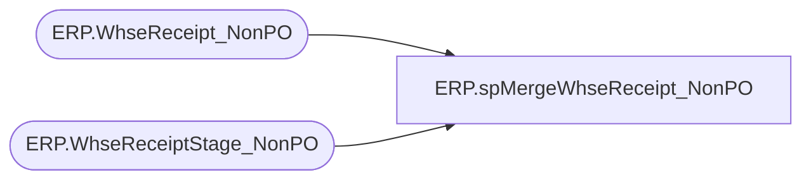

# ERP.spMergeWhseReceipt_NonPO

**Database:** IntegrationStaging  
**Server:** STL-SSIS-P-01  

## Architecture Diagram



## Table Dependencies

| Referenced Table |
|---|
| ERP.WhseReceipt_NonPO |
| ERP.WhseReceiptStage_NonPO |

## Stored Procedure Code

```sql
CREATE proc [ERP].[spMergeWhseReceipt_NonPO]

as

-------------------------------------------------------------------------------------------------------------------------------------
-- Dan Tweedie	-	20171121	-	Created proc - Merges from ERP.PurchaseOrderReceiptStage into ERP.PurchaseOrderReceipt for D365
-------------------------------------------------------------------------------------------------------------------------------------


set nocount on


merge into ERP.WhseReceipt_NonPO as target
using ERP.WhseReceiptStage_NonPO as source
on
	(
		target.ReferenceNumber = source.ReferenceNumber
		and 
		target.CaseNumber = source.CaseNumber
		and
		target.ItemID = source.ItemID
	)
when not matched by target 
	then 
		insert (
					ReferenceNumber,
					ReceiptLocation,
					BOL,
					ItemID,
					CaseNumber,
					Qty,
					ReceiptDate,
					InsertDate,
					Entity
				)
			values
				(
					source.ReferenceNumber,
					source.ReceiptLocation,
					source.BOL,
					source.ItemID,
					source.CaseNumber,
					source.Qty,
					source.ReceiptDate,
					getdate(),
					Entity
				)
;
```

