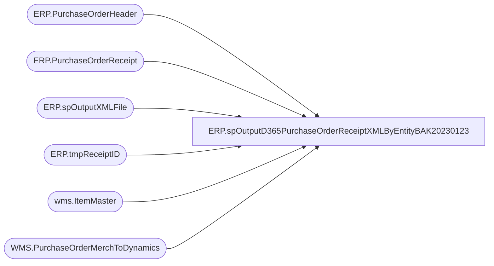

# ERP.spOutputD365PurchaseOrderReceiptXMLByEntityBAK20230123

**Database:** IntegrationStaging  
**Server:** STL-SSIS-P-01  

## Architecture Diagram



## Table Dependencies

| Referenced Table |
|---|
| ERP.PurchaseOrderHeader |
| ERP.PurchaseOrderReceipt |
| ERP.spOutputXMLFile |
| ERP.tmpReceiptID |
| wms.ItemMaster |
| WMS.PurchaseOrderMerchToDynamics |

## Stored Procedure Code

```sql
CREATE proc [ERP].[spOutputD365PurchaseOrderReceiptXMLByEntityBAK20230123]
@DropFile varchar(500),
@Entity varchar(10)

as


---------------------------------------------------------------------------------------------------------------------------
--	Dan Tweedie	-	2017-11-15	-	Created proc to generate PurchaseOrderReceipt xml file for D365
--									Needs to be updated to only execute spOutputXMLFile if there is new receipt data
---------------------------------------------------------------------------------------------------------------------------

set nocount on

truncate table ERP.tmpReceiptID

insert ERP.tmpReceiptID
select distinct pr.ReceiptID
from ERP.PurchaseOrderReceipt pr
join wms.ItemMaster im on pr.ItemID = im.ProductNumber and pr.entity = im.Entity
--left join ERP.ItemsUOM uom on im.ProductNumber = uom.ProductNumber and im.PurchaseUnitSymbol = uom.FromUnitSymbol and uom.ToUnitSymbol = 'ea'
where pr.Transmitted = 0 
and exists (select po.PurchaseOrderNumber from ERP.PurchaseOrderHeader po with (nolock) where po.PurchaseOrderNumber = pr.PurchaseOrderNumber
				UNION
				select m.PONumber from WMS.PurchaseOrderMerchToDynamics m where m.PONumber=pr.PurchaseOrderNumber group by m.PONumber
				)
and pr.Entity = @Entity 


if (select count(*) from ERP.tmpReceiptID) > 0

begin

	declare @concat varchar(100)

	declare @SQL varchar(1000)
	select @SQL = 'exec IntegrationStaging.ERP.spPurchaseOrderReceiptXML ' + @Entity 

	select @concat = concat(
										'PurchOrderReceipt_',
										datepart(yyyy, getdate()),
										datepart(mm, getdate()),
										datepart(dd, getdate()),
										datepart(hh, getdate()),
										datepart(mi, getdate()),
										datepart(ss, getdate()),
										datepart(ms, getdate()),
										'.xml'
									)

		exec ERP.spOutputXMLFile
			@Query = @SQL,
			@FileLocation = @DropFile,  --'\\stl-ssis-T-01\IntegrationStaging\ERP\Outbound\D365\POReceipts',
			@FileName = @concat

		update pr
		set pr.Transmitted = 1
		from ERP.PurchaseOrderReceipt pr
		join ERP.tmpReceiptID r on pr.ReceiptID = r.ReceiptID
		where pr.Transmitted = 0 
end
```

