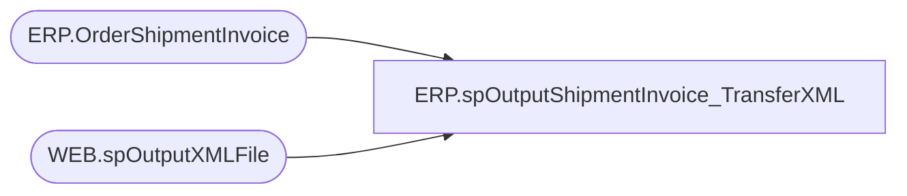

# ERP.spOutputShipmentInvoice_TransferXML

**Database:** IntegrationStaging  
**Server:** STL-SSIS-P-01  

## Architecture Diagram



## Table Dependencies

| Referenced Table |
|---|
| ERP.OrderShipmentInvoice |
| WEB.spOutputXMLFile |

## Stored Procedure Code

```sql
CREATE proc [ERP].[spOutputShipmentInvoice_TransferXML]
@DropFolder varchar(100)


as

set nocount on

-- =====================================================================================================
-- Name:  ERP.spOutputShipmentInvoice_TransferXML
--
-- Description:	Outputs Shipment Invoice XML to push to Dynamics365 ERP
--				 
-- Revision History
--		Name:			Date:			Comments:
--		Dan Tweedie		2017-12-14		Created proc
-- =====================================================================================================


declare 
	@dateString varchar(20),
	@file varchar(100),
	@sql varchar(100),
	@RowsToSend int

Select @RowsToSend = count(*) 
		from ERP.OrderShipmentInvoice with (nolock)
		where Transmitted = 0
		--and left(OrderRef, 2) = 'TR'
		and OrderRef like '%TR%'

if @RowsToSend > 0
begin
	select 
		@dateString = replace(replace(replace(replace(convert(varchar, getdate(), 121), '-', ''), ':', ''), '.', ''),' ', ''),
		@file = 'S' + @datestring + '.xml',
		@sql = 'select XMLData from IntegrationStaging.ERP.vwShipmentInvoice_TransferXML'

	exec WEB.spOutputXMLFile 
	@Query = @sql, 
	@FileLocation = @DropFolder, 
	@FileName = @file

	update ERP.OrderShipmentInvoice 
	set Transmitted = 1
	where Transmitted = 0
	--and left(OrderRef, 2) = 'TR'
	and OrderRef like '%TR%'
end
```

