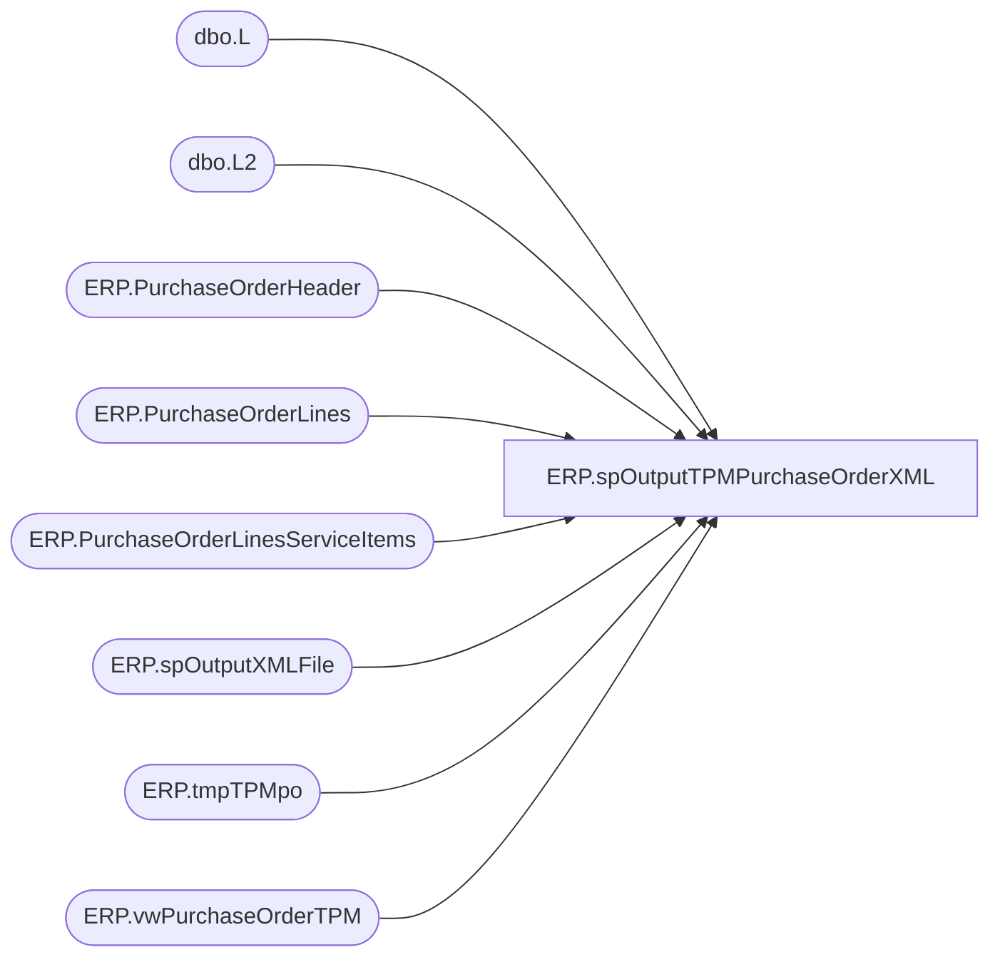

# ERP.spOutputTPMPurchaseOrderXML

**Database:** IntegrationStaging  
**Server:** STL-SSIS-P-01  

## Architecture Diagram



## Table Dependencies

| Referenced Table |
|---|
| dbo.L |
| dbo.L2 |
| ERP.PurchaseOrderHeader |
| ERP.PurchaseOrderLines |
| ERP.PurchaseOrderLinesServiceItems |
| ERP.spOutputXMLFile |
| ERP.tmpTPMpo |
| ERP.vwPurchaseOrderTPM |

## Stored Procedure Code

```sql
CREATE proc [ERP].[spOutputTPMPurchaseOrderXML]
@FileDrop varchar(1000)

as

-------------------------------------------------------------------------------------------------------
--	Dan Tweedie		-	2017-11-07	-	Created proc - Generates PO XML File for TPM integration (source is D365 ETL)
--	Tim Callahan	-	2021-09-29	-	Modified proc - Updates table ERP.PurchaseOrderLinesServiceItems, so we dont resend PO over and over
--														Added CTE to for load into ERP.TPMpo, we do not want service item ONLY POs flowing to TPM, only if they are a mix of supply and service items
--	Tim Callahan	 - 2021-09-30	-	Modified poc - Remarked out CTE that was added on 9/29 - Handling the filtering in the View itself now 
-------------------------------------------------------------------------------------------------------

set nocount on

TRUNCATE TABLE ERP.tmpTPMpo;

declare 
	@RowsToSend int,
	@count int,
	@concat varchar(100),
	@PO varchar(52);

--with EligiblePO as 
--	(
--		select po_no
--		from ERP.vwPurchaseOrderTPM
--		group by po_no 
--		having count (case when ItemId <> 'ServiceItem' then 1 end) > 0 -- Basically we want POs that have at least one non service item to export  
--	)

INSERT ERP.tmpTPMpo
select distinct po_no, NULL
from ERP.vwPurchaseOrderTPM
--where po_no in (select distinct po_no from EligiblePO)

IF (Object_ID('tempdb..#PO') IS NOT NULL) DROP TABLE #PO;
select s.PurchaseOrderNumber as PO, OrderLine
into #PO
from ERP.tmpTPMpo s
join ERP.vwPurchaseOrderTPM v on s.PurchaseOrderNumber = v.po_no

Select @count = count(*)
from ERP.tmpTPMpo


while @count > 0

BEGIN
	
	select @PO = max(PurchaseOrderNumber) from ERP.tmpTPMpo where exported is NULL
	
	update ERP.tmpTPMpo
	set exported = 0
	where PurchaseOrderNumber = @PO

	select @concat = concat(
									'PO_D365.',
									@PO,
									'.',
									datepart(yyyy, getdate()),
									datepart(mm, getdate()),
									datepart(dd, getdate()),
									datepart(hh, getdate()),
									datepart(mi, getdate()),
									datepart(ss, getdate()),
									datepart(ms, getdate()),
									'.xml'
								)

	exec ERP.spOutputXMLFile
		@Query = 'select XMLData from IntegrationStaging.ERP.vwPurchaseOrderTPM_XML', 
		@FileLocation = @FileDrop,--'\\stl-ssis-p-01\IntegrationStaging\ERP\Outbound\TPM\',
		@FileName = @concat


	update ERP.tmpTPMpo
	set exported = 1
	where PurchaseOrderNumber = @PO

	UPDATE ERP.PurchaseOrderHeader 
	set SendData = 0, Exported_TPM = getdate()
	where PurchaseOrderNumber = @PO

	UPDATE L 
	set L.SendData = 0, L.Exported_TPM = getdate()
	from ERP.PurchaseOrderLines L
	join #PO po on L.PurchaseOrderNumber = po.PO and L.LineNumber = po.OrderLine
	where PurchaseOrderNumber = @PO 

	UPDATE L2
	set L2.SendData = 0, L2.Exported_TPM = getdate()
	from ERP.PurchaseOrderLinesServiceItems L2
	join #PO po on L2.PurchaseOrderNumber = po.PO and L2.LineNumber = po.OrderLine
	where PurchaseOrderNumber = @PO 

	select @count = count(*)
	from ERP.tmpTPMpo 
	where exported is NULL

	if @count < 1
		break
	else
		continue
			
END
```

