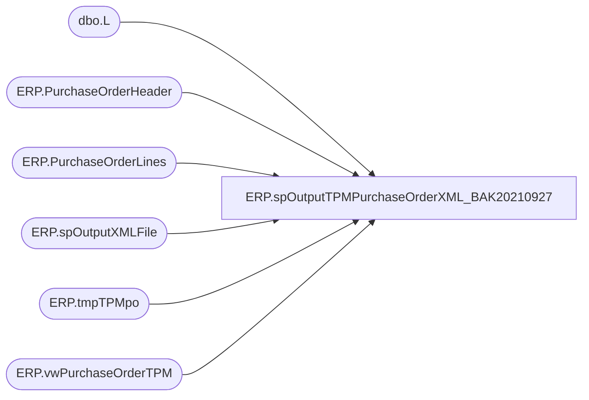

# ERP.spOutputTPMPurchaseOrderXML_BAK20210927

**Database:** IntegrationStaging  
**Server:** STL-SSIS-P-01  

## Architecture Diagram



## Table Dependencies

| Referenced Table |
|---|
| dbo.L |
| ERP.PurchaseOrderHeader |
| ERP.PurchaseOrderLines |
| ERP.spOutputXMLFile |
| ERP.tmpTPMpo |
| ERP.vwPurchaseOrderTPM |

## Stored Procedure Code

```sql
CREATE proc [ERP].[spOutputTPMPurchaseOrderXML_BAK20210927]
@FileDrop varchar(1000)

as

-------------------------------------------------------------------------------------------------------
--	Dan Tweedie	-	2017-11-07	-	Created proc - Generates PO XML File for TPM integration (source is D365 ETL)

-------------------------------------------------------------------------------------------------------

set nocount on

TRUNCATE TABLE ERP.tmpTPMpo


declare 
	@RowsToSend int,
	@count int,
	@concat varchar(100),
	@PO varchar(52)

INSERT ERP.tmpTPMpo
select distinct po_no, NULL
from ERP.vwPurchaseOrderTPM

IF (Object_ID('tempdb..#PO') IS NOT NULL) DROP TABLE #PO;
select s.PurchaseOrderNumber as PO, OrderLine
into #PO
from ERP.tmpTPMpo s
join ERP.vwPurchaseOrderTPM v on s.PurchaseOrderNumber = v.po_no

Select @count = count(*)
from ERP.tmpTPMpo


while @count > 0

BEGIN
	
	select @PO = max(PurchaseOrderNumber) from ERP.tmpTPMpo where exported is NULL
	
	update ERP.tmpTPMpo
	set exported = 0
	where PurchaseOrderNumber = @PO

	select @concat = concat(
									'PO_D365.',
									@PO,
									'.',
									datepart(yyyy, getdate()),
									datepart(mm, getdate()),
									datepart(dd, getdate()),
									datepart(hh, getdate()),
									datepart(mi, getdate()),
									datepart(ss, getdate()),
									datepart(ms, getdate()),
									'.xml'
								)

	exec ERP.spOutputXMLFile
		@Query = 'select XMLData from IntegrationStaging.ERP.vwPurchaseOrderTPM_XML', 
		@FileLocation = @FileDrop,--'\\stl-ssis-p-01\IntegrationStaging\ERP\Outbound\TPM\',
		@FileName = @concat


	update ERP.tmpTPMpo
	set exported = 1
	where PurchaseOrderNumber = @PO

	UPDATE ERP.PurchaseOrderHeader 
	set SendData = 0, Exported_TPM = getdate()
	where PurchaseOrderNumber = @PO

	UPDATE L 
	set L.SendData = 0, L.Exported_TPM = getdate()
	from ERP.PurchaseOrderLines L
	join #PO po on L.PurchaseOrderNumber = po.PO and L.LineNumber = po.OrderLine
	where PurchaseOrderNumber = @PO 

	select @count = count(*)
	from ERP.tmpTPMpo 
	where exported is NULL

	if @count < 1
		break
	else
		continue
			
END


ERP,spOutputTransferPalletReceipt,CREATE proc [ERP].[spOutputTransferPalletReceipt]
@DropFile varchar(5000)

as

---------------------------------------------------------------------------------------------------------------------------
--	Dan Tweedie	-	2018-06-13
---------------------------------------------------------------------------------------------------------------------------

set nocount on

IF (Object_ID('tempdb..#ReceiptData') IS NOT NULL) DROP TABLE #ReceiptData
;
with 
PalletReceipts as
	(
		select 
			PalletID,
			cast(ReceiptDate as date) ReceiptDate
		from erp.wcPalletReceipts
		where datediff(dd, ReceiptDate, getdate()) = 0
		and PalletID not in (select PalletID from erp.wcPalletReceiptsTransmitLog)
	),
InventoryMultiple as
	(
		select ProductNumber, InventoryMultiple, InventoryUnitSymbol
		from erp.vwItemMasterUOM
		where left(ProductNumber, 1) = 'S'
	),
ReceiptData as
	(
		select 
			concat(
				replace(p.ReceiptDate, '-', ''),
				w.WarehouseID,
				rank() over(order by w.WarehouseID, p.ReceiptDate) 
			  ) as ReceiptID,
			im.InventoryUnitSymbol as UnitOfMeasure,
			si.DlvMode,
			w.WarehouseID as InventLocationId,
			si.ItemId,
			si.OrderRef,
			sum(si.WhseUnitQty / im.InventoryMultiple) as Qty,
			convert(varchar, p.ReceiptDate, 101) as ReceiptDate
		from ERP.ShipmentInvoice si with (nolock)
		join InventoryMultiple im on si.ItemID = im.ProductNumber 
		join PalletReceipts p on si.PalletID = p.PalletID
		join erp.vwWarehouseIDToLocationCode w on si.ShipTo = w.LocationCode 
		group by si.DlvMode, w.WarehouseID, si.ItemId, si.OrderRef, p.ReceiptDate,im.InventoryUnitSymbol
	)
select *
into #ReceiptData
from ReceiptData

if (select count(*) from #ReceiptData) > 0

---
	insert erp.wcPalletReceiptsTransmitLog
	select PalletID, ReceiptDate, 1 as Transmitted
	from erp.wcPalletReceipts
	where PalletID not in (select PalletID from erp.wcPalletReceiptsTransmitLog)
---

begin

	declare @concat varchar(100)

	select @concat = concat(
										'TOReceipt_',
										datepart(yyyy, getdate()),
										datepart(mm, getdate()),
										datepart(dd, getdate()),
										datepart(hh, getdate()),
										datepart(mi, getdate()),
										datepart(ss, getdate()),
										datepart(ms, getdate()),
										'.xml'
									)

		exec ERP.spOutputXMLFile
			@Query = 'select XMLData from IntegrationStaging.ERP.vwTransferReceiptXML', 
			@FileLocation = @DropFile,  --'\\stl-ssis-p-01\IntegrationStaging\ERP\Outbound\D365\POReceipts',
			@FileName = @concat

		
end


ERP,spOutputWarehouseInvAdjXML,CREATE proc [ERP].[spOutputWarehouseInvAdjXML]
@FileDrop varchar(500),
@Entity nvarchar(4)

as

-----------------------------------------------------------------------------------------------------------------------------
--Dan Tweedie	-	2018-01-24	- Created proc - Outputs Item Master XML file for WM - Only Contains Suppies from Dynamics365
-----------------------------------------------------------------------------------------------------------------------------

set nocount on

truncate table ERP.tmpInvAdj 
;
with 
InventoryMultiple as
	(
		select uom.ProductNumber, uom.InventoryMultiple, uom.entity 
		from ERP.vwItemMasterUOM uom 
		join WMS.ItemMaster im with (nolock) on uom.ProductNumber=im.ItemNumber and uom.Entity=im.Entity
		where im.NecessaryProductionWorkingTimeSchedulingPropertyId = 'Supplies'
		--UNION
		--select ItemID as ProductNumber, 1, entity 
		--from ERP.vwMerchandiseInventoryAdjustment 
	),
InvAdj as
	(
		select 
			concat(
				replace(a.AdjustmentDate, '-', ''),
				a.WarehouseID,
				rank() over(order by a.WarehouseID, a.AdjustmentDate) 
			  )
			as JournalNumber,
			a.AdjustmentDate,
			a.ItemID,
			a.WarehouseID,
			SUM(a.Qty / im.InventoryMultiple) Qty
		from erp.WarehouseInventoryAdjustment a
		join InventoryMultiple im on a.ItemID = im.ProductNumber and a.entity = im.entity 
		where Exported = 0
		and a.Entity = @Entity 
		group by 
			a.ItemID,
			a.WarehouseID,
			a.AdjustmentDate 
	),
LineNumbers as
	(
		select 
			JournalNumber,
			AdjustmentDate,
			ItemID,
			WarehouseID,
			Qty,
			rank() over(partition by JournalNumber order by AdjustmentDate, WarehouseID, ItemID) as LineNumber
		from InvAdj
		--where JournalNumber in (select JournalNumber from erp.tmpInvAdj where exported = 0) --controlled via loop, ensures only working on one Journal at a time
		where Qty <> 0 --excludes qty errors due to inventory multiple conversion issue
	)
insert ERP.tmpInvAdj
select distinct JournalNumber, NULL as exported
from LineNumbers 

if (select count(*) from ERP.tmpInvAdj) > 0

BEGIN

		declare 
			@RowsToSend int,
			@count int,
			@concat varchar(100),
			@QueryString varchar(500),
			@JournalNumber varchar(52)


		select @count = count(*) 
		from ERP.tmpInvAdj

		while @count > 0

		begin

	
			select @JournalNumber = max(JournalNumber) from ERP.tmpInvAdj where exported is null

			update ERP.tmpInvAdj
			set exported = 0
			where JournalNumber = @JournalNumber

			select @concat = concat(
									'InventoryAdjustmentJournals.',
									datepart(yyyy, getdate()),
									datepart(mm, getdate()),
									datepart(dd, getdate()),
									datepart(hh, getdate()),
									datepart(mi, getdate()),
									datepart(ss, getdate()),
									datepart(ms, getdate()),
									'.xml'
									)

 
			select @QueryString = 'set nocount on exec IntegrationStaging.ERP.spWarehouseInventoryAdjustmentXML_ByEntity ' + @entity

			exec ERP.spOutputXMLFile
				@Query = @QueryString,
				@FileLocation = @FileDrop,
				@FileName = @concat

			update ERP.tmpInvAdj 
			set exported = 1
			where JournalNumber = @JournalNumber

			select @count = count(*)
			from ERP.tmpInvAdj 
			where exported is null

			if @count < 1
				break 
			else 
				continue

		end 

		update erp.WarehouseInventoryAdjustment 
		set Exported = 1,
		ExportDate = getdate()
		where exported = 0
		and entity = @entity 
END
```

