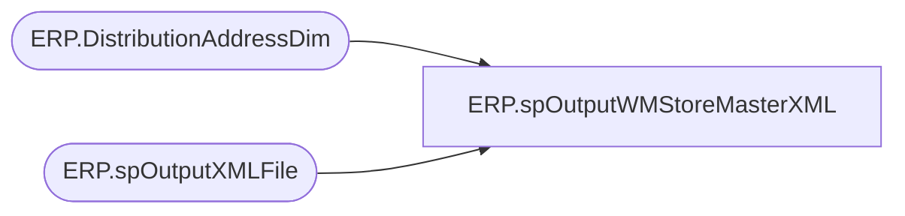

# ERP.spOutputWMStoreMasterXML

**Database:** IntegrationStaging  
**Server:** STL-SSIS-P-01  

## Architecture Diagram



## Table Dependencies

| Referenced Table |
|---|
| ERP.DistributionAddressDim |
| ERP.spOutputXMLFile |

## Stored Procedure Code

```sql
CREATE proc [ERP].[spOutputWMStoreMasterXML]
@DropFolder varchar(500)

as

-- =====================================================================================================
-- Name:  ERP.spOutputWMStoreMasterXML
--
-- Description:	Outputs StoreMaster XML to push to WM
--				 
-- Revision History
--		Name:			Date:			Comments:
--		Dan Tweedie		2017-08-11		Created proc
-- =====================================================================================================

declare 
	@RowsToSend int

Select 
	@RowsToSend = count(*)
from ERP.DistributionAddressDim

if @RowsToSend > 0

	begin

		exec ERP.spOutputXMLFile
		 @Query = 'select XMLData from IntegrationStaging.ERP.vwWmStoreMasterXML', 
		 @FileLocation = @DropFolder,
		 @FileName = 'ISMstoremasterbridge.xml'

	end
```

