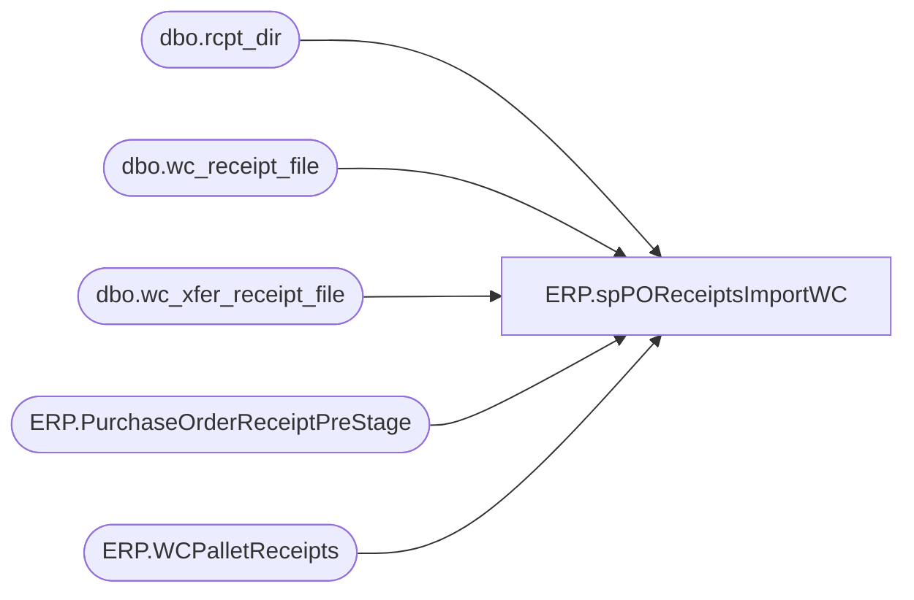

# ERP.spPOReceiptsImportWC

**Database:** IntegrationStaging  
**Server:** STL-SSIS-P-01  

## Architecture Diagram



## Table Dependencies

| Referenced Table |
|---|
| dbo.rcpt_dir |
| dbo.wc_receipt_file |
| dbo.wc_xfer_receipt_file |
| ERP.PurchaseOrderReceiptPreStage |
| ERP.WCPalletReceipts |

## Stored Procedure Code

```sql
CREATE proc [ERP].[spPOReceiptsImportWC]
as

-- =====================================================================================================
-- Name: ERP.spPOReceiptsImportWC
--
-- Description:	Produces PO Receipt file & Carton Batch Receiving file, based on data provided in file from West Coast DC.
--				This proc will import a file from the west coast DC, check for existence of po receipts and/or shipment receipts,
--				execute procs to produce po receipt file and/or shipment receipt file, drop files on pipeline server.
--
-- Input:	*.dat file located at \\stl-ssis-p-01\IntegrationStaging\3PW\WC_Distro\RECEIPTS\ -- This file will be uploaded by the West Coast DC.
--
-- Dependencies: spMerchandising_Select_wcPOreceipts
--				
--
-- Revision History
--		Name:			Date:			Comments:
--		Lizzy Timm		03/03/2025		Created proc. based on bedrockdb02.me_01.spMerchandising_Report_wcReceipts
-- =====================================================================================================


set nocount on

if (object_id('IntegrationStaging..rcpt_dir') is not null) drop table rcpt_dir
create table rcpt_dir
(output varchar(100))

insert rcpt_dir
EXEC master..xp_cmdshell 'dir \\stl-ssis-p-01\IntegrationStaging\3PW\WC_Distro\RECEIPTS\*.dat /B'

if (select count(*) from rcpt_dir where output like '%.dat%') > 0

BEGIN
		-------------------------------------------------------------------------------------------------------------------------------------
		--This process handles transfer receipt files and po receipt files, there is special handling for each.
		--the sql agent job (that executes this procedure) already polled the directory into rcpt_dir so we use this date to manage the handling.

		--Handle the xfer receipt file (if any)
		if (select count(*) from rcpt_dir where output like 'rc_babw_xfer%.dat') > 0
			begin
					--rename file
					EXEC master..xp_cmdshell 'ren \\stl-ssis-p-01\IntegrationStaging\3PW\WC_Distro\RECEIPTS\rc_babw_xfer*.dat xfer_receipt.dat'
					--import file into work table
					if (object_id('IntegrationStaging..wc_xfer_receipt_file') is not null) drop table wc_xfer_receipt_file
					create table wc_xfer_receipt_file
					(dateage varchar(10),
					pallet varchar(20))

					bulk insert wc_xfer_receipt_file
					from '\\stl-ssis-p-01\IntegrationStaging\3PW\WC_Distro\RECEIPTS\xfer_receipt.dat'
					with 
					(
					FIELDTERMINATOR = '\t',
					ROWTERMINATOR = '\n'
					)

					----STAGE DATA FOR DYNAMICS
					if (select count(*) from wc_xfer_receipt_file) > 0
					begin
						insert ERP.WCPalletReceipts
						select dateage, pallet 
						from wc_xfer_receipt_file
					end

					

					--rename file with timestamp
					EXEC master..xp_cmdshell 'ren \\stl-ssis-p-01\IntegrationStaging\3PW\WC_Distro\RECEIPTS\xfer_receipt.dat xfer_receipt%date:~4,2%%date:~7,2%%date:~10%.dat'
					--move file to DONE folder
					EXEC master..xp_cmdshell 'move \\stl-ssis-p-01\IntegrationStaging\3PW\WC_Distro\RECEIPTS\xfer_receipt*.dat \\stl-ssis-p-01\IntegrationStaging\3PW\WC_Distro\RECEIPTS\done'			
			end
		----------------------------------------------------------------------------------------------------------------------------------------------
		--Handle the po receipt file (if any)
		if (select count(*) from rcpt_dir where output like 'rc_babw%.dat' and output not like 'rc_babw_xfer%.dat') > 0
			begin
					--rename file
					EXEC master..xp_cmdshell 'ren \\stl-ssis-p-01\IntegrationStaging\3PW\WC_Distro\RECEIPTS\rc_babw*.dat receipt.dat'
					--import file into work table
					if (object_id('IntegrationStaging..wc_receipt_file') is not null) drop table wc_receipt_file
					create table wc_receipt_file
					(receipt_date varchar(8),
					po_nbr varchar(52),
					ref_nbr varchar(10),
					style varchar(6),
					qty_received int,
					qty_damaged int)

					bulk insert wc_receipt_file
					from '\\stl-ssis-p-01\IntegrationStaging\3PW\WC_Distro\RECEIPTS\receipt.dat'
					with 
					(
					FIELDTERMINATOR = ',',
					ROWTERMINATOR = '\n'
					)

					--------------------------------------------------------
					--Added 2017-11-21
						if (select count(*) from wc_receipt_file) > 0
							begin
								insert ERP.PurchaseOrderReceiptPreStage 
								select 
									po_nbr as PurchaseOrderNumber,
									'9960' as ReceiptLocation,
									cast(receipt_date as date) as ReceiptDate, 
									style as ItemID,
									sum(qty_received) as Qty,
									getdate(),
									'1100' as Entity
								from wc_receipt_file
								group by po_nbr, cast(receipt_date as date), style
							end
					
					--rename file with timestamp
					EXEC master..xp_cmdshell 'ren \\stl-ssis-p-01\IntegrationStaging\3PW\WC_Distro\RECEIPTS\receipt.dat po_receipt%date:~4,2%%date:~7,2%%date:~10%.dat'
					--move file to DONE folder
					EXEC master..xp_cmdshell 'move \\stl-ssis-p-01\IntegrationStaging\3PW\WC_Distro\RECEIPTS\po_receipt*.dat \\kermode\FileRepository\MERCHANDISING\WC_Distro\RECEIPTS\done'
				END
END
```

