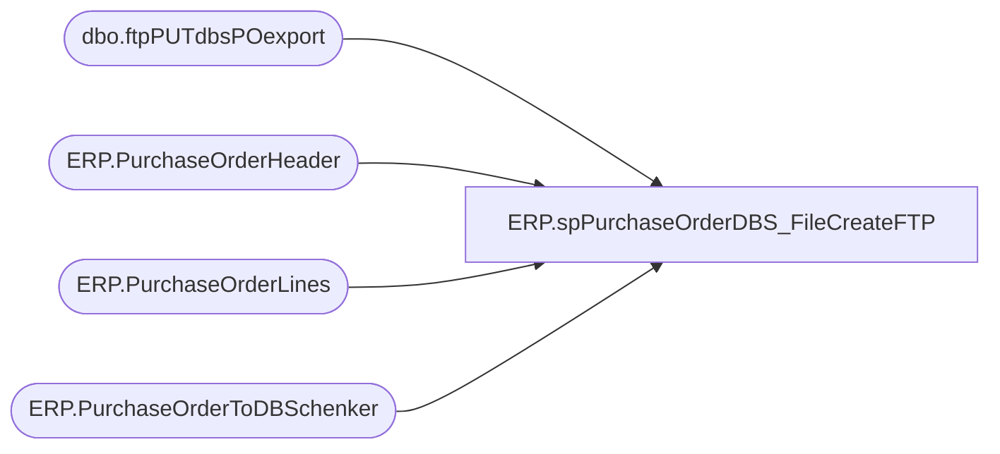

# ERP.spPurchaseOrderDBS_FileCreateFTP

**Database:** IntegrationStaging  
**Server:** STL-SSIS-P-01  

## Architecture Diagram



## Table Dependencies

| Referenced Table |
|---|
| dbo.ftpPUTdbsPOexport |
| ERP.PurchaseOrderHeader |
| ERP.PurchaseOrderLines |
| ERP.PurchaseOrderToDBSchenker |

## Stored Procedure Code

```sql
CREATE proc [ERP].[spPurchaseOrderDBS_FileCreateFTP]

		@ERP_DBSFileDropFolder varchar(100),
		@ERP_IntegrationStaging_ServerName varchar(20),
		@FTPfile_locationDBS varchar(1000),
		@FTPlog_locationDBS varchar(100),
		@SMTP_sp_send_dbmail varchar(1000),
		@SMTP_DBSfileattachments varchar(200),
		@SMTP_Subject varchar(200),
		@ERP_DBSfilemove varchar(300)

as 

set nocount on 

-- =====================================================================================================
-- Name: ERP.spPurchaseOrderDBS_FileCreateFTP
--
-- Description:	Output and upload PO file for DB Schenker FTP server
--
--
-- Revision History
--		Name:			Date:			Comments:
--		Lizzy Timm		2024-03-14		Created Proc to run at end of SSIS to output and upload PO file for DB Schenker FTP server; based on requirements in FDD PURCHASE ORDER EXPORT DYNAMICS TO DB SCHENKER; Jira BIB-776	
-- =====================================================================================================

declare @query varchar(2000),
		@date varchar(52),
		@file_name varchar(100),
		@username varchar(20),
		@password varchar(20),
		@database varchar(20),
		@bcp varchar(2000)

-- --Uncomment for testing
--DECLARE @ERP_DBSFileDropFolder varchar(100), @ERP_IntegrationStaging_ServerName varchar(20)
--set @ERP_IntegrationStaging_ServerName = 'stl-ssis-t-01'
--set @ERP_DBSFileDropFolder = '\\kermode\FileRepository\MERCHANDISING\APAC\'

set @query = 'SELECT ProjID ,PurchaseOrder ,PurposeCode ,Division ,Department ,Buyer ,SupplierName ,SupplierCode ,SupplierAddress1 ,SupplierAddress2 ,SupplierAddress3 ,SupplierAddress4 ,UNLOCCodeValue ,ScheduleKCode1 ,SupplierCity ,SupplierState ,SupplierCountry ,SupplierPostal ,OrderPaymentTerms ,FreightPaymentTerms ,OrderDate ,PORef1 ,PORef2 ,PORef3 ,ShipToName ,ShipToCode ,ShipToEmail ,ShipToAddress1 ,ShipToAddress2 ,ShipToAddress3 ,ShiptoAddress4 ,UNLOCCode1 ,ScheduleDorKCode ,ShipToCountry ,ShipToCity ,ShipToState ,ShipToZipCode ,FactoryName ,FactoryCode ,FactoryAddress1 ,FactoryAddress2 ,FactoryAddress3 ,FactoryAddress4 ,UNLOCCode2 ,ScheduleKCode2 ,FactoryCity ,FactoryState ,FactoryCountry ,FactoryPostal ,ShipWindowStart ,ShipWindowEnd ,ShipWindowCancelDate ,productdetailid ,ProductDetailProductCode ,ProductDetailProductDesc ,ProductDetailHTS ,ProductDetailOrderQuantity ,QuantityUOM ,UnitCost ,Mode ,ProductDetailMasterPackQty ,ProductDetailNoOfPackages ,ProductDetailInnerPackQty ,ProductDetailTotalVolume ,ProductDetailTotalWeight ,ProductDetailProductPriority ,ProductDetailManufacturerID ,ProductDetailProductRef ,ProductDetailProductRef2 ,ProductDetailProductRef3 ,ProductDetailProductRef4 ,ProductDetailProductRef5 ,OriginCountry ,OriginCity ,FinalDestination ,POETA ,ProductDate1 ,ProductDate2 ,Consolidator ,Broker ,Currency ,SKUNumber ,Size ,Color ,LineEndIndicator FROM IntegrationStaging.ERP.PurchaseOrderToDBSchenker WHERE SendData = 1 AND ProductDetailHTS <> '''' and origincountry <> '''' and origincity <> '''' ORDER BY PurchaseOrder, ProductDetailProductCode, ProductDetailID, ShipWindowStart '
select @date = convert(varchar, datepart(yyyy, getdate())) + convert(varchar, datepart(mm, getdate())) + convert(varchar, datepart(dd, getdate())) + convert(varchar, datepart(hh, getdate())) + convert(varchar, datepart(mi, getdate())) + convert(varchar, datepart(ss, getdate())) + convert(varchar, datepart(ms, getdate()))
set @file_name = 'BABBQPO' + @date --NO LONGER USING FILE EXTENSION, INSTEAD ADDING THAT IN THE BCP SCRIPT AND AGAIN DURING THE FTP RENAME
set @database = 'IntegrationStaging'
set @bcp = 'bcp "' + @query + '" queryout "' + @ERP_DBSFileDropFolder + @file_name + '.tmp' + '"  -T -c -S' + '"' + @ERP_IntegrationStaging_ServerName + '"'

EXEC MASTER..xp_cmdshell @bcp
----FTP text file to DB Schenker server
--------------
		--declare and set ftp variables 
------DYNAMIC FTP SCRIPT TO USE SPECIFIC FILENAMES (ALLOWS FOR FILE UPLOADED, THEN RENAMED)
---- FTP part commented out for test
			
declare @FTPquery varchar(1000),
		--@FTPfile_locationDBS varchar(1000),
		@FTPfile_name varchar(52),
		@FTPbcp varchar(1000)

IF (Object_ID('tempdb..##ftpFile') IS NOT NULL) DROP TABLE ##ftpFile
create table ##ftpFile
(ftpString varchar(4000))

	insert ##ftpFile
	select 'verbose'
	insert ##ftpFile
	select 'open ftp.sword.schenker.com'
	insert ##ftpFile
	select 'babw'
	insert ##ftpFile
	select 'B3arbu1ld'
	insert ##ftpFile
	select 'prompt n'
	insert ##ftpFile
	select 'cd from_babw'
	insert ##ftpFile
	select 'mput '+ @ERP_DBSFileDropFolder + @file_name + '.tmp'
	insert ##ftpFile
	select 'rename ' + @file_name + '.tmp ' + @file_name + '.TXT'
	insert ##ftpFile
	select 'quit'

-- --Uncomment for testing
-- DECLARE @FTPfile_locationDBS varchar(1000)
--set @FTPfile_locationDBS = '\\kermode\FileRepository\MERCHANDISING\APAC\FTP\SCRIPTS\'

set @FTPquery = 'set nocount on select * from ##ftpFile'
set @FTPfile_name = 'ftpPUTnew.TXT'
set @FTPbcp = 'bcp "' + @FTPquery + '" queryout "' + @FTPfile_locationDBS + @FTPfile_name + '"  -T -c -S"' + @ERP_IntegrationStaging_ServerName + '"'

EXEC MASTER..xp_cmdshell @FTPbcp
			
-----ftp upload
declare @ftpPUT varchar(1000),
				@Log_query varchar(1000),
				@Log_filename varchar(100),
				--@FTPlog_locationDBS varchar(100),
				@Log_bcp varchar(1000),
				@body varchar(4000),
				--@SMTP_sp_send_dbmail varchar(1000),
				@SMTP_bcc varchar(100),
				@SMTP_Recip varchar(100)--,
				--@SMTP_Subject varchar(200),
				--@SMTP_DBSfileattachments varchar(200),
				--@ERP_DBSfilemove varchar(300)

		set @ftpPUT = 'ftp -d -s:' + @FTPfile_locationDBS + @FTPfile_name
		

		-- --Uncomment for testing
		--DECLARE @FTPlog_locationDBS varchar(100), 		@SMTP_sp_send_dbmail varchar(1000),		@SMTP_DBSfileattachments varchar(200),		@SMTP_Subject varchar(200),		@ERP_DBSfilemove varchar(300)
		--set @FTPlog_locationDBS = '\\kermode\FileRepository\MERCHANDISING\APAC\FTP\LOGS\'
		--set @SMTP_sp_send_dbmail = 'msdb.dbo.sp_send_dbmail'
		--set @SMTP_bcc = 'LizzyT@buildabear.com'
		--set @SMTP_Recip = 'EntSysSupport@buildabear.com'
		--set @SMTP_Subject = '**TEST** FTP Failure: PO Export from BAB to DB Schenker'
		--set @SMTP_DBSfileattachments = '\\kermode\FileRepository\MERCHANDISING\APAC\FTP\LOGS\ftpPUTLog.txt'
		--set @ERP_DBSfilemove = 'move \\kermode\FileRepository\MERCHANDISING\APAC\* \\kermode\FileRepository\MERCHANDISING\APAC\done'							


--create temp tables for ftp logs
IF (Object_ID('IntegrationStaging..ftpPUTdbsPOexport') IS NOT NULL) DROP TABLE ftpPUTdbsPOexport
create table ftpPUTdbsPOexport
(ftpLog varchar(4000))

--execute sql/ftp
----connect to ftp server, if connection unsuccessful, send email
insert ftpPUTdbsPOexport EXEC MASTER..xp_cmdshell @ftpPUT
if (select count(*) from ftpPUTdbsPOexport where ftplog like '%Transfer complete%') < 1
	begin
		set @Log_query = 'select * from IntegrationStaging.dbo.ftpPUTdbsPOexport'
		set @Log_filename = 'ftpPUTLog.txt'		
		set @Log_bcp = 'bcp "' + @Log_query + '" queryout "' + @FTPlog_locationDBS + @Log_filename + '" -t, -T -c -S"' + @ERP_IntegrationStaging_ServerName + '"'

		EXEC MASTER..xp_cmdshell @Log_bcp
															
		set @body =	'An attempt to FTP a PO Export file from BAB to DB Schenker failed.' 
					+ char(10) + char(13) + 
					'See the attached log for details.'
					+ char(10) + char(13) + 
					+ char(10) + char(13) + 
					'This process is managed by the agent job ERP_PurchaseOrderFromD365 on ' + @ERP_IntegrationStaging_ServerName
							
		EXEC @SMTP_sp_send_dbmail
		@profile_name = 'BIAdmin',
		@Recipients = 'EntSysSupport@buildabear.com',
		@blind_copy_recipients = 'LizzyT@buildabear.com',
		@subject = @SMTP_Subject,
		@body = @body,
		@file_attachments = @SMTP_DBSfileattachments,
		@importance = 'HIGH'
	end
else
	begin
	
		EXEC MASTER..xp_cmdshell @ERP_DBSfilemove

		IF (Object_ID('tempdb..##PO_no') IS NOT NULL) DROP TABLE ##PO_no
		SELECT DISTINCT PurchaseOrder 
		  INTO ##PO_no
		  FROM IntegrationStaging.ERP.PurchaseOrderToDBSchenker 
		  WHERE SendData = 1 
			AND ProductDetailHTS <> '''' 
			AND origincountry <> '''' 
			AND origincity <> ''''

		UPDATE IntegrationStaging.ERP.PurchaseOrderHeader 
		  SET SendData = 0
		--	, Exported_DBS = getdate() 
		  WHERE PurchaseOrderNumber IN (SELECT DISTINCT PurchaseOrder FROM ##PO_no)

		UPDATE IntegrationStaging.ERP.PurchaseOrderLines 
		  SET SendData = 0
		--	, Exported_DBS = getdate() 
		  WHERE PurchaseOrderNumber IN (SELECT DISTINCT PurchaseOrder FROM ##PO_no)

		UPDATE IntegrationStaging.ERP.PurchaseOrderToDBSchenker 
		  SET SendData = 0 
		  WHERE PurchaseOrder IN (SELECT DISTINCT PurchaseOrder FROM ##PO_no)
	end

	
ERP,spPurchaseOrderFactoryAddress,CREATE proc [ERP].[spPurchaseOrderFactoryAddress]

as

set nocount on


if (select count(*) 
		from erp.PurchaseOrderHeaderStage h 
		join ERP.PurchaseOrderLinesStage l with (nolock) 
			on h.PurchaseOrderNumber = l.PurchaseOrderNumber
			and h.ConfirmationNumber = l.ConfirmationNumber
			and h.Entity = l.Entity
			and h.Iscurrent = 1
			and l.IsCurrent = 1
		join ERP.VendorMaster vm with (nolock) on cast(h.ShipFromID as varchar) = vm.VendorAccountNumber and h.Entity = vm.Entity
		join ERP.FactoryAddress fa with (nolock) on substring(vm.OrganizationPhoneticName, charindex('-',vm.OrganizationPhoneticName)+1,10)  = fa.FactoryCode  
	) > 0

begin

	update l
		set l.FactoryCode=fa.FactoryCode, 
		l.FactoryName=fa.FactoryName,
		l.FactoryPort=fa.port,
		l.FactoryAddress=fa.address,
		l.FactoryCity=fa.city,
		l.FactoryProvince=fa.province,
		l.COOCode=fa.country
	from erp.PurchaseOrderHeaderStage h 
	join ERP.PurchaseOrderLinesStage l with (nolock) 
		on h.PurchaseOrderNumber = l.PurchaseOrderNumber
		and h.ConfirmationNumber = l.ConfirmationNumber
		and h.Entity = l.Entity
		and h.Iscurrent = 1
		and l.IsCurrent = 1
	join ERP.VendorMaster vm with (nolock) on cast(h.ShipFromID as varchar) = vm.VendorAccountNumber and h.Entity = vm.Entity
	join ERP.FactoryAddress fa with (nolock) on substring(vm.OrganizationPhoneticName, charindex('-',vm.OrganizationPhoneticName)+1,10)  = fa.FactoryCode 

end
```

