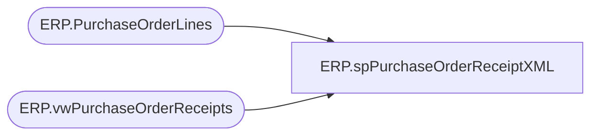

# ERP.spPurchaseOrderReceiptXML

**Database:** IntegrationStaging  
**Server:** STL-SSIS-P-01  

## Architecture Diagram



## Table Dependencies

| Referenced Table |
|---|
| ERP.PurchaseOrderLines |
| ERP.vwPurchaseOrderReceipts |

## Stored Procedure Code

```sql
CREATE proc [ERP].[spPurchaseOrderReceiptXML]
@Entity varchar(10)

as
set nocount on;
---------------------------------------------------------------------
-- Dan Tweedie	-	2017-11-15	-	Created view, work in progress --
--									Need to update to pull data from Fact table, not Stage, and to only capture NEW receipts
-- Tim Callahan	-	2023-01-23	-	Updated to accomodate changes as related to JIRA BIB-464
---------------------------------------------------------------------

with 
Receipts as
	(
		select *
		from ERP.vwPurchaseOrderReceipts
		where Entity = @Entity 
	),
XMLStage (XML) as
	(
		select 
			concat(
			datepart(yyyy, getdate()), 
			datepart(mm, getdate()),
			datepart(dd, getdate()),
			datepart(hh, getdate()),
			datepart(mi, getdate()),
			datepart(ss, getdate()),
			datepart(ms, getdate()),
			cast(DENSE_RANK() OVER (ORDER BY r.ReceiptLocation, r.ITEMID, r.PurchaseOrderNumber, r.RECEIPTDATE, r.BOL) as varchar)
			) as [@ReceiptId],
			r.ItemID as [@ItemId],
			r.PurchaseOrderNumber as [@PurchId],
			r.ReceiptLocation as [@InventLocationId],
			'NO' as [@CloseForReceipt],
			'Imported' as [@ImportStatus], 
			concat(
			datepart(yyyy, getdate()), 
			datepart(mm, getdate()),
			datepart(dd, getdate()),
			datepart(hh, getdate()),
			datepart(mi, getdate()),
			datepart(ss, getdate()),
			datepart(ms, getdate()),
			cast(DENSE_RANK() OVER (ORDER BY r.ReceiptLocation, r.ITEMID, r.PurchaseOrderNumber, r.RECEIPTDATE, r.BOL) as varchar)
			) as [@ORIGRECEIPTID],
			r.Qty as [@Qty],
			r.ReceiptDate as [@ReceiptDate],
			r.UnitOfMeasure as [@UnitOfMeasure]
		from Receipts r 
		--join ERP.PurchaseOrderLines l on r.ItemID = l.ItemID
		where exists (select ItemID from ERP.PurchaseOrderLines l with (nolock) where r.ItemID = l.ItemID)
		order by r.ReceiptLocation, r.PurchaseOrderNumber, r.Qty
		--for xml path('RSMWMSPurchaseReceiptEntity'), root('Document'), Type Replaced 12/1/2022
		for xml path('rsmBABWMSPOReceiptEntity'), root('Document'), Type
	)
select XML as XMLData
from XMLStage
```

