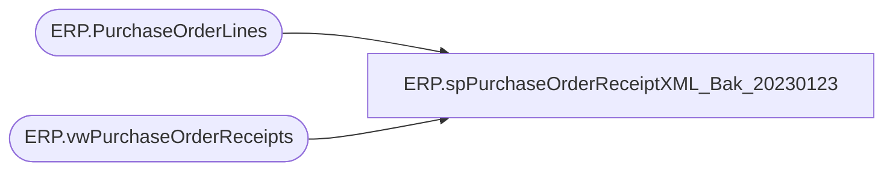

# ERP.spPurchaseOrderReceiptXML_Bak_20230123

**Database:** IntegrationStaging  
**Server:** STL-SSIS-P-01  

## Architecture Diagram



## Table Dependencies

| Referenced Table |
|---|
| ERP.PurchaseOrderLines |
| ERP.vwPurchaseOrderReceipts |

## Stored Procedure Code

```sql
CREATE proc [ERP].[spPurchaseOrderReceiptXML_Bak_20230123]
@Entity varchar(10)

as
set nocount on;
---------------------------------------------------------------------
-- Dan Tweedie	-	2017-11-15	-	Created view, work in progress --
--									Need to update to pull data from Fact table, not Stage, and to only capture NEW receipts
---------------------------------------------------------------------

with 
Receipts as
	(
		select *
		from ERP.vwPurchaseOrderReceipts
		where Entity = @Entity 
	),
XMLStage (XML) as
	(
		select 
			'NO' as 'CloseForReceipt',
			r.ReceiptLocation as 'InventLocationId',
			r.ItemID as 'ItemId',
			--'' as 'LineNum', NULL,
			r.PurchaseOrderNumber as 'PurchId',
			r.Qty,
			r.ReceiptDate,
			concat(
			datepart(yyyy, getdate()), 
			datepart(mm, getdate()),
			datepart(dd, getdate()),
			datepart(hh, getdate()),
			datepart(mi, getdate()),
			datepart(ss, getdate()),
			datepart(ms, getdate()),
			cast(DENSE_RANK() OVER (ORDER BY r.ReceiptLocation, r.ITEMID, r.PurchaseOrderNumber, r.RECEIPTDATE, r.BOL) as varchar)
			) as ReceiptId,
			r.UnitOfMeasure
		from Receipts r 
		--join ERP.PurchaseOrderLines l on r.ItemID = l.ItemID
		where exists (select ItemID from ERP.PurchaseOrderLines l with (nolock) where r.ItemID = l.ItemID)
		order by r.ReceiptLocation, r.PurchaseOrderNumber, r.Qty
		for xml path('RSMWMSPurchaseReceiptEntity'), root('Document'), Type
	)
select XML as XMLData
from XMLStage


ERP,spPurchaseOrderToDBSchenkerExportUpload,CREATE proc [ERP].[spPurchaseOrderToDBSchenkerExportUpload]

as 

set nocount on 

------------------------------------------------------------------------------------------------------------------------------
--Dan Tweedie -- 2018-01-08 - Created Proc to run at end of SSIS to output and upload PO file for DB Schenker FTP server
------------------------------------------------------------------------------------------------------------------------------

declare @Rows int

select @Rows = count(*) from ERP.PurchaseOrderToDBSchenker where SendData = 1

if @Rows > 0

begin
	
	IF (Object_ID('IntegrationStaging.ERP.tmpDBSchenkerPOStage') IS NOT NULL) DROP TABLE ERP.tmpDBSchenkerPOStage

	select 
		ProjID,	PurchaseOrder,PurposeCode,Division,Department,Buyer,SupplierName,SupplierCode, SupplierAddress1,SupplierAddress2,SupplierAddress3,SupplierAddress4,
		UNLOCCodeValue,ScheduleKCode1,SupplierCity,SupplierState,SupplierCountry,SupplierPostal,OrderPaymentTerms,FreightPaymentTerms,OrderDate,PORef1,PORef2,PORef3,
		ShipToName,ShipToCode,ShipToEmail,ShipToAddress1,ShipToAddress2,ShipToAddress3,ShiptoAddress4,UNLOCCode1,ScheduleDorKCode,ShipToCountry,ShipToCity,ShipToState,
		ShipToZipCode,FactoryName,FactoryCode, FactoryAddress1,FactoryAddress2,FactoryAddress3,FactoryAddress4, UNLOCCode2,ScheduleKCode2,FactoryCity,FactoryState,FactoryCountry,
		FactoryPostal,ShipWindowStart,ShipWindowEnd,ShipWindowCancelDate,ProductDetailID,ProductDetailProductCode,ProductDetailProductDesc,ProductDetailHTS,ProductDetailOrderQuantity,
		QuantityUOM,UnitCost,Mode, ProductDetailMasterPackQty,ProductDetailNoOfPackages,ProductDetailInnerPackQty,ProductDetailTotalVolume,ProductDetailTotalWeight,ProductDetailProductPriority,
		ProductDetailManufacturerID,ProductDetailProductRef,ProductDetailProductRef2,ProductDetailProductRef3,ProductDetailProductRef4,ProductDetailProductRef5,OriginCountry, 
		OriginCity, FinalDestination,POETA,ProductDate1,ProductDate2,Consolidator,Broker,Currency,SKUNumber,Size,Color,LineEndIndicator	
	into ERP.tmpDBSchenkerPOStage
	from ERP.PurchaseOrderToDBSchenker
	where SendData = 1

	update ERP.PurchaseOrderToDBSchenker
	set SendData = 0
	where SendData = 1
end


 if (select count(*) from ERP.tmpDBSchenkerPOStage where OriginCountry = 'CN' ) > 0 

	Begin

		update ERP.tmpDBSchenkerPOStage
		set ProductDate1 = convert(VarChar(30), dateadd(d,-7,ProductDate1), 101)
		where OriginCountry = 'CN'

 
	End 

	----Export data into text file
	----Only proceed if there is data from query above
	---export data to file
	if (select count(*) from ERP.tmpDBSchenkerPOStage where ProductDetailHTS <> '' and origincountry <> '' and origincity <> '') > 0 
	begin

			
			declare @query varchar(1000),
					@date varchar(52),
					@file_name varchar(100),
					@file_location varchar(100),
					@server varchar(20),
					@username varchar(20),
					@password varchar(20),
					@database varchar(20),
					@bcp varchar(1000)

			set @query = 'select distinct * from ERP.tmpDBSchenkerPOStage where ProductDetailHTS <> '''' and origincountry <> '''' and origincity <> '''' order by PurchaseOrder, ProductDetailProductCode, ProductDetailID, ShipWindowStart '
			select @date = convert(varchar, datepart(yyyy, getdate())) + convert(varchar, datepart(mm, getdate())) + convert(varchar, datepart(dd, getdate())) + convert(varchar, datepart(hh, getdate())) + convert(varchar, datepart(mi, getdate())) + convert(varchar, datepart(ss, getdate())) + convert(varchar, datepart(ms, getdate()))
			set @file_location = '\\stl-ssis-p-01\IntegrationStaging\Dynamics\WarehouseInterfaces\PurchaseOrder\DBSchenker\'
			set @file_name = 'BABBQPO' + @date --NO LONGER USING FILE EXTENSION, INSTEAD ADDING THAT IN THE BCP SCRIPT AND AGAIN DURING THE FTP RENAME
			set @server = '[stl-ssis-p-01]'
			set @database = 'IntegrationStaging'
			set @bcp = 'bcp "' + @query + '" queryout "' + @file_location + @file_name + '.tmp' + '"  -T -c -S' + @server 

			exec master..xp_cmdshell @bcp

			----FTP text file to DB Schenker server
			--------------
					--declare and set ftp variables 
	------DYNAMIC FTP SCRIPT TO USE SPECIFIC FILENAMES (ALLOWS FOR FILE UPLOADED, THEN RENAMED)
				
				declare @FTPquery varchar(1000),
						@FTPfile_location varchar(1000),
						@FTPfile_name varchar(52),
						@FTPbcp varchar(1000)

				IF (Object_ID('tempdb..##ftpFile') IS NOT NULL) DROP TABLE ##ftpFile
				create table ##ftpFile
				(ftpString varchar(4000))

				insert ##ftpFile
				select 'verbose'
				insert ##ftpFile
				select 'open ftp.sword.schenker.com'
				insert ##ftpFile
				select 'babw'
				insert ##ftpFile
				select 'B3arbu1ld'
				insert ##ftpFile
				select 'prompt n'
				insert ##ftpFile
				select 'cd from_babw'
				insert ##ftpFile
				select 'mput \\stl-ssis-p-01\IntegrationStaging\Dynamics\WarehouseInterfaces\PurchaseOrder\DBSchenker\' + @file_name + '.tmp'
				insert ##ftpFile
				select 'rename ' + @file_name + '.tmp ' + @file_name + '.TXT'
				insert ##ftpFile
				select 'quit'

				set @FTPquery = 'set nocount on select * from ##ftpFile'
				set @FTPfile_location = '\\stl-ssis-p-01\IntegrationStaging\Dynamics\WarehouseInterfaces\PurchaseOrder\DBSchenker\FTP\SCRIPTS\'
				set @FTPfile_name = 'ftpPUTnew.TXT'
				set @FTPbcp = 'bcp "' + @FTPquery + '" queryout "' + @FTPfile_location + @FTPfile_name + '"  -T -c -S' + @server

				exec master..xp_cmdshell @FTPbcp
				
			-----ftp upload
			declare @ftpPUT varchar(1000),
							@Log_query varchar(1000),
							@Log_filename varchar(100),
							@Log_file_location varchar(100),
							@Log_bcp varchar(1000),
							@body varchar(4000)
							
					set @ftpPUT = 'ftp -d -s:\\stl-ssis-p-01\IntegrationStaging\Dynamics\WarehouseInterfaces\PurchaseOrder\DBSchenker\FTP\SCRIPTS\ftpPUTnew.txt' 

					--create temp tables for ftp logs
					IF (Object_ID('IntegrationStaging..ftpPUTdbsPOexport') IS NOT NULL) DROP TABLE ftpPUTdbsPOexport
					create table ftpPUTdbsPOexport
					(ftpLog varchar(4000))

					--execute sql/ftp
					----connect to ftp server, if connection unsuccessful, send email
							insert ftpPUTdbsPOexport exec master..xp_cmdshell @ftpPUT
							if (select count(*) from ftpPUTdbsPOexport where ftplog like '%Transfer complete%') < 1
								begin
									set @Log_query = 'select * from [stl-ssis-p-01].IntegrationStaging.dbo.ftpPUTdbsPOexport'
									set @Log_filename = 'ftpPUTLog.txt'
									set @Log_file_location = '\\stl-ssis-p-01\IntegrationStaging\Dynamics\WarehouseInterfaces\PurchaseOrder\DBSchenker\FTP\LOGS\'
									set @Log_bcp = 'bcp "' + @Log_query + '" queryout "' + @Log_file_location + @Log_filename + '" -t, -T -c -Sbedrockdb02'

									exec master..xp_cmdshell @Log_bcp
															
									set @body =	'An attempt to FTP a PO Export file from BAB to DB Schenker failed.' 
												+ char(10) + char(13) + 
												'See the attached log for details.'
												+ char(10) + char(13) + 
												+ char(10) + char(13) + 
												'This process is managed by STL-SSIS-P-01.IntegrationStaging.ERP.spPurchaseOrderToDBSchenkerExportUpload'
							
									EXEC msdb.dbo.sp_send_dbmail
									@profile_name = 'BIAdmin',
									@recipients = 'BIAdmin@buildabear.com',
									@subject = 'FTP Failure: PO Export from D365 to DB Schenker',
									@body = @body,
									@file_attachments = '\\stl-ssis-p-01\IntegrationStaging\Dynamics\WarehouseInterfaces\PurchaseOrder\DBSchenker\FTP\LOGS\ftpPUTLog.txt',
									@importance = 'HIGH'
								end
							else
								begin
									EXEC master..xp_cmdshell 'move \\stl-ssis-p-01\IntegrationStaging\Dynamics\WarehouseInterfaces\PurchaseOrder\DBSchenker\* \\stl-ssis-p-01\IntegrationStaging\Dynamics\WarehouseInterfaces\PurchaseOrder\DBSchenker\done'
								end

			
	END


	

ERP,spPurchaseOrderUpdateIsCurrent,CREATE proc ERP.spPurchaseOrderUpdateIsCurrent

as

-----------------------------------------------------------------------------------------------
---Dan Tweedie - 2017-11-02 - Created proc - 
--											Used with SSIS, after PO XML is staged, it sets the IsCurrent flag based on the record with the max(ConfirmationNumber), 
--											as records without Max(Confirmation) are not current.
------------------------------------------------------------------------------------------------
set nocount on
;
with 
MaxConfirmationNumber as
	(
		select 
			PurchaseOrderNumber,
			max(ConfirmationNumber) ConfirmationNumber
		from ERP.PurchaseOrderHeaderStage
		group by PurchaseOrderNumber
	)
update po
set po.IsCurrent = 
	case 
		when po.ConfirmationNumber = m.ConfirmationNumber 
			then 1
		else 0
	end
from ERP.PurchaseOrderHeaderStage po
join MaxConfirmationNumber m on po.PurchaseOrderNumber = m.PurchaseOrderNumber 
;
with 
MaxConfirmationNumber as
	(
		select 
			PurchaseOrderNumber,
			max(ConfirmationNumber) ConfirmationNumber
		from ERP.PurchaseOrderHeaderStage
		group by PurchaseOrderNumber
	)
update po
set po.IsCurrent = 
	case 
		when po.ConfirmationNumber = m.ConfirmationNumber 
			then 1
		else 0
	end
from ERP.PurchaseOrderLinesStage po
join MaxConfirmationNumber m on po.PurchaseOrderNumber = m.PurchaseOrderNumber 


ERP,spPurchaseOrderUpdateSendData,CREATE proc [ERP].[spPurchaseOrderUpdateSendData]

as

set nocount on

update h
set h.SendData = 1
from erp.PurchaseOrderHeader h
join ERP.PurchaseOrderLines l with (nolock) 
	on h.PurchaseOrderNumber = l.PurchaseOrderNumber
	and h.ConfirmationNumber = l.ConfirmationNumber
	and h.Entity = l.Entity
	and h.Iscurrent = 1
	and l.IsCurrent = 1
where l.SendData = 1 and h.SendData <> 1

update l
set l.SendData = 1
from erp.PurchaseOrderHeader h
join ERP.PurchaseOrderLines l with (nolock) 
	on h.PurchaseOrderNumber = l.PurchaseOrderNumber
	and h.ConfirmationNumber = l.ConfirmationNumber
	and h.Entity = l.Entity
	and h.Iscurrent = 1
	and l.IsCurrent = 1
where h.SendData = 1 and l.SendData <> 1

update l2
set l2.SendData = 1
from erp.PurchaseOrderHeader h
join ERP.PurchaseOrderLinesServiceItems l2 with (nolock) 
	on h.PurchaseOrderNumber = l2.PurchaseOrderNumber
	and h.ConfirmationNumber = l2.ConfirmationNumber
	and h.Entity = l2.Entity
	and h.Iscurrent = 1
	and l2.IsCurrent = 1
where h.SendData = 1 and l2.SendData <> 1
```

