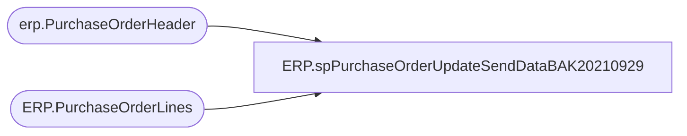

# ERP.spPurchaseOrderUpdateSendDataBAK20210929

**Database:** IntegrationStaging  
**Server:** STL-SSIS-P-01  

## Architecture Diagram



## Table Dependencies

| Referenced Table |
|---|
| erp.PurchaseOrderHeader |
| ERP.PurchaseOrderLines |

## Stored Procedure Code

```sql
create proc [ERP].[spPurchaseOrderUpdateSendDataBAK20210929]

as

set nocount on

update h
set h.SendData = 1
from erp.PurchaseOrderHeader h
join ERP.PurchaseOrderLines l with (nolock) 
	on h.PurchaseOrderNumber = l.PurchaseOrderNumber
	and h.ConfirmationNumber = l.ConfirmationNumber
	and h.Entity = l.Entity
	and h.Iscurrent = 1
	and l.IsCurrent = 1
where l.SendData = 1 and h.SendData <> 1

update l
set l.SendData = 1
from erp.PurchaseOrderHeader h
join ERP.PurchaseOrderLines l with (nolock) 
	on h.PurchaseOrderNumber = l.PurchaseOrderNumber
	and h.ConfirmationNumber = l.ConfirmationNumber
	and h.Entity = l.Entity
	and h.Iscurrent = 1
	and l.IsCurrent = 1
where h.SendData = 1 and l.SendData <> 1

ERP,spSelectSalesOrderUDA,CREATE proc [ERP].[spSelectSalesOrderUDA]

as

------------------------------------------------------------------------------------------------------------------------------
--Dan Tweedie - 2018-06-07 - Created Proc to output UDA data for posting to Merchandising system for Sales Order UDA, called from SSIS
------------------------------------------------------------------------------------------------------------------------------

set nocount on


declare @date varchar(12),
		@location varchar(4),
		@upc varchar(12),
		@units varchar(100),
		@total int,
		@TotalUDA int,
		@SaleType varchar(20),
		@ReasonCode varchar(5),
		@DocNbr varchar(20)

select @date = convert(varchar, getdate(), 101)

select @TotalUDA = count(*) from ERP.tmpUDAStage

while @TotalUDA > 0

	begin
		select @SaleType = max(SaleType) from ERP.tmpUDAStage
		select @ReasonCode = case when @SaleType = 'Wholesale' then 'WHSE' else 'INTNL' end
		select @DocNbr = concat(replace(replace(replace(convert(varchar, getdate(), 120), '-', ''), ' ', ''), ':', ''), @ReasonCode)
	
		select @total = count(*) from ERP.tmpUDAStage where SaleType = @SaleType

		--print 'H' + '	' + 'A' + '	' + '' + '	' + @date + '	' + 'DYNAMICS' + '	' + 'UDA Upload' + '	' + @SaleType + '	' + '3' + '	' + ''
		print 'H' + '	' + 'A' + '	' + @DocNbr + '	' + @date + '	' + @ReasonCode + '	' + 'UDA Upload' + '	' + @SaleType + '	' + '3' + '	' + ''


		while @total > 0
			BEGIN
		
				select @location = max(LocationCode) from ERP.tmpUDAStage where SaleType = @SaleType 
				select @upc = max(upc) from ERP.tmpUDAStage where SaleType = @SaleType and LocationCode = @location
				select @units = units from ERP.tmpUDAStage where SaleType = @SaleType and LocationCode = @location and upc = @upc

				print 'D' + '	' + 'A' + '	' + @DocNbr + '	' + 'S' + '	' + @location + '	' + @upc +  '	' +  '	' +  '	' +  '	' +  '	' + '	' + @units + '	'  + '	'
		
				delete from ERP.tmpUDAStage where SaleType = @SaleType and LocationCode = @location and upc = @upc
		
				select @total = count(*) from ERP.tmpUDAStage where SaleType = @SaleType

				if @total = 0
					break
				else
					continue
			END

		select @TotalUDA = count(*) from ERP.tmpUDAStage
		if @TotalUDA = 0
				break
			else
				continue
		END
ERP,spShipmentInvoice_SalesOrderXML,CREATE proc [ERP].[spShipmentInvoice_SalesOrderXML]
@Entity varchar(10)

as
-- =====================================================================================================
-- Name:  ERP.spShipmentInvoice_SalesOrderXML
--
-- Description:	Outputs Shipment Invoice XML 
--				 
-- Revision History
--		Name:			Date:			Comments:
--		Dan Tweedie		2017-12-14		Created proc
-- =====================================================================================================

set nocount on;

with 
XMLStage (XML) as
	(
		select 
			DlvMode,
			Warehouse as InventLocationId,
			--InventLocationId,
			ItemId,
--			Null as LineNum, NULL,
			OrderRef,
			cast(sum(Qty) as int) as Qty,
			convert(varchar, ShipDate, 101) as ShipDate
			--NULL as UnitOfMeasure, NULL
		from ERP.ShipmentInvoice with (nolock)
		where Transmitted = 0
		and left(OrderRef, 2) = 'SO'
		and Entity = @Entity 
		group by DlvMode, Warehouse, ItemId, OrderRef, convert(varchar, ShipDate, 101)
		for xml path('rsmBABWMShipmentEntity'), root('Document'), Type
	)
select XML as XMLData
from XMLStage
```

