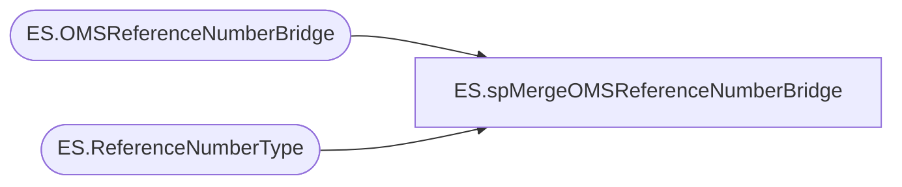

# ES.spMergeOMSReferenceNumberBridge

**Database:** IntegrationStaging  
**Server:** STL-SSIS-P-01  

## Architecture Diagram



## Table Dependencies

| Referenced Table |
|---|
| ES.OMSReferenceNumberBridge |
| ES.ReferenceNumberType |

## Stored Procedure Code

```sql
CREATE PROCEDURE [ES].[spMergeOMSReferenceNumberBridge]

-- =============================================================================================================
-- Name: ES.spMergeOMSReferenceNumberBridge
--
-- Description:	Merge Enterprise Selling order numbers for OMS order creation reference
--
-- Output: 
--	
-- Dependencies: 
--
-- Revision History
--		Name:			Date:			Comments:
--		Ben Barud		05/01/2019		Initial Creation
-- =============================================================================================================

	@enterpriseSellingID VARCHAR(20)
AS
BEGIN
	-- SET NOCOUNT ON added to prevent extra result sets from
	-- interfering with SELECT statements.
	SET NOCOUNT ON;

    CREATE TABLE #tmpEnterpriseSellingID
    (
      EnterpriseSellingID VARCHAR(20)
    )

    INSERT INTO #tmpEnterpriseSellingID
    SELECT @enterpriseSellingID

    DECLARE @referenceNumberTypeID INT
    SELECT @referenceNumberTypeID = ReferenceNumberTypeID FROM [IntegrationStaging].[ES].[ReferenceNumberType] WHERE ReferenceNumberType = 'EnterpriseSellingID'

    MERGE [IntegrationStaging].[ES].[OMSReferenceNumberBridge] AS TARGET
    USING #tmpEnterpriseSellingID AS SOURCE
    ON (TARGET.ReferenceNumber = SOURCE.EnterpriseSellingID)
    WHEN NOT MATCHED BY TARGET
    THEN INSERT (EnterpriseSellingID, ReferenceNumber, ReferenceNumberTypeID) VALUES (SOURCE.EnterpriseSellingID, SOURCE.EnterpriseSellingID, @referenceNumberTypeID);
END

ES,spMissingEAOrdersToBeReprocessed,CREATE   PROCEDURE ES.spMissingEAOrdersToBeReprocessed
AS
BEGIN
    SET NOCOUNT ON;

    /*
        Returns missing Endless Aisle orders from the last 14 days that
        are not present in esell.orders or the OMSReferenceNumberBridge.

        Output:
            EnterpriseSellingID  (header id, no leading 'U')
            OrderID              (ORD... value used for reprocessing)
    */

    ;WITH EndlessAisle AS
    (
        SELECT DISTINCT
            so.order_id AS OrderID,

            -- Deterministic EnterpriseSellingID generation (matches email proc)
            RIGHT('00000' + SUBSTRING(so.device_id, 2, 3), 5)
            + SUBSTRING(so.business_date, 3, 2)
            + SUBSTRING(so.business_date, 5, 2)
            + RIGHT(so.device_id, 2)
            + RIGHT('00000' + CAST(soli.orig_sequence_number AS VARCHAR(5)), 5)
            + '0101' AS EnterpriseSellingID,

            esb.ReferenceNumber,
            e.order_id AS EsellOrderId
        FROM papamart.dw.dbo.JMC_sls_order so
        JOIN papamart.dw.dbo.JMC_sls_order_line_item soli
            ON so.order_id = soli.order_id

        LEFT JOIN ES.OMSReferenceNumberBridge esb WITH (NOLOCK)
            ON
                RIGHT('00000' + SUBSTRING(so.device_id, 2, 3), 5)
                + SUBSTRING(so.business_date, 3, 2)
                + SUBSTRING(so.business_date, 5, 2)
                + RIGHT(so.device_id, 2)
                + RIGHT('00000' + CAST(soli.orig_sequence_number AS VARCHAR(5)), 5)
                + '0101'
                = esb.EnterpriseSellingID

        LEFT JOIN bedrockdb02.esell.esell.orders e WITH (NOLOCK)
            ON
                RIGHT('00000' + SUBSTRING(so.device_id, 2, 3), 5)
                + SUBSTRING(so.business_date, 3, 2)
                + SUBSTRING(so.business_date, 5, 2)
                + RIGHT(so.device_id, 2)
                + RIGHT('00000' + CAST(soli.orig_sequence_number AS VARCHAR(5)), 5)
                + '0101'
                = RIGHT(e.order_id, 20)

        WHERE DATEDIFF(DAY, so.create_time, GETDATE()) <= 14
    )
    SELECT
        EnterpriseSellingID,
        OrderID
    FROM EndlessAisle
    WHERE
        ReferenceNumber IS NULL
        OR EsellOrderId IS NULL
    ORDER BY OrderID;
END

HR,spMergeUltiProSSOEmployeesActivated,CREATE proc [HR].[spMergeUltiProSSOEmployeesActivated]

as

set nocount on

merge into HR.UltiProSSOEmployeesActivated as target
using HR.UltiProEmployeeActivationStage as source
on (
		target.EmployeeID=source.EmployeeIdentifier
	)
when matched 
	and 
		(
			isnull(target.ActivatedDate,getdate())<>isnull(source.ActivatedDate,getdate())
			or
			isnull(target.ClientUserName,'x')<>isnull(source.ClientUserName,'x')
			OR
			isnull(target.Success,99)<>isnull(source.Success,99)
			OR
			isnull(target.UltiProResponse,'z')<>isnull(source.UltiProResponse,'z')
		)
	then update
		set
			target.ActivatedDate=source.ActivatedDate,
			target.ClientUserName=source.ClientUserName,
			target.Success=source.Success,
			target.UltiProResponse=source.UltiProResponse,
			target.UpdateDate=getdate()
when not matched by target
	then insert
		(
			EmployeeID,
			ClientUserName,
			ActivatedDate,
			Success,
			UltiProResponse,
			InsertDate
		)
	values
		(
			source.EmployeeIdentifier,
			source.ClientUserName,
			source.ActivatedDate,
			source.Success,
			source.UltiProResponse,
			getdate()
		)
;
```

