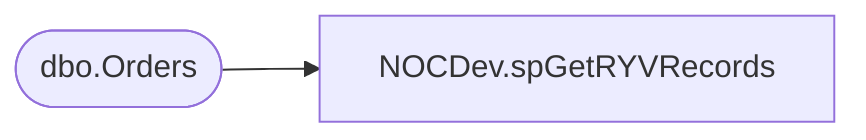

# NOCDev.spGetRYVRecords

**Database:** IntegrationStaging  
**Server:** STL-SSIS-P-01  

## Architecture Diagram



## Table Dependencies

| Referenced Table |
|---|
| dbo.Orders |

## Stored Procedure Code

```sql
CREATE proc [NOCDev].[spGetRYVRecords]

as

-------------------------------------------------------------------------					
-- 2021-11-10 - Brandon Hickey - Created Proc
-------------------------------------------------------------------------

set nocount on


SELECT			CAST(format(CAST(DATEPART(HOUR, AudioRecordedDate)AS INT), '00')AS VARCHAR(2)) + ':00' AS AudioRecordedHour, 
                COUNT(*) AS AudioRecordedCountByHour
                FROM [KODIAK].[RecordYourVoice].[dbo].[Orders] 
                WHERE AudioRecordedDate IS NOT NULL 
				AND AudioRecordedDate > DATEADD(HOUR, -11, GETDATE())
                GROUP BY DATEPART(HOUR, AudioRecordedDate)
				ORDER BY MIN(AudioRecordedDate);
```

