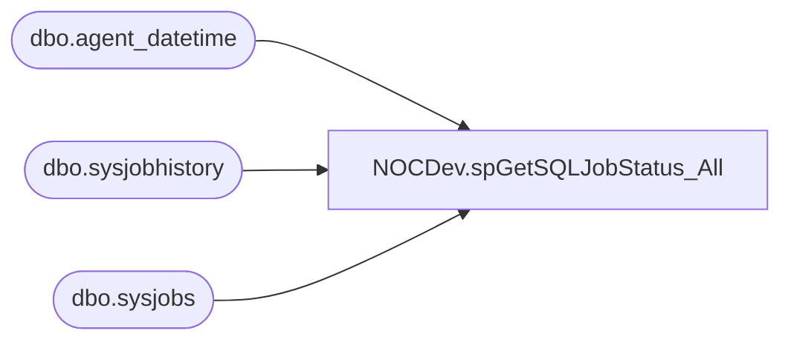

# NOCDev.spGetSQLJobStatus_All

**Database:** IntegrationStaging  
**Server:** STL-SSIS-P-01  

## Architecture Diagram



## Table Dependencies

| Referenced Table |
|---|
| dbo.agent_datetime |
| dbo.sysjobhistory |
| dbo.sysjobs |

## Stored Procedure Code

```sql
CREATE proc [NOCDev].[spGetSQLJobStatus_All]
--WITH EXECUTE AS 'link_readonly'
as

-------------------------------------------------------------------------					
-- 2021-11-10 - Brandon Hickey - Created Proc
-------------------------------------------------------------------------

set nocount on

--WITH EXECUTE AS 'BAB\SVC-DEV-CDVWEB'

SELECT
 j.name AS 'JobName',
 run_date,
 run_time,
 h.run_status,
 h.step_id,
 msdb.dbo.agent_datetime(run_date, run_time) AS 'RunDateTime',
 run_duration,
 ((run_duration/10000*3600 + (run_duration/100)%100*60 + run_duration%100 + 31 ) / 60) 
         AS 'RunDurationMinutes'
FROM msdb.dbo.sysjobs j 
INNER JOIN msdb.dbo.sysjobhistory h 
 ON j.job_id = h.job_id 
WHERE j.enabled = 1   --Only Enabled Jobs
AND j.name IN ('WMS - Manage D365 Wave Messages', 'WMS_Manage D365 Ship Messages', 'WEB-Prod - US - Update Deck Status') --Uncomment to search for a single job
AND msdb.dbo.agent_datetime(run_date, run_time) > DATEADD(HOUR, -6, GETDATE())  --Uncomment for date range queries
AND step_id = 0
ORDER BY JobName, RunDateTime ASC
```

