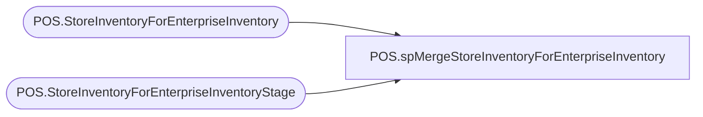

# POS.spMergeStoreInventoryForEnterpriseInventory

**Database:** IntegrationStaging  
**Server:** STL-SSIS-P-01  

## Architecture Diagram



## Table Dependencies

| Referenced Table |
|---|
| POS.StoreInventoryForEnterpriseInventory |
| POS.StoreInventoryForEnterpriseInventoryStage |

## Stored Procedure Code

```sql
create proc POS.spMergeStoreInventoryForEnterpriseInventory

as 

set nocount on

merge into POS.StoreInventoryForEnterpriseInventory as target
using POS.StoreInventoryForEnterpriseInventoryStage as source
on 
	target.LocationCode=source.LocationCode
	and
	target.StyleCode=source.StyleCode
when matched
	and 
		isnull(target.StoreInventory,0)<>isnull(source.StoreInventory,0)
	then update
		set target.StoreInventory=isnull(source.StoreInventory,0),
			target.UpdateDate=getdate()
when not matched by target
	then insert
		(LocationCode,StoreNumber,StyleCode,StoreInventory,Country,InsertDate)
	values
		(
			source.LocationCode,
			source.StoreNumber,
			source.StyleCode,
			source.StoreInventory,
			source.Country,
			getdate()
		)
when not matched by source
	then update
		set target.StoreInventory=0,
		target.UpdateDate=getdate()
;
```

