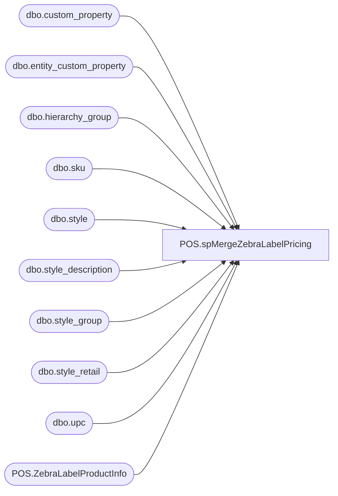

# POS.spMergeZebraLabelPricing

**Database:** IntegrationStaging  
**Server:** STL-SSIS-P-01  

## Architecture Diagram



## Table Dependencies

| Referenced Table |
|---|
| dbo.custom_property |
| dbo.entity_custom_property |
| dbo.hierarchy_group |
| dbo.sku |
| dbo.style |
| dbo.style_description |
| dbo.style_group |
| dbo.style_retail |
| dbo.upc |
| POS.ZebraLabelProductInfo |

## Stored Procedure Code

```sql
CREATE proc [POS].[spMergeZebraLabelPricing]

as 

set nocount on

IF (Object_ID('tempdb..#BarcodeMergeTemp') IS NOT null) DROP TABLE #BarcodeMergeTemp;
SELECT st.style_code, upc.upc_number, st.short_desc, CAST(sr.current_selling_retail AS VARCHAR) AS cost, 
                 isnull(replace(sd.plu_desc, CHAR(140), 'OE'),'') AS local_desc, sr.jurisdiction_id, cast(
            case 
                when isdate(replace(replace(replace(replace(ecp.custom_property_value, '\', '-'), '/', '-'), '.', '-'), ' ', '')) = 1
                then cast( replace(replace(replace(replace(ecp.custom_property_value, '\', '-'), '/', '-'), '.', '-'), ' ', '') as date)
                else '1999-12-31'
            end 
    as date) AS MerchInDate
            INTO #BarcodeMergeTemp
             FROM [BEDROCKDB02].[me_01].[dbo].[style] st with (nolock) 
                 JOIN [BEDROCKDB02].[me_01].[dbo].[style_group] sg WITH (NOLOCK) ON sg.style_id = st.style_id 
                 JOIN [BEDROCKDB02].[me_01].[dbo].[style_retail] sr WITH (NOLOCK) ON st.style_id = sr.style_id 
                 JOIN [BEDROCKDB02].[me_01].[dbo].[hierarchy_group] hg WITH (NOLOCK) ON hg.hierarchy_group_id = sg.hierarchy_group_id 
                 LEFT JOIN [BEDROCKDB02].[me_01].[dbo].[style_description] AS sd WITH (NOLOCK) ON sd.style_id = st.style_id AND sd.language_id = CASE 
                    WHEN sr.jurisdiction_id = 8 THEN 100006 ELSE 100002 END
                 LEFT JOIN [BEDROCKDB02].[me_01].[dbo].[sku] AS sku WITH (NOLOCK) ON st.style_id = sku.style_id
                 LEFT JOIN [BEDROCKDB02].[me_01].[dbo].[upc] AS upc    WITH (NOLOCK) ON upc.sku_id = sku.sku_id
                 JOIN [BEDROCKDB02].[me_01].[dbo].[entity_custom_property] AS ecp WITH (NOLOCK) ON st.style_id = ecp.parent_id AND ecp.parent_type = 1
				 join [BEDROCKDB02].[me_01].[dbo].[custom_property] as  cp (nolock) on cp.custom_property_id = ecp.custom_property_id -- Added By TimC
													and cp.cust_prop_code in ('IDATE')-- Added By TimC
             where [hierarchy_group_code] not like 'R-B-D-60%' 
                 and [hierarchy_group_code] not like 'R-B-D-70%' 
                 and sr.[current_selling_retail] is not null 
                 and sr.jurisdiction_id IN (1,2,3,5)            
			 order by [style_code]
		

MERGE [IntegrationStaging].[POS].[ZebraLabelProductInfo] as TARGET
    USING 
    (SELECT DISTINCT style_code, upc_number, short_desc, MAX(cost), local_desc, jurisdiction_id, MAX(MerchInDate) FROM #BarcodeMergeTemp 
             WHERE MerchInDate <= DATEADD(DAY, 2, GetDate()) GROUP BY style_code, upc_number, jurisdiction_id, short_desc, local_desc)
    as SOURCE ([style_code], [upc_number], [short_desc], [cost], [local_desc], [jurisdiction_id], [MerchInDate])
 
    ON TARGET.[style_code] = SOURCE.[style_code] AND TARGET.[upc_number] = SOURCE.[upc_number] AND TARGET.[jurisdiction_id] = SOURCE.[jurisdiction_id]
 
    WHEN MATCHED THEN UPDATE 
        SET
        TARGET.short_desc = SOURCE.short_desc,
        TARGET.cost = SOURCE.cost,
        TARGET.local_desc = SOURCE.local_desc,
        TARGET.jurisdiction_id = SOURCE.jurisdiction_id,
        TARGET.in_date = SOURCE.MerchInDate
 
    WHEN NOT MATCHED BY TARGET THEN 
        INSERT([style_code], [upc_number], [cost], [local_desc], [short_desc], [jurisdiction_id], [in_date])
        VALUES(SOURCE.[style_code], 
            SOURCE.[upc_number], 
            SOURCE.[cost], 
            SOURCE.[local_desc], 
            SOURCE.[short_desc], 
            SOURCE.[jurisdiction_id],
            SOURCE.[MerchInDate])
 
    WHEN NOT MATCHED BY SOURCE THEN 
        DELETE;
```

