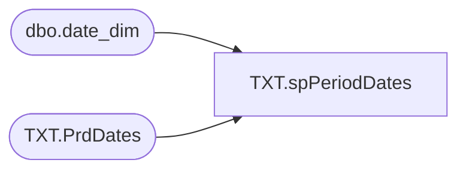

# TXT.spPeriodDates

**Database:** IntegrationStaging  
**Server:** STL-SSIS-P-01  

## Architecture Diagram



## Table Dependencies

| Referenced Table |
|---|
| dbo.date_dim |
| TXT.PrdDates |

## Stored Procedure Code

```sql
CREATE proc [TXT].[spPeriodDates]
as 
-- =====================================================================================================
-- Name: TXT.spPeriodDates
--
-- Description:	Populates TXT.PrdDates with BOP and EOP dates; JIRA BIB-897
--
-- Revision History
--		Name:			Date:			Comments:
--		Lizzy Timm		05/15/2024		Created proc
-- =====================================================================================================
set nocount on 

DECLARE @year int
	, @yearcheck int

SELECT DISTINCT @year = fiscal_year FROM date_dim WHERE CAST(actual_date AS date) = CAST(getdate() AS date)
SELECT DISTINCT @yearcheck = Fiscal_year FROM TXT.PrdDates

IF(@year = @yearcheck)
BEGIN
	TRUNCATE TABLE TXT.PrdDates
	INSERT INTO TXT.PrdDates
	SELECT CONCAT(d1.fiscal_year, right('00' + cast(d1.fiscal_period as varchar), 2)) Fiscal_year_pd
			, d1.fiscal_year
			, d1.fiscal_period
			, MIN(d1.actual_date) BOPDate
			, MAX(d1.actual_date) EOPDate
	  FROM date_dim d1  
	  WHERE d1.fiscal_year = @year
	  GROUP BY CONCAT(d1.fiscal_year, right('00' + cast(d1.fiscal_period as varchar), 2))
		, d1.fiscal_year
		, d1.fiscal_period
	  ORDER BY 1
END
```

