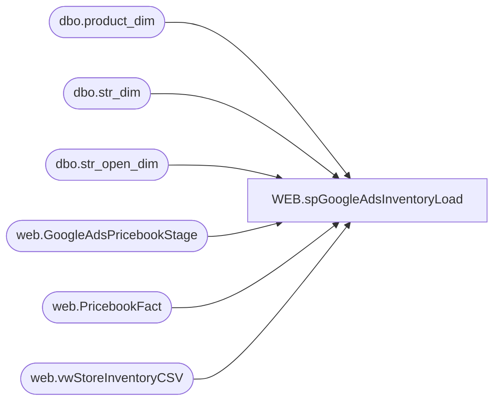

# WEB.spGoogleAdsInventoryLoad

**Database:** IntegrationStaging  
**Server:** STL-SSIS-P-01  

## Architecture Diagram



## Table Dependencies

| Referenced Table |
|---|
| dbo.product_dim |
| dbo.str_dim |
| dbo.str_open_dim |
| web.GoogleAdsPricebookStage |
| web.PricebookFact |
| web.vwStoreInventoryCSV |

## Stored Procedure Code

```sql
CREATE proc [WEB].[spGoogleAdsInventoryLoad] 

-- Testing Variables 
/*
declare @SimDaysFutureOrBack as int
declare @Country as varchar(2)

set @SimDaysFutureOrBack = '-1'
set @Country = 'US';

*/
-- Declare Variables 
--/*
@SimDaysFutureOrBack as int,
@Country as varchar(2)
as
--*/

with OpenStore as (

select cast(sd.str_num as int) as StoreID
from  Kodiak.babwmstrdata.dbo.str_dim sd 
join Kodiak.babwmstrdata.dbo.str_open_dim sod on sd.str_id = sod.str_key
where cast(sod.open_dt as date) <= cast(getdate() as date)
and (cast(sod.close_dt as date) > cast(getdate() as date) or sod.close_dt is null) 
and sd.str_num not in ('32','98','134','153','161','181','192','204','208','214','216','226','236','249','260','308','328','331','335','345','350','351','367','385','398','405','414','416','417','520','525','527','528','530','532','533','534','607','619','2035','2078')
group by cast(sd.str_num as int)


), -- Added On 4/26/2022 see JIRA BIB-378


Styles as 

(
	select style_code as StyleCode, 
	product_desc
	--department_code,
	--department
	from papamart.dw.dbo.product_dim pd
	where right(pd.department_code,2) in ('02')
	and pd.style_code not in ('019052','020405','021808','022013','022014','022601','022632','022640','023010','023875','023952','024099','024183','024218','024229','024259','024357','024446','024546','024663','024942','024992','024999','025001','025204','025239','025261','025262','025270','025533','025567','025663','025720','025965','026322','026362','026363','026481','026482','026483','026485','026486','026487','026488','026516','026528','026839','027017','027229','027457','027501','027741','027744','027766','027875','027918','027930','028033','028052','028085','028108','028175','028176','028192','028195','028202','028245','028269','028352','028364','028378','028412','028413','028469','028601','028646','028653','028682','028699','028747','028763','028778','028941','028954','029053','029054','029072','029089','029165','029166','029193','029197','029347','029348','029349','029350','029351','029411','029454','029461','029482','029496','029592','029596','029601','029603','029653','029666','029668','029677','029748','029846','029893','030129','030143','030243','030244','030257','030260','229239','229347') -- Added On 4/26/2022 see JIRA BIB-378
	
	--and Style_code in ('023103','023004') -- Testing Purposes 
), 

ListPrice as 
(
	select style_code as StyleCode, 
	CurrentPrice as ListPrice, 
	Catalog
	from web.PricebookFact
	--where Catalog=@CountryLoad

), 

Inventory as 
(

select WarehouseCode, 
ProductCode as StyleCode, 
c.TotalQuantity, 
case when left(c.WarehouseCode,1) = 2 and len(c.warehousecode)=4
	then 'UK'
	else 'US'
	end as WarehouseCountry
--c.ProtectedQuantity,
--c.PreBackOrderQuantity
from web.vwStoreInventoryCSV c (nolock) 
where WarehouseCode not in ('0013','2013')
and c.TotalQuantity > 0 -- Added On 4/25/2022 see JIRA BIB-378
--and WarehouseCode in ('0001','2010') -- Temp using for testing only 


) ,

SalePrice as 
(


select G.PriceBookName,
G.Currency,
G.OnlineFlag,
G.ProductNumber,
G.Quantity,
min(G.Price) as SalePrice,
SWITCHOFFSET(G.OnlineFrom AT TIME ZONE 'Central Standard Time', '+00:00') as EffectiveFromDateTimeUTC, 
SWITCHOFFSET(G.OnlineTo AT TIME ZONE 'Central Standard Time', '+00:00') as EffectiveToDateTimeUTC, 
SWITCHOFFSET(dateadd(dd,@SimDaysFutureOrBack,getdate())  AT TIME ZONE 'Central Standard Time', '+00:00')  as SimulateDateTimeUTC
from web.GoogleAdsPricebookStage G
where G.Currency = 'USD'
and (
(
	SWITCHOFFSET(dateadd(dd,@SimDaysFutureOrBack,getdate())  AT TIME ZONE 'Central Standard Time', '+00:00') > =SWITCHOFFSET(G.OnlineFrom AT TIME ZONE 'Central Standard Time', '+00:00')
	AND
	SWITCHOFFSET(dateadd(dd,@SimDaysFutureOrBack,getdate())  AT TIME ZONE 'Central Standard Time', '+00:00') <=SWITCHOFFSET(G.OnlineTo AT TIME ZONE 'Central Standard Time', '+00:00')
	)
	or 
	(G.OnlineFrom is null and G.OnlineTo is null ) -- Accounts for Long Term Temp Price Changes 
	)
group by G.PriceBookName,
G.Currency,
G.OnlineFlag,
G.ProductNumber,
G.Quantity,
G.Price,
SWITCHOFFSET(G.OnlineFrom AT TIME ZONE 'Central Standard Time', '+00:00'),
SWITCHOFFSET(G.OnlineTo AT TIME ZONE 'Central Standard Time', '+00:00') 
UNION ALL 
select G.PriceBookName,
G.Currency,
G.OnlineFlag,
G.ProductNumber,
G.Quantity,
min(G.Price) as SalePrice,
SWITCHOFFSET(G.OnlineFrom AT TIME ZONE 'Central Standard Time', '+00:00') as EffectiveFromDateTimeUTC, 
SWITCHOFFSET(G.OnlineTo AT TIME ZONE 'Central Standard Time', '+00:00') as EffectiveToDateTimeUTC, 
SWITCHOFFSET(dateadd(dd,@SimDaysFutureOrBack,getdate())  AT TIME ZONE 'Central Standard Time', '+00:00')  as SimulateDateTimeUTC
from web.GoogleAdsPricebookStage G
where G.Currency = 'GBP'
and (
(
	SWITCHOFFSET(dateadd(dd,@SimDaysFutureOrBack,getdate())  AT TIME ZONE 'Central Standard Time', '+00:00') > =SWITCHOFFSET(G.OnlineFrom AT TIME ZONE 'Central Standard Time', '+00:00')
	AND
	SWITCHOFFSET(dateadd(dd,@SimDaysFutureOrBack,getdate())  AT TIME ZONE 'Central Standard Time', '+00:00') <=SWITCHOFFSET(G.OnlineTo AT TIME ZONE 'Central Standard Time', '+00:00')
	)
	or 
	(G.OnlineFrom is null and G.OnlineTo is null )-- Accounts for Long Term Temp Price Changes 
	)
group by G.PriceBookName,
G.Currency,
G.OnlineFlag,
G.ProductNumber,
G.Quantity,
G.Price,
SWITCHOFFSET(G.OnlineFrom AT TIME ZONE 'Central Standard Time', '+00:00'),
SWITCHOFFSET(G.OnlineTo AT TIME ZONE 'Central Standard Time', '+00:00') 
--order by 2 desc, 4, 1


), 

FinalTable as (
select 
--I.WarehouseCode as StoreCode,
CONVERT(int,left(I.WarehouseCode,4)) as StoreCode,
--CONVERT(int,left(s.StyleCode,6)) as ID,
right('00000000000'+s.StyleCode,6) as ID, -- On 10/12/2021 Bryce Ahrens requested leading zeroes on styles 
--s.product_desc as ProdDesc, 
l.ListPrice, 
i.TotalQuantity, 
case when I.TotalQuantity = 0 then 'out of stock'
	when I.TotalQuantity between 1 and 2 then 'limited availability'
	when I.TotalQuantity >= 3 then 'in stock' -- Corrected from >+ while implementing change for BIB-378 
	end as 'Availability',
	SP.SalePrice,
	--cast(sp.EffectiveFromDateTimeUTC as varchar) + '/' + cast(EffectiveToDateTimeUTC as varchar) as 'SalePriceEffectiveDate'
	convert(varchar(100),sp.EffectiveFromDateTimeUTC,127) + '/' + convert(varchar(100),sp.EffectiveToDateTimeUTC, 127) as 'SalePriceEffectiveDate'
	,convert(varchar(100),sp.SimulateDateTimeUTC,127) as SimulateDateTimeUTC,
	I.WarehouseCountry
from Styles  s
join Inventory I on i.StyleCode=s.StyleCode
join ListPrice L on l.StyleCode=S.StyleCode
	and l.Catalog='US'
left join SalePrice SP on sp.ProductNumber=S.StyleCode
	and sp.Currency = 'USD'
union all 
select 
--I.WarehouseCode as StoreCode,
CONVERT(int,left(I.WarehouseCode,4)) as StoreCode,
--CONVERT(int,left(s.StyleCode,6)) as ID,
right('00000000000'+s.StyleCode,6) as ID, -- On 10/12/2021 Bryce Ahrens requested leading zeroes on styles 
--s.product_desc as ProdDesc, 
l.ListPrice, 
i.TotalQuantity, 
case when I.TotalQuantity = 0 then 'out of stock'
	when I.TotalQuantity between 1 and 2 then 'limited availability'
	when I.TotalQuantity >= 3 then 'in stock' -- Corrected from >+ while implementing change for BIB-378 
	end as 'Availability',
	SP.SalePrice,
	--cast(sp.EffectiveFromDateTimeUTC as varchar) + '/' + cast(EffectiveToDateTimeUTC as varchar) as 'SalePriceEffectiveDate'
	convert(varchar(100),sp.EffectiveFromDateTimeUTC,127) + '/' + convert(varchar(100),sp.EffectiveToDateTimeUTC, 127) as 'SalePriceEffectiveDate'
	,convert(varchar(100),sp.SimulateDateTimeUTC,127) as SimulateDateTimeUTC, 
	I.WarehouseCountry
from Styles  s
join Inventory I on i.StyleCode=s.StyleCode
join ListPrice L on l.StyleCode=S.StyleCode
	and l.Catalog='UK'
left join SalePrice SP on sp.ProductNumber=S.StyleCode
	and sp.Currency = 'GBP'
	)


select StoreCode, 
ID, 
ListPrice, 
TotalQuantity, 
Availability, 
SalePrice, 
SalePriceEffectiveDate, 
SimulateDateTimeUTC
--,WarehouseCountry
from FinalTable f
join OpenStore op on op.storeid=f.storecode -- Added On 4/26/2022 see JIRA BIB-378
where f.WarehouseCountry = @Country
Order by 1,2
```

