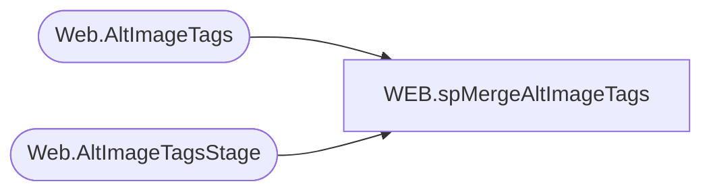

# WEB.spMergeAltImageTags

**Database:** IntegrationStaging  
**Server:** STL-SSIS-P-01  

## Architecture Diagram



## Table Dependencies

| Referenced Table |
|---|
| Web.AltImageTags |
| Web.AltImageTagsStage |

## Stored Procedure Code

```sql
create proc [WEB].[spMergeAltImageTags] 

as

set nocount on

merge into Web.AltImageTags as target 
using Web.AltImageTagsStage as source 
	on	
		target.BABWProductID=source.BABWProductID
		and
		target.ImagePath=source.ImagePath
when matched 
	and
		isnull(target.AltText, 'x')<>isnull(source.AltText,'x')
		or
		isnull(target.TitleText,'x')<>isnull(source.TitleText,'x')
then update
	set
		target.AltText=source.AltText,
		target.TitleText=source.TitleText,
		target.UpdateDate=getdate()
when not matched by target
	then insert 
		(
			babwproductID,
			ImagePath,
			AltText,
			TitleText,
			InsertDate
		)
	values
		(
			source.babwproductID,
			source.ImagePath,
			source.AltText,
			source.TitleText,
			getdate()
		)
;
	

WEB,spMergeCategoryXREF,CREATE proc [WEB].[spMergeCategoryXREF] 
@LoadType varchar(5)

as

-------------------------------------------------------------------------
-- spMergeCategoryXREF - Merges from WEB.CategoryXREFstage to WEB.CategoryXREF
--						 If rows are deleted from WEB.CategoryXREF, 
--							the deleted rows will be inserted into WEB.CategoryXREFarchive, by way of trigger on WEB.CategoryXREF called WEB.TRGCategoryXREF
-- 05-18-2017 - Dan Tweedie - Created Proc
-------------------------------------------------------------------------

set nocount on

DELETE from WEB.CategoryXREFArchive
where datediff(dd, ArchiveDate, getdate()) > 30

Update WEB.CategoryXREFArchive
set CurrentBatch = 0

Update WEB.CategoryXREF 
set SendData = 0 

Merge into WEB.CategoryXREF as target
Using WEB.CategoryXREFstage as source
On (
			isnull(target.FilterGroup,999.99) = isnull(source.FilterGroup,999.99)
		AND	isnull(target.Filter,'xxx') = isnull(source.Filter,'xxx')
		AND	isnull(target.CountrySpecificCategory,'xxx') = isnull(source.CountrySpecificCategory,'xxx')
		AND	isnull(target.MerchCodeType,'xxx') = isnull(source.MerchCodeType,'xxx')
		AND	isnull(target.MerchCodeLabel,'xxx') = isnull(source.MerchCodeLabel,'xxx')
		AND	isnull(target.MerchCodeValue,'xxx') = isnull(source.MerchCodeValue,'xxx')
		AND	isnull(target.AttributeConcat,'xxx') = isnull(source.AttributeConcat,'xxx')
		AND	isnull(target.PrimaryCategorySortOrder,2147483647) = isnull(source.PrimaryCategorySortOrder,2147483647)
		AND	isnull(target.PrimaryCategoryID,'xxx') = isnull(source.PrimaryCategoryID,'xxx')
		AND	isnull(target.PrimaryCategoryName,'xxx') = isnull(source.PrimaryCategoryName,'xxx')
		AND	isnull(target.SecondaryCategorySortOrder,2147483647) = isnull(source.SecondaryCategorySortOrder,2147483647)
		AND	isnull(target.SecondaryCategoryID,'xxx') = isnull(source.SecondaryCategoryID,'xxx')
		AND	isnull(target.SecondaryCategoryName,'xxx') = isnull(source.SecondaryCategoryName,'xxx')
		AND	isnull(target.TertiaryCategorySortOrder,2147483647) = isnull(source.TertiaryCategorySortOrder,2147483647)
		AND	isnull(target.TertiaryCategoryID,'xxx') = isnull(source.TertiaryCategoryID,'xxx')
		AND	isnull(target.TertiaryCategoryName,'xxx') = isnull(source.TertiaryCategoryName,'xxx')
		AND isnull(target.QuaternaryCategorySortOrder, 9999999) <> isnull(source.QuaternaryCategorySortOrder, 9999999)
		AND isnull(target.QuaternaryCategoryID, 'xxx') <> isnull(source.QuaternaryCategoryID, 'xxx')
		AND isnull(target.QuaternaryCategoryName, 'xxx') <> isnull(source.QuaternaryCategoryName, 'xxx')
		AND	isnull(target.PrimaryCategoryDesignation,2147483647) = isnull(source.PrimaryCategoryDesignation,2147483647)
		AND	isnull(target.OnlineStart,'9999-12-31') = isnull(source.OnlineStart,'9999-12-31')
		AND	isnull(target.OnlineEnd,'9999-12-31') = isnull(source.OnlineEnd,'9999-12-31')
		AND isnull(target.ShowInMenu,'xxx') = isnull(source.ShowInMenu,'xxx')
	)
When Not Matched By Target 
	Then 
		Insert (
					FilterGroup, 
					Filter, 
					CountrySpecificCategory, 
					MerchCodeType, 
					MerchCodeLabel, 
					MerchCodeValue, 
					AttributeConcat,
					PrimaryCategorySortOrder, 
					PrimaryCategoryID, 
					PrimaryCategoryName, 
					SecondaryCategorySortOrder,
					SecondaryCategoryID, 
					SecondaryCategoryName, 
					TertiaryCategorySortOrder,
					TertiaryCategoryID, 
					TertiaryCategoryName,
					QuaternaryCategorySortOrder,
					QuaternaryCategoryID,
					QuaternaryCategoryName,
					PrimaryCategoryDesignation,
					OnlineStart,
					OnlineEnd,
					ShowInMenu,
					SendData,
					InsertDate
				)
		Values (	
					source.FilterGroup, 
					source.Filter, 
					source.CountrySpecificCategory, 
					source.MerchCodeType, 
					source.MerchCodeLabel, 
					source.MerchCodeValue, 
					source.AttributeConcat,
					source.PrimaryCategorySortOrder, 
					source.PrimaryCategoryID, 
					source.PrimaryCategoryName, 
					source.SecondaryCategorySortOrder,
					source.SecondaryCategoryID, 
					source.SecondaryCategoryName, 
					source.TertiaryCategorySortOrder,
					source.TertiaryCategoryID, 
					source.TertiaryCategoryName,
					source.QuaternaryCategorySortOrder,
					source.QuaternaryCategoryID,
					source.QuaternaryCategoryName,
					source.PrimaryCategoryDesignation,
					source.OnlineStart,
					source.OnlineEnd,
					source.ShowInMenu,
					1,
					getdate()
				)
When Not Matched By Source
	Then
		Delete
		
OUTPUT 
	deleted.*,
	getdate(),
	$action,
	1
into WEB.CategoryXREFArchive
;

if @LoadType = 'FULL'
update WEB.CategoryXREF
set SendData = 1


WEB,spMergeInventoryFact,CREATE proc [WEB].[spMergeInventoryFact]
@LoadType varchar(5)

as

-------------------------------------------------------------------------
-- spMergeInventoryFact - Merges from WEB.InventoryStage to WEB.InventoryFact
--						  Mergable changes = change in QTY or UPC, or new style record.
--						  Full vs Delta loads controlled by the following:
--							1) Set All records to SendData = 0 (no)
--							2) Inserts or Updates from the Merge will set SendData to 1
--							3) If @LoadType variable = 'FULL', then ALL records will be updated to SendData = 1
--							4) View that queries data for XML will filter for SendData = 1
--
-- 05-18-2017 - Dan Tweedie - Created Proc
---							Data is staged from Enterprise Selling and should contain a row for all stores (actually store list contained in the proc), all styles --- 
--							So if there is no inventory in ES, it should result in a row with 0 qty being passed through
-------------------------------------------------------------------------

set nocount on

update WEB.InventoryFact
	set SendData = 0 

if (select count(*) from WEB.InventoryStage where LocationCode in ('0013', '2013') and Qty > 0) > 100 --SAFETY TO PREVENT MERGE IF WE HAVE NO INVENTORY FOR 'ALL' STYLES --IF LESS THAN 100 THAT'S A PROBLEM, 

begin

		Merge into WEB.InventoryFact as target
		Using 
			(
				select DISTINCT
					LocationCode,
					GTIN,
					StyleCode,
					SKUDescription,
					QTY,
					SellingGeography,
					UnbufferedQTY,
					getdate() as INS_DT,
					getdate() as CheckDate
				from WEB.InventoryStage
			) as source
		On (target.LocationCode = source.LocationCode
			and target.StyleCode = source.StyleCode
			)
		When Matched 
			AND 
				(
					 isnull(target.QTY,0)<>isnull(source.QTY,0)
					--OR
					-- isnull(target.GTIN,'x') <> isnull(source.GTIN,'x')
				 )
			Then 
				Update 
					Set target.QTY = source.QTY,
						--target.GTIN = source.GTIN,
						target.UnbufferedQTY = source.UnbufferedQTY,
						target.SellingGeography = source.SellingGeography,
						target.PreviousQty = target.Qty,
						target.UpdateDate = getdate(),
						target.CheckDate = source.CheckDate,
						target.SendData = 1
		When Not Matched By Target 
			Then 
				Insert (LocationCode, GTIN, StyleCode, SKUDescription, QTY, SellingGeography, UnbufferedQTY, InsertDate, CheckDate, SendData)
				Values (source.LocationCode, source.GTIN, source.StyleCode, source.SKUDescription, source.QTY, source.SellingGeography, source.UnbufferedQTY, source.INS_DT, source.CheckDate, 1)
		;

		update WEB.InventoryFact
		set CheckDate = getdate()

		if @LoadType = 'FULL'
			update WEB.InventoryFact
			set SendData = 1

end
```

