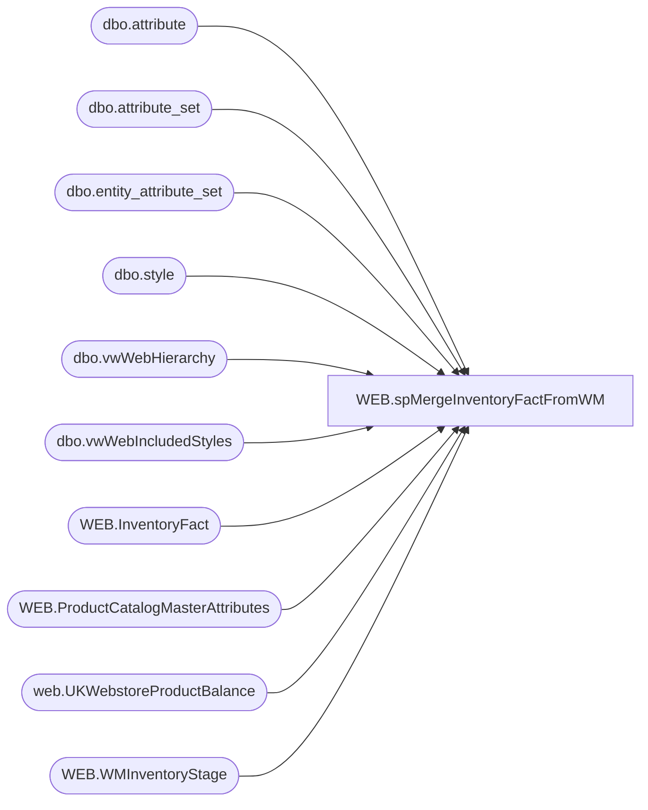

# WEB.spMergeInventoryFactFromWM

**Database:** IntegrationStaging  
**Server:** STL-SSIS-P-01  

## Architecture Diagram



## Table Dependencies

| Referenced Table |
|---|
| dbo.attribute |
| dbo.attribute_set |
| dbo.entity_attribute_set |
| dbo.style |
| dbo.vwWebHierarchy |
| dbo.vwWebIncludedStyles |
| WEB.InventoryFact |
| WEB.ProductCatalogMasterAttributes |
| web.UKWebstoreProductBalance |
| WEB.WMInventoryStage |

## Stored Procedure Code

```sql
CREATE proc [WEB].[spMergeInventoryFactFromWM]

as 

set nocount on

---stage infinite inventory items --- this is a workaround for now
IF (Object_ID('tempdb..#infiniteInventory') IS NOT NULL) DROP TABLE #infiniteInventory;
with ProductType as
	(
		select 
			s.style_code StyleCode,
			case 
				when h.SubClassCode in 
					(
						'W-C-K-12-01-07',
						'W-D-K-12-01-07',
						'W-E-K-12-01-07',
						'W-F-K-12-01-07'
					) then 'DigitalBlanks'
				when h.SubClassCode in 
					(
						'R-B-D-80-02-00',
						'R-B-U-80-02-00'
					) then 'VirtualGiftCards' 
				when h.DepartmentCode in 
					(
						'R-B-D-46',
						'R-B-U-46'
					) then 'Donations'
				when h.DepartmentCode in 
					(
						'R-B-D-65'
					) then 'Embroidery'
				else 'PhysicalProduct'
			end as ProductType,
			cast(s.UPC as varchar(20)) as UPC
		from bedrockdb02.me_01.dbo.vwWebIncludedStyles s
		join bedrockdb02.me_01.dbo.vwWebHierarchy h on s.hierarchy_group_id = h.SubClassHierarchyGroupID
		where s.StorefrontEligible = 1
	),
InfiniteInventory as 
	(
		select s.style_code as StyleCode--, ats.attribute_set_code, ats.attribute_set_label
		from bedrockdb02.me_01.dbo.attribute a
		join bedrockdb02.me_01.dbo.entity_attribute_set eas on a.attribute_id = eas.attribute_id 
		join bedrockdb02.me_01.dbo.attribute_set ats 
			on a.attribute_id = ats.attribute_id 
			and eas.attribute_set_id = ats.attribute_set_id 
			and ats.active_flag = 1
		join bedrockdb02.me_01.dbo.style s on eas.parent_id = s.style_id 
		where a.attribute_code = 'WEBINV' and ats.attribute_set_label = 'INFINITE INVENTORY'
	),
Infinite as
	(
		select StyleCode, UPC
		from ProductType
		where ProductType in ('DigitalBlanks', 'VirtualGiftCards', 'Donations', 'Embroidery')
		and StyleCode <> '080088' --temporary because the brick is a 'donation' but bryce wants to use the webinv to control this...
		UNION
		select i.StyleCode, p.UPC
		from InfiniteInventory i
		join ProductType p on i.StyleCode=p.StyleCode
	)
select 
	case 
		when left(StyleCode,1) in ('4','5','6') 
			then '2013'
		else '0013'
	end as LocationCode,
	StyleCode, 
	999999 as UnbufferedQty,
	999999 as Qty,
	UPC,
	case 
		when left(StyleCode,1) in ('4','5','6') 
			then 'UK'
		else 'US'
	end as SellingGeography
into #infiniteInventory
from Infinite
;


Merge into WEB.InventoryFact as target
Using 
	(
		select 
			wm.LocationCode,
			wm.StyleCode,
			wm.QTY as UnbufferedQTY,
			case 
				when (wm.QTY - isnull(a.InventoryBuffer,0)) < 0 
					then 0 
				else (wm.QTY - isnull(a.InventoryBuffer,0)) 
			end Qty,
			a.UPC,
			case 
				when wm.LocationCode='0013' 
					then 'US' 
				else 'UK' 
			end as SellingGeography
		from WEB.WMInventoryStage wm 
		join WEB.ProductCatalogMasterAttributes a on wm.StyleCode = a.BABWProductID and a.StorefrontEligible = 1
		where wm.StyleCode not in (select styleCode from #infiniteInventory) ---does not merge from wm if the items are to have 'infinite inventory'
		UNION
		select
			LocationCode,
			StyleCode,
			UnbufferedQTY,
			Qty,
			UPC,
			SellingGeography
		from #infiniteInventory
	) as source
On (
		target.LocationCode = source.LocationCode
		and target.StyleCode = source.StyleCode 
	)
When Matched 
	Then 
		Update 
			Set target.QTY = source.QTY,
				target.UnbufferedQTY = source.UnbufferedQTY,
				target.UpdateDate = getdate(),
				target.CheckDate = getdate(),
				target.SendData = 1
when not matched by target 
	then insert
		(
			LocationCode,
			StyleCode,
			Qty,
			GTIN,
			SellingGeography,
			UnbufferedQty,
			InsertDate,
			CheckDAte,
			SendData
		)
	values
		(
			source.LocationCode,
			source.StyleCode,
			source.Qty,
			source.UPC,
			source.SellingGeography,
			source.UnbufferedQty,
			getdate(),
			getdate(),
			1
		)
;

--update to 0 where item not contained in WM query, and is also not a hard-code infinite inventory item

update web.InventoryFact
set 
	Qty = 0, 
	UnbufferedQty = 0, 
	UpdateDate = getdate(), 
	CheckDate=getdate(),
	SendData = 1
where LocationCode = '0013'
and Qty <> 0
and UnbufferedQty <> 0
and StyleCode not in 
	(
		select wm.StyleCode 
		from WEB.WMInventoryStage wm 
		join WEB.ProductCatalogMasterAttributes a on wm.StyleCode = a.BABWProductID and a.StorefrontEligible = 1
		where wm.LocationCode='0013'
	)
and StyleCode not in (select styleCode from #infiniteInventory)

-----update to 0 for UK items not contained in the WM query, and is also not hard-code infinite inventory item

if (select count(*) from web.UKWebstoreProductBalance where datediff(dd, InventoryDate, getdate())=0) > 0 --- first verify that we have current inventory from UK

begin
	update web.InventoryFact
	set 
		Qty = 0, 
		UnbufferedQty = 0, 
		UpdateDate = getdate(), 
		CheckDate=getdate(),
		SendData = 1
	where LocationCode = '2013'
	and Qty <> 0
	and UnbufferedQty <> 0
	and StyleCode not in 
		(
			select  wm.StyleCode 
			from WEB.WMInventoryStage wm 
			join WEB.ProductCatalogMasterAttributes a on wm.StyleCode = a.BABWProductID and a.StorefrontEligible = 1
			where wm.LocationCode='2013'
		)
	and StyleCode not in (select styleCode from #infiniteInventory)
end
```

